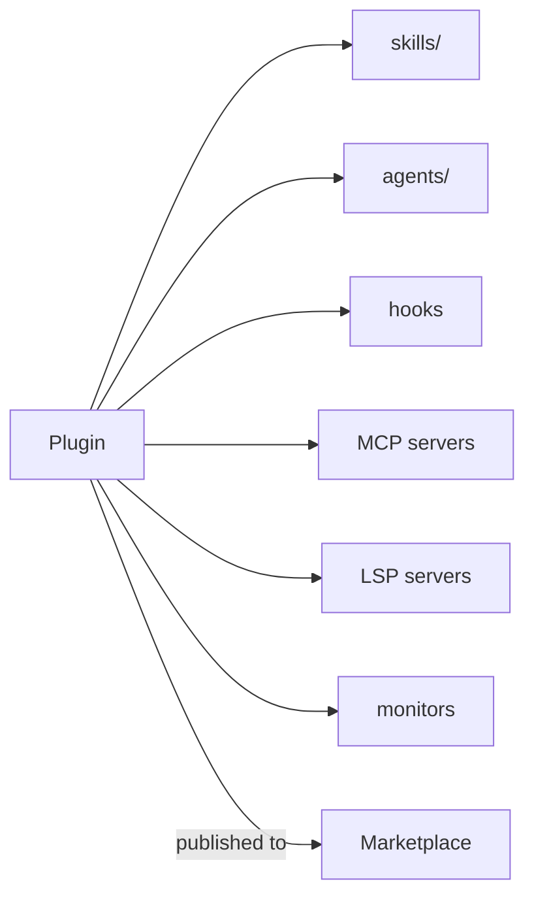

<LevelBadge level="advanced" />

<VerifyNote lastVerified="2026-07-06" source="https://code.claude.com/docs/en/plugins">
Plugin structure and marketplace mechanics are evolving fast — confirm details in the official Claude Code docs.
</VerifyNote>

A **plugin** bundles several customizations — [skills](/docs/claude-code/skills), [subagents](/docs/claude-code/subagents), [slash commands](/docs/claude-code/slash-commands), [hooks](/docs/claude-code/hooks), and [MCP servers](/docs/claude-code/mcp) — into a single, versioned, installable unit. A **marketplace** is a catalog of plugins people can discover and install.

## Why plugins matter

- **Ship a team toolkit in one step.** Instead of asking everyone to copy five files, publish a plugin; teammates install it and get the same commands, hooks, agents, and MCP connections.
- **Versioning.** Update the plugin, everyone pulls the new version.
- **Distribution.** A marketplace makes your toolkit (or others') discoverable.

## What's typically inside

A plugin is a structured folder (a `.claude-plugin/plugin.json` manifest plus the pieces it ships). At minimum it can carry just skills; beyond that it can bundle subagents, hooks, and MCP servers, and — more recently — [LSP servers](https://code.claude.com/docs/en/plugins-reference#lsp-servers) for code intelligence, background [monitors](https://code.claude.com/docs/en/plugins-reference#monitors), a `bin/` of executables, and default settings. Keep each plugin **coherent** — a "team conventions" plugin, a "Python toolkit" plugin — rather than a grab-bag.

## Trust before you install

:::warning Plugins can ship executable code
Hooks and MCP servers in a plugin run with your privileges. Install from sources you trust and review what a plugin does first — see [Reviewing Third-Party Code](/docs/security/reviewing-third-party-code).
:::

## A path to scale your setup

The natural progression: a `CLAUDE.md` → a few [skills](/docs/claude-code/skills) and [commands](/docs/claude-code/slash-commands) → bundle them into a plugin → publish to a marketplace for your team or the community. That last step is part of how AILmanac wants to help the ecosystem grow.

## Next

- [Skills](/docs/claude-code/skills) · [Subagents](/docs/claude-code/subagents) · [MCP](/docs/claude-code/mcp)
- [Reviewing Third-Party Code](/docs/security/reviewing-third-party-code)
- AILmanac's [skill packs](/docs/templates/skills)
