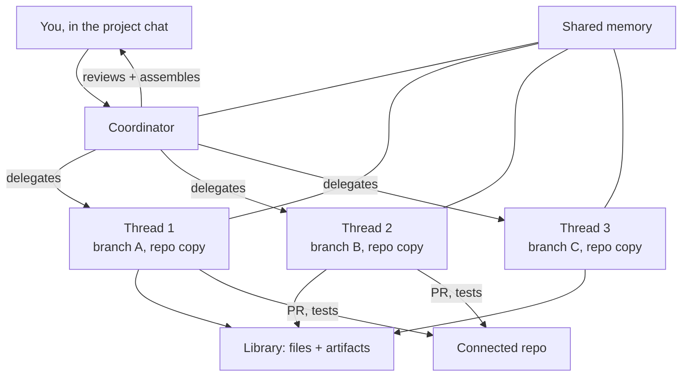

<LevelBadge level="advanced" />

<VerifyNote lastVerified="2026-09-23" source="https://claude.com/blog/projects-redesigned">
Redesigned Projects is in **beta** and rolling out in stages. Eligibility, plan coverage, and the coordinator/thread controls are still moving, and there is no reference page in the Claude Code docs yet — the announcement post is the authoritative source. Confirm what your account actually has before designing around it.
</VerifyNote>

On **September 17, 2026** Anthropic rebuilt Projects. The old Project was a *folder*: files, instructions, and a pile of chats that all shared them. The new Project is an *org chart* — "threads that do the work and a coordinator that directs them."

That is a bigger change than it sounds. A Project is no longer a place you put context; it is a thing that **runs work on your behalf**. You describe an outcome in the main project chat, and Claude scopes it, splits it, delegates it to parallel threads, reviews what comes back, and assembles the result.

<Callout type="objectives" items={[
  "What a thread actually is — and why 'a Claude Code cloud session on its own branch' is the key sentence",
  "How the coordinator differs from a subagent orchestrator, and when each one is the right tool",
  "The four ways to run work in parallel in Claude Code today, and how to choose between them",
  "Why Projects burn usage limits faster, and the two model/effort dials that control it",
  "The eligibility rule that explains why your account may not see the redesign yet"
]} />

## The architecture in one diagram

Three pieces matter, and they are easy to conflate:

- **The coordinator** is the main project chat. Anthropic's framing is briefing a chief of staff: you say what you need, it routes the work to new or existing threads.
- **A thread** is not a lightweight worker. "Under the hood, each thread is a Claude Code cloud session working on its own branch and copy of the repo." It is a full session with its own context window, its own tools, and its own ability to spawn **subagents, loops, and workflows** when an assignment is big enough to warrant it.
- **Shared memory and the library** are what keep the fan-out from fragmenting. Every thread draws from the same memory pool, and the library "collects the files you add and the artifacts produced by Claude" so outputs stay findable instead of dying inside a closed session.

With a repository connected, threads open pull requests and run tests on their own. You can watch and steer from anywhere, including your phone.

## The sentence that determines everything else

> Each thread is a Claude Code cloud session working on its own branch and copy of the repo.

Read that as three separate commitments:

1. **Own session** → its own context window. Threads do not share a context budget the way subagents inside one session do. Fan-out no longer eats the parent's window.
2. **Own branch** → threads cannot overwrite each other's files. Isolation is enforced by git, not by prompt discipline. The cost is that integration moves to merge time.
3. **Own copy of the repo** → a thread can run tests, install dependencies, and break things without touching your machine or your other threads.

That third point is also the current ceiling: threads run in the cloud only. Anthropic says running "on your machine alongside your local tools and code and behind your network is coming very soon" — until it lands, anything that needs a local service, a VPN-only host, or an unpublished dependency stays outside Projects.

## Choosing among four kinds of parallelism

Claude Code now offers four ways to do more than one thing at once. They are not interchangeable, and picking the wrong one is the most common failure here.

| Mechanism | Who orchestrates | Isolation | Context | Best for |
|---|---|---|---|---|
| [Subagents](/docs/claude-code/subagents) | Your main agent, within one session | Same working tree | Share the session's limits; [capped at 20 concurrent, depth 3](/docs/claude-code/subagent-fleet-limits) | Fan-out reads and research inside a single task |
| [Worktrees](/docs/claude-code/worktrees) | You, by hand | Separate branch + directory, local | Separate sessions you start yourself | Local parallel work you want to watch and control |
| [Inter-session messaging](/docs/claude-code/inter-session-messaging) | You, addressing sessions by name | Whatever each session already has | Independent | Coordinating sessions that are already running |
| **Project threads** | **Claude, from the coordinator** | **Separate branch + repo copy, in the cloud** | **Independent per thread** | **Long assignments you want scoped, split, and assembled for you** |

The honest heuristic:

- If the work fits in one session and is mostly reading, use **subagents** — they are free of setup and the cheapest.
- If you want to supervise every step on your own machine, use **worktrees**.
- If the split is obvious to you and you would rather decide it yourself, use worktrees or messaging. Projects add value precisely when **the decomposition is the hard part**.
- If the assignment is large, the split is non-obvious, and you want to check in from your phone rather than babysit a terminal, use **Projects**.

## Setting one up

<Steps items={[
  {title: "Pick a goal and a repo", body: "You choose the outcome and the relevant repository or context up front. The coordinator uses both to propose the first slice of work, so a vague goal produces a vague delegation."},
  {title: "Configure the environment", body: "Set the cloud environment, connectors, plugins, and instructions. These are inherited by every thread the coordinator spawns — this is the one place where a mistake multiplies across the whole fan-out."},
  {title: "Choose models and effort — twice", body: "Coordinator chat and worker threads take separate model and effort settings. This is the main cost lever; see below."},
  {title: "Describe the outcome, not the steps", body: "Brief the coordinator like a chief of staff. Naming the deliverable and the constraints lets it scope and split; naming the steps turns it into an expensive way to run a checklist you already wrote."},
  {title: "Tune the check-in cadence", body: "You can adjust how often Claude checks in with you and how readily it starts new threads. Turn check-ins up while you are still calibrating how it decomposes your work."},
  {title: "Review at the merge, not the keystroke", body: "Threads open pull requests and run tests. Your review surface is the PR set the coordinator assembles, which is where isolated branches become one change."}
]} />

## The cost model, stated plainly

Anthropic is direct about this: "Projects can reach usage limits faster." The reason follows from the architecture — every thread is a full Claude Code cloud session, so five threads is roughly five sessions of consumption running at once, not one session split five ways.

Two dials exist, and they are the whole cost story:

<Callout type="tip" items={[
  "Coordinator model/effort — it scopes, reviews, and assembles. It reads a lot and writes little, so it benefits from capable reasoning.",
  "Thread model/effort — this is multiplied by the number of threads. A step down here is the single highest-leverage cost change you can make.",
  "Per-project usage is visible on its own, so you can see what a project costs without guessing from your global limit."
]} />

The pattern that follows: **keep the coordinator sharp, make the workers proportionate.** Delegating mechanical work — test writing, migrations, doc sweeps — to threads at a lower effort level while the coordinator reviews at a higher one gives you most of the quality at a fraction of the multiplied spend. It is the same economics as [routing subagents to cheaper models](/docs/claude-code/subagent-fleet-limits), applied one layer up.

## Why you may not have it

The beta gate is unusually specific, and it trips people who assume it is a simple percentage rollout. At launch, access went to:

> select Claude Pro and Max subscribers who use cloud sessions in Claude Code and don't have any existing projects on the web or desktop

Three conditions, all required:

| Condition | Why it bites |
|---|---|
| Pro or Max plan | Team and Enterprise come later, after the consumer rollout |
| Already uses cloud sessions in Claude Code | Local-only users are not in the first wave, however heavy their usage |
| **No existing projects on web or desktop** | The surprising one — being an *early, heavy* user of old Projects actively disqualified you at launch |

That third rule is the trap. Long-time Projects users are the least likely to have seen the redesign, because the migration path for existing projects had not shipped. Existing projects keep working during the rollout. Pro and Max users without access can join a waitlist; Anthropic said access would widen "over the coming week" to more Claude Code users on those plans, then to the rest of Claude and to Team and Enterprise.

## Common mistakes

- **Treating the coordinator as a prompt box.** It is a delegator. Give it an outcome and constraints; if you hand it an ordered list of steps, you pay orchestration overhead for something a single session does better.
- **Assuming threads share your local state.** They hold a cloud copy of the repo. Uncommitted local changes, local env files, and services on `localhost` are not there.
- **Forgetting that isolation defers conflicts rather than removing them.** Branch-per-thread guarantees threads will not clobber each other *while running*. It does not guarantee three PRs touching the same module merge cleanly. Scope threads along module boundaries where you can.
- **Leaving thread effort at the same level as the coordinator.** That setting is multiplied by thread count. It is the fastest way to hit a limit mid-assignment.
- **Using it for work that needs your machine.** Local-network or local-tool dependencies belong in [worktrees](/docs/claude-code/worktrees) until local threads ship.

## What this signals

Projects is the first place where Anthropic has made *decomposition itself* the product. Subagents let a model fan out within a task you defined. A Project asks the model to define the tasks. The controls Anthropic chose to expose — check-in frequency, how eagerly it opens new threads, separate effort for coordinator and workers — are all knobs on **how much autonomy you are delegating**, which is a useful signal about where agent products are heading generally. See [the verification bottleneck](/docs/frontiers/the-verification-bottleneck) for why review, not generation, is the constraint this design runs into.

<Quiz questions={[
  {
    q: "What is a Project thread, technically?",
    options: [
      "A subagent running inside the coordinator's session",
      "A full Claude Code cloud session on its own branch and copy of the repo",
      "A background task sharing the coordinator's context window",
      "A queued Message Batches request"
    ],
    answer: 1,
    explain: "Anthropic's wording is exact: each thread is a Claude Code cloud session working on its own branch and copy of the repo. That is why threads have independent context and can open their own pull requests — and why they consume usage like separate sessions."
  },
  {
    q: "Why do Projects reach usage limits faster than a single session?",
    options: [
      "The coordinator always runs at maximum effort",
      "Cloud sessions are billed at a premium rate",
      "Each thread is a full session, so several run concurrently rather than sharing one budget",
      "Shared memory is re-sent with every request"
    ],
    answer: 2,
    explain: "Threads are full sessions running in parallel, so consumption multiplies by thread count. The lever is thread model/effort, which is multiplied — stepping it down while keeping the coordinator capable is the highest-leverage cost change."
  },
  {
    q: "At launch, which condition DISQUALIFIED an account from the beta?",
    options: [
      "Being on the Max plan rather than Pro",
      "Having existing projects on web or desktop",
      "Never having used subagents",
      "Using Claude Code only through the IDE extension"
    ],
    answer: 1,
    explain: "Beta went to select Pro and Max subscribers who use cloud sessions in Claude Code and have no existing projects on web or desktop. Heavy users of the old Projects were therefore the least likely to see the redesign first, because the migration path had not shipped."
  }
]} />

<Callout type="takeaways" items={[
  "A Project is now an orchestration layer, not a folder: a coordinator scopes and delegates, threads execute.",
  "A thread is a full cloud session on its own branch and repo copy — independent context, its own PRs, its own consumption.",
  "Reach for Projects when the decomposition is the hard part; reach for subagents or worktrees when you already know the split.",
  "Thread effort is multiplied by thread count; coordinator effort is not. Tune them separately.",
  "Threads are cloud-only today, so anything needing local tools or a private network stays in worktrees for now."
]} />

## Next

- [Subagents](/docs/claude-code/subagents) — the in-session fan-out primitive that threads sit one level above
- [Subagent Fleet Limits](/docs/claude-code/subagent-fleet-limits) — the concurrency caps and cost routing that apply inside each thread
- [Worktrees](/docs/claude-code/worktrees) — the local, you-orchestrate alternative while cloud-only is a constraint

## Sources & further reading

- [Projects redesigned: from folder to conversation — Anthropic](https://claude.com/blog/projects-redesigned) — the announcement, and currently the authoritative description of the coordinator, threads, shared memory, library, beta eligibility, and the cloud-only limitation
- [Claude Code documentation](https://code.claude.com/docs/en/overview) — reference docs for the surrounding Claude Code features; a Projects reference page had not shipped as of this writing
