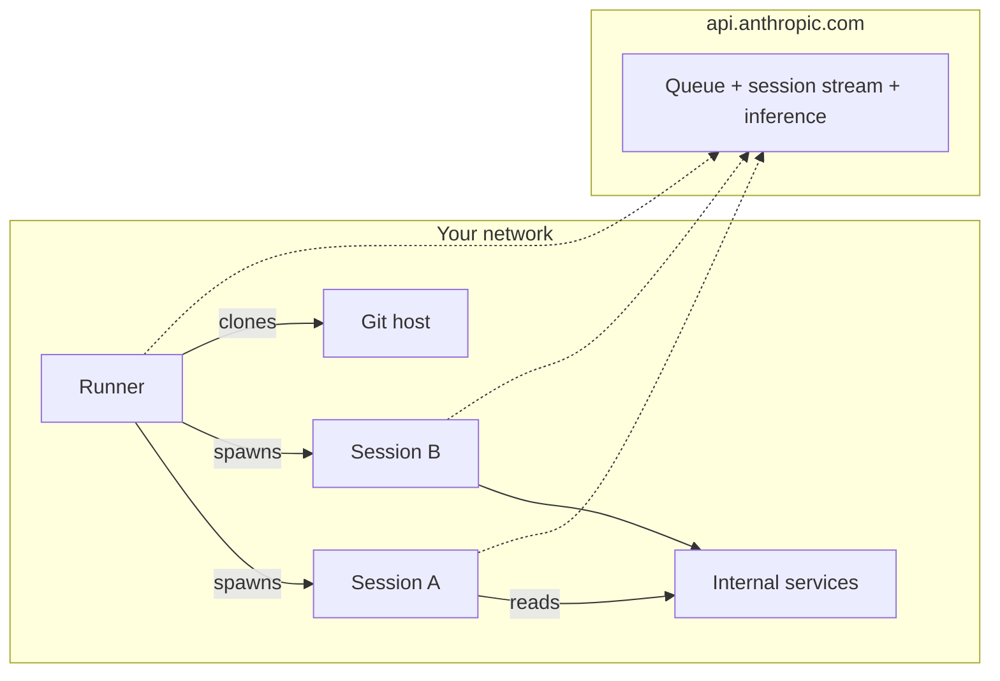

<LevelBadge level="advanced" />

<Callout type="objectives" items={[
  "Understand what a self-hosted environment actually is — three moving parts (environment, runner, session) that look almost exactly like a self-hosted CI runner",
  "See the network shape: 100% outbound HTTPS, zero inbound from Anthropic, Anthropic's control plane stays hosted, execution moves to your boxes",
  "Know when to reach for it (internal network access, custom tooling, compliance) vs the two easier answers most teams should use first",
  "Stand up your first runner with claude self-hosted-runner in four commands, without leaking the environment secret into shell history",
  "Understand the one-user-at-a-time runner lock — why it exists, what --drain-grace-sec and --retire-at do, and how it drives your minimum fleet size",
  "Ship the six gotchas that catch every first production fleet (secret rotation, ZDR blockers, model routing blockers, --base-dir default, clock skew, spot-instance eviction)",
]} />

<VerifyNote lastVerified="2026-08-07" source="https://code.claude.com/docs/en/self-hosted-environments">
Public beta shipped **August 7, 2026** in [Claude Code v2.1.224](https://code.claude.com/docs/en/changelog) on Team and Enterprise plans. The `claude self-hosted-runner` subcommand does not exist on earlier versions — it silently starts a normal Claude session with the words as a prompt. Names, flags, and enablement path may change before GA; cross-check the official [self-hosted environments page](https://code.claude.com/docs/en/self-hosted-environments) and its [quickstart](https://code.claude.com/docs/en/self-hosted-environments-quickstart) before you build against them.
</VerifyNote>

On August 7, 2026, Anthropic shipped a feature that closes the last real gap between Claude Code and the way regulated organizations actually run infrastructure: **self-hosted environments**. Every cloud session — the ones you start from claude.ai, the mobile and desktop apps, [scheduled Cowork routines](/docs/claude-app/cowork-scheduled-tasks), or `claude --cloud` — can now execute inside your own network, on machines you provision and image, on Team and Enterprise plans. Orchestration and the model call stay on Anthropic's side; the checked-out code, the tool executions, and the network access to your internal services live entirely on your boxes.

If you've ever operated a GitHub Actions self-hosted runner fleet, the shape is exactly familiar. You'll be productive faster if you carry that mental model in.

## The one-paragraph version

You define an **environment** in claude.ai admin settings — a named destination. You copy its **environment secret** once (365-day life; the UI calls it an "environment key"). You install Claude Code v2.1.224+ on a Linux or macOS host, put the secret in a file, and run `claude self-hosted-runner --environment-secret-file /etc/claude/environment-secret --base-dir /workspace`. That process polls `api.anthropic.com` outbound for work, claims sessions off your environment's queue, clones the repo the developer picked, and spawns a child `claude` process to run each session. Session state, git checkouts, and everything the tools touch stay on your host; only the transcript for inference leaves, over outbound HTTPS. Nothing inbound from Anthropic. Simple mental model, one operational surprise: a runner locks to the first user that lands on it and only serves that user until it drains.

## Where this sits vs the two easier answers

Before you build a fleet, be honest about whether you actually need one. Two adjacent products cover most of the "I want Claude somewhere other than my laptop" cases without any infrastructure to run.

| Option | Where execution happens | Setup you own | Pick it when |
| :--- | :--- | :--- | :--- |
| Anthropic-hosted cloud (default) | Anthropic's infra | None | You have no compliance or network reason to move execution. This is the right answer for most teams. |
| [Remote Control](https://code.claude.com/docs/en/remote-control) | Your own always-on machine | That one machine | You want to drive one workstation from your phone or another laptop. Available on Pro, Max, Team, and Enterprise. |
| **Self-hosted environments** | Your fleet of runners | Runner image, orchestration, egress, git creds | You need session execution inside your network — internal registries, private endpoints, air-gapped code, or compliance says "checkouts stay on our infra." Team and Enterprise only. |

If a session started from a terminal or IDE never leaves the developer's laptop anyway, none of this applies to that session — the environment picker only appears for cloud sessions.

## Architecture: environment, runner, session

Three nouns; they map cleanly onto their GitHub Actions equivalents.

<Steps items={[
  {title: "Environment (~ runner group)", body: "A named group of your runners, created on the Cloud environments admin page in claude.ai. Sessions are routed to an environment, not to a specific runner. In API fields and metrics it appears as pool, and the ID is a string like ccpool_..."},
  {title: "Runner (~ self-hosted runner)", body: "A long-lived process on your host started with claude self-hosted-runner. It registers with the environment using the environment secret, receives a runner token, and polls the queue for work. One binary, no daemon service to install — the runner IS the standard claude CLI in a different mode."},
  {title: "Session (~ workflow run)", body: "One Claude Code task a developer started, from claude.ai, the mobile/desktop app, a scheduled Cowork routine, or claude --cloud. Each session runs as a child claude process the runner spawns, with its own event stream back to Anthropic."},
]} />

Every connection is outbound from your network. Anthropic never connects in. The runner and each session each open their own outbound HTTPS to `api.anthropic.com` for queue polling, session streaming, and model inference; the runner or session opens git connections to your git host (public over HTTPS/SSH, or internal directly since you're on that network).

## Availability and the blockers most orgs hit

Six lines to read before you plan a rollout. Each one is a hard "no", not a workaround.

- **Plans**: Team and Enterprise, public beta. **Allow self-hosted environments** must be turned on by an Owner or admin on the [Cloud environments admin page](https://claude.ai/admin-settings/cloud-environments); the **New** button is hidden until then. Requires [Claude Code on the web](https://code.claude.com/docs/en/claude-code-on-the-web) to be enabled for the org.
- **Zero Data Retention**: unavailable for organizations with ZDR enabled. If your org needs ZDR, self-hosted environments are not for you.
- **Model routing**: inference goes to the Anthropic API on `api.anthropic.com`. You **cannot** route it through Amazon Bedrock, Google Cloud, Microsoft Foundry, or an [LLM gateway](https://code.claude.com/docs/en/llm-gateway) inside a self-hosted environment — the session authenticates with an Anthropic-issued, session-scoped OAuth token. Move execution, keep inference.
- **Repositories**: session checkouts are GitHub for now. If your source of truth is GitLab, Bitbucket, or self-hosted anything without GitHub-federated auth, wait.
- **Surfaces not yet routable**: [Claude Tag](https://claude.com/docs/claude-tag/overview), Claude Security, and Code Review sessions do not yet route to self-hosted environments. Regular chat, Claude Code on the web, mobile/desktop app, scheduled routines, and `claude --cloud` do.
- **Runner OS**: Linux or macOS host or container. Windows is not supported as a runner host — run it in a Linux container instead. Developer workstations are unaffected (they never host the runner).

## Quickstart: your first runner in four commands

The guided setup (`claude self-hosted-runner setup`) walks a machine you've logged into with `claude auth login` under an Owner/admin account through the whole flow interactively, and drops a `./runner-setup/CHEAT-SHEET.md` at the end. On a headless host where an interactive setup isn't possible, do it manually with these four commands.

<Steps items={[
  {title: "Create the environment in claude.ai and copy the secret", body: "Cloud environments admin page → New under Self-hosted environments → name it → Copy environment key. The secret is shown ONCE. Expires 365 days after creation. The ccpool_... ID is retrievable later; the secret is not."},
  {title: "Stage the secret in a file, out of shell history", body: "The subshell + umask trick reads from stdin, so the secret never lands in ~/.bash_history or ~/.zsh_history. Ctrl-D after paste + Enter."},
  {title: "Create a base directory the runner user can write to", body: "The runner defaults --base-dir to /workspace. If that directory doesn't exist (or the runner isn't root), you'll hit an error at first claim. Own it explicitly."},
  {title: "Start the runner and watch it register", body: "The process polls the queue in the foreground. Restart on exit is your job — see the fleet recipes below."},
]} />

<PromptCard title="1. Verify Claude Code is new enough">{`claude self-hosted-runner --help`}</PromptCard>

Prints the runner's usage text with flags like `--environment-secret-file` on v2.1.224+. On older versions it prints the general `claude --help` — upgrade first with `claude update` or reinstall from the [`latest` channel](https://code.claude.com/docs/en/setup).

<PromptCard title="2. Stage the environment secret without leaking it">{`sudo mkdir -p /etc/claude
sudo bash -c '(umask 077 && cat > /etc/claude/environment-secret)'
# paste secret, press Enter, then Ctrl-D`}</PromptCard>

<PromptCard title="3. Create a writable base directory">{`sudo mkdir -p /workspace && sudo chown $USER /workspace`}</PromptCard>

<PromptCard title="4. Start the runner">{`claude self-hosted-runner \\
  --environment-secret-file /etc/claude/environment-secret \\
  --base-dir /workspace`}</PromptCard>

Within a few seconds the environment's status on the admin page flips from **No runners deployed** to **Healthy**. Start a session from `claude.ai/code`, pick your environment from the picker, and watch the runner log `Picked up session <session-id>` with an active/capacity count.

Sending a follow-up from any other machine you've logged into:

<PromptCard title="Send a follow-up to a running cloud session">{`claude -p "add a test for the empty-list case" --cloud <session-id>`}</PromptCard>

The `<session-id>` is the bare `session_...` or `cse_...` ID or the session's `claude.ai/code` URL. Confirms with `Sent to cloud session.` plus a view link.

## The runner lifecycle: the one-user lock

This is the surprise most operators hit first. It's a deliberate isolation choice, and it drives everything about fleet sizing.

- The first session a runner picks up **locks the runner to that user's account**. From then on the runner claims only that user's queued work, up to `--capacity` concurrent sessions.
- What happens after those sessions finish depends on `--drain-grace-sec`:
  - **Default `0`**: runner exits as soon as active sessions finish; your orchestrator (Kubernetes, Compose, systemd + `Restart=always`) starts a fresh one on a clean disk that can serve *any* user.
  - **Positive value**: runner keeps polling the locked account's queue for that many seconds before exiting. Use this only if a single power user's back-to-back sessions dominate.
- The **minimum fleet size** is therefore the number of users you expect to be actively working at once — one long-running session on a runner blocks every other user from that runner until it drains.
- Session lease is polled every ~cycle; **60 seconds** without a poll and the control plane requeues the session to another runner. Runner heartbeat and lease refresh are the same call.
- For hosts destroyed at a wall clock time without a signal (spot instances, sandbox lifetime caps), pass `--retire-at <epoch-seconds>` a few minutes before the kill. The runner stops taking new work, releases each active session (so the user's next message picks up on a fresh runner), and exits 0. Without `--retire-at`, a signal-less kill looks like a crash and the session requeues from a lost-worker state.
- SIGTERM triggers a graceful drain out of the box (no flag). A turn that outlives the kill grace is still lost; size for it.

<Flashcards title="Runner lifecycle vocabulary" cards={[
  {front: "One-user lock", back: "The first session a runner claims locks the runner to that user's account until it drains. Minimum fleet size = number of concurrent active users."},
  {front: "--drain-grace-sec", back: "Seconds a runner keeps polling the locked user's queue after its active sessions finish. Default 0 (exit immediately)."},
  {front: "--capacity", back: "Concurrent sessions per runner, all served for the locked user."},
  {front: "--retire-at <epoch>", back: "Ask the runner to stop taking work and release active sessions before a signal-less kill (spot instance, sandbox timeout). Prevents lost-worker state."},
  {front: "--base-dir", back: "Where the runner checks out repositories. Default /workspace; must exist and be writable, or run the runner as root."},
  {front: "--environment-secret-file", back: "Path to the file holding the ccpool secret. The env secret expires 365 days from creation; rotate before then."},
  {front: "ccpool_ ID", back: "Public environment identifier (a.k.a. pool_id in APIs and metrics). Not a secret; use it in the aud check when verifying session tokens."},
]} />

## Network and what actually crosses the perimeter

The point of self-hosting is control over what leaves. So it's worth being precise about what does.

**Stays on your infra** — repository checkouts, build artifacts, secrets your tooling reads, and any files sessions create or modify. Session-to-internal-service calls (databases, registries, private HTTP endpoints) never leave your network.

**Leaves your infra** — the conversation itself (prompts, model responses, tool results) goes to `api.anthropic.com` for inference, and Anthropic stores the session transcript so a session can be picked up from another surface. Runner heartbeats and queue polls are outbound HTTPS to the same host. Optional: git clones can be tunneled through Anthropic's [git proxy](https://code.claude.com/docs/en/self-hosted-environments-deploy#use-the-anthropic-git-proxy) if your internal git host is unreachable from the runner directly.

**Never happens** — Anthropic does not open inbound connections to your network. There is no port to expose, no ingress to firewall.

Proxy support: the runner and the optional autoscaling orchestrator honor `HTTPS_PROXY` / `NO_PROXY` and the mTLS variables from [Network configuration](https://code.claude.com/docs/en/network-config). Sessions inherit them. The proxy in the path **must not buffer** server-sent-event responses — session streaming will break if it does.

## Production checklist: what to bake into the runner image

The runner is one binary. Everything else that makes sessions productive lives in the image or a wrapper script.

- **Pin the Claude Code version.** The `latest` channel gets releases the day they ship; the `stable` channel, Homebrew cask, and apt/dnf/apk stable repos trail ~a week. Follow [Install a specific version](https://code.claude.com/docs/en/setup#install-a-specific-version) and pin.
- **Git ≥ 2.24** on PATH. Newer git is required for some [Configure git](https://code.claude.com/docs/en/self-hosted-environments-deploy#configure-git) options; each stated floor is on that page.
- **Pre-install your build tools** — compilers, language runtimes, package managers, internal CLIs. This is 80% of the "why we self-host" value: every session starts ready to build, no `apt install` mid-turn.
- **Provision git credentials** in the runner image or via a wrapper. Options include per-session minted credentials — see [Configure git](https://code.claude.com/docs/en/self-hosted-environments-deploy#configure-git).
- **Restart-on-exit orchestration** (Kubernetes Deployment, `systemd` with `Restart=always`, Compose with `restart: always`). The runner exits by design when active sessions finish; without a restarter, your environment goes cold.
- **Clock sync (NTP or equivalent).** Authentication fails when the clock is more than 5 minutes off — a silent cause of `poll auth failed` loops.
- **Autoscaling**: for bursty demand, deploy the [autoscaling orchestrator](https://code.claude.com/docs/en/self-hosted-environments-configuration#on-demand-runners), a second process you host that starts on-demand runners as sessions queue.

## Testing and identity

Two adjacent surfaces worth knowing about the day you go past a single-host smoke test:

- **CI smoke test** — [Test end to end](https://code.claude.com/docs/en/self-hosted-environments-testing) dispatches a session at your environment from CI (`--environment ccpool_...`) and reads Claude's replies, giving you an image-promotion gate.
- **Verify session identity** — [Session identity verification](https://code.claude.com/docs/en/self-hosted-environments-identity) lets your internal services validate the session token before granting access, using the `ccpool_...` ID as the `aud` check. This is the piece that lets internal APIs know "this request came from a session in our environment, not from a random employee laptop."

## The six gotchas that catch every first fleet

Not made up — each one is either in the docs' fine print or a natural consequence of the design. Save yourself a week.

1. **Guided-setup version trap.** On Claude Code &lt; v2.1.224, `claude self-hosted-runner setup` doesn't error — it starts a normal Claude session with the literal words as the prompt. Run the `--help` check first; if you see the general `claude --help`, upgrade.
2. **Environment secret is show-once.** The value you copy at creation is unrecoverable. Store it in your secrets manager the same moment you copy it, before you close the wizard. If you lose it, create a new secret from the environment's **Configuration** tab, roll it to your runners, then revoke the old one — old runners hitting revoked secrets fail their next poll with `poll auth failed`.
3. **`--base-dir` default trap.** If you don't pass `--base-dir` and don't run the runner as root, `/workspace` won't exist and won't be writable — the runner registers fine, then errors on first claim. Always pass an explicit `--base-dir` on non-root runs, and `chown` it.
4. **The one-user lock, again.** A team of 20 active engineers needs at minimum 20 runners, not 20 × session-capacity. Under-provision here and every other user waits behind whoever hit the runner first. Size fleets by *concurrent active users*, not by concurrent sessions.
5. **Clock skew fails auth.** Runners on hosts more than 5 minutes off wall-clock time silently loop on `poll auth failed`. NTP is not optional.
6. **Signal-less kills lose the current turn.** Spot instances, container-runtime deadlines, and some Kubernetes evictions kill the host without SIGTERM. Set `--retire-at` a few minutes before the known kill time so the runner drains cleanly; otherwise a turn mid-flight is lost and the session requeues from a lost-worker state.

<Quiz title="Check your understanding" questions={[
  {q: "Your ZDR-enabled Enterprise org wants to move Claude Code execution on-prem. Can they use self-hosted environments?", options: ["Yes, ZDR is orthogonal to execution location", "No — self-hosted environments are unavailable for organizations with Zero Data Retention enabled", "Yes, but only for scheduled routines"], answer: 1, explain: "Self-hosted environments are unavailable to ZDR-enabled orgs. The session transcript still goes to api.anthropic.com for inference and is stored so a session can move between surfaces — that storage is incompatible with ZDR."},
  {q: "You have 20 engineers who might each have a Claude Code cloud session open at any time. What's your minimum runner count?", options: ["1, since --capacity handles concurrent sessions", "20, because each runner locks to one user until it drains", "You can compute it as ceil(20 / --capacity)"], answer: 1, explain: "A runner locks to the first user's account for its lifetime. Minimum fleet size equals concurrent active users. --capacity only bumps concurrency for that ONE locked user."},
  {q: "Your runners are on spot instances that get 2 minutes of warning before termination — no SIGTERM. What do you set to avoid losing mid-turn sessions?", options: ["--drain-grace-sec 120", "--retire-at set to a few minutes before the known termination time", "--capacity 1"], answer: 1, explain: "--retire-at handles signal-less kills: the runner stops accepting new work and releases active sessions so the user's next message picks up on a fresh runner. --drain-grace-sec only affects post-drain polling."},
  {q: "You want Claude Code cloud sessions routed to your Bedrock inference. Does self-hosted environments enable that?", options: ["Yes — that's a common use case", "No — sessions in self-hosted environments authenticate with an Anthropic-issued session-scoped OAuth token and inference goes to api.anthropic.com only", "Yes, if you use an LLM gateway"], answer: 1, explain: "Self-hosting moves execution, not inference. Inference in a self-hosted environment cannot be routed through Bedrock, Google Cloud, Foundry, or an LLM gateway."},
  {q: "You bring up a runner on a machine whose clock is 12 minutes ahead of real time. What do you see?", options: ["It works fine — Anthropic tolerates clock skew", "It registers but never picks up sessions", "It fails with poll auth failed and never registers as Healthy — auth fails past a 5-minute skew"], answer: 2, explain: "Authentication tokens are time-bound. More than 5 minutes off wall-clock time and the runner's polls fail auth. NTP or a similar clock sync is a hard requirement."},
]} />

<Callout type="takeaways" items={[
  "Self-hosted environments move Claude Code cloud session EXECUTION into your network. Orchestration and inference stay on api.anthropic.com. There is no inbound from Anthropic.",
  "Three parts: environment (a named routing destination), runner (a claude self-hosted-runner process), session (one child Claude Code task). Same shape as GitHub Actions self-hosted runners.",
  "Availability today: Team and Enterprise, public beta, off by default. Blocked by ZDR. Inference cannot be routed off Anthropic. GitHub-only checkouts. Linux/macOS runner hosts.",
  "One runner locks to the first user's account for its lifetime. Minimum fleet size = number of concurrent active users. --capacity only scales concurrency for that locked user.",
  "The four commands are the whole quickstart: verify version, stage the secret in a umask-protected file, mkdir a writable --base-dir, run the runner in the foreground. Restart-on-exit is your orchestrator's job.",
  "For anything less than a fleet, Anthropic-hosted cloud is the right answer. For driving one always-on machine remotely, use Remote Control instead.",
]} />

## Next

- Cloud sessions you'll be routing → [Claude Code on the web](https://code.claude.com/docs/en/claude-code-on-the-web)
- Scheduled sessions that run without a device on → [Cowork Scheduled Tasks](/docs/claude-app/cowork-scheduled-tasks)
- The hardening and fleet recipes for real deployments → [Deploy to production (official docs)](https://code.claude.com/docs/en/self-hosted-environments-deploy)
- The other primitive for "run Claude Code somewhere other than my laptop" → [Remote Control (official docs)](https://code.claude.com/docs/en/remote-control)
