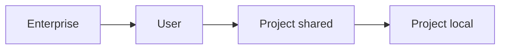

<LevelBadge level="intermediate" />

<VerifyNote lastVerified="2026-07-08" source="https://code.claude.com/docs/en/settings">
The exact keys and file locations are best confirmed in the official Claude Code settings docs.
</VerifyNote>

`settings.json` is where Claude Code's configuration lives — [permissions](/docs/claude-code/permissions), [hooks](/docs/claude-code/hooks), environment variables, model defaults, and more. Understanding the **tiers** is the key.

## The tiers (most-global → most-specific)

Later (more specific) tiers override earlier ones:

1. **Enterprise / managed** — policy set by an org admin. Wins over everything.
2. **User** — `~/.claude/settings.json`. Your defaults across all projects.
3. **Project (shared)** — `.claude/settings.json`, committed to the repo. Team-wide.
4. **Project (personal)** — `.claude/settings.local.json`, git-ignored. Your overrides for this repo.

:::tip Commit the shared file, ignore the local one
Put team conventions in `.claude/settings.json` (committed). Put personal tweaks and machine-specific paths in `.claude/settings.local.json` (git-ignored). This keeps the team consistent without forcing your preferences on others.
:::

## What you'll commonly set

- **`permissions`** — allow/ask/deny rules. See [Permissions](/docs/claude-code/permissions).
- **`hooks`** — commands that run at lifecycle events. See [Hooks](/docs/claude-code/hooks).
- **`env`** — environment variables for the session.
- **Model / behaviour defaults** — e.g. preferred model.

## Editing safely

- Keep it valid JSON (a trailing comma will break it).
- Prefer **narrow** permission rules over broad ones.
- Never put secrets in a committed file — use `env` references or a secrets manager.

Ready-to-copy starting files live in [Hooks & settings.json Recipes](/docs/templates/hooks-settings).

## Next

- [Permissions & Permission Modes](/docs/claude-code/permissions)
- [Hooks: Deterministic Automation](/docs/claude-code/hooks)
- [Custom Slash Commands](/docs/claude-code/slash-commands)
