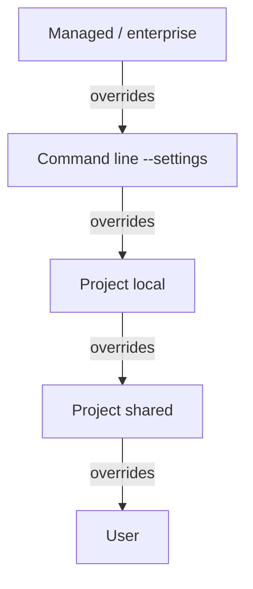

<LevelBadge level="intermediate" />

<VerifyNote lastVerified="2026-09-23" source="https://code.claude.com/docs/en/settings">
Five-level precedence stack (managed → command line → project local → shared project → user) and the "environment variables aren't a level" rule from the official [Settings files and precedence](https://code.claude.com/docs/en/settings) page. Per-key overrides are listed in the [settings reference](https://code.claude.com/docs/en/settings-reference).
</VerifyNote>

`settings.json` is where Claude Code's configuration lives — [permissions](/docs/claude-code/permissions), [hooks](/docs/claude-code/hooks), environment variables, model defaults, and more. Understanding the **tiers** is the key.

## The tiers (highest precedence first)

When the same key is set in more than one place, Claude Code uses the value from the highest level that sets it:

1. **Managed / enterprise** — `managed-settings.json`, an MDM policy, or server-managed settings from the claude.ai console. Nothing you set overrides them (bar a few security-sensitive exceptions).
2. **Command line** — `claude --settings '<json-or-path>'`, for one session only. Sits above every file except managed, and writes to no file.
3. **Project (personal)** — `.claude/settings.local.json`, git-ignored. Your overrides for this repo.
4. **Project (shared)** — `.claude/settings.json`, committed to the repo. Team-wide.
5. **User** — `~/.claude/settings.json`. Your defaults across all projects.

```mermaid
flowchart TB
  M[Managed / enterprise] -->|overrides| C[Command line --settings]
  C -->|overrides| L[Project local]
  L -->|overrides| P[Project shared]
  P -->|overrides| U[User]
```

:::note Environment variables are not a tier
They sit outside this stack and are resolved per key. For example `ANTHROPIC_MODEL` applies over the `model` key from any file, while `ANTHROPIC_DEFAULT_MODEL` applies only when no file sets `model`.
:::

:::tip Commit the shared file, ignore the local one
Put team conventions in `.claude/settings.json` (committed). Put personal tweaks and machine-specific paths in `.claude/settings.local.json` (git-ignored). This keeps the team consistent without forcing your preferences on others.
:::

## What you'll commonly set

- **`permissions`** — allow/ask/deny rules. See [Permissions](/docs/claude-code/permissions).
- **`hooks`** — commands that run at lifecycle events. See [Hooks](/docs/claude-code/hooks).
- **`env`** — environment variables for the session.
- **Model / behaviour defaults** — e.g. preferred model.

## Editing safely

- Keep it valid JSON (a trailing comma will break it).
- Prefer **narrow** permission rules over broad ones.
- Never put secrets in a committed file — use `env` references or a secrets manager.

Ready-to-copy starting files live in [Hooks & settings.json Recipes](/docs/templates/hooks-settings).

## Next

- [Permissions & Permission Modes](/docs/claude-code/permissions)
- [Hooks: Deterministic Automation](/docs/claude-code/hooks)
- [Custom Slash Commands](/docs/claude-code/slash-commands)
