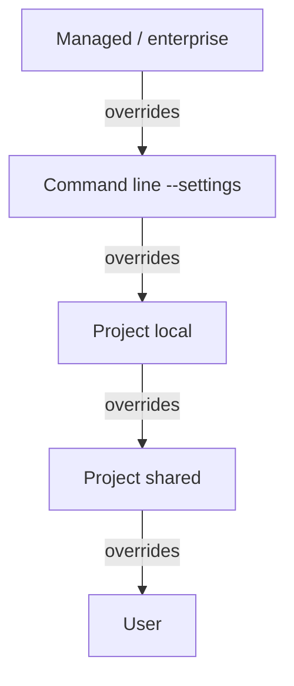

<LevelBadge level="intermediate" />

<VerifyNote lastVerified="2026-09-23" source="https://code.claude.com/docs/en/settings">
Five-level precedence stack (managed → command line → project local → shared project → user) and the "environment variables aren't a level" rule from the official [Settings files and precedence](https://code.claude.com/docs/en/settings) page. Per-key overrides are listed in the [settings reference](https://code.claude.com/docs/en/settings-reference).
</VerifyNote>

`settings.json` is where Claude Code's configuration lives — [permissions](/docs/claude-code/permissions), [hooks](/docs/claude-code/hooks), environment variables, model defaults, and more. Understanding the **tiers** is the key.

<Callout type="objectives" items={["The five-level precedence stack, and which file wins when two of them set the same key","Why environment variables are not a tier, and what that means for ANTHROPIC_MODEL","Which file to put a setting in: committed team convention, personal override, or one-session experiment","The four sections you will actually edit, and where each one is documented in depth","How to edit without breaking the file, and what never belongs in a committed settings file"]} />

## The tiers (highest precedence first)

When the same key is set in more than one place, Claude Code uses the value from the highest level that sets it:

<Steps items={[
  {title: "Managed / enterprise", body: "managed-settings.json, an MDM policy, or server-managed settings from the claude.ai console. Nothing you set overrides them (bar a few security-sensitive exceptions)."},
  {title: "Command line", body: "claude --settings '<json-or-path>', for one session only. Sits above every file except managed, and writes to no file — so it is the right tool for an experiment you do not want to remember."},
  {title: "Project (personal)", body: ".claude/settings.local.json, git-ignored. Your overrides for this repo: machine-specific paths, a model you prefer here, a hook only you want."},
  {title: "Project (shared)", body: ".claude/settings.json, committed to the repo. Team-wide conventions — the file a new teammate inherits by cloning."},
  {title: "User", body: "~/.claude/settings.json. Your defaults across all projects. Lowest precedence, so a repo can always override you."}
]} />

```mermaid
flowchart TB
  M[Managed / enterprise] -->|overrides| C[Command line --settings]
  C -->|overrides| L[Project local]
  L -->|overrides| P[Project shared]
  P -->|overrides| U[User]
```

:::note Environment variables are not a tier
They sit outside this stack and are resolved per key. For example `ANTHROPIC_MODEL` applies over the `model` key from any file, while `ANTHROPIC_DEFAULT_MODEL` applies only when no file sets `model`.
:::

:::tip Commit the shared file, ignore the local one
Put team conventions in `.claude/settings.json` (committed). Put personal tweaks and machine-specific paths in `.claude/settings.local.json` (git-ignored). This keeps the team consistent without forcing your preferences on others.
:::

## What you'll commonly set

- **`permissions`** — allow/ask/deny rules. See [Permissions](/docs/claude-code/permissions).
- **`hooks`** — commands that run at lifecycle events. See [Hooks](/docs/claude-code/hooks).
- **`env`** — environment variables for the session.
- **Model / behaviour defaults** — e.g. preferred model.

## Editing safely

- Keep it valid JSON (a trailing comma will break it).
- Prefer **narrow** permission rules over broad ones.
- Never put secrets in a committed file — use `env` references or a secrets manager.

<PromptCard title="Try a setting for one session without writing it to any file">
{`claude --settings '{"permissions":{"allow":["Bash(git log *)"]}}'`}
</PromptCard>

Ready-to-copy starting files live in [Hooks & settings.json Recipes](/docs/templates/hooks-settings). When a file is malformed or a key isn't doing what you expect, `claude doctor` prints settings-file validation errors without starting a session — see [the CLI page](/docs/claude-code/cli-flags) for that and `--safe-mode`.

## Check yourself

<Quiz questions={[
  {
    q: "Your repo's committed .claude/settings.json sets a model, and your ~/.claude/settings.json sets a different one. Which applies?",
    options: [
      "Your user file — personal settings always win",
      "The repo's committed file — project shared sits above user",
      "Neither; the conflict is an error",
      "Whichever file was modified most recently"
    ],
    answer: 1,
    explain: "User settings are the lowest tier, so a repo can always override your personal defaults. The order is managed → command line → project local → project shared → user."
  },
  {
    q: "Where should a machine-specific absolute path go?",
    options: [
      ".claude/settings.json, so the team has it",
      ".claude/settings.local.json, which is git-ignored",
      "~/.claude/settings.json, so it applies to every project",
      "managed-settings.json"
    ],
    answer: 1,
    explain: "settings.local.json is the project-scoped, git-ignored tier: right for paths and preferences that only make sense on your machine, without pushing them onto teammates."
  },
  {
    q: "Which statement about environment variables is correct?",
    options: [
      "They form a sixth tier, just below managed settings",
      "They are resolved per key and sit outside the stack — ANTHROPIC_MODEL overrides the model key from any file, while ANTHROPIC_DEFAULT_MODEL applies only when no file sets it",
      "They are ignored once any settings file exists",
      "They only work when set in the env section of settings.json"
    ],
    answer: 1,
    explain: "The docs are explicit that environment variables are not a precedence level. Each one has its own rule, which is why two variables for the same concept can behave differently."
  }
]} />

<Callout type="takeaways" items={["Five tiers, one rule: the highest level that sets a key wins. Managed is absolute; user settings are the weakest.","Committed file for team conventions, local file for personal and machine-specific values, --settings for a throwaway experiment.","Environment variables are not a tier. Check each variable's own rule rather than assuming a position in the stack.","Secrets never go in a committed settings file.","When a setting seems ignored, run claude doctor for validation errors before changing anything else."]} />

## Next

- [The claude CLI: Flags That Change Outcomes](/docs/claude-code/cli-flags) — the per-session counterpart to every key here
- [Permissions & Permission Modes](/docs/claude-code/permissions)
- [Hooks: Deterministic Automation](/docs/claude-code/hooks)
- [Custom Slash Commands](/docs/claude-code/slash-commands)
