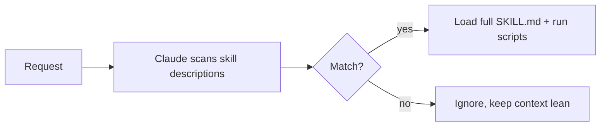

<LevelBadge level="advanced" />

<VerifyNote lastVerified="2026-06-23" source="https://code.claude.com/docs/en/skills">
Skill file layout, progressive disclosure, and where skills run (Claude Code, Claude.ai, Cowork) are evolving — confirm in the official Skills docs.
</VerifyNote>

A **Skill** packages expertise — instructions plus optional scripts and resources — that Claude loads **only when relevant**. Instead of stuffing everything into [CLAUDE.md](/docs/claude-code/claude-md), you give Claude a library of capabilities it pulls in on demand.

## Anatomy

A skill is a folder with a `SKILL.md`: YAML frontmatter + instructions.

```markdown
---
name: pdf-forms
description: Use when the user needs to fill, read, or generate PDF forms.
---

# PDF Forms
Steps and rules for working with PDF forms…
(optionally reference scripts/ or resources/ in this folder)
```

The **`description` is the trigger** — Claude reads it to decide *when* to activate the skill. Write it as "Use when…", specific enough that it loads at the right time and not otherwise.

## Progressive disclosure (why skills scale)

Claude doesn't load every skill's full body up front — it sees the lightweight `name` + `description`, and only pulls in the full instructions (and runs scripts) when a request matches. That keeps context lean even with many skills installed.



## Where they live

- Personal: `~/.claude/skills/<name>/SKILL.md`
- Project (shareable): `.claude/skills/<name>/SKILL.md`
- Bundled in a [plugin](/docs/claude-code/plugins-marketplaces) for team distribution.

AILmanac ships [7 ready-made skill packs](/docs/templates/skills) — copy one in to try it.

## Worked example: a skill that triggers itself

Create `~/.claude/skills/release-notes/SKILL.md`:

```markdown
---
name: release-notes
description: Use when the user asks to write release notes or a changelog from git history.
---

# Release Notes
1. Run `git log <last-tag>..HEAD --oneline` to get the commits.
2. Group them into Features / Fixes / Breaking changes.
3. Write user-facing notes — what changed for *users*, not commit messages.
4. Output Markdown ready to paste into a GitHub release.
```

Later you type: *"Draft release notes since v1.4."* Claude never had these steps in context — but the request matches the `description`, so it pulls in the full `SKILL.md`, runs the `git log`, and produces grouped notes. You didn't invoke anything by name; the **description did the routing**. Add a `scripts/` file in the same folder and the skill can run it as part of step 1.

## Skill vs command vs subagent vs MCP

| Tool | What it is | You vs Claude triggers |
|---|---|---|
| [Slash command](/docs/claude-code/slash-commands) | A saved prompt | **You** invoke it |
| **Skill** | On-demand expertise + scripts | **Claude** loads it when relevant |
| [Subagent](/docs/claude-code/subagents) | A delegated agent with its own context | Claude delegates |
| [MCP](/docs/claude-code/mcp) | A connection to external tools/data | Provides tools to call |

Rule of thumb: **you** want to fire it on demand → slash command. **Claude** should know the procedure and apply it when relevant → skill. The work should happen in a separate context → subagent. You need to reach an external system → MCP.

## Common mistakes

- **A description that doesn't trigger.** "Helps with PDFs" is too vague; "Use when the user needs to fill, read, or generate PDF forms" tells Claude exactly when to load it. The description is the whole activation mechanism — write it for matching, not for humans.
- **Putting everything in CLAUDE.md instead.** [CLAUDE.md](/docs/claude-code/claude-md) loads *every* session and costs context always; a skill loads *only when relevant*. Move situational procedures into skills and keep CLAUDE.md for always-true project rules.
- **One giant skill.** Many small, sharply-described skills route better than one catch-all — progressive disclosure only helps if each description is specific.
- **Forgetting it's shareable.** A project skill in `.claude/skills/` committed to git gives the whole team the capability; a personal one in `~/.claude/skills/` stays yours.

## Next

- [Write Your First Skill (walkthrough)](/docs/walkthroughs/first-skill)
- [SKILL.md Templates](/docs/templates/skills)
- [Plugins & Marketplaces](/docs/claude-code/plugins-marketplaces)
