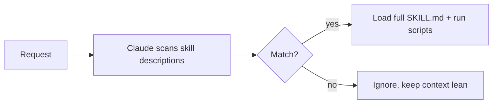

<LevelBadge level="advanced" />

<VerifyNote lastVerified="2026-06-23" source="https://code.claude.com/docs/en/skills">
Skill file layout, progressive disclosure, and where skills run (Claude Code, Claude.ai, Cowork) are evolving — confirm in the official Skills docs.
</VerifyNote>

<Callout type="objectives" items={["Define what a Skill is and how it differs from stuffing everything into CLAUDE.md", "Read and write a SKILL.md — frontmatter plus instructions — and understand why the description is the trigger", "Explain progressive disclosure and why it lets many skills scale without bloating context", "Know the three places skills live: personal, project, and bundled in a plugin", "Choose correctly between Skill, slash command, subagent, and MCP", "Avoid the four common mistakes that keep skills from triggering"]} />

A **Skill** packages expertise — instructions plus optional scripts and resources — that Claude loads **only when relevant**. Instead of stuffing everything into [CLAUDE.md](/docs/claude-code/claude-md), you give Claude a library of capabilities it pulls in on demand.

## Anatomy

A skill is a folder with a `SKILL.md`: YAML frontmatter + instructions.

```markdown
---
name: pdf-forms
description: Use when the user needs to fill, read, or generate PDF forms.
---

# PDF Forms
Steps and rules for working with PDF forms…
(optionally reference scripts/ or resources/ in this folder)
```

<Callout type="tip" items={["The description is the trigger — Claude reads it to decide when to activate the skill. Write it as \"Use when…\", specific enough that it loads at the right time and not otherwise."]} />

## Progressive disclosure (why skills scale)

Claude doesn't load every skill's full body up front — it sees the lightweight `name` + `description`, and only pulls in the full instructions (and runs scripts) when a request matches. That keeps context lean even with many skills installed.



## Where they live

<Steps items={[{title:"Personal", body:"~/.claude/skills/<name>/SKILL.md — stays yours, available across all your projects."},{title:"Project (shareable)", body:".claude/skills/<name>/SKILL.md — commit it to git and the whole team gets the capability."},{title:"Bundled in a plugin", body:"Package skills inside a plugin for team distribution. See Plugins & Marketplaces."}]} />

AILmanac ships [7 ready-made skill packs](/docs/templates/skills) — copy one in to try it.

## Worked example: a skill that triggers itself

Create `~/.claude/skills/release-notes/SKILL.md`:

```markdown
---
name: release-notes
description: Use when the user asks to write release notes or a changelog from git history.
---

# Release Notes
1. Run `git log <last-tag>..HEAD --oneline` to get the commits.
2. Group them into Features / Fixes / Breaking changes.
3. Write user-facing notes — what changed for *users*, not commit messages.
4. Output Markdown ready to paste into a GitHub release.
```

Later you type the prompt below. Claude never had these steps in context — but the request matches the `description`, so it pulls in the full `SKILL.md`, runs the `git log`, and produces grouped notes. You didn't invoke anything by name; the **description did the routing**. Add a `scripts/` file in the same folder and the skill can run it as part of step 1.

<PromptCard title="Trigger the skill by intent — no name needed">{`Draft release notes since v1.4.`}</PromptCard>

## Skill vs command vs subagent vs MCP

| Tool | What it is | You vs Claude triggers |
|---|---|---|
| [Slash command](/docs/claude-code/slash-commands) | A saved prompt | **You** invoke it |
| **Skill** | On-demand expertise + scripts | **Claude** loads it when relevant |
| [Subagent](/docs/claude-code/subagents) | A delegated agent with its own context | Claude delegates |
| [MCP](/docs/claude-code/mcp) | A connection to external tools/data | Provides tools to call |

<Callout type="takeaways" items={["You want to fire it on demand → slash command.", "Claude should know the procedure and apply it when relevant → skill.", "The work should happen in a separate context → subagent.", "You need to reach an external system → MCP."]} />

## Common mistakes

<Callout type="warning" items={["A description that doesn't trigger. \"Helps with PDFs\" is too vague; \"Use when the user needs to fill, read, or generate PDF forms\" tells Claude exactly when to load it. The description is the whole activation mechanism — write it for matching, not for humans.", "Putting everything in CLAUDE.md instead. CLAUDE.md loads every session and costs context always; a skill loads only when relevant. Move situational procedures into skills and keep CLAUDE.md for always-true project rules.", "One giant skill. Many small, sharply-described skills route better than one catch-all — progressive disclosure only helps if each description is specific.", "Forgetting it's shareable. A project skill in .claude/skills/ committed to git gives the whole team the capability; a personal one in ~/.claude/skills/ stays yours."]} />

## Recap the terms

<Flashcards cards={[{front:"What is a Skill?", back:"A folder with a SKILL.md packaging instructions plus optional scripts and resources, that Claude loads only when relevant."},{front:"What is the trigger for a skill?", back:"The description field — Claude reads it to decide when to activate the skill. Write it as \"Use when…\", specific enough to load at the right time and not otherwise."},{front:"What is progressive disclosure?", back:"Claude sees only the lightweight name + description up front, and pulls in the full SKILL.md (and runs scripts) only when a request matches — keeping context lean even with many skills."},{front:"Personal vs project skill location?", back:"Personal: ~/.claude/skills/<name>/SKILL.md (stays yours). Project: .claude/skills/<name>/SKILL.md (commit to git to share with the team)."},{front:"Skill vs slash command?", back:"You invoke a slash command on demand; Claude loads a skill automatically when the request matches its description."},{front:"Skill vs CLAUDE.md?", back:"CLAUDE.md loads every session and always costs context; a skill loads only when relevant. Keep always-true rules in CLAUDE.md, situational procedures in skills."}]} />

## Check yourself

<Quiz title="Check yourself" questions={[{q:"In a SKILL.md, what actually decides when Claude activates the skill?", options:["The folder name","The description field in the frontmatter","The first heading in the body","Manual invocation by the user"], answer:1, explain:"The description is the trigger — Claude reads it to decide when to activate the skill. Write it as \"Use when…\", specific enough to load at the right time."},{q:"What is progressive disclosure?", options:["Claude loads every skill's full body up front","Claude sees only name + description, and loads the full SKILL.md only when a request matches","Skills reveal their steps one line at a time to the user","CLAUDE.md is loaded gradually over a session"], answer:1, explain:"Progressive disclosure means Claude sees the lightweight name + description and only pulls in the full instructions (and runs scripts) when a request matches — keeping context lean even with many skills installed."},{q:"You want the WHOLE TEAM to get a capability via git. Where do you put the skill?", options:["~/.claude/skills/<name>/SKILL.md","/etc/claude/skills/","\.claude/skills/<name>/SKILL.md committed to git","Inside CLAUDE.md"], answer:2, explain:"A project skill in .claude/skills/ committed to git gives the whole team the capability; a personal one in ~/.claude/skills/ stays yours."},{q:"You want to fire something yourself, on demand, by name. Which tool fits?", options:["Skill","Slash command","Subagent","MCP"], answer:1, explain:"Rule of thumb: you want to fire it on demand → slash command. Claude loading a procedure when relevant → skill; separate context → subagent; reach an external system → MCP."},{q:"Why prefer a skill over putting a situational procedure in CLAUDE.md?", options:["CLAUDE.md cannot contain procedures","CLAUDE.md loads every session and always costs context, while a skill loads only when relevant","Skills run faster than CLAUDE.md","CLAUDE.md can't be shared via git"], answer:1, explain:"CLAUDE.md loads every session and costs context always; a skill loads only when relevant. Move situational procedures into skills and keep CLAUDE.md for always-true project rules."}]} />

## Next

- [Write Your First Skill (walkthrough)](/docs/walkthroughs/first-skill)
- [SKILL.md Templates](/docs/templates/skills)
- [Plugins & Marketplaces](/docs/claude-code/plugins-marketplaces)
