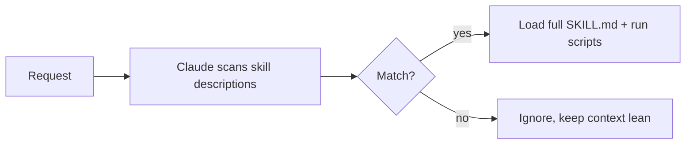

<LevelBadge level="advanced" />

<VerifyNote lastVerified="2026-06-20" source="https://code.claude.com/docs/en/skills">
Skill file layout and where skills run (Claude Code, Claude.ai, Cowork) are evolving — confirm in the official Skills docs.
</VerifyNote>

A **Skill** packages expertise — instructions plus optional scripts and resources — that Claude loads **only when relevant**. Instead of stuffing everything into [CLAUDE.md](/docs/claude-code/claude-md), you give Claude a library of capabilities it pulls in on demand.

## Anatomy

A skill is a folder with a `SKILL.md`: YAML frontmatter + instructions.

```markdown
---
name: pdf-forms
description: Use when the user needs to fill, read, or generate PDF forms.
---

# PDF Forms
Steps and rules for working with PDF forms…
(optionally reference scripts/ or resources/ in this folder)
```

The **`description` is the trigger** — Claude reads it to decide *when* to activate the skill. Write it as "Use when…", specific enough that it loads at the right time and not otherwise.

## Progressive disclosure (why skills scale)

Claude doesn't load every skill's full body up front — it sees the lightweight `name` + `description`, and only pulls in the full instructions (and runs scripts) when a request matches. That keeps context lean even with many skills installed.



## Where they live

- Personal: `~/.claude/skills/<name>/SKILL.md`
- Project (shareable): `.claude/skills/<name>/SKILL.md`
- Bundled in a [plugin](/docs/claude-code/plugins-marketplaces) for team distribution.

AILmanac ships [7 ready-made skill packs](/docs/templates/skills) — copy one in to try it.

## Skill vs command vs subagent vs MCP

| Tool | What it is | You vs Claude triggers |
|---|---|---|
| [Slash command](/docs/claude-code/slash-commands) | A saved prompt | **You** invoke it |
| **Skill** | On-demand expertise + scripts | **Claude** loads it when relevant |
| [Subagent](/docs/claude-code/subagents) | A delegated agent with its own context | Claude delegates |
| [MCP](/docs/claude-code/mcp) | A connection to external tools/data | Provides tools to call |

## Next

- [Write Your First Skill (walkthrough)](/docs/walkthroughs/first-skill)
- [SKILL.md Templates](/docs/templates/skills)
- [Plugins & Marketplaces](/docs/claude-code/plugins-marketplaces)
