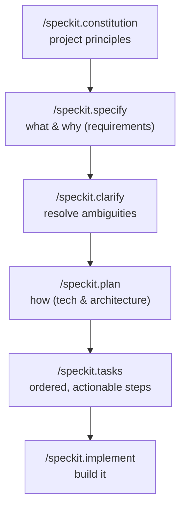

<LevelBadge level="intermediate" />

# Spec-Driven Development with Spec Kit

Vibe coding — "build me a dashboard," accept whatever comes back — works great until the feature gets big. Then the agent drifts: it forgets an earlier decision, re-invents a function, or ships something that technically runs but isn't what you meant. **Spec-Driven Development (SDD)** is the fix that's caught on across the agentic-coding crowd in 2026: instead of treating the prompt as throwaway, you make a **written, reviewable specification the source of truth** and have the agent generate code *from* it.

GitHub's open-source **[Spec Kit](https://github.com/github/spec-kit)** turns that idea into a concrete workflow you can run inside Claude Code today.

<Callout type="objectives" items={["Understand what spec-driven development is and the problem it solves", "Walk the Spec Kit phases: constitution → specify → plan → tasks → implement", "Install the Specify CLI and wire it into Claude Code", "Know the optional quality gates (clarify, analyze, checklist)", "Decide when SDD is worth the overhead and when to skip it"]} />

<VerifyNote lastVerified="2026-06-28" source="https://github.com/github/spec-kit">
Spec Kit is moving fast (~116k★, MIT-licensed). Command names, the `specify init` agent-selection flag, and supported tools change between releases — confirm the current quickstart in the repo README before relying on exact syntax. The slash-command names below use the `/speckit.*` namespace introduced in recent releases.
</VerifyNote>

## Why specs, not just prompts

A prompt is gone the moment the turn ends. A **spec is an artifact**: it can be read, reviewed in a PR, corrected, and re-run. That single shift fixes the three ways big agentic builds go wrong:

- **Drift** — the agent contradicts an earlier decision because nothing wrote it down. The spec is the memory.
- **Ambiguity** — "make it nice" means ten different things. Forcing requirements into prose surfaces the gaps *before* code exists, where they're cheap to fix.
- **Unreviewable diffs** — a 2,000-line generated PR is hard to judge. A reviewed spec + plan makes the diff *expected* instead of surprising.

The mental model: **intent is the high-value, durable thing; code is a downstream, regenerable artifact.** SDD is the disciplined cousin of Claude Code's own [Plan Mode](/docs/claude-code/plan-mode) — plan first, build second — scaled up to a whole feature and persisted to files in your repo.

## The Spec Kit workflow

Spec Kit structures a feature as a short pipeline of slash commands. Each one writes Markdown artifacts into your repo (under `.specify/`), so every phase is inspectable and version-controlled.

<Steps items={[{title: "Constitution", body: "Run /speckit.constitution once per project. It writes governing principles — code style, testing bar, architectural non-negotiables — into .specify/memory/constitution.md. Every later phase is checked against it, so this is your durable guardrail (think of it as a CLAUDE.md focused on principles)."}, {title: "Specify", body: "Run /speckit.specify and describe WHAT you're building and WHY — user stories, requirements, success criteria. Deliberately NOT the tech stack. The agent produces a structured spec you read and correct before going further."}, {title: "Plan", body: "Run /speckit.plan with your technical choices — framework, data store, constraints. Now the HOW gets written: architecture, components, and how they satisfy the spec. Tech decisions live here, not in the spec, so the spec stays implementation-agnostic."}, {title: "Tasks", body: "Run /speckit.tasks to break the plan into a numbered, ordered list of small, individually reviewable steps. This is what makes the build auditable — you can see the sequence before any code is written."}, {title: "Implement", body: "Run /speckit.implement and the agent executes the task list, building the feature against the plan and the constitution. Because each prior phase was reviewed, the resulting diff is expected, not a surprise."}]} />

### Optional quality gates

Three more commands tighten the loop when a feature is high-stakes:

- **`/speckit.clarify`** — interrogates the spec for under-specified areas and asks you targeted questions *before* planning. Best run right after `specify`.
- **`/speckit.analyze`** — cross-checks the spec, plan, and tasks for consistency and coverage gaps.
- **`/speckit.checklist`** — generates a validation checklist so "done" is defined and testable.

<Callout type="tip" items={["Run /speckit.clarify before /speckit.plan — fixing ambiguity is cheapest before architecture is committed.", "Treat each generated artifact like a PR: read it, correct it, and only then advance to the next phase.", "Commit the .specify/ artifacts — they're the reviewable record of intent behind the code."]} />

## Get it running with Claude Code

Spec Kit ships a CLI, **Specify**, that scaffolds the slash commands into your project. It supports 30+ coding agents, Claude Code among them.

<Steps items={[{title: "Install the Specify CLI", body: "Use uv to install it from the repo. (Python + uv required.)"}, {title: "Initialize a project", body: "Scaffold the .specify/ structure and the agent commands. Run init in a new or existing repo; when prompted, choose Claude Code as your agent (or pass the current integration flag from the README)."}, {title: "Open Claude Code and check the commands", body: "Launch claude in the project folder. You'll know it's wired up when /speckit.constitution, /speckit.specify, /speckit.plan, /speckit.tasks, and /speckit.implement appear as slash commands."}]} />

<PromptCard title="Install the Specify CLI (uv)">{`uv tool install specify-cli --from git+https://github.com/github/spec-kit.git`}</PromptCard>

<PromptCard title="Scaffold spec-driven workflow into a project">{`# new project
specify init my-feature

# or in the current repo
specify init --here`}</PromptCard>

<PromptCard title="Then, inside Claude Code, run the pipeline">{`/speckit.constitution Establish principles: TypeScript strict, tests for every public function, no secrets in code.
/speckit.specify Build a CSV export for the reports page: users pick a date range and download a CSV of matching rows.
/speckit.clarify
/speckit.plan Next.js App Router, server action for the query, stream the CSV; no new dependencies.
/speckit.tasks
/speckit.implement`}</PromptCard>

<Callout type="warning" items={["The exact agent-selection flag for specify init changes between releases — check the README quickstart rather than copying a flag blindly.", "SDD does not remove the need to verify: read the generated code and run it. The spec makes the diff reviewable, not automatically correct.", "Never put secrets or credentials in the spec, plan, or constitution — they get committed like any other file."]} />

## When to use it (and when not)

SDD trades upfront ceremony for control. That trade is worth it when the work is big, ambiguous, or must be reviewed by others — and pure overhead when it isn't.

<Callout type="info" items={["Reach for SDD: greenfield features, multi-file builds, anything a teammate must review, or work you'll hand to a subagent fleet.", "Skip SDD: one-off scripts, tiny fixes, exploratory throwaway code — a plain prompt or Plan Mode is faster.", "Brownfield works too: point /speckit.specify at an enhancement to an existing codebase, not just new projects."]} />

<Flashcards title="SDD at a glance" cards={[{front: "What is the source of truth in SDD?", back: "The written specification. Code is a regenerable artifact downstream of it."}, {front: "What does /speckit.constitution do?", back: "Writes durable project principles (style, testing bar, architecture rules) that every later phase is checked against."}, {front: "Where do tech-stack decisions belong?", back: "In /speckit.plan — not in the spec. The spec stays implementation-agnostic (what & why); the plan is the how."}, {front: "What makes a Spec Kit build auditable?", back: "/speckit.tasks produces an ordered, reviewable task list before any code is written, and each phase writes inspectable Markdown artifacts."}, {front: "When should you NOT use SDD?", back: "One-off scripts, tiny fixes, or throwaway exploration — the ceremony costs more than it saves."}]} />

## Check yourself

<Quiz title="Check yourself" questions={[{q: "What is the core idea of spec-driven development?", options: ["Write more detailed one-off prompts", "Make a reviewable specification the source of truth and generate code from it", "Skip planning and let the agent improvise"], answer: 1, explain: "SDD treats intent as the durable, high-value artifact and code as a downstream, regenerable output — the opposite of throwaway-prompt vibe coding."}, {q: "Which Spec Kit phase should capture the technology stack and architecture?", options: ["/speckit.specify", "/speckit.plan", "/speckit.constitution"], answer: 1, explain: "specify describes WHAT and WHY (implementation-agnostic); plan is where the HOW — framework, data store, architecture — gets decided."}, {q: "When is spec-driven development NOT worth the overhead?", options: ["A multi-file greenfield feature a teammate must review", "A throwaway one-line script or tiny fix", "Any work you'll hand to subagents"], answer: 1, explain: "SDD's upfront ceremony pays off on big, ambiguous, or reviewed work. For a trivial fix, a plain prompt or Plan Mode is faster."}]} />

<Callout type="takeaways" items={["Spec-driven development makes a reviewable spec — not the prompt — the source of truth, killing drift, ambiguity, and unreviewable diffs.", "GitHub's Spec Kit (the Specify CLI) brings SDD into Claude Code as /speckit.* slash commands.", "The pipeline is constitution → specify → (clarify) → plan → (analyze) → tasks → (checklist) → implement, each writing inspectable artifacts.", "Keep WHAT/WHY in the spec and HOW in the plan; review every artifact like a PR before advancing.", "Use it for big, ambiguous, or reviewed features; skip it for throwaway work — and always still verify the generated code."]} />

## Next

- [Plan Mode](/docs/claude-code/plan-mode) — the built-in, lighter-weight "plan before you build" loop
- [Slash Commands](/docs/claude-code/slash-commands) — how the /speckit.* commands fit Claude Code's command system
- [CLAUDE.md & Memory Files](/docs/claude-code/claude-md) — the principles-as-memory idea behind the constitution
- [Subagents](/docs/claude-code/subagents) — hand a reviewed task list to a fleet of agents
- [Coding & Software Development](/docs/playbooks/coding) — the verify-everything mindset SDD depends on

## Sources & further reading

- [github/spec-kit — Toolkit for Spec-Driven Development](https://github.com/github/spec-kit) (MIT)
- [Spec Kit README & quickstart](https://github.com/github/spec-kit/blob/main/README.md)
- [Anthropic — Plan Mode in Claude Code](https://code.claude.com/docs/en/interactive-mode)
