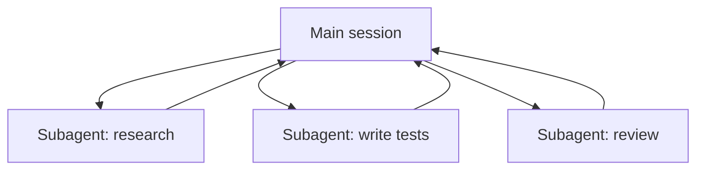

<LevelBadge level="advanced" />

<VerifyNote lastVerified="2026-06-20" source="https://code.claude.com/docs/en/sub-agents">
Subagent configuration and the `/agents` interface change over time — confirm in the official docs.
</VerifyNote>

A **subagent** is a separate Claude instance with its **own context window** and a **scoped set of tools**, that your main session delegates a chunk of work to. It reports back a result, not its whole transcript — so the main session stays focused and uncluttered.

## Why delegate

- **Protect the main context.** A research dive or a big file sweep can burn thousands of tokens; do it in a subagent and only the conclusion returns.
- **Specialize.** Give a subagent a tailored system prompt and only the tools it needs (e.g. a read-only reviewer).
- **Parallelize.** Run independent subtasks at once — e.g. explore three modules simultaneously.

## Defining them

Subagents are configured as Markdown files with frontmatter (name, description, allowed tools, sometimes a model), managed via the `/agents` interface. The `description` tells the main agent *when* to delegate to it. Scope tools tightly — a reviewer rarely needs write access.

## When NOT to parallelize

:::warning Parallel isn't free
- **Dependent steps** must be sequential — don't fan out work where step B needs step A's output.
- **Shared file writes** can conflict; isolate them (see [Git Worktrees](/docs/claude-code/worktrees)) or serialize.
- **Coordination overhead** can exceed the benefit for small tasks. Delegate when the subtask is sizeable and independent.
:::

## Subagent vs the API/SDK "agents"

This page is about Claude Code's built-in delegation. Building your *own* agents programmatically is [Building Agents on the API](/docs/api/building-agents). The mental model — a goal, a tool loop, isolated context — is the same.

## Next

- [Design a Multi-Subagent Workflow (walkthrough)](/docs/walkthroughs/multi-subagent-workflow)
- [Context Management](/docs/claude-code/context-management)
- [Git Worktrees](/docs/claude-code/worktrees)
