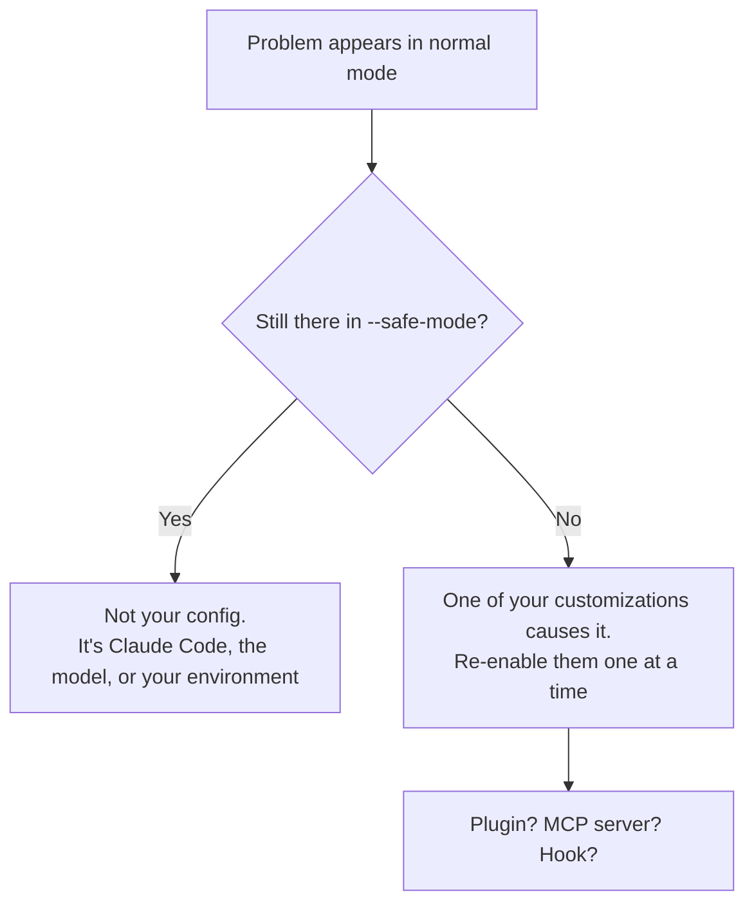

<LevelBadge level="intermediate" />

<Callout type="objectives" items={["Route any Claude Code problem to its fix in one step, using a symptom table", "Run the two diagnostic commands that solve most setup issues before you debug anything by hand", "Isolate whether a plugin, MCP server, or hook is the real cause", "Fix the four classic runtime failures: high memory, hangs, compaction thrashing, and search finding nothing", "Collect the right evidence before filing a bug report"]} />

<VerifyNote lastVerified="2026-07-17" source="https://code.claude.com/docs/en/troubleshooting">
Commands, flags, and environment variables on this page are verified against the official Claude Code troubleshooting docs. Diagnostics change between releases — confirm there before relying on an exact flag.
</VerifyNote>

## The big idea

Almost every Claude Code problem is one of two kinds, and they have completely different fixes:

- **Your setup is wrong** — a plugin, an MCP server, a hook, a settings file, a missing binary. The fix is *configuration*.
- **The session is under strain** — the context window is full, a huge file blew up memory, the terminal can't render. The fix is *hygiene*.

Guessing which one you have is where people lose an afternoon. The table below skips the guessing.

:::tip Different kind of "weird"?
This page is about the **tool** misbehaving — it won't start, it hangs, search finds nothing. If the **model** is misbehaving — it made up a fact, forgot an instruction, refused something reasonable — that's a different page: [Why Did Claude Do That?](/docs/contribute/troubleshooting)
:::

## Start here: symptom → where to go

Find your symptom. Don't read the rest of the page.

| Symptom | Go to |
|---|---|
| `command not found`, install fails, `EACCES`, PATH or TLS errors | [Official: install & login](https://code.claude.com/docs/en/troubleshoot-install) |
| Login loops, OAuth errors, `403 Forbidden`, "organization disabled" | [Official: login & authentication](https://code.claude.com/docs/en/troubleshoot-install#login-and-authentication) |
| Settings not applying, hooks not firing, MCP servers not loading | [Isolate your config](#isolate-your-config) below |
| `API Error: 5xx`, `529 Overloaded`, `429`, validation errors | [Errors & Rate Limits](/docs/api/errors-and-rate-limits) |
| `model not found` / "you may not have access to it" | [Current Models & Pricing](/docs/whats-new/models-and-pricing) |
| VS Code or JetBrains not detecting Claude | [IDE Integrations](/docs/claude-code/ide-integrations) |
| High CPU or memory | [Memory and CPU](#memory-and-cpu) below |
| Hangs, freezes, unresponsive | [Hangs and freezes](#hangs-and-freezes) below |
| `Autocompact is thrashing` | [Compaction thrashing](#compaction-thrashing) below |
| Search, `@file`, agents, or skills not finding files | [Search finds nothing](#search-finds-nothing) below |
| Boxes, smears, or wrong glyphs in an IDE terminal | [Garbled terminal text](#garbled-terminal-text) below |

## The two commands to run first

Before you debug anything by hand, run the built-in checkup. It diagnoses your installation, settings, extensions, and context usage — and proposes fixes it can apply after you confirm.

<Steps items={[{title: "Run the checkup from inside a session", body: "/doctor (its alias is /checkup) inspects your installation, settings, extensions, and context usage, then offers to apply the fixes it can. This alone resolves most setup complaints."}, {title: "If Claude Code won't even start, run it from your shell", body: "claude doctor does the same checkup from outside a session, so a broken config can't block the tool that would diagnose it."}, {title: "If the problem smells like a tool or connector, check MCP separately", body: "/mcp prints the live status of every configured MCP server — the fastest way to see whether a server failed to load rather than misbehaved."}]} />

<PromptCard title="Diagnose a broken setup">{`# inside a session
/doctor

# if the session won't start at all
claude doctor

# check MCP server status
/mcp`}</PromptCard>

## Isolate your config

If settings aren't applying, hooks aren't firing, or something is just *off*, the question is never "what's broken" — it's **which of your customizations is broken**. Answer it by removing all of them at once.

`--safe-mode` starts Claude Code with every customization disabled: no plugins, no MCP servers, no hooks.

<PromptCard title="Test against a clean configuration">{`claude --safe-mode`}</PromptCard>

This gives you a clean binary result:



Once you know it's a customization, bisect: re-enable them in groups until the problem returns. The suspects, in rough order of how often they're the culprit, are [MCP servers](/docs/claude-code/mcp), [hooks](/docs/claude-code/hooks), [plugins](/docs/claude-code/plugins-marketplaces), and [settings](/docs/claude-code/settings).

<Callout type="tip" items={["--safe-mode is also the right first move for mysterious slowness, not just outright breakage. A chatty MCP server is a very common cause of both."]} />

## Memory and CPU

Claude Code works with most environments but can consume real resources on large codebases. Work through these in order — they're sorted cheapest-first.

<Steps items={[{title: "Compact regularly", body: "Run /compact to shrink the context. A bloated context window is the single most common cause of a heavy session. See /docs/claude-code/context-management."}, {title: "Restart between major tasks", body: "Close and restart Claude Code when you switch to unrelated work, instead of letting one process accumulate an afternoon of state."}, {title: "Hide large build directories", body: "Add build output, caches, and vendored dependencies to .gitignore so they never enter a search or a read in the first place."}, {title: "Rule out your customizations", body: "Restart with claude --safe-mode. If usage drops, a plugin, MCP server, or hook is the source — bisect from there."}, {title: "If memory is still high, capture evidence", body: "Run /heapdump to write a JavaScript heap snapshot plus a memory breakdown to ~/Desktop (or your home directory on Linux without a Desktop folder)."}]} />

The `/heapdump` breakdown reports resident set size, JS heap, array buffers, and unaccounted native memory. That split is the useful part: it tells you whether growth is in JavaScript objects or down in native code. To inspect what's holding memory alive, open the `.heapsnapshot` file in Chrome DevTools under **Memory → Load**.

<VerifyNote lastVerified="2026-07-17" source="https://code.claude.com/docs/en/troubleshooting">
`/heapdump` writes to `~/Desktop`, falling back to the home directory on Linux systems without a Desktop folder. Attach both files when reporting a memory issue.
</VerifyNote>

## Hangs and freezes

If Claude Code stops responding:

<Steps items={[{title: "Cancel the current operation", body: "Press Ctrl+C. This aborts whatever is running without killing the session."}, {title: "If it's still unresponsive, kill the terminal", body: "Close the terminal and restart. This feels destructive, but it isn't."}, {title: "Resume where you left off", body: "Run claude --resume in the SAME directory. Restarting does not lose your conversation — the transcript survives the process."}]} />

<Callout type="tip" items={["The fear of losing a long conversation is why people wait out a hang instead of killing it. Don't — claude --resume in the same directory brings the session back."]} />

## Compaction thrashing

This error looks alarming and is actually a *protection*:

```
Autocompact is thrashing: the context refilled to the limit...
```

It means automatic compaction **succeeded** — and then a file or tool output immediately refilled the entire context window, several times in a row. Claude Code stops retrying rather than burn API calls on a loop that isn't making progress.

The cause is almost always one oversized thing being read whole. Pick the fix that matches your situation:

| Situation | Fix |
|---|---|
| One huge file is the problem | Ask Claude to read a line range or a single function instead of the whole file |
| The context has a large output you no longer need | `/compact` with a focus that drops it |
| The big read is genuinely necessary | Move it to a [subagent](/docs/claude-code/subagents) so it burns a separate context window |
| The earlier conversation no longer matters | `/clear` |

<PromptCard title="Compact with a focus that drops the bloat">{`/compact keep only the plan and the diff`}</PromptCard>

The subagent option is the one people forget, and it's often the best: a subagent reads the giant file in *its* context and returns only the conclusion to yours. See [Context Management](/docs/claude-code/context-management) and [Subagents](/docs/claude-code/subagents).

## Search finds nothing

If the Search tool, `@file` mentions, custom agents, or custom skills aren't finding files that you know exist, the bundled `ripgrep` binary probably can't run on your system. The fix is to install your platform's own `ripgrep` and tell Claude Code to use it.

<Steps items={[{title: "Install ripgrep for your platform", body: "macOS: brew install ripgrep — Ubuntu/Debian: sudo apt install ripgrep — Alpine: apk add ripgrep — Arch: pacman -S ripgrep — Windows: winget install BurntSushi.ripgrep.MSVC"}, {title: "Tell Claude Code to stop using the bundled binary", body: "Set USE_BUILTIN_RIPGREP=0 in your environment. Without this step, installing ripgrep changes nothing."}, {title: "Verify", body: "Re-run the search or @file mention that was failing. Run /doctor if it still comes up empty."}]} />

<PromptCard title="Fix search on macOS">{`brew install ripgrep
export USE_BUILTIN_RIPGREP=0`}</PromptCard>

### The WSL exception

On WSL, incomplete search results are usually **not** a broken binary. Reading across the Windows/Linux filesystem boundary carries a disk performance penalty, so search returns fewer matches than expected. Search still works — it just under-delivers.

<Callout type="warning" items={["On WSL, claude doctor reports Search as OK even while results are incomplete. A green checkup does not rule this out — that's exactly what makes it hard to diagnose."]} />

Three ways out, best first: move the project onto the Linux filesystem (`/home/`) rather than `/mnt/c/`; run Claude Code natively on Windows instead of through WSL; or narrow your searches so fewer files are scanned — "Search for JWT validation logic in the auth-service package" beats "find the auth code."

## Garbled terminal text

Characters rendering as boxes, smears, or the wrong glyphs inside the VS Code, Cursor, or Devin Desktop integrated terminal is a **GPU renderer** problem, not a font or encoding problem.

<PromptCard title="Fix garbled glyphs in an IDE terminal">{`/terminal-setup`}</PromptCard>

That sets `terminal.integrated.gpuAcceleration` to `"off"`. You can set it by hand in your editor settings and reload the window instead — same result.

## Large tables get cut off

A Markdown table over 200 rows renders its first 200 followed by a `… N more rows not shown` line. This is a **display cap only** — the full table is still in the conversation, and `/copy` copies every row. For a table too large to read in a terminal at all, ask Claude to write it to a file.

<VerifyNote lastVerified="2026-07-17" source="https://code.claude.com/docs/en/troubleshooting">
The 200-row display cap arrived in Claude Code v2.1.208. Before that, every row was rendered, so resuming a session containing a very large table could stall while it re-rendered.
</VerifyNote>

## Filing a good bug report

If nothing here fits, report it — but bring evidence. A report that says "it's slow" gets nowhere; one with a heap snapshot and a `--safe-mode` result gets fixed.

<Steps items={[{title: "Run /doctor and /mcp", body: "Capture what the checkup says and which MCP servers are actually loaded. Half of reported bugs are answered here."}, {title: "Record whether --safe-mode changes anything", body: "This single fact tells a maintainer whether to look at Claude Code or at your customizations. It is the most valuable line in your report."}, {title: "Attach artifacts for resource issues", body: "For memory problems, attach both files written by /heapdump — the snapshot and the breakdown."}, {title: "Send it", body: "Use /feedback inside Claude Code to report directly to Anthropic, or check github.com/anthropics/claude-code for a known issue first."}]} />

<Callout type="takeaways" items={["Run /doctor (alias /checkup) first — from your shell as claude doctor if the session won't start. It diagnoses installation, settings, extensions, and context usage, and can apply fixes.", "claude --safe-mode disables all customizations at once. Whether the problem survives it is the single most informative fact you can gather.", "High memory: /compact, restart between tasks, .gitignore build dirs, then --safe-mode, then /heapdump for evidence.", "A hang is not a lost conversation — Ctrl+C, then restart the terminal, then claude --resume in the same directory.", "Autocompact thrashing means one oversized read refills the window. Read in chunks, /compact with a focus, or delegate the read to a subagent.", "Search finding nothing usually means the bundled ripgrep can't run: install your platform's ripgrep AND set USE_BUILTIN_RIPGREP=0. On WSL it's a filesystem-boundary penalty instead — and claude doctor still reports Search as OK."]} />

<Quiz title="Check yourself" questions={[{q: "Hooks aren't firing and settings seem to be ignored. What's the single most informative thing to try?", options: ["Reinstall Claude Code", "Run claude --safe-mode and see whether the problem survives", "Delete your CLAUDE.md"], answer: 1, explain: "--safe-mode disables all customizations at once. If the problem disappears, one of your plugins, MCP servers, or hooks causes it and you can bisect. If it survives, your config is not the cause — which is equally useful to know."}, {q: "Claude Code hangs mid-task and Ctrl+C doesn't help. You close the terminal. What happens to your conversation?", options: ["It's lost — that's why you should wait out hangs instead", "It survives — run claude --resume in the same directory", "It's saved only if you ran /compact first"], answer: 1, explain: "Restarting does not lose your conversation. Run claude --resume in the SAME directory to pick the session back up. Fear of losing the transcript is exactly why people wait out hangs unnecessarily."}, {q: "You see 'Autocompact is thrashing: the context refilled to the limit...'. What actually happened?", options: ["Compaction failed and the context is corrupted", "Compaction succeeded, but a file or tool output immediately refilled the window several times in a row", "Your plan ran out of tokens"], answer: 1, explain: "Compaction succeeded — then something oversized refilled the context repeatedly. Claude Code stops retrying to avoid burning API calls on a loop that isn't progressing. Fix the oversized read: chunk it, /compact with a focus, or move it to a subagent."}, {q: "You installed ripgrep with brew because @file mentions found nothing, but search is still broken. What did you miss?", options: ["You need to restart your machine", "You must also set USE_BUILTIN_RIPGREP=0 so Claude Code uses your binary instead of the bundled one", "brew installs the wrong version — use apt"], answer: 1, explain: "Installing ripgrep alone changes nothing. You must set USE_BUILTIN_RIPGREP=0 in your environment to tell Claude Code to use your platform binary instead of the bundled one that couldn't run."}, {q: "On WSL, search returns fewer matches than expected but claude doctor reports Search as OK. What's going on?", options: ["doctor is lying — the ripgrep binary is broken", "Reading across the Windows/Linux filesystem boundary carries a disk penalty, so search under-delivers while still functioning", "Your project is too large to index"], answer: 1, explain: "On WSL, cross-filesystem read penalties mean search returns fewer results than on a native filesystem. It still functions, so doctor reports Search as OK — which is what makes it hard to spot. Move the project to /home/, run natively on Windows, or submit narrower searches."}]} />

## Next

- [Why Did Claude Do That?](/docs/contribute/troubleshooting) — troubleshooting the *model's* behavior rather than the tool
- [Context Management](/docs/claude-code/context-management) — `/compact` vs `/clear`, and keeping sessions lean
- [Errors & Rate Limits](/docs/api/errors-and-rate-limits) — `429`, `529`, and retry strategy on the API
- [MCP Token Cost](/docs/claude-code/mcp-token-cost) — when a connected server is quietly the problem
