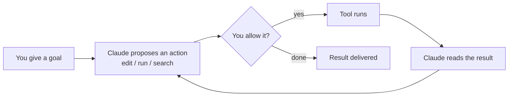

<LevelBadge level="beginner" />

<VerifyNote lastVerified="2026-06-27" source="https://code.claude.com/docs/en/overview">
Install commands and the exact feature set change often. Treat the official Claude Code docs as the source of truth for setup.
</VerifyNote>

<Callout type="objectives" items={["Explain what makes Claude Code agentic, not just a chat window", "Picture the agentic loop: goal, action, permission, observe, repeat", "Name the surfaces where Claude Code runs and how settings travel with you", "Order the things you configure by leverage, starting with CLAUDE.md", "Walk through the shape of a safe first session using Plan Mode"]} />

**Claude Code** is Anthropic's *agentic* coding tool. Unlike a chat window, it can actually **do things in your project**: read and edit files, run shell commands, search the codebase, and call external tools — all with your permission.

## The mental model: an agentic loop

This is the one idea that makes everything else make sense. You give an objective in plain language ("add tests for the auth module and fix what fails"). Claude **plans, acts, observes the result, and repeats** until the goal is met. You stay in control via [permissions](/docs/claude-code) and [Plan Mode](/docs/claude-code).

<Callout type="tip" items={["The loop only advances on actions you allow. Nothing edits or runs without passing through that permission gate — which is exactly why the next sections matter."]} />

## Where you can run it

The same Claude Code follows you across surfaces — it **shares your settings, hooks, and permissions** wherever you work.

- **Terminal (CLI)** — the original surface; works in any shell.
- **IDE extensions** — VS Code and JetBrains, with inline diffs.
- **Desktop and web** — and it shares your settings, hooks, and permissions across surfaces.

## What you'll configure (in rough order of leverage)

Think of this as a ladder: master the top rungs first, then layer on power features only when a real need appears.

<Steps items={[{title: "CLAUDE.md", body: "Persistent project instructions. Highest impact, lowest effort — start here."}, {title: "Plan Mode", body: "Investigate and propose before any edits run."}, {title: "Permissions", body: "Decide what Claude may do without asking."}, {title: "settings.json", body: "The full config system underneath everything."}, {title: "Power features", body: "Slash commands, hooks, skills, subagents, and MCP servers — layered on as you need them."}]} />

Each rung links into its own lesson: [CLAUDE.md](/docs/claude-code), [Plan Mode](/docs/claude-code), [Permissions](/docs/claude-code), [settings.json](/docs/claude-code), [Slash commands](/docs/claude-code), [hooks](/docs/claude-code), [skills](/docs/claude-code), [subagents](/docs/claude-code), and [MCP servers](/docs/claude-code).

## Your first session (the shape of it)

<Steps items={[{title: "Install and authenticate", body: "See the official docs for current commands."}, {title: "Open a project", body: "cd into a project and start Claude Code."}, {title: "Generate a starter CLAUDE.md", body: "Run /init to scaffold your project instructions."}, {title: "Ask something small and concrete", body: "Try: Explain how routing works in this app."}, {title: "Make a change in Plan Mode first", body: "Review the proposed plan, then let it execute."}]} />

Two commands worth memorizing from that first session:

<PromptCard title="Scaffold project instructions">{`/init`}</PromptCard>

<PromptCard title="A safe, read-only first ask">{`Explain how routing works in this app.`}</PromptCard>

For current install and authentication commands, see the [official docs](https://code.claude.com/docs/en/overview).

<Callout type="tip" items={["Start read-only. For your first real task, use Plan Mode — Claude investigates and shows you a plan without touching files. It's the safest way to build trust."]} />

## Key terms at a glance

<Flashcards title="Claude Code vocabulary" cards={[{front: "Agentic tool", back: "A tool that takes actions in your project — reads/edits files, runs commands, searches code, calls external tools — not just a chat window."}, {front: "Agentic loop", back: "Goal in plain language, then Claude plans, acts, observes the result, and repeats until the goal is met."}, {front: "Plan Mode", back: "Claude investigates and proposes a plan before any edits run — the safest way to start."}, {front: "CLAUDE.md", back: "Persistent project instructions. Highest impact, lowest effort; generated with /init."}, {front: "Permissions", back: "The control gate: what Claude may do without asking you first."}]} />

<Quiz title="Check yourself" questions={[{q: "What makes Claude Code different from a chat window?", options: ["It writes longer answers", "It can take actions in your project — edit files, run commands, search code — with your permission", "It only works in the terminal"], answer: 1, explain: "Claude Code is agentic: it acts in your project (read/edit files, run shell commands, search, call tools), all with your permission."}, {q: "In the agentic loop, what happens right after Claude proposes an action?", options: ["The tool runs automatically", "You decide whether to allow it", "The result is delivered"], answer: 1, explain: "Every proposed action passes through a permission gate — the tool only runs if you allow it."}, {q: "Which setup step is highest impact for the lowest effort?", options: ["MCP servers", "Hooks", "CLAUDE.md"], answer: 2, explain: "CLAUDE.md — persistent project instructions — is listed first because it has the highest impact for the lowest effort."}]} />

<Callout type="takeaways" items={["Claude Code is agentic: it acts in your project with your permission, not just chats.", "The loop is goal, propose, allow, run, observe, repeat — you control it through permissions and Plan Mode.", "It runs in the terminal, VS Code/JetBrains, and on desktop and web, sharing settings, hooks, and permissions across surfaces.", "Configure by leverage: CLAUDE.md first, then Plan Mode, Permissions, settings.json, then power features.", "Start a first session read-only in Plan Mode to build trust before letting edits run."]} />

## Next

- The highest-leverage setup → [CLAUDE.md & Memory Files](/docs/claude-code)
- Do it end-to-end → [Walkthrough: Customise Claude Code for a real repo](/docs/walkthroughs)
- Build your own automations → [Templates & Recipes](/docs/templates)
