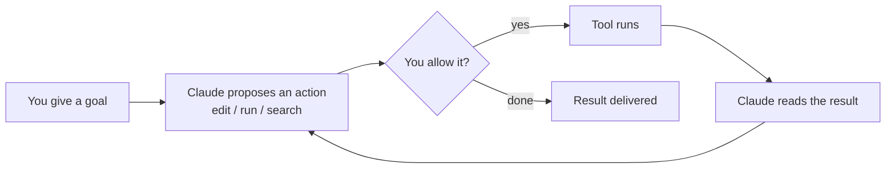

<LevelBadge level="beginner" />

<VerifyNote lastVerified="2026-06-20" source="https://code.claude.com/docs/en/overview">
Install commands and the exact feature set change often. Treat the official Claude Code docs as the source of truth for setup.
</VerifyNote>

**Claude Code** is Anthropic's *agentic* coding tool. Unlike a chat window, it can actually **do things in your project**: read and edit files, run shell commands, search the codebase, and call external tools — all with your permission.

## The mental model: an agentic loop

This is the one idea that makes everything else make sense:

You give an objective in plain language ("add tests for the auth module and fix what fails"). Claude **plans, acts, observes the result, and repeats** until the goal is met. You stay in control via [permissions](/docs/claude-code) and [Plan Mode](/docs/claude-code).

## Where you can run it

- **Terminal (CLI)** — the original surface; works in any shell.
- **IDE extensions** — VS Code and JetBrains, with inline diffs.
- **Desktop and web** — and it shares your settings, hooks, and permissions across surfaces.

## What you'll configure (in rough order of leverage)

1. **[CLAUDE.md](/docs/claude-code)** — persistent project instructions. Highest impact, lowest effort.
2. **[Plan Mode](/docs/claude-code)** — investigate and propose *before* any edits run.
3. **[Permissions](/docs/claude-code)** — what Claude may do without asking.
4. **[settings.json](/docs/claude-code)** — the full config system.
5. **[Slash commands](/docs/claude-code)**, **[hooks](/docs/claude-code)**, **[skills](/docs/claude-code)**, **[subagents](/docs/claude-code)**, **[MCP servers](/docs/claude-code)** — power features, layered on as you need them.

## Your first session (the shape of it)

1. Install and authenticate (see the [official docs](https://code.claude.com/docs/en/overview) for current commands).
2. `cd` into a project and start Claude Code.
3. Run `/init` to generate a starter **CLAUDE.md**.
4. Ask for something small and concrete: *"Explain how routing works in this app."*
5. Then try a change in **Plan Mode** first, review the plan, and let it execute.

:::tip Start read-only
For your first real task, use [Plan Mode](/docs/claude-code) — Claude investigates and shows you a plan without touching files. It's the safest way to build trust.
:::

## Next

- The highest-leverage setup → [CLAUDE.md & Memory Files](/docs/claude-code)
- Do it end-to-end → [Walkthrough: Customise Claude Code for a real repo](/docs/walkthroughs)
- Build your own automations → [Templates & Recipes](/docs/templates)
