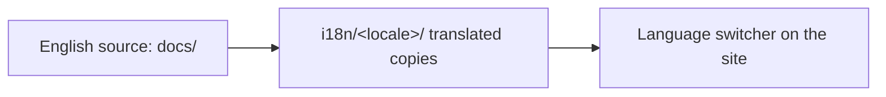

<LevelBadge level="intermediate" />

AILmanac is English-first but **built to be translated** — that's how it reaches "everyone in the world." If you'd like to bring it to your language, here's the path.

## How i18n works here

The site uses Docusaurus's built-in internationalization. **English is the canonical source.** A locale is a parallel set of translated files; Docusaurus serves a language switcher once a locale is enabled.

## The golden rule: own it before we ship it

:::warning No half-translations in production
A locale is only **enabled in production once someone commits to maintaining it.** A 30%-translated, months-stale locale hurts credibility more than no translation. Better to translate a *complete section* well than scatter partial pages.
:::

## How to contribute a translation

1. **Open an issue** (use the *translation* template) saying which language and which section you'll take.
2. **Translate a coherent chunk** first — e.g. all of *Start Here* — not random pages.
3. **Keep code, commands, and `VerifyNote` sources unchanged**; translate prose, headings, and admonition text.
4. **Don't translate model IDs or links**; keep `/docs/...` paths as-is.
5. **Open a PR.** A maintainer reviews and, once a locale has an owner + a complete first section, we enable it.

## Tips

- **Use Claude to draft**, then a fluent human reviews — AI translation is a great first pass, not a final authority ([Hallucinations](/docs/foundations/hallucinations) apply to translation too).
- **Match the level/tone** of the English page.
- **Flag untranslatable terms** (keep "prompt", "token" etc. where that's the norm in your language's tech community).

## Next

- [Contribute in 10 Minutes](/docs/contribute/contribute-in-10-minutes)
- [Content Style Guide](/docs/contribute/style-guide)
- [Code of Conduct & Governance](/docs/contribute/governance)
