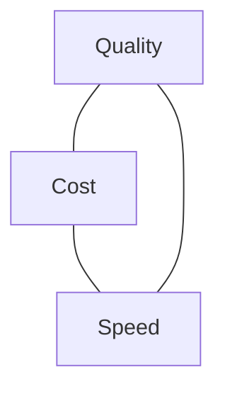
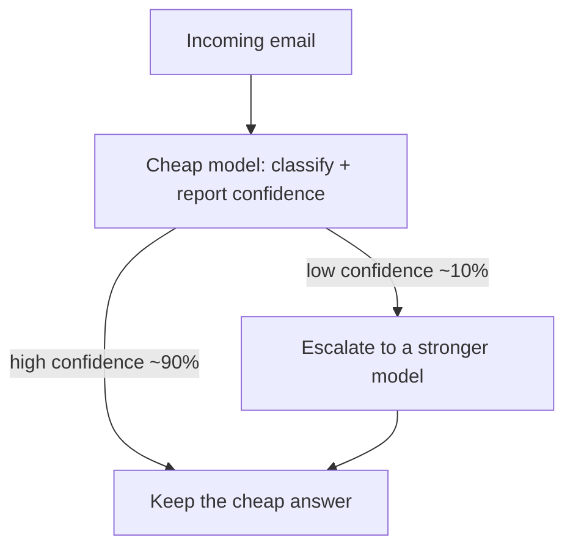

<LevelBadge level="intermediate" />

<Callout type="objectives" items={["The cost/quality/speed triangle — why you can never max all three at once","The six biggest levers to spend where it matters and save everywhere else","How a cheap-first cascade routes 90% of volume to a small model and cuts cost ~70% without dropping quality on the hard cases","The latency-specific wins (streaming, parallelism, caching, async) that reshape perceived speed","Why 'optimize blind' burns quality — measure first, guard with evals second"]} />

Quality, cost, and speed pull against each other. You can't max all three at once — but you *can* spend each where it matters and save everywhere else.

## The triangle

A bigger model is smarter but slower and pricier; a smaller one is fast and cheap but less capable. Good engineering is **routing each task to the right point** on this triangle.

## The biggest levers (roughly in order)

<Steps items={[{title: "Right-size the model", body: "Don't run Opus for classification. Start with Sonnet, drop to Haiku for simple/high-volume steps, reserve Opus for the hard parts. Biggest single lever — see /docs/api/choosing-a-model."}, {title: "Model tiering / cascades", body: "Use a cheap model first; escalate to a stronger one only when needed (e.g. low-confidence cases). See the worked example below."}, {title: "Prompt caching", body: "Reuse a stable prompt prefix across calls — big savings for repeated system prompts, RAG context, or agent tool catalogs. See /docs/api/prompt-caching."}, {title: "Trim input tokens", body: "Send only what matters. RAG beats stuffing the whole knowledge base. Shorter inputs = cheaper AND often better output."}, {title: "Cap output tokens", body: "Set sensible max_tokens and tight format instructions. Output tokens are billed at the highest rate — capping them cuts the tail."}, {title: "Batch offline work", body: "For anything that doesn't need to be interactive, use the Message Batches API. Trades latency for a large per-token discount."}]} />

## Worked example: a cheap-first cascade

Cascading is the lever people skip because it sounds vague. Make it concrete. Say you need to triage 100,000 support emails. The naive approach runs every email through your strongest model. A cascade routes most of the volume to a cheap model and escalates only the hard cases:

Suppose the cheap model resolves 90% of cases on its own and a stronger model costs roughly 5× as much per token. Counting in relative *cost units* (1 = one cheap pass over one email):

- **All-strong:** `100k × 5 = 500k` cost units.
- **Cascade:** `100k × 1` (every email gets the cheap pass) `+ 10k × 5` (the 10% that escalate) `= 150k` cost units.

That's about a **70% cut**, and the genuinely hard cases still get your best model. The multipliers and split are illustrative — plug in your own [token counts and rates](/docs/api/tokens-and-pricing) and measure the *real* escalation rate with [evals](/docs/foundations/evals). The lesson holds regardless: the savings come from how rarely you pay the expensive rate, not from the rate itself.

## Latency-specific wins

<Callout type="tip" items={["Stream responses — users see the first tokens instantly, so perceived speed jumps even when total time is unchanged (/docs/api/streaming).","Parallelize independent sub-calls — a request that fans out to three tools finishes in max(latency), not sum(latency).","Cache repeated work and precompute where you can — the fastest tokens are the ones you don't have to generate.","Pick a smaller model for the interactive path; move heavy lifting async so the user isn't waiting on it.","Reduce max output tokens for interactive endpoints — long generations are the dominant tail-latency source."]} />

## Don't optimize blind

Measure first: where are the tokens and the seconds actually going? Then optimize the biggest line item. And re-check quality with [evals](/docs/foundations/evals) after any cost cut — a cheaper setup that's wrong isn't cheaper.

<Quiz title="Check yourself" questions={[{q: "Which is USUALLY the single biggest cost lever?", options: ["Enabling prompt caching", "Right-sizing the model to the task (don't run flagship for jobs a small model handles fine)", "Setting a smaller max_tokens", "Using batch mode"], answer: 1, explain: "Model choice is the largest multiplier by far — often 5–10× between tiers. Caching, capping, and batching are meaningful, but none of them beat 'stop paying flagship rates for a job a Haiku-class model finishes correctly.'"}, {q: "In a cheap-first cascade, where do the savings actually come from?", options: ["The cheap model being intrinsically cheaper per token", "How RARELY you end up paying the expensive rate — most cases resolve on the cheap tier", "Prompt caching hiding behind the cascade", "Streaming the responses"], answer: 1, explain: "The math (100k × 1 + 10k × 5 vs 100k × 5) shows the savings are dominated by escalation rate. If you route 90% to cheap and 10% to strong, you're paying the expensive rate on a tenth of the volume."}, {q: "You want the user to feel a response is faster. Which lever helps MOST without changing model choice?", options: ["Set max_tokens to 5 so the response is short", "Stream tokens as they generate so time-to-first-token drops sharply", "Retry the request twice in parallel and keep the fastest", "Add a loading spinner"], answer: 1, explain: "Streaming reshapes PERCEIVED latency without changing total generation time — users see output as it's produced, so a 4-second response feels instant. Truncating with a tiny max_tokens hurts quality; parallel retries burn cost."}, {q: "You cut costs by moving from Sonnet to Haiku on a workflow. What's the required next step?", options: ["Ship it — cost went down, that's the whole win", "Re-run evals to confirm quality didn't collapse — a cheaper setup that's wrong isn't cheaper", "Cache the prompt so it costs even less", "Add a fallback to Opus for every request"], answer: 1, explain: "Every cost cut needs to be guarded by evals. A cheap wrong answer usually costs more than an expensive right one — through retries, escalations, or downstream cleanup. Measure quality after any change."}]} />

<Callout type="takeaways" items={["The triangle is real: quality, cost, and speed pull against each other — engineering means routing each task to the right point, not maxing all three.","Right-sizing the model is the biggest single lever; cascades multiply it by only paying flagship rates on the hard minority.","Prompt caching, tight max_tokens, and RAG-driven input trimming compound with model choice.","Latency-perception is a separate axis — streaming, parallel sub-calls, and async heavy lifting reshape UX without changing raw cost.","Every cost cut must be guarded by evals — a cheaper setup that's wrong isn't cheaper."]} />

## Next

- [Choosing a Claude Model](/docs/api/choosing-a-model)
- [Prompt Caching & Cost Optimization](/docs/api/prompt-caching)
- [Tokens, Context & Pricing](/docs/api/tokens-and-pricing)
