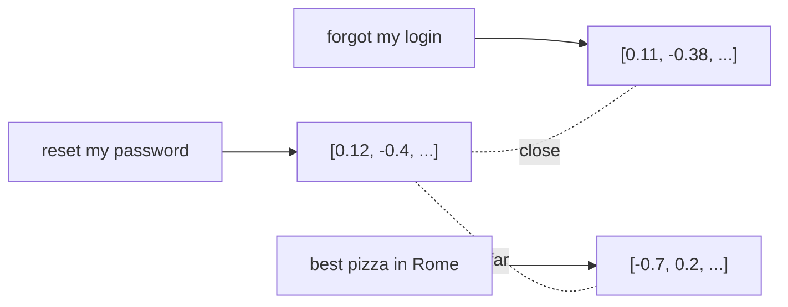

<LevelBadge level="intermediate" />

An **embedding** turns a piece of text into a list of numbers (a **vector**) that captures its *meaning*. Texts with similar meaning get vectors that are close together — even if they share no words. That's the trick behind **semantic search** and [RAG](/docs/foundations/rag).

<Callout type="objectives" items={[
  "Picture an embedding as a point in a space arranged so that similar meanings sit near each other",
  "Tell keyword search from semantic search — and know why hybrid search usually wins",
  "Walk the four steps of a vector search, from chunking to nearest-neighbor lookup",
  "Avoid the three mistakes that quietly ruin retrieval quality: bad chunk sizes, mixed embedding models, and no metadata filters",
  "Decide when you actually need a vector database and when you don't"
]} />

## The intuition

Imagine every sentence placed as a point in a huge multi-dimensional space, arranged so that **similar meanings sit near each other**. "How do I reset my password?" lands near "I forgot my login," far from "best pizza in Rome."

## Semantic vs keyword search

- **Keyword search** matches literal words ("password" finds "password").
- **Semantic search** matches *meaning* — "I can't sign in" finds the password-reset doc even without the word "password."

Best results often **combine** both (hybrid search).

## How a vector search works

<Steps items={[
  {
    "title": "Embed your documents and store the vectors",
    "body": "Split each document into chunks first, then embed each chunk and store the vectors in a vector database. This is the step you do once, ahead of time."
  },
  {
    "title": "Embed the query",
    "body": "At query time, run the user's question through the same embedding model so it lands in the same space as your chunks."
  },
  {
    "title": "Find the nearest vectors",
    "body": "Compare the query vector against the stored ones by cosine similarity or distance, and keep the closest matches."
  },
  {
    "title": "Return those chunks",
    "body": "Typically to feed into RAG, where the retrieved text becomes context for the model's answer."
  }
]} />

## Practical notes

- **Chunking matters.** Too big = noisy matches; too small = lost context. Tune it.
- **Use one embedding model consistently** — vectors from different models aren't comparable.
- **Metadata + filters** (date, source, type) make retrieval far more precise.
- A vector DB isn't always needed — for small corpora, a simple in-memory search is fine.

<Flashcards cards={[
  { "front": "Embedding", "back": "A list of numbers (a vector) that represents a piece of text's meaning. Similar meanings get vectors that sit close together, even when the texts share no words." },
  { "front": "Vector", "back": "The list of numbers an embedding produces — a point in a huge multi-dimensional space arranged so that nearness means similar meaning." },
  { "front": "Keyword search vs semantic search", "back": "Keyword search matches literal words: \"password\" finds \"password\". Semantic search matches meaning: \"I can't sign in\" finds the password-reset doc without the word \"password\"." },
  { "front": "Hybrid search", "back": "Combining keyword and semantic search. Best results often come from both together rather than either alone." },
  { "front": "Chunk", "back": "The unit a document is split into before embedding. Too big gives noisy matches; too small loses context. It is a parameter to tune, not a default to accept." },
  { "front": "Vector database", "back": "Where the embedded chunks are stored so you can look up nearest vectors at query time. Not always needed — for a small corpus, a simple in-memory search is fine." },
  { "front": "Cosine similarity / distance", "back": "The measure used to find the vectors nearest to your query vector — step 3 of a vector search." },
  { "front": "Why you must not mix embedding models", "back": "Vectors from different models aren't comparable. Embed documents and queries with the same model, consistently." },
  { "front": "Metadata + filters", "back": "Attributes like date, source and type stored alongside each vector. Filtering on them makes retrieval far more precise than similarity alone." }
]} />

<Quiz questions={[
  {
    "q": "A user searches \"I can't sign in\" and gets back the password-reset doc, which never uses the word \"sign in\". What made that work?",
    "options": [
      "Keyword search matching literal words",
      "Semantic search matching meaning rather than words",
      "A metadata filter on document type",
      "A larger chunk size"
    ],
    "answer": 1,
    "explain": "Keyword search matches literal words, so \"sign in\" would not find a doc that never says it. Semantic search compares meaning: both texts embed to nearby vectors. Best results often combine the two — hybrid search."
  },
  {
    "q": "You re-embed your documents with a newer embedding model but leave the existing query path untouched. What breaks?",
    "options": [
      "Nothing — embeddings are a standard format",
      "Only the chunking, which has to be redone",
      "Retrieval quality, because vectors from different models aren't comparable",
      "Only the metadata filters"
    ],
    "answer": 2,
    "explain": "Vectors from different models aren't comparable — they live in different spaces. Documents and queries must be embedded with the same model consistently, which means re-embedding both sides when you change models."
  },
  {
    "q": "Your retrieved chunks are topically right but keep missing the detail the answer needed. Which knob is the first suspect?",
    "options": [
      "Chunk size — too small, so context was lost",
      "The vector database vendor",
      "Cosine similarity, which should be swapped for keyword matching",
      "The number of dimensions in the embedding"
    ],
    "answer": 0,
    "explain": "Chunking is the knob: too big gives noisy matches, too small loses the surrounding context the answer depended on. Topically-right-but-incomplete results point at chunks that were cut too fine."
  }
]} />

<Callout type="takeaways" items={[
  "An embedding is meaning as a point in space — nearness means similar meaning, not shared words.",
  "Semantic search finds what keyword search misses, but hybrid search usually beats either alone.",
  "Four steps: embed and store chunks, embed the query, find nearest vectors, return the chunks.",
  "One embedding model, used consistently on both sides. Vectors from different models aren't comparable.",
  "Chunk size and metadata filters do more for retrieval quality than the choice of vector database.",
  "For a small corpus, a simple in-memory search is enough — a vector DB isn't a requirement."
]} />

## Next

- [Retrieval-Augmented Generation (RAG)](/docs/foundations/rag)
- [Fine-tuning vs Prompting vs RAG](/docs/foundations/finetune-vs-prompt-vs-rag)
- [Hallucinations & How to Reduce Them](/docs/foundations/hallucinations)
