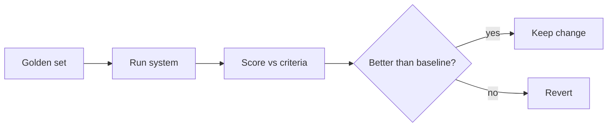

<LevelBadge level="advanced" />

If you ship anything built on AI, **evals** are how you know it works — and how you know a change made it better, not worse. Without them you're flying blind: a prompt tweak that helps one case can silently break ten others.

## The minimum viable eval

You don't need a framework to start:

1. **Collect a golden set.** 20–100 real inputs with the *correct* or *acceptable* outputs (or clear criteria). Cover the easy cases, the tricky ones, and the edge cases that bit you.
2. **Define what "good" means** per task — exact match, contains key facts, valid JSON schema, no hallucinated numbers, tone, etc.
3. **Run and score** your current setup against the set.
4. **Change one thing** (prompt, model, retrieval), re-run, **compare**. Keep the change only if the score improves.

## Choosing metrics

- **Deterministic checks** where possible: schema valid? contains the right value? code passes tests? These are cheap and trustworthy.
- **LLM-as-judge** for fuzzy quality (helpfulness, tone): have a model grade outputs against a rubric. Useful but **calibrate it** — judges have biases (length, position). Validate the judge against human ratings on a sample.
- **Human review** for the highest-stakes slice.

## When to run them

- **Before/after any prompt or model change.**
- **On model migration** — a new model can shift behavior ([Errors & Migration](/docs/api/errors-and-rate-limits)).
- **In CI** for production systems, as a gate.

:::tip Separate the stages
For [RAG](/docs/foundations/rag) and [agents](/docs/api/building-agents), eval each stage (did retrieval find the right doc? did the tool get called correctly?) — not just the final answer. It localizes failures.
:::

## Next

- [Evaluating Your AI Agent](/docs/playbooks/evaluating-agents) — the deeper playbook: trajectory scoring, LLM-judge calibration, CI gate
- [Hallucinations & How to Reduce Them](/docs/foundations/hallucinations)
- [Building Agents on the API](/docs/api/building-agents)
- [Choosing a Model & Provider](/docs/foundations/choosing-a-model-provider)
