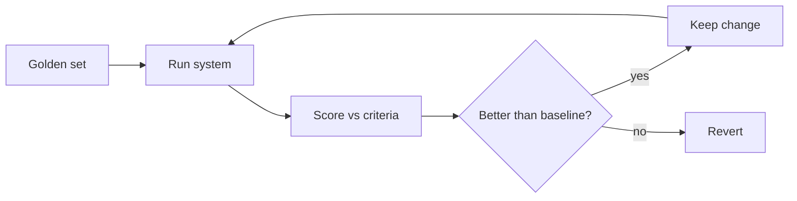

<LevelBadge level="advanced" />

<Callout type="objectives" items={[
  "Build the smallest useful eval — a golden set of 20–100 real inputs with clear pass criteria",
  "Pick the right metric per task: deterministic checks, LLM-as-judge, or human review",
  "Run evals as a gate — before/after every prompt change, model swap, and in CI",
  "Score every stage (retrieval, tool call, final answer), not just the last one, to localize regressions"
]} />

If you ship anything built on AI, **evals** are how you know it works — and how you know a change made it better, not worse. Without them you're flying blind: a prompt tweak that helps one case can silently break ten others. Evals turn "vibes-based" iteration into a measurable loop.

## The minimum viable eval

You don't need a framework to start. The whole loop is four steps:

<Steps items={[
  {title: "Collect a golden set", body: "20–100 real inputs with the correct or acceptable outputs (or clear criteria for what counts as a pass). Cover the easy cases, the tricky ones, and the edge cases that already bit you in production."},
  {title: "Define what 'good' means per task", body: "Exact match? Contains a specific key fact? Valid JSON that fits your schema? No hallucinated numbers? On-brand tone? Write the pass criteria down — one line per case is enough."},
  {title: "Run and score your baseline", body: "Run your current setup against the set and record the score. This is now the number to beat. Save it — future you will need it."},
  {title: "Change one thing, re-run, compare", body: "Prompt tweak, model swap, retrieval change — one variable at a time. If the score goes up and nothing regresses, keep the change. If it doesn't, revert. This is the entire loop."}
]} />

```mermaid
flowchart LR
  G[Golden set] --> R[Run system]
  R --> S[Score vs criteria]
  S --> C{Better than baseline?}
  C -->|yes| K[Keep change]
  C -->|no| X[Revert]
  K --> R
```

## Choosing metrics

Not every question deserves the same test. Match the metric to the task:

| Task type | Metric | Cost | Trustworthiness |
|---|---|---|---|
| Structured output (JSON, SQL) | Schema validation, exact-match | Free | High |
| Code generation | Run the tests it wrote | Cheap | High |
| Extraction (dates, entities) | String contains / regex | Free | High |
| Classification | Accuracy, precision, recall | Free | High |
| Summaries, drafts, tone | LLM-as-judge with a rubric | Moderate | Medium — must calibrate |
| High-stakes writing, safety | Human review on a slice | Expensive | Highest |

Three rules of thumb:

- **Deterministic checks where possible.** If the answer is "valid JSON matching this schema" or "the code passes these tests," don't ask an LLM — just check.
- **LLM-as-judge for fuzzy quality.** Helpfulness, tone, factuality-vs-source. Cheap, fast, but has *biases* (length, position, self-preference). Validate the judge against human ratings on a sample before you trust its numbers.
- **Humans on the highest-stakes slice.** Even 10 human-graded cases per release beats 0.

<PromptCard title="LLM-as-judge starter rubric">{`You are grading assistant responses against a source document.

For each response, output a JSON object with these fields:
- grounded: true if every factual claim is supported by the source, else false
- complete: true if the response answers all parts of the question, else false
- concise: true if the response contains no filler or repetition, else false
- overall_score: 1-5 (1 = unusable, 5 = ship it)
- reasoning: one sentence explaining the score

Do not consider length. Do not consider whether the response comes first or second.

<source>{{SOURCE}}</source>
<question>{{QUESTION}}</question>
<response>{{RESPONSE}}</response>

Return only the JSON, no preamble.`}</PromptCard>

## When to run them

- **Before/after any prompt or model change.** No exceptions. The whole point of the golden set is to catch the change you thought was safe.
- **On model migration.** New models shift behavior — sometimes silently. Run evals before you flip the model ID. See [Errors & Migration](/docs/api/errors-and-rate-limits).
- **In CI, for production systems.** Turn a green eval into a merge gate. Regressions get caught before users see them.
- **After every reported bug.** Add the failing case to the golden set. The set grows as the system does.

## Eval every stage, not just the final answer

For [RAG](/docs/foundations/rag) and [agents](/docs/api/building-agents), a single "final answer" score hides where things break. Score each stage separately so regressions land in one place:

| Stage | What to check |
|---|---|
| Retrieval | Did the top-k include the doc that contains the answer? |
| Tool selection | Did the agent pick the right tool for this turn? |
| Tool arguments | Were the arguments well-formed and correct? |
| Final answer | Does it match the golden criteria? |

When retrieval score drops but final-answer score holds steady, you know it's a retrieval regression — not a prompt problem. That kind of localization is what makes evals actually useful for debugging, not just scoring.

## Common mistakes

- **Grading with the same model that generated the answer.** Self-preference bias inflates scores. Use a different model — or better, a different family — as judge.
- **Judge prompts that leak the "right" answer.** If the judge sees the gold answer, it will find reasons to reward matching it. Judge on criteria, not on similarity.
- **Golden sets frozen at day one.** The set should grow every time production surprises you. A stale set measures the past.
- **Optimizing to the eval instead of the task.** If you tune prompts against a small set until every case passes, you may have overfit. Hold out ~20% of cases as a validation slice you never look at during iteration.

<Quiz title="Check yourself" questions={[
  {q: "What's the minimum viable eval?", options: ["A model fine-tuned on your data", "A golden set of 20–100 real inputs with pass criteria you can score against", "A dashboard tracking latency and cost"], answer: 1, explain: "20–100 real inputs with a clear definition of 'good' is enough to start. You don't need a framework — you need something you can score."},
  {q: "When should you prefer a deterministic check over LLM-as-judge?", options: ["Never — LLM judges are more nuanced", "When the pass criterion is objective (schema valid, exact match, tests pass)", "Only when you can't afford an LLM judge"], answer: 1, explain: "If you can decide pass/fail with code, do — deterministic checks are free, fast, and unbiased. Reserve LLM-as-judge for genuinely fuzzy quality dimensions."},
  {q: "For a RAG agent, why score each stage separately?", options: ["To satisfy compliance", "So a regression tells you WHERE it broke (retrieval, tool, or final answer)", "To make the eval slower and more thorough"], answer: 1, explain: "A single end-to-end score hides which stage regressed. Stage-level scores let you localize bugs — retrieval dropped but final held? That's a retrieval regression, not a prompt one."},
  {q: "What's a red flag that you've overfit to your eval set?", options: ["Your golden set never changes and passes 100%", "You use an LLM judge", "You run evals in CI"], answer: 0, explain: "A frozen golden set at 100% pass rate usually means you've tuned to memorize it. Keep a held-out validation slice you never look at during iteration, and grow the set from real production failures."}
]} />

<Callout type="takeaways" items={[
  "20–100 real inputs + pass criteria + one variable at a time = a working eval loop.",
  "Deterministic > LLM-judge > human — pick the cheapest metric the task allows.",
  "Score every stage in a pipeline, not just the final answer.",
  "The golden set grows with every reported bug. A stale set measures the past."
]} />

## Next

- [Evaluating Your AI Agent](/docs/playbooks/evaluating-agents) — the deeper playbook: trajectory scoring, LLM-judge calibration, CI gate
- [Hallucinations & How to Reduce Them](/docs/foundations/hallucinations)
- [Building Agents on the API](/docs/api/building-agents)
- [Choosing a Model & Provider](/docs/foundations/choosing-a-model-provider)
