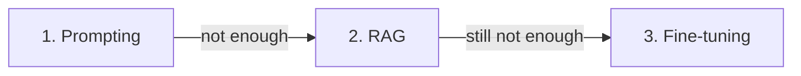

<LevelBadge level="intermediate" />

<Callout type="objectives" items={["The three levers you have when the model isn't doing what you want","The order that actually works — and why fine-tuning is almost never step 1","When RAG is the right fix and when it's overkill","What fine-tuning is genuinely good at (and what it isn't)","How the three combine in a real production system"]} />

When the model doesn't do what you want, there are three levers — and people reach for the expensive one first. Here's the order that actually works.

## Try in this order

<Steps items={[{title: "1. Prompting — start here, always", body: "Clearer instructions, examples, a role, output constraints (see /docs/prompting/basics). Fixes the majority of problems, costs nothing extra, and is instant to iterate. Most 'the model is bad at X' turns out to be 'the prompt was vague.'"}, {title: "2. RAG — when it needs YOUR knowledge", body: "If the gap is missing or fresh information (your docs, your data, current facts), add RAG (/docs/foundations/rag). Keeps knowledge updatable and citable without touching the model — swap a document and the next answer reflects it."}, {title: "3. Fine-tuning — last resort, for behavior/format at scale", body: "Fine-tuning further-trains a model on your examples. Reach for it only when prompting + RAG can't get consistent style, format, or task behavior AND you have many high-quality examples AND the volume to justify it."}]} />

## The decision table

| Your problem | Reach for |
|---|---|
| Vague/wrong outputs, wrong format | **Prompting** |
| Doesn't know your data / needs current info | **RAG** |
| Needs a very specific style/behavior, consistently, at scale | **Fine-tuning** |
| Needs to take actions | (Not these — that's [tool use/agents](/docs/api/tool-use)) |

<Flashcards title="Which lever solves which problem" cards={[{front: "Symptom: the output is vague, wrong format, or misses the point of the task.", back: "Fix with PROMPTING. Add role, constraints, examples, and a target format. Cheapest and fastest — nine times out of ten this is the whole answer."}, {front: "Symptom: the model doesn't know your company's docs, the current price list, or last week's news.", back: "Fix with RAG. Retrieve the relevant chunks at query time and inject them as context. Knowledge stays updatable and citable — no retraining needed."}, {front: "Symptom: you need a very consistent house style, JSON schema, or narrow classification behavior across thousands of calls, and prompting keeps drifting.", back: "Consider FINE-TUNING. Only after prompting + RAG fail, and only with hundreds to thousands of high-quality examples plus the call volume to earn back the training cost."}, {front: "Symptom: the model needs to take actions (send an email, run a query, call an API).", back: "None of these three — that's TOOL USE / AGENTS. See /docs/api/tool-use."}]} />

## Why people get it wrong

Fine-tuning *sounds* like "teaching the model," so it feels like the real fix. But it's the slowest, costliest, least flexible option, it **doesn't add fresh knowledge** well (RAG does that), and it's easy to do badly. Exhaust prompting and RAG first — you usually won't need step 3.

<Callout type="warning" items={["Fine-tuning a frontier model on your data does NOT reliably add new facts — it shifts style and behavior. Facts still hallucinate.","A fine-tuned model is pinned to that base version. When the vendor ships a better base, you re-train or you're stuck.","Bad training data amplifies bad behavior — a mediocre dataset makes the model worse, not better.","Most 'we need fine-tuning' requests are really 'our prompt is 40 lines of ad-hoc rules' — refactor the prompt first."]} />

:::tip They combine
A strong system is often a good **prompt** + **RAG** for knowledge, with fine-tuning reserved for a narrow behavioral need. They're not mutually exclusive.
:::

<PromptCard title="A concrete example: 'the model can't answer questions about our product'">{`# Wrong first move: fine-tune on the product manual.
# Right first move: retrieve the relevant chapter and inject it.

# 1. PROMPTING (baseline)
System: "You are a support agent for Acme Widgets. Be concise, cite doc sections."
User:   "Does the Widget Pro support Bluetooth 5.3?"
# Fails — model has no idea what a Widget Pro is.

# 2. + RAG (usually enough)
System: "You are a support agent for Acme Widgets. Be concise, cite doc sections."
Context: [top-3 chunks from product manual retrieved by embedding search]
User:    "Does the Widget Pro support Bluetooth 5.3?"
# Works — model reads the retrieved specs and answers with a citation.

# 3. + Fine-tuning (only if house voice / format is still drifting after 1+2)
# Train on 500-2000 (prompt, ideal answer) pairs to lock in the style — NOT to teach facts.`}</PromptCard>

<Quiz title="Check yourself" questions={[{q: "The model gives vague, off-format answers to your task. What do you try first?", options: ["Fine-tune on a batch of ideal outputs", "Add RAG so it can retrieve better context", "Tighten the prompt — role, constraints, examples, target format", "Switch to a bigger model"], answer: 2, explain: "Prompting is step 1, always. Most 'the model is bad at X' turns out to be 'the prompt was vague.' It's free, instant to iterate, and fixes the majority of problems."}, {q: "Your model doesn't know about your internal wiki. Which lever?", options: ["Prompting — write a longer system prompt describing the wiki", "RAG — retrieve the relevant wiki page at query time and inject it", "Fine-tuning — train on the wiki corpus so the model 'knows' it", "None — just switch models"], answer: 1, explain: "Missing OR fresh information is exactly what RAG solves. Fine-tuning is unreliable for adding facts and is pinned to a base model. RAG keeps knowledge updatable and citable — swap the wiki page and the next answer reflects it."}, {q: "What is fine-tuning ACTUALLY good at?", options: ["Adding new factual knowledge to the model", "Locking in a consistent style, format, or narrow task behavior at scale, when prompting + RAG can't reach it", "Making the model faster", "Removing the need for a system prompt"], answer: 1, explain: "Fine-tuning shifts style and behavior, not facts. It's the right last-resort tool for a narrow, high-volume behavioral need (e.g. producing a strict JSON schema in a specific tone across millions of calls). Facts belong in RAG."}, {q: "Which combination is the shape of a mature production system?", options: ["Fine-tune everything and skip prompting", "Strong prompt + RAG for knowledge, with fine-tuning reserved for a narrow behavioral need — they're not mutually exclusive", "Only one of the three — mixing them causes conflicts", "Prompt + fine-tune, never RAG"], answer: 1, explain: "The three levers compose. A good prompt sets the frame, RAG supplies the fresh knowledge, and fine-tuning (if used at all) locks in one specific behavior at scale."}]} />

<Callout type="takeaways" items={["Three levers when the model isn't doing what you want: prompting, RAG, fine-tuning — in that order.","Prompting fixes ~9 out of 10 'model is bad at X' complaints for zero cost and instant iteration.","RAG is the right fix when the gap is missing or fresh knowledge — fine-tuning is NOT reliable for adding facts.","Fine-tuning is a last resort for consistent style/format/behavior at scale, and needs hundreds to thousands of high-quality examples plus the call volume to justify it.","In a real production system the three compose: strong prompt + RAG + narrow fine-tune."]} />

## Next

- [Retrieval-Augmented Generation (RAG)](/docs/foundations/rag)
- [Prompting Basics](/docs/prompting/basics)
- [Evaluating AI Quality (Evals)](/docs/foundations/evals)
