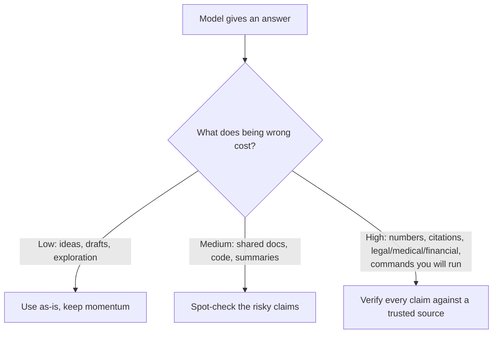

<LevelBadge level="intermediate" />

A **hallucination** is when a model states something false with complete confidence. It's not lying and not broken — it's the flip side of how LLMs work: they generate *plausible* text, and plausible isn't always true (see [What Is an LLM?](/docs/foundations/what-is-an-llm)). You can't prompt this away entirely, but you can drastically reduce it and catch the rest.

## Why it happens

The model predicts a likely continuation. When it doesn't "know" something, the *most likely-looking* continuation is often a confident, well-formed — and wrong — answer. There's no built-in "I'm unsure" signal unless you create room for one.

## The high-risk zones

Be most skeptical when output involves:

- **Citations, quotes, and references** — fabricated papers, fake URLs, misattributed quotes.
- **Specific numbers, dates, and stats** — plausible but invented figures.
- **Niche or very recent facts** — beyond what the model reliably learned.
- **APIs and library details** — methods or parameters that don't exist.
- **People and legal/medical specifics** — high stakes, easy to get subtly wrong.

## The reduction toolkit

Stack these — each one helps:

1. **Ground it in sources.** Paste the source text and say *"answer only from the text above; if it's not there, say so."* This is the core idea behind [RAG](/docs/foundations/rag).
2. **Give it an out.** Explicitly allow *"If you're not sure, say 'I don't know'"* — it dramatically reduces confident guessing.
3. **Ask for reasoning and citations.** *"Quote the exact sentence that supports each claim."* Unsupported claims become obvious.
4. **Lower the creativity** for factual tasks where the model exposes a temperature control (see [Sampling Controls](/docs/foundations/sampling-controls)).
5. **Use tools.** For math, current data, or lookups, give the model a calculator/search/[tool](/docs/api/tool-use) instead of trusting recall.
6. **Cross-check.** Ask the same question two ways, or have a second pass critique the first.

## A copy-paste anti-hallucination prompt

Most of the toolkit above collapses into one reusable wrapper. Paste your source where shown and ask your question — it grounds the answer, gives the model an out, and forces citations in a single shot:

```text
You answer ONLY from the SOURCE below.
Rules:
- If the answer is not in the SOURCE, reply exactly: "Not stated in the source."
- After every claim, quote the exact sentence from the SOURCE that supports it.
- Do not add outside knowledge, estimates, or assumptions.

SOURCE:
"""
[paste the document, transcript, or data here]
"""

QUESTION: [your question]
```

Why it works: the "Not stated in the source" escape hatch removes the pressure to guess, and the quote-the-sentence rule makes any unsupported claim impossible to hide. Drop the SOURCE block when you genuinely want the model's own knowledge — but then verification is back on you.

## The mindset that actually protects you

:::warning Verify what matters — always
No prompt makes output 100% reliable. For anything consequential — a number in a report, a citation, a command you'll run, a medical/legal/financial detail — **check it against a trusted source**. Treat AI as a fast first draft, not a final authority. This is the heart of [Responsible Use](/docs/security/responsible-use).
:::

A simple rule: **the cost of being wrong sets the amount of verification.** Brainstorming? Trust freely. Publishing a statistic? Verify every time.



## Next

- [Retrieval-Augmented Generation (RAG)](/docs/foundations/rag)
- [Evaluating AI Quality (Evals)](/docs/foundations/evals)
- [Responsible Use, Ethics & Verification](/docs/security/responsible-use)
