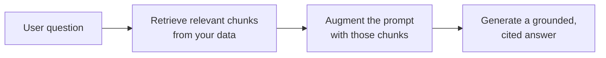

<LevelBadge level="intermediate" />

**RAG** makes a model answer questions about **your** data — docs, a knowledge base, a codebase — that it was never trained on. The idea is simple: **retrieve** the relevant pieces, **augment** the prompt with them, then **generate** an answer grounded in those pieces.

## The loop



1. **Index** your data: split into chunks, [embed](/docs/foundations/embeddings) them, store in a vector (and/or keyword) index.
2. **Retrieve** the top chunks most relevant to the question.
3. **Augment**: put those chunks in the prompt with an instruction like *"Answer only from the context below; if it's not there, say so."*
4. **Generate** — and ideally **cite** which chunk each claim came from.

## Why RAG instead of fine-tuning?

RAG keeps knowledge **fresh** (update the data, not the model), provides **citations**, and is far cheaper than retraining. For most "answer about my documents" needs, it's the right first tool — see [Fine-tuning vs Prompting vs RAG](/docs/foundations/finetune-vs-prompt-vs-rag).

## The failure modes (where RAG quality dies)

- **Bad retrieval = bad answer.** If the right chunk isn't retrieved, the model can't use it. Most "RAG is wrong" problems are *retrieval* problems.
- **Chunking too coarse/fine** — wrecks relevance ([embeddings](/docs/foundations/embeddings)).
- **No grounding instruction** — the model blends retrieved facts with its own guesses. Tell it to answer *only* from context and to admit gaps.
- **Stuffing too much** — irrelevant chunks dilute the signal and cost [tokens](/docs/foundations/tokens-and-context). Retrieve few, high-quality chunks.
- **No citations** — you can't verify, so you can't trust.

:::tip Evaluate retrieval separately
Measure "did we retrieve the right chunk?" apart from "did the model answer well?" It localizes the problem fast. See [Evals](/docs/foundations/evals).
:::

## Copy-paste: a grounding prompt

The single highest-leverage fix is a grounding instruction. Drop your retrieved chunks into a template like this — it forces the model to answer *only* from context, cite each claim, and admit gaps instead of guessing:

```text
You are answering strictly from the context below.

Rules:
- Use ONLY the context to answer. Do not use outside knowledge.
- Cite the source after each claim, like [chunk 2].
- If the answer is not in the context, reply exactly:
  "I don't have that in the provided sources."
- Quote numbers and names verbatim — never paraphrase a figure.

Context:
[chunk 1] ...
[chunk 2] ...
[chunk 3] ...

Question: <the user's question>
```

Pair it with a *few* high-quality chunks (not everything you retrieved) and you close the two biggest gaps at once: hallucinated blending and unverifiable answers. Then [eval](/docs/foundations/evals) retrieval and generation separately so you know which half to tune.

## Next

- [Embeddings & Vector Search](/docs/foundations/embeddings)
- [Fine-tuning vs Prompting vs RAG](/docs/foundations/finetune-vs-prompt-vs-rag)
- [Research & Synthesis playbook](/docs/playbooks/research)
