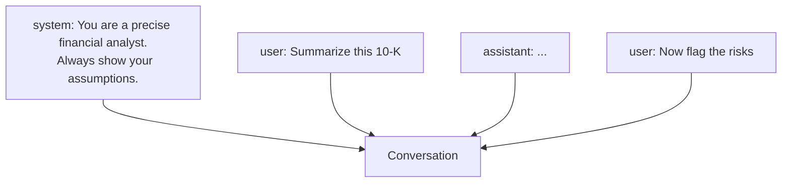

<LevelBadge level="beginner" />

<Callout type="objectives" items={["The three roles every AI conversation is built from — and what each one is for", "Why the system prompt is the single highest-leverage place to steer behavior", "How the same idea appears in chat apps, Claude Code, and the API", "A common trap: burying rules in a user turn instead of the system message"]} />

Every AI conversation is built from **messages**, and each message has a **role**. Understanding the three roles explains how to steer the model — and why some instructions stick while others don't.

## The three roles

<Steps items={[{title: "system — the standing brief", body: "Top-level setup for the whole conversation: who the model should be, the rules, the output format. Set once, applies to every turn that follows."}, {title: "user — your turn each time", body: "Your questions and inputs, one turn at a time. Keep these focused on the actual task; don't re-paste the standing rules every turn."}, {title: "assistant — the model's reply", body: "The model's responses. You can also put words in the assistant's mouth as few-shot examples (see /docs/prompting/few-shot) — the model treats them as prior turns and continues in that style."}]} />

## Why the system prompt is your most powerful lever

The system message frames **everything that follows**. It's where you set the model's role, standards, tone, and hard rules — and the model weights it heavily. If you want consistent behavior across a whole conversation (or app), put it here, not buried in a user turn.

Same idea, three surfaces:

| Surface | What plays the system-prompt role |
|---|---|
| **Chat apps** (Claude.ai, ChatGPT, Gemini) | Your account [custom instructions](/docs/claude-app/custom-instructions) |
| **Claude Code** | [`CLAUDE.md`](/docs/claude-code/claude-md) at the project root |
| **The API** | The `system` parameter on the request ([first call](/docs/api/first-call)) |

## A worked before/after

The most common mistake is putting the standing rules into every user turn instead of the system message. Watch what changes.

**Before — rules jammed into a user turn, repeated every time:**

<PromptCard title="Rules in the user turn (fragile)">{`user: You are a precise financial analyst. Always show your assumptions.
Never invent numbers. Now: summarize this 10-K.
[10-K text]`}</PromptCard>

**After — rules hoisted to the system message, user turns stay clean:**

<PromptCard title="Rules in the system message (durable)">{`system: You are a precise financial analyst. Always show your assumptions.
Never invent numbers. Cite the section of the filing for each claim.

user: Summarize this 10-K.
[10-K text]

user: Now flag the risks.`}</PromptCard>

The "after" version keeps behavior stable across turns, halves the tokens you resend each turn, and makes the app easier to change — you edit the standing brief in one place.

## Putting words in the assistant's mouth

An underused move: you can prepend an `assistant` turn as a **few-shot example** or a **format primer**, and the model will continue in that style. This is how templates and rubrics get enforced without a big prompt.

<PromptCard title="Prime the assistant to follow a format">{`system: You are a code reviewer. Return only the sections below.

user: Review this pull request. [diff]

assistant: ## Summary
- 
## Risks
- 
## Suggested changes
-`}</PromptCard>

The model treats your seeded assistant turn as a prior response and completes into the same shape.

## Common mistakes

<Callout type="tip" items={["Rules in every user turn — put standing rules once in the system message; use user turns for the actual task.", "Contradicting yourself across turns — a later, explicit user instruction can override a vague system one. Be consistent.", "Treating the assistant role as read-only — you can seed it to prime format, tone, or a few-shot pattern.", "Overloading the system prompt with facts that change — put volatile facts (docs, data, current state) into the user turn or retrieval context, not the system message."]} />

## Check yourself

<Quiz title="Check yourself" questions={[{q: "Where should standing rules like tone, format, and role live?", options: ["Repeated in every user turn so the model doesn't forget", "In the system message, set once", "In the assistant's first reply", "In the model configuration, not the prompt"], answer: 1, explain: "The system message frames the whole conversation. Setting rules once there is more durable, cheaper, and easier to change than repeating them in every user turn."}, {q: "In Claude Code, which file plays the same role as the API's system parameter?", options: ["package.json", "CLAUDE.md", "README.md", ".env"], answer: 1, explain: "CLAUDE.md at the project root is Claude Code's standing brief — the equivalent of a system prompt for that project."}, {q: "Can you write text into an assistant turn yourself before the model replies?", options: ["No — the assistant role is read-only", "Yes — seeding an assistant turn primes format or style and the model continues from there", "Only in the API, never in chat apps", "Only if you use fine-tuning"], answer: 1, explain: "Seeding an assistant turn is a common technique to enforce a template or few-shot style — the model treats it as a prior response."}, {q: "A user turn now says something that contradicts the system prompt. What tends to happen?", options: ["The system prompt always wins", "A later, explicit user instruction can override a vague system one — be consistent to avoid surprises", "The model refuses to answer", "The model averages the two"], answer: 1, explain: "The system prompt is weighted heavily, but a clear, explicit user instruction can override a vague one. Consistency across roles matters."}]} />

<Callout type="takeaways" items={["Three roles: system sets the brief, user asks per-turn, assistant replies (or is seeded).", "The system prompt is the highest-leverage lever — put standing rules there once.", "Chat custom instructions, CLAUDE.md, and the API `system` field are the same idea on three surfaces.", "Volatile facts belong in user turns or retrieval, not the system message."]} />

## Next

- [Prompting Basics](/docs/prompting/basics)
- [Custom Instructions & Styles](/docs/claude-app/custom-instructions)
- [Tokens, Context & Memory](/docs/foundations/tokens-and-context)
