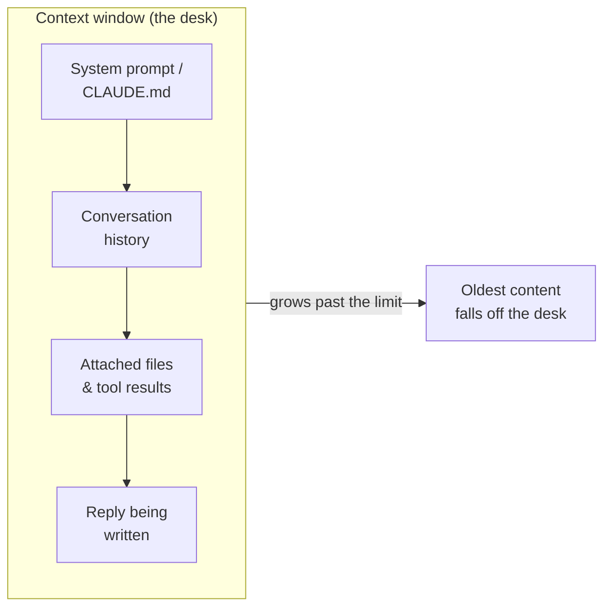

<LevelBadge level="beginner" />

Three ideas unlock a lot of "why did it do that?" moments: **tokens**, the **context window**, and **memory**. Get these and you'll stop being surprised by drift, forgetting, and surprise bills.

<Callout
  type="objectives"
  items={[
    "Read text the way a model does — in tokens, not words or characters",
    "Picture the context window as a finite desk, and predict when things fall off it",
    "Recognize 'context rot' — why models can lose the middle of a long input",
    "Know the four real sources of 'memory' and how to provide it on purpose"
  ]}
/>

## Tokens: the unit models think in

Models don't read characters or words — they read **tokens**, chunks of text roughly ¾ of a word in English. "Unbelievable" might be 3–4 tokens; common words are one each; a space, a comma, or a chunk of code each cost tokens too. Both your input *and* the model's output are counted, and tokens are exactly what [pricing and limits](/docs/api/tokens-and-pricing) are measured in.

You don't need to count by hand, but a rough feel helps: **~750 words ≈ ~1,000 tokens**. Type something and watch:

<TokenEstimator />

:::tip Why the ratio shifts
Plain English lands near ¾ word per token. Code, JSON, non-Latin scripts, long URLs, and rare words split into *more* tokens — so a 500-line file or a Chinese paragraph costs more than its word count suggests. When a bill or a limit surprises you, this is usually why.
:::

## The context window: working memory

The **context window** is the maximum number of tokens the model can consider at once — *your system prompt, the whole conversation so far, any attached files, and the reply it's writing,* all together. Think of it as the model's desk: large, but finite. Window sizes differ by model and keep growing — see [Models & Pricing](/docs/whats-new/models-and-pricing) for current numbers rather than memorizing one.

Everything the model "knows" in the moment lives on that desk:

When a conversation grows past the window, the **oldest content falls off**. That's why a very long chat can seem to "forget" how it started, or drift away from your original instruction.

## Context rot: it's not just *full* vs *empty*

A subtler problem: even when everything still fits, models tend to use the **beginning and end** of a long input more reliably than the **middle**. Bury the one sentence that matters in the center of a 50-page paste and it may get under-weighted — a failure mode often called *"lost in the middle."*

<VerifyNote lastVerified="2026-06-29" source="https://arxiv.org/abs/2307.03172">The "lost in the middle" effect — degraded use of information placed mid-context — was documented by Liu et al. (2023). Newer long-context models handle it better, but the practical habit below still pays off.</VerifyNote>

<Steps
  items={[
    {title: "Lead with the ask", body: "Put the actual instruction or question first, before pasting a long document — not buried after it."},
    {title: "Restate at the end", body: "Repeat the key instruction in one line after the long content. First + last positions are the strongest."},
    {title: "Trim before you paste", body: "Drop irrelevant sections. Less noise in the middle means the signal that's left gets more attention."},
    {title: "Split when huge", body: "For very large inputs, summarize or chunk instead of dumping everything — or start a fresh chat for a new sub-task."}
  ]}
/>

Here's the same request, structured so the instruction sits in the strong positions:

<PromptCard title="Instruction-first, restated-last">{`Task: Find every place this contract caps our liability, and quote the exact clause.

[... paste the full 40-page contract here ...]

Reminder of the task: list only the liability-cap clauses, with exact quotes and section numbers. Ignore everything else.`}</PromptCard>

:::tip In Claude Code
Long agent sessions hit the same ceiling. Claude Code manages it deliberately — compacting history and letting you steer what stays in view. See [Context Management](/docs/claude-code/context-management) and [Context Engineering](/docs/frontiers/context-engineering).
:::

## Memory: there isn't any, unless you provide it

By default, each conversation is a **blank slate**. The model doesn't remember your last chat. Everything that looks like memory is one of four things:

| Source | What it is | You control it by |
| --- | --- | --- |
| **Re-sent history** | Chat apps resend the conversation each turn, until the window fills | Starting fresh chats; keeping threads focused |
| **Memory features** | Some Claude surfaces carry facts across chats | [Memory Across Chats](/docs/claude-app/memory) settings |
| **Files you provide** | Persistent context you attach on purpose | [Projects](/docs/claude-app/projects), [CLAUDE.md](/docs/claude-code/claude-md) |
| **Your own code** | The API is **stateless** — you resend prior messages | [First API Call](/docs/api/first-call) |

The throughline: *if you want the model to remember something, you have to keep putting it on the desk.*

## Why this matters

Almost every "it ignored my earlier instruction" or "it lost track" issue traces back to one of three things: the window filled up, a new session started cold, or the key detail sat in the dead middle of a long paste. Knowing this, you'll structure prompts and sessions to keep the important stuff *in view*.

## Check yourself

<Quiz
  questions={[
    {
      q: "Roughly how many tokens is 750 words of plain English?",
      options: ["About 250", "About 1,000", "About 3,000", "Exactly 750"],
      answer: 1,
      explain: "A handy rule of thumb is ~750 words ≈ ~1,000 tokens for ordinary English. Code and non-Latin scripts run higher."
    },
    {
      q: "A long chat starts 'forgetting' how it began. The most likely cause is:",
      options: [
        "The model is broken",
        "The earliest content fell off the context window as the conversation grew",
        "The model permanently learned your earlier messages",
        "Tokens were refunded"
      ],
      answer: 1,
      explain: "The context window is finite. As a conversation exceeds it, the oldest tokens drop off the 'desk' — so early instructions can vanish from view."
    },
    {
      q: "You must paste a huge document plus one key instruction. Best placement?",
      options: [
        "Instruction only in the exact middle of the document",
        "Instruction at the very start AND restated at the end",
        "No instruction — let the model guess",
        "Instruction in a separate chat the model can't see"
      ],
      answer: 1,
      explain: "Models use the start and end of a long input most reliably ('lost in the middle'). Lead with the ask and restate it at the end."
    }
  ]}
/>

## Key terms

<Flashcards
  title="Lock in the vocabulary"
  cards={[
    {front: "Token", back: "The chunk of text a model actually processes — roughly ¾ of an English word. Input and output are both counted, and pricing is per token."},
    {front: "Context window", back: "The max tokens a model can consider at once: system prompt + history + files + the reply, all together. Finite — content past the limit falls off."},
    {front: "Lost in the middle", back: "The tendency to use the start and end of a long input more reliably than the middle. Put critical instructions in the strong positions."},
    {front: "Statelessness", back: "The API remembers nothing between calls. To continue a conversation you resend the prior messages yourself."}
  ]}
/>

:::note Takeaways
- **Tokens** are the unit of both thinking and billing — ~1,000 per 750 English words, more for code and other scripts.
- The **context window** is a finite desk; long chats forget because old content falls off it.
- Even within the window, **lead with your instruction and restate it at the end** — the middle gets under-used.
- There is **no memory by default**. Provide it deliberately with files, Projects, CLAUDE.md, or by resending history.
:::

## Next

- [What Is an LLM?](/docs/foundations/what-is-an-llm)
- [System, User & Assistant Roles](/docs/foundations/roles)
- [Context Engineering](/docs/frontiers/context-engineering)
- [Tokens, Context & Pricing (API)](/docs/api/tokens-and-pricing)
