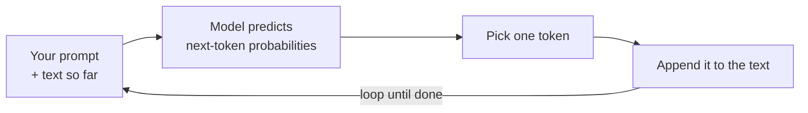

<LevelBadge level="beginner" />

A **Large Language Model** (LLM) — the technology behind Claude — does one deceptively simple thing: it reads text and **predicts what comes next**, one chunk at a time. That's it. Everything else emerges from doing that astonishingly well.

<Callout
  type="objectives"
  items={[
    "Grasp the one-sentence mental model: an LLM is a very sophisticated autocomplete",
    "See how the model builds an answer one token at a time, in a loop",
    "Understand why this mechanism explains both its strengths and its quirks",
    "Know what an LLM is NOT — and how that changes the way you use it"
  ]}
/>

## The one-sentence mental model

> An LLM is a very sophisticated autocomplete that has read an enormous amount of text and learned the patterns of how language — and the ideas inside it — tend to continue.

When you ask a question, the model isn't "looking up" an answer. It's generating the most plausible continuation of your text, token by token (see [Tokens & Context](/docs/foundations/tokens-and-context)). Plausible continuations of a good question are usually good answers — which is why this works at all.

:::tip Analogy: predictive keyboard on steroids
Think of the autocomplete on your phone that suggests the next word. Now imagine it had read most of the books, articles, and code on the internet — and suggested not just the next word, but a whole essay, translation, or program that fits. That's the intuition behind an LLM.
:::

## One token at a time

The whole engine is a loop: read everything so far, predict the next chunk, append it, repeat.

<Steps
  items={[
    {title: "Read", body: "The model takes in your prompt plus everything generated so far as a single block of text."},
    {title: "Predict", body: "It computes probabilities for what the next token could be."},
    {title: "Pick", body: "It selects one token. Whether this is deterministic or a bit random is what sampling controls like temperature adjust."},
    {title: "Append & repeat", body: "The chosen token is added to the text, and the slightly longer text feeds back in — looping until the answer is done."}
  ]}
/>

Each step only ever predicts **one** token, then feeds the slightly longer text back in. The model has no plan for the whole answer up front — coherence emerges from doing this prediction extremely well, thousands of times. How the "pick one token" step behaves (greedy vs. a bit random) is what [sampling controls](/docs/foundations/sampling-controls) like temperature adjust.

## Why this explains its strengths

Because it learned patterns across writing, code, and reasoning, an LLM can fluidly **write, summarize, translate, explain, and code** — tasks that are all "continue this text sensibly." Give it a clear setup and it produces a strong continuation. That's why [prompting](/docs/prompting/basics) matters so much: you're shaping the start of the text it continues.

## Why this explains its quirks

The same mechanism explains the rough edges:

- **It can be confidently wrong.** A fluent-sounding continuation isn't always a true one — that's [hallucination](/docs/foundations/hallucinations).
- **It doesn't truly "know" today's facts** unless you provide them or it has a tool to look them up.
- **It has no memory** between conversations unless you give it some.

## What an LLM is **not**

:::warning Adjust your expectations and you'll get better results
- ❌ **Not a database or search engine.** It generates, it doesn't retrieve verified records.
- ❌ **Not a calculator.** It can reason about math but isn't guaranteed exact — give it tools for that.
- ❌ **Not a person.** No feelings, intentions, or continuous memory. It's a powerful text engine.
:::

Treat it as a brilliant, fast, well-read assistant that occasionally misremembers — and **verify** what matters.

## Key terms

<Flashcards
  title="Review the core concepts"
  cards={[
    {front: "LLM (Large Language Model)", back: "The technology behind Claude. It reads text and predicts what comes next, one chunk at a time."},
    {front: "Next-token prediction", back: "The core loop: read the text so far, predict the next token, append it, repeat until done."},
    {front: "Token", back: "The chunk of text the model predicts at each step. The model only ever predicts one at a time."},
    {front: "Hallucination", back: "A fluent-sounding continuation that isn't actually true — a side effect of generating, not retrieving."},
    {front: "Sampling / temperature", back: "Controls how the 'pick one token' step behaves — greedy vs. a bit random."}
  ]}
/>

<Callout
  type="takeaways"
  items={[
    "An LLM is a very sophisticated autocomplete — it predicts the next token, not looks up an answer",
    "Coherence emerges from running that prediction loop one token at a time, thousands of times",
    "The same mechanism explains its strengths (write, summarize, translate, explain, code) and its quirks (confidently wrong, no live facts, no memory)",
    "It is not a database, a calculator, or a person — verify what matters"
  ]}
/>

## Check yourself

<Quiz
  title="Check yourself"
  questions={[
    {
      q: "What does an LLM fundamentally do when you ask it a question?",
      options: [
        "Looks up the answer in a database of verified facts",
        "Generates the most plausible continuation of your text, one token at a time",
        "Searches the live web for the most recent answer"
      ],
      answer: 1,
      explain: "An LLM isn't looking anything up — it generates the most plausible continuation of your text, token by token."
    },
    {
      q: "Why can an LLM be confidently wrong?",
      options: [
        "A fluent-sounding continuation isn't always a true one — that's hallucination",
        "It runs out of memory mid-answer",
        "It refuses to answer questions it doesn't know"
      ],
      answer: 0,
      explain: "It generates plausible-sounding text rather than retrieving verified records, so a fluent continuation can still be false — that's hallucination."
    },
    {
      q: "Which statement about an LLM is correct?",
      options: [
        "It is a search engine that retrieves verified records",
        "It is a calculator guaranteed to be exact",
        "It is not a person and has no continuous memory between conversations unless you give it some"
      ],
      answer: 2,
      explain: "An LLM is a powerful text engine — not a database, calculator, or person. It has no memory between conversations unless you provide it."
    }
  ]}
/>

## Next

- [Tokens, Context & Memory](/docs/foundations/tokens-and-context)
- [Hallucinations & How to Reduce Them](/docs/foundations/hallucinations)
- [Prompting Basics](/docs/prompting/basics)
