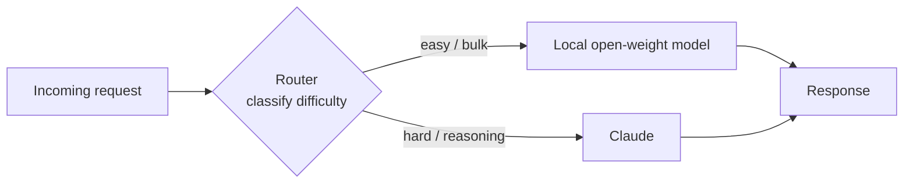

<LevelBadge level="advanced" />

The framing "frontier model **or** local model" is a false choice. The most cost-effective, privacy-respecting, and resilient systems in production use **both** — a small open-weight model running locally for the easy, high-volume, or sensitive work, and a frontier model like Claude as the **smart layer** that handles the hard reasoning. This page is about the durable *patterns* that wire the two together so each does what it's best at. The patterns are provider-neutral — Claude is simply a great fit for the "reasoning" role — and they outlast any specific model name.

<Callout type="objectives" items={[
  "Understand WHY a hybrid (frontier + local) beats either model alone on cost, privacy, and resilience",
  "Learn the five durable hybrid patterns: router/big-little, draft-then-refine, privacy redaction, bulk pre/post-processing, and offline fallback",
  "For each pattern: know when to reach for it, the trade-off you're accepting, and a concrete sketch",
  "Design your own Claude+local hybrid with a repeatable, four-step method",
  "Know that these patterns are provider-neutral — Claude slots in as the 'smart layer', not a lock-in",
]} />

## Why hybrid, not either-or

A local open-weight model (see [Run models locally with Ollama](/docs/models/run-models-locally-ollama)) and a frontier model are good at *different* things:

- **Local** is private (data never leaves your machine), cheap-at-scale (no per-token bill), low-latency for small models, and works offline. But it has a real **capability gap** on the hardest reasoning, long-context, and agentic tasks.
- **Claude (frontier)** leads on exactly those hard tasks, but every call costs tokens and sends data to a cloud API.

The insight behind every pattern below: **most requests are easy, and the hard ones are the minority.** If a cheap local model can handle the bulk and you reserve the frontier model for the genuinely hard slice, you get most of the frontier quality at a fraction of the cost — and you can keep sensitive data local. Microsoft's *Hybrid LLM* paper formalized this: a learned router that sends easy queries to a small model made **up to 40% fewer calls** to the large model with no drop in response quality ([arXiv 2404.14618](https://arxiv.org/abs/2404.14618)). The open-source [RouteLLM](https://github.com/lm-sys/RouteLLM) framework reports similar results — near-frontier quality at roughly **half the cost** on common benchmarks by routing about half of queries to the cheaper model.

> Pick your hybrid by **constraint**, not by hype. If you don't yet know which model fits which task, start at [Choosing a model](/docs/models/choosing-a-model) — then come back and decide *where the boundary sits* between local and frontier.

---

## Pattern 1 — Router / big-little

**The idea.** Put a thin **classifier** in front of every request. It looks at the task and decides: easy/bulk → local model; hard reasoning → Claude. Borrowed from "big.LITTLE" CPU design, where a phone runs background work on tiny efficient cores and wakes the big core only for heavy load.

**When to use.** You have a mixed stream of requests — many trivial, a few genuinely hard — and you want to pay frontier prices only for the hard ones. This is the workhorse hybrid.

**The trade-off.** The router can be *wrong*. Misroute a hard task to the local model and quality drops; misroute an easy one to Claude and you overpay. You tune a threshold to trade cost against quality, and you should **measure** that threshold on your own data with a small eval (see [Evals](/docs/power-user/evals)).

**The sketch.** The router can be as simple as a rules layer (length, keywords, presence of code) or as rich as a small classifier model. A cheap, transparent option is to ask the **local** model itself to classify difficulty, then dispatch:

<PromptCard title="Router classification prompt (runs on the local model)">{`You are a request router. Classify the user request into exactly one tier.

Return ONLY a JSON object: {"tier": "...", "reason": "..."}

Tiers:
- "local"  → simple, mechanical, or high-volume: short rewrites, formatting,
             single-fact lookup, basic classification/extraction, boilerplate.
- "frontier" → hard reasoning, multi-step planning, long-context synthesis,
             ambiguous instructions, code that must be correct, anything where
             a wrong answer is costly.

Bias toward "local" when in doubt about a CHEAP, low-risk task,
and toward "frontier" when a mistake would be EXPENSIVE.

Request:
"""
{{REQUEST}}
"""`}</PromptCard>

The router's output is a routing decision, not the final answer — keep it tiny and fast. For richer routing across many tools or models, the same classify-then-dispatch logic generalizes (and resembles how models choose between [tools](/docs/api/tool-use)).

---

## Pattern 2 — Draft-then-refine

**The idea.** The local model produces a **cheap first draft**; Claude **polishes, corrects, or verifies** it. You pay frontier tokens for refinement, not generation from scratch — and a good draft makes Claude's job shorter and more reliable.

**When to use.** Open-ended generation where a rough draft is much cheaper than a perfect one but the final output must be high quality: long-form writing, code, structured documents, summaries that must be exactly right.

**The trade-off.** Two model calls instead of one adds latency, and a *bad* draft can anchor the refiner toward its mistakes. The win shows up when drafting is the expensive part and refinement is comparatively cheap — verify on your data that "draft local + refine frontier" actually beats "frontier does it all" on cost-per-acceptable-output.

**The sketch.** Local model drafts → pass the draft to Claude with a focused instruction: *"Here is a draft. Fix errors, tighten, and verify claims; return the corrected version."* This is the same intuition that powers **speculative decoding** at the token level — a small drafter proposes, the large model verifies and keeps only what holds up ([NVIDIA: speculative decoding](https://developer.nvidia.com/blog/an-introduction-to-speculative-decoding-for-reducing-latency-in-ai-inference/)). At the task level you're doing the same thing by hand: cheap proposal, expensive verification.

---

## Pattern 3 — Privacy redaction

**The idea.** A local model (or local NLP tooling) **strips PII** from text *before* anything is sent to a cloud API. Claude reasons over the redacted version; you re-insert the real values locally on the way back if needed.

**When to use.** You want frontier reasoning but you're handling regulated or sensitive data (health, finance, customer records) and raw PII **must not** leave your environment. Redaction lets you use the cloud model on the *shape* of the problem without exposing the people in it.

**The trade-off.** Redaction is never perfect — a missed entity is a leak, and over-redaction destroys context the model needs to answer well. Treat the redactor as a security control: test its recall, and keep the un-redaction mapping strictly local.

**The sketch.** Run a local detector/anonymizer over the input, replacing entities with placeholders (`[PERSON_1]`, `[EMAIL_1]`), send the redacted text to Claude, then re-hydrate placeholders locally. Microsoft's open-source [Presidio](https://github.com/microsoft/presidio) is the common building block here — it detects and anonymizes PII and can use a pluggable NLP backend, including a local model for a second pass on hard cases. A crucial, often-missed detail: redact **everything** that reaches the model, including retrieved documents and tool results — not just the user's latest message.

---

## Pattern 4 — Bulk pre/post-processing

**The idea.** The local model handles **high-volume, repetitive** work — extraction, classification, tagging, normalization across thousands of items — and Claude handles only the **few hard cases** the local model flags as low-confidence.

**When to use.** Pipeline workloads: classify 100k support tickets, extract fields from a mountain of documents, tag a content firehose. Running every item through a frontier API would be slow and expensive; most items are easy.

**The trade-off.** You need a reliable **confidence / escalation signal** so the right items get escalated. Too eager and you overpay; too shy and quality suffers on the hard tail. The local model's self-reported confidence is a starting point, but validate it.

**The sketch.** Local model processes the full batch and attaches a confidence score; items below a threshold (or that fail a schema/validation check) are escalated to Claude for the hard call. This is Pattern 1 applied to a batch instead of a live request — the same "cheap handles the bulk, frontier handles the tail" economics that cascades exploit, often **40–70% cost savings** with minimal quality loss on the easy majority.

---

## Pattern 5 — Offline fallback

**The idea.** The local model is the **safety net**. When the cloud API is down, rate-limited, or unreachable, requests fail *over* to the local model instead of failing *outright*. Degraded answers beat error pages.

**When to use.** Anything where availability matters more than always-best quality: internal tools that must keep working, on-device features, products that can't show users a hard error during a provider outage.

**The trade-off.** Fallback responses are **lower quality** by definition — you're trading the frontier ceiling for "still works." Make the degradation explicit (label it, narrow the feature set) rather than silently serving weaker answers as if they were the real thing.

**The sketch.** Wrap calls in an ordered chain: try Claude → on availability error (timeout, 429/5xx), retry with backoff → if still failing, route to the local model. LLM gateways like LiteLLM and OpenRouter implement exactly this fallback-chain pattern, including caching of common prompts so an offline path can still serve something useful. The durable principle: **keep a local model warm as your last line**, so an outage degrades the experience instead of breaking it.

---

## Design your own Claude+local hybrid

<Steps items={[
  {title: "Map your request distribution", body: "Sample real traffic and label what fraction is genuinely hard vs easy/bulk vs sensitive. The shape of this distribution tells you which pattern pays off — a long easy tail favors a router or bulk pre-processing; a small sensitive slice favors redaction."},
  {title: "Pick the pattern that matches the constraint", body: "Mixed live traffic → Pattern 1 (router). High-quality generation on a budget → Pattern 2 (draft-then-refine). Regulated/sensitive data → Pattern 3 (redaction). Pipeline / batch volume → Pattern 4 (bulk). Availability is critical → Pattern 5 (fallback). Many systems combine two or three."},
  {title: "Set the boundary, then measure it", body: "Decide where local stops and Claude starts (a router threshold, a confidence cutoff, a redaction policy). Run a small eval on YOUR data to put numbers on the cost-vs-quality trade. Don't trust a leaderboard or a vendor's headline — measure on your task. See the Evals page."},
  {title: "Add observability and a safety valve", body: "Log every routing/escalation decision and its outcome so you can re-tune the boundary as models and traffic change. Keep an explicit fallback (Pattern 5) so a provider outage degrades gracefully instead of breaking."},
]} />

<VerifyNote lastVerified="2026-06-28" source="https://platform.claude.com/docs/en/about-claude/models/overview">
Specific model names, context windows, per-token prices, and rate limits change frequently and are **not** restated here on purpose — they're the volatile part. Before you fix a cost or quality threshold for a router or cascade, check the current Claude model lineup and pricing at the source above, and the current local-model names in the <a href="https://ollama.com/library">Ollama library</a>. The patterns on this page are durable; the exact numbers behind the boundary are not.
</VerifyNote>

<Quiz title="Check yourself" questions={[
  {q: "What is the core economic insight that makes every hybrid pattern work?", options: ["Local models are always better than frontier models", "Most requests are easy; only a minority truly need frontier reasoning", "Frontier models are cheaper per token than local models"], answer: 1, explain: "The bulk of real traffic is easy. If a cheap local model handles the easy majority and you reserve the frontier model for the hard minority, you get most of the quality at a fraction of the cost. That asymmetry is what every pattern here exploits."},
  {q: "You must use a frontier model to reason over customer records, but raw PII cannot leave your environment. Which pattern fits?", options: ["Router / big-little", "Privacy redaction", "Offline fallback"], answer: 1, explain: "Privacy redaction strips PII locally before anything reaches the cloud API, so Claude reasons over a redacted version and the real values stay in your environment. The router decides WHERE to send work; it doesn't remove sensitive data."},
  {q: "What is the main risk specific to the router / big-little pattern?", options: ["It can only ever use one model", "A misrouted task costs quality (hard sent to local) or money (easy sent to frontier)", "It requires the cloud API to be online at all times"], answer: 1, explain: "The router is a classifier and it can be wrong. Misrouting a hard task to the weak model hurts quality; misrouting an easy one to the frontier wastes money. That's why you tune and measure the routing threshold on your own data."},
  {q: "Why is draft-then-refine sometimes NOT worth it?", options: ["It always produces lower quality than a single frontier call", "Two calls add latency, and a bad local draft can anchor the refiner toward its mistakes", "Frontier models cannot edit text they didn't write"], answer: 1, explain: "Draft-then-refine wins only when drafting is the expensive part and refinement is cheap. Two model calls add latency, and a weak draft can lead the refiner astray — so verify on your data that local-draft + frontier-refine actually beats frontier-does-it-all."},
]} />

<Flashcards title="The five hybrid patterns at a glance" cards={[
  {front: "Router / big-little", back: "Classify each request, then dispatch: easy/bulk → local, hard reasoning → Claude. The workhorse hybrid. Trade-off: the router can misroute — tune the threshold on your own data."},
  {front: "Draft-then-refine", back: "Local model drafts cheaply; Claude polishes/verifies. Pay frontier tokens for refinement, not generation. Trade-off: extra latency, and a bad draft can anchor the refiner."},
  {front: "Privacy redaction", back: "A local model/NLP tool strips PII before anything reaches the cloud API; re-hydrate locally. Lets you use frontier reasoning on sensitive data. Trade-off: a missed entity is a leak; redact tool results and retrieved docs too, not just the user message."},
  {front: "Bulk pre/post-processing", back: "Local handles high-volume extraction/classification across the whole batch; Claude handles only low-confidence escalations. Pattern 1 applied to a batch. Needs a reliable confidence/escalation signal."},
  {front: "Offline fallback", back: "Local model is the safety net: when the cloud API is down or rate-limited, fail OVER to local instead of failing outright. Degraded answers beat errors. Make the degradation explicit."},
]} />

<Callout type="takeaways" items={[
  "Frontier vs local is a false choice — the best systems use both, with Claude as the provider-neutral 'smart layer' for the hard minority of work",
  "All five patterns ride one insight: most requests are easy and cheap; reserve frontier spend for the genuinely hard slice",
  "Router/big-little is the workhorse; draft-then-refine buys quality on a budget; redaction unlocks sensitive data; bulk pre-processing scales pipelines; offline fallback buys resilience — and they compose",
  "Every pattern has a boundary (a threshold, a confidence cutoff, a redaction policy) — measure it on YOUR data with a small eval, never a leaderboard",
  "Keep the volatile numbers (model names, prices, limits) behind a verify step; the patterns are durable, the specifics are not",
]} />

## Sources & further reading

- [Hybrid LLM: Cost-Efficient and Quality-Aware Query Routing (arXiv 2404.14618, ICLR 2024)](https://arxiv.org/abs/2404.14618)
- [RouteLLM — open-source framework for serving and evaluating LLM routers (GitHub, LMSYS)](https://github.com/lm-sys/RouteLLM)
- [RouteLLM: An Open-Source Framework for Cost-Effective LLM Routing (LMSYS blog)](https://www.lmsys.org/blog/2024-07-01-routellm/)
- [Microsoft Presidio — detect, redact, and anonymize PII (GitHub)](https://github.com/microsoft/presidio)
- [Presidio PII masking with LiteLLM — tutorial](https://docs.litellm.ai/docs/tutorials/presidio_pii_masking)
- [An Introduction to Speculative Decoding (NVIDIA Technical Blog)](https://developer.nvidia.com/blog/an-introduction-to-speculative-decoding-for-reducing-latency-in-ai-inference/)
- [Model fallbacks — reliable AI with automatic failover (OpenRouter docs)](https://openrouter.ai/docs/guides/routing/model-fallbacks)
- [Anthropic — Claude models overview](https://platform.claude.com/docs/en/about-claude/models/overview)
