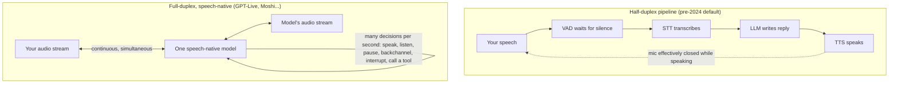

<LevelBadge level="beginner" />

For a decade, talking to a computer meant taking turns with a walkie-talkie that pretended to be a person. On **July 8, 2026, OpenAI shipped GPT-Live** — a voice model that listens *while* it talks — and the walkie-talkie era officially started ending. This page explains what actually changed under the hood, why the old voice stack was doomed to feel robotic, and how to judge the whole 2026 voice-agent landscape without the hype.

<Callout type="objectives" items={[
  "Understand why the classic STT → LLM → TTS pipeline always felt laggy — it's physics, not polish",
  "Know what full-duplex means: one speech-native model that listens and speaks simultaneously",
  "Get the verified facts on GPT-Live and the current voice landscape (OpenAI, Google, ElevenLabs, Anthropic, open models)",
  "Know when a voice agent is genuinely viable today — and what still breaks",
]} />

<VerifyNote lastVerified="2026-07-13" source="https://openai.com/index/introducing-gpt-live/">
GPT-Live launched days ago and details (model tiers, rollout, API access) are moving fast. Product names, availability, and latency figures on this page are perishable — check each provider's own page (linked in Sources) for today's truth.
</VerifyNote>

## The 200-millisecond problem

Here's the fact that explains everything else on this page: **humans respond to each other in about 0–200 milliseconds**. A landmark cross-linguistic study of 10 languages (Stivers et al., *PNAS* 2009) found response gaps cluster near **0 ms** in every culture tested — we routinely start answering *before* the other person finishes, because our brains predict the end of their turn.

Now compare the classic voice-assistant stack. It was a **pipeline of three separate models** glued together:

1. **STT (speech-to-text)** transcribes your audio into text,
2. an **LLM** reads the transcript and writes a reply,
3. **TTS (text-to-speech)** turns the reply back into audio.

Each stage must (mostly) finish before the next starts, so their delays **stack**. Worse, the pipeline has no idea when you've stopped talking — audio has no "send" button — so engineers bolted on a **VAD (voice activity detection)** silence timer: wait for roughly half a second to a second of silence, then *guess* the turn is over. That single hack explains both classic failure modes: pause mid-sentence to think and the bot barges in; finish crisply and it still sits there waiting for its silence timer. Add it all up and you get 1–3 seconds of dead air where a human expects ~0–200 ms — **an order of magnitude too slow**, before the model has even said a word.

And it gets worse: the pipeline is **half-duplex**, like a walkie-talkie. While the bot is speaking, it is not listening. You can't interrupt ("barge in") without special engineering, the bot can never say "mhmm" while *you* talk, and any overlap — the most human part of conversation — is simply impossible by construction.

## What "full-duplex" actually means

**Full-duplex** is a telecom term: both directions transmit *at the same time* (a phone call), versus **half-duplex**, where they alternate (a walkie-talkie). Applied to AI voice:

- **The model listens and speaks simultaneously.** There is no "your turn / my turn" state machine — input audio streams in continuously while output audio streams out.
- **It's speech-native.** One model consumes and produces audio directly, instead of three models passing text between them. No transcription step, no synthesis step, no stacked latency — and no information loss (tone, hesitation, irony, and emotion survive, because they were never flattened into text).
- **Turn-taking becomes a learned behavior, not a timer.** Per OpenAI's description of GPT-Live, the model makes interaction decisions "many times per second": whether to speak, keep listening, pause, acknowledge, interrupt, or invoke a tool. The silence-detection hack disappears because the model *predicts* turn ends the way humans do.
- **Backchannels and barge-in come for free.** It can murmur "mhmm" while you talk (a **backchannel**), stop mid-sentence the instant you cut in (**barge-in**), or stay silent while you think — all impossible or hacky in a pipeline.

Few people know this: **full-duplex wasn't invented by OpenAI in 2026.** French lab **Kyutai open-sourced Moshi in 2024** — a full-duplex speech model with ~160 ms theoretical / ~200 ms practical latency that models *two parallel audio streams* (yours and its own) and uses an "Inner Monologue" of time-aligned text tokens to keep its speech linguistically coherent. You can download the weights and run it locally today. What changed this month is that full-duplex went from research demo to the **default interface for hundreds of millions of ChatGPT users**.

## GPT-Live: what OpenAI actually shipped

Verified against OpenAI's announcement and launch coverage (July 8, 2026):

- **Two models: GPT-Live-1 and GPT-Live-1 mini.** The mini replaces Advanced Voice Mode as the ChatGPT Voice default (including free tier); the larger GPT-Live-1 is for paid tiers. TechCrunch reports over **150 million people** already use ChatGPT's voice features.
- **True full-duplex architecture.** Continuous processing of input while generating output, with speak/listen/pause/interrupt/tool decisions made many times per second. It backchannels ("mhmm", "yeah"), handles rapid back-and-forth, and — notably — can **stay quiet** and just absorb context until called on.
- **Delegation to a frontier model.** For web search, deeper reasoning, or agentic work, GPT-Live hands the task to OpenAI's frontier model (GPT-5.5 at launch) **in the background and keeps talking with you** while the result comes back. The voice model is the conversational front-end; the heavy thinking happens elsewhere. This "fast talker + slow thinker" split is the architecture pattern to watch.
- **Live translation** falls out of the continuous listen-while-speaking design — the model can render your sentence in another language nearly as you say it. (Launch coverage noted accent quality is still uneven in some languages.)
- **No developer API at launch.** GPT-Live is a ChatGPT product for now; OpenAI says API access is coming and has a sign-up form. For builders, **gpt-realtime on the Realtime API remains the current developer product** (see below).
- **Known limits at launch:** no video/screen-share in the voice session, uneven quality outside major languages, and OpenAI says it is monitoring emotional-reliance effects.

<VerifyNote lastVerified="2026-07-13" source="https://openai.com/index/introducing-gpt-live/">
Tier availability, the exact frontier model behind delegation, and API timing are the fastest-moving claims here — recheck OpenAI's announcement before repeating them.
</VerifyNote>

## The voice landscape, verified (July 2026)

| Player | What exists | Full-duplex? | Notes |
|---|---|---|---|
| **OpenAI — GPT-Live** | ChatGPT Voice (consumer) | **Yes** — speech-native | Delegates hard tasks to a frontier model mid-conversation; no API yet |
| **OpenAI — Realtime API (gpt-realtime)** | Developer API, GA | Speech-to-speech, single model | Production voice agents: SIP phone calling, remote MCP servers, image input |
| **Google — Gemini Live API** | Developer API (AI Studio / Vertex, GA) | Native-audio, streaming | Barge-in, "proactive audio" (speaks only when relevant), affective dialog, tool use + Google Search |
| **ElevenLabs — Agents** | Agent platform (launched Mar 2026) | Orchestrated stack with proprietary turn-taking model | TTS/STT + turn-taking + tool calls; 70+ languages; sub-500 ms first-turn claims; phone/web/app channels |
| **Anthropic — Claude** | [Voice mode in the Claude apps](/docs/claude-app/voice-mode); push-to-talk `/voice` in Claude Code (Mar 2026, multilingual out of beta Jun 2026) | **No** — turn-based | Speak, get spoken replies with a saved transcript. No speech-native full-duplex model announced as of the verify date — don't let anyone tell you otherwise |
| **Kyutai — Moshi** | Open weights + code (GitHub, Hugging Face) | **Yes** — the open-source proof | ~160–200 ms latency, dual-stream audio, "Inner Monologue"; runs locally |

Two takeaways from that table most coverage misses: **(1)** "voice agent" today means two different architectures — genuinely speech-native full-duplex models (GPT-Live, Moshi, Gemini's native audio) versus very fast, well-orchestrated pipelines with a learned turn-taking model on top (ElevenLabs Agents). Both can feel good; only the first can overlap speech. **(2)** The open-source option is real: Moshi proves you can run full-duplex on your own hardware, which matters if your use case can't ship audio to a cloud (see [Choosing a Model](/docs/models/choosing-a-model) for that decision framework).

## How a full-duplex conversation actually flows

<Steps items={[
  {title: "Audio streams in continuously", body: "There is no record-then-send. Your microphone audio is encoded into tokens frame by frame (Moshi's codec uses 80 ms frames) and fed to the model as it arrives — even while the model is mid-sentence."},
  {title: "The model makes micro-decisions constantly", body: "Many times per second it chooses: keep talking, stop, stay silent, drop a backchannel ('mhmm'), or start a reply. Turn-taking is a prediction the model learned from real conversation, not a silence timer."},
  {title: "You interrupt; it yields instantly", body: "Barge-in is native: the model hears you the moment you start because it never stopped listening. It cuts its own sentence, absorbs what you said, and adjusts — no 'stop' keyword needed."},
  {title: "Hard questions get delegated, softly", body: "Ask something needing web search or real reasoning and GPT-Live hands it to the frontier model in the background — while keeping the conversation alive ('let me check that... so anyway—'). The answer is woven back in when ready."},
  {title: "Silence is a valid move", body: "A full-duplex model can deliberately say nothing — letting you think out loud without hijacking the turn. Pipeline bots literally could not do this; their VAD treated your pause as an invitation."},
]} />

## When voice agents are now viable — and what still breaks

**Now genuinely viable:**

- **Customer support and phone workflows.** Sub-second turn-taking plus barge-in removes the two biggest complaint drivers. The Realtime API's SIP support and ElevenLabs Agents both target exactly this.
- **Hands-free and eyes-busy use.** Driving, cooking, field work, accessibility — the interaction finally keeps up with speech ([voice mode on the Claude apps](/docs/claude-app/voice-mode) already covers the capture-and-transcribe version of this).
- **Live translation and language practice.** Listen-while-speaking makes near-simultaneous interpretation and natural conversation drills possible for the first time.
- **Voice as an agent front-end.** The delegation pattern — chat with a fast voice model while a slow frontier model does the work — is OpenAI's stated bet for managing "long-running agentic work" by voice.

**Still breaks:**

- **Hallucinated audio.** Speech-native models can hallucinate in *sound*, not just facts: wrong-language drift, mangled names and numbers, or off accents (GPT-Live's launch translation demo drew exactly this criticism). Never trust a spoken number you didn't confirm.
- **Noisy environments and crosstalk.** Always-open microphones hear everything — side conversations, TV, a second speaker. Full-duplex makes the model *more* exposed to ambient audio, not less.
- **Safety of real-time actions.** A model that acts at conversational speed can act on a misheard sentence at conversational speed. Any voice agent that touches money, messages, or deletions needs explicit spoken confirmation gates and a bias toward read-only defaults — the same rules as any agent (see [Foundations](/docs/foundations)), but with a lower-fidelity input channel.
- **Emotional reliance.** A system that backchannels, hesitates, and never tires of you is engineered to feel like a friend. OpenAI itself flags monitoring for this. Design (and use) accordingly.

<PromptCard title="System-prompt skeleton for a voice agent (works on speech-native models and pipelines)">{`You are a voice assistant for {company}. You are SPEAKING, not writing.

Style:
- Short sentences. One idea per sentence. No lists, no markdown, no URLs read aloud.
- If the user interrupts, stop immediately and address what they said.
- If the user pauses mid-thought, stay silent. Do not fill silence.

Safety:
- Before ANY action that sends, buys, deletes, or changes something:
  say back exactly what you will do and wait for a clear spoken "yes".
- Repeat numbers, names, and addresses back for confirmation — always.
- If audio is unclear or noisy, say what you think you heard and ask.
- If asked for something outside {scope}, say so and offer a human handoff.`}</PromptCard>

<Quiz title="Check yourself" questions={[
  {q: "Why did the classic STT → LLM → TTS stack always feel laggy?", options: ["The models were too small", "Three sequential stages plus a silence-detection timer stack into 1–3 s of delay, versus the ~0–200 ms humans expect", "Microphones add latency", "TTS voices were robotic"], answer: 1, explain: "It's structural: each stage waits on the previous one, and a VAD waits for silence before anything starts. Humans respond within ~0–200 ms (Stivers et al., PNAS 2009), so the pipeline was an order of magnitude too slow by design."},
  {q: "What can a full-duplex model do that a half-duplex pipeline cannot, by construction?", options: ["Answer factual questions", "Speak more fluently", "Listen while it speaks — enabling barge-in, backchannels, and overlapping speech", "Use tools"], answer: 2, explain: "Half-duplex alternates turns like a walkie-talkie: while the bot speaks it is not listening. Simultaneous listen-and-speak is the defining property of full-duplex."},
  {q: "How does GPT-Live handle a question that needs web search or deep reasoning?", options: ["It refuses voice for hard questions", "It pauses the call until the answer is ready", "It answers from memory only", "It delegates to a frontier model in the background and keeps the conversation going meanwhile"], answer: 3, explain: "The 'fast talker + slow thinker' split: the speech-native model fronts the conversation and hands heavy work to a frontier model (GPT-5.5 at launch), weaving the result back in when ready."},
  {q: "Which of these was true BEFORE GPT-Live launched?", options: ["A full-duplex speech model with ~200 ms latency was already open source (Kyutai's Moshi, 2024)", "No model could be interrupted", "Voice AI required an internet connection by law", "Claude had a full-duplex speech-native model"], answer: 0, explain: "Moshi shipped open weights in 2024 with dual-stream full-duplex audio and ~160–200 ms latency. GPT-Live's significance is mainstreaming full-duplex, not inventing it. Claude's voice features remain turn-based as of the verify date."},
]} />

<Flashcards title="Voice-AI vocabulary" cards={[
  {front: "Half-duplex", back: "Communication that alternates directions — walkie-talkie style. The old voice-assistant pipeline: while the bot speaks, it isn't listening."},
  {front: "Full-duplex", back: "Both directions at once, like a phone call. The model listens and speaks simultaneously and decides many times per second whether to talk, pause, or yield."},
  {front: "Speech-native model", back: "A single model that consumes and produces audio directly — no STT/TTS stages, no stacked latency, and tone/emotion survive because speech is never flattened to text."},
  {front: "Barge-in", back: "Interrupting the agent mid-sentence and having it stop and adapt instantly. Native in full-duplex; a bolt-on hack in pipelines."},
  {front: "Backchannel", back: "Short listener signals — 'mhmm', 'yeah', 'got it' — made while the OTHER party speaks. Impossible in half-duplex by construction."},
  {front: "VAD / endpointing", back: "Voice activity detection: the silence timer old pipelines used to guess you'd finished talking. Cause of both cut-you-off and awkward-wait failures."},
  {front: "Latency stacking", back: "Pipeline delays add up: VAD wait + STT + LLM + TTS ≈ 1–3 s. Humans expect ~0–200 ms — the gap that made bots feel robotic."},
  {front: "Delegation (fast talker / slow thinker)", back: "GPT-Live's pattern: a fast speech-native model fronts the conversation and hands search/reasoning to a frontier model in the background, keeping the chat alive meanwhile."},
]} />

<Callout type="takeaways" items={[
  "The old stack wasn't badly built — it was structurally too slow: stacked STT/LLM/TTS latency plus a silence timer, versus the ~0–200 ms humans expect",
  "Full-duplex = one speech-native model that listens while speaking; barge-in, backchannels, and deliberate silence become learned behaviors, not hacks",
  "GPT-Live (July 8, 2026) mainstreams full-duplex in ChatGPT and pioneers delegation: fast voice model up front, frontier model reasoning in the background",
  "The landscape splits in two: speech-native full-duplex (GPT-Live, Gemini native audio, Moshi — open source since 2024) vs fast orchestrated pipelines with learned turn-taking (ElevenLabs Agents); Claude's voice remains turn-based",
  "Voice agents are now viable for support, hands-free, and translation — but audio hallucinations, noisy rooms, and real-time action safety still demand confirmation gates",
]} />

## Next

- [The AI Model Landscape: Choosing a Model](/docs/models/choosing-a-model) — the decision framework, applied to any modality
- [Talking to Claude (Voice Mode)](/docs/claude-app/voice-mode) — what Claude's voice features do today
- [Foundations](/docs/foundations) — tokens, context, and the agent-safety basics that voice inherits

## Sources & further reading

- [Introducing GPT-Live — OpenAI](https://openai.com/index/introducing-gpt-live/) — the launch announcement (July 8, 2026)
- [OpenAI releases new voice models for more natural live conversations — TechCrunch](https://techcrunch.com/2026/07/08/openai-releases-new-voice-models-for-more-natural-live-conversations/) — launch coverage: tiers, 150 M voice users, translation demo caveats
- [Introducing gpt-realtime and Realtime API updates for production voice agents — OpenAI](https://openai.com/index/introducing-gpt-realtime/) — the current developer speech-to-speech product (GA)
- [Gemini Live API capabilities — Google AI for Developers](https://ai.google.dev/gemini-api/docs/live-api/capabilities) — native audio, barge-in, proactive audio, tool use
- [ElevenLabs Agents](https://elevenlabs.io/agents) — the agent platform: turn-taking model, channels, languages
- [Moshi: a speech-text foundation model for real-time dialogue — Kyutai (arXiv 2410.00037)](https://arxiv.org/abs/2410.00037) — the open full-duplex architecture: dual streams, Inner Monologue, 160 ms theoretical latency
- [kyutai-labs/moshi — GitHub](https://github.com/kyutai-labs/moshi) — code and weights to run full-duplex locally
- [Universals and cultural variation in turn-taking in conversation — Stivers et al., PNAS 2009](https://www.pnas.org/doi/10.1073/pnas.0903616106) — the ~0–200 ms human turn-gap evidence
- [Claude Code rolls out a voice mode capability — TechCrunch](https://techcrunch.com/2026/03/03/claude-code-rolls-out-a-voice-mode-capability/) — Claude's push-to-talk voice input status
