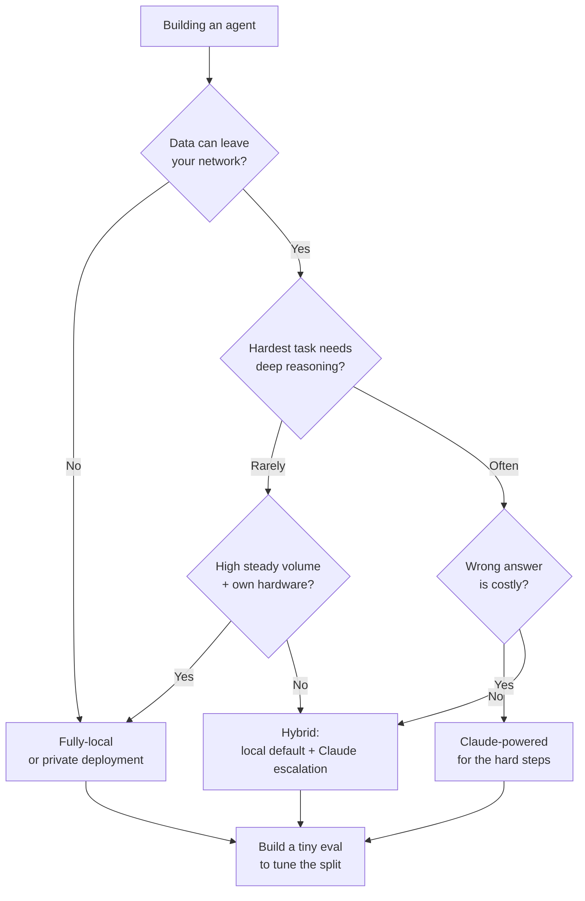

<LevelBadge level="intermediate" />

You're building an agent. The first real fork in the road: does it run on a **fully-local** open-weight model (private, free to run, yours), on **Claude** (frontier quality, hosted), or on a **hybrid** of both? This page is a decision framework — the factors that actually decide it, a clear "if X → lean Y" flow, and the honest reality that **hybrid usually wins**: local for the easy/sensitive 90%, Claude for the hard 10%.

<Callout type="objectives" items={[
  "Name the factors that actually decide local vs Claude vs hybrid",
  "Walk a clear 'if X → lean Y' decision flow for your agent",
  "Understand why a hybrid (local default + Claude escalation) often beats either extreme",
  "Leave with a tiny eval as your tie-breaker — not a leaderboard",
]} />

<VerifyNote lastVerified="2026-06-28" source="https://artificialanalysis.ai/">
The durable claims here — *a capability gap between top open-weight and frontier models exists but keeps narrowing*, and *routing/cascade (cheap-model-first, escalate-on-hard) saves cost while holding quality* — are stable. But the **specific numbers** (how big the gap is this month, which open model leads, per-token Claude prices, exact tokens/sec on given hardware) move constantly. Treat any specific figure as perishable and check a live tracker like [Artificial Analysis](https://artificialanalysis.ai/) before betting on it.
</VerifyNote>

## The three options, in one breath

- **Fully-local agent** — an open-weight model (Llama, Qwen, Mistral, DeepSeek, etc.) running on your own hardware via Ollama/LM Studio/vLLM. Data never leaves your machine; no per-call cost; works offline; capped by your hardware and the model's ceiling. → [Local AI Agents](/docs/models/local-ai-agents)
- **Claude-powered agent** — calls the Claude API. Frontier reasoning and tool-use, no infra to babysit, scales instantly; but data leaves your network, you pay per call, and you need connectivity.
- **Hybrid** — a local model handles the routine/sensitive bulk; hard or high-stakes steps escalate to Claude. The pattern most production agents converge on. → [Claude + Local Models](/docs/models/claude-plus-local-models)

## The factors that actually decide it

Run your agent through these. Most decisions are settled by just the first two or three.

| Factor | Leans **local** when… | Leans **Claude** when… |
|---|---|---|
| **Data sensitivity / privacy** | Data is regulated or can't leave your network | Data is non-sensitive or you have a compliant data agreement |
| **Task difficulty & reasoning depth** | Tasks are narrow, well-scoped, repetitive | Tasks need deep multi-step reasoning, long-context, tricky tool use |
| **Reliability needs** | A retry or a human is fine on a miss | Each step must be right; failures are costly |
| **Latency** | Local hardware responds fast enough | You'd rather pay for speed than provision GPUs |
| **Cost at your volume** | High, steady volume — fixed hardware amortizes | Low/spiky volume — pay-per-call beats idle GPUs |
| **Offline requirement** | Must run air-gapped / no connectivity | Always-online is fine |
| **Hardware you have** | You own capable GPU(s) / unified memory | You don't, and don't want to buy/rent them |
| **Babysitting budget** | You can tune, quantize, evaluate, maintain it | You want it to "just work" with no ops |

**The two that usually decide it:** if the data *cannot* leave your network, that alone pushes you local (or to a private deployment) regardless of everything else. If it can, then **task difficulty** is the next swing factor — easy work is cheap to do locally; hard reasoning is where the [frontier gap](/docs/models/choosing-a-model) still bites.

<Callout type="info" items={[
  "The open-weight vs frontier capability gap is real but narrowing fast — top open models are excellent at routine and many coding tasks, and still trail most on the hardest agentic, long-horizon, and deep-reasoning work.",
  "That asymmetry is exactly what makes hybrid powerful: send the easy/sensitive majority local, reserve Claude for the slice that genuinely needs frontier reasoning.",
]} />

## The decision flow

<Steps items={[
  {title: "Can the data leave your network?", body: "If NO → local (or a private/VPC deployment) is your baseline. Privacy is a hard constraint, not a preference — it dominates the other factors. If YES → continue down the flow."},
  {title: "How hard is the hardest thing your agent must do?", body: "If every task is narrow and repetitive → a good local model likely clears the bar; lean local. If some steps need deep reasoning, long context, or delicate multi-tool orchestration → lean Claude for at least those steps."},
  {title: "How costly is a wrong answer?", body: "If a miss just means a retry or a human glance → local tolerances are fine. If a single bad step is expensive or unsafe → favour Claude's reliability where it counts."},
  {title: "What's your volume and hardware?", body: "High, steady volume on hardware you already own → local amortizes beautifully. Low or spiky volume, no GPUs → Claude's pay-per-call avoids idle iron."},
  {title: "Do you actually want to run infrastructure?", body: "Willing to quantize, serve, monitor, and re-eval models → local/hybrid is viable. Want zero ops → Claude, or a hybrid where the local part is dead-simple."},
  {title: "Default to hybrid, then prove you don't need it", body: "Local model as the default worker; Claude as the escalation path for the hard/high-stakes slice. Start here unless step 1 forces pure-local or the task is uniformly hard (then pure-Claude)."},
]} />

## Why hybrid often wins

Most real workloads are **lopsided**: a large majority of requests are easy and/or sensitive, and a small minority are genuinely hard. A hybrid exploits that shape directly.

- **Local handles the easy/sensitive 90%** — fast, free at the margin, private, offline-capable. The bulk of your traffic never touches an API.
- **Claude handles the hard 10%** — the multi-step reasoning, the ambiguous edge cases, the steps where being right matters. You pay frontier prices only on the slice that needs frontier quality.

This is the **cascade / routing** pattern: try the cheap (local) model first; escalate to Claude when a quality signal says the local answer isn't good enough, or route up front by a difficulty/sensitivity classifier. It's a well-established way to keep most of the quality while paying a fraction of all-frontier cost — and it doubles as a privacy boundary, since sensitive cases can be pinned to "local only."

<PromptCard title="Self-check before you commit to one extreme">{`Answer for YOUR agent:
1. Must any data stay on my machine?            (yes -> local baseline)
2. What % of tasks are genuinely HARD?          (high -> Claude leans heavier)
3. What's a wrong answer cost me?               (high -> Claude on those steps)
4. My volume + hardware?                        (high+own GPU -> local amortizes)
5. Can I babysit infra?                         (no -> Claude or simple hybrid)

If answers conflict -> you've just described a HYBRID.
Now build the tiny eval below and let DATA pick the split.`}</PromptCard>

The honest caveat: hybrid is **more moving parts** — two model paths, a router, and a quality signal to maintain. If your agent is uniformly simple *or* uniformly hard, a single-model setup is simpler and probably right. Reach for hybrid when your workload is genuinely lopsided.

<Flashcards title="Decision-guide vocabulary" cards={[
  {front: "Fully-local agent", back: "Agent powered by an open-weight model on your own hardware. Private, no per-call cost, offline-capable; bounded by your hardware and the model's ceiling."},
  {front: "Claude-powered agent", back: "Agent that calls the Claude API. Frontier reasoning and tool-use, no infra, instant scale; data leaves your network and you pay per call."},
  {front: "Hybrid (cascade / routing)", back: "Local model handles the easy/sensitive majority; Claude handles the hard/high-stakes minority. Try-cheap-first-then-escalate, or route by difficulty/sensitivity up front."},
  {front: "The deciding factor, usually", back: "Data sensitivity first (can it leave the network?), then task difficulty (how hard is the hardest step?). The rest are tie-breakers."},
  {front: "The capability gap", back: "Top open-weight models trail frontier models mainly on the hardest reasoning/agentic tasks. Real but narrowing — which is exactly why hybrid is so effective."},
]} />

<Quiz title="Check yourself" questions={[
  {q: "Your agent processes data that legally cannot leave your network. What does that imply first?", options: ["Use Claude — it's higher quality", "A fully-local or private deployment is the baseline, regardless of other factors", "Pick whichever is cheapest per token"], answer: 1, explain: "Privacy is a hard constraint. If data can't leave the network, that dominates the decision — local (or a private/VPC deployment) is your baseline before you weigh anything else."},
  {q: "Why does a hybrid agent often win for a typical, lopsided workload?", options: ["Frontier models are always cheaper at scale", "Local handles the easy/sensitive majority cheaply and privately; Claude is reserved for the hard minority that needs frontier reasoning", "It removes the need for any evaluation"], answer: 1, explain: "Most workloads are lopsided. Routing the easy/sensitive 90% to a local model and the hard 10% to Claude keeps most of the quality at a fraction of all-frontier cost — and pins sensitive cases to local."},
  {q: "When is a single-model setup (pure-local OR pure-Claude) the better call over hybrid?", options: ["Always — hybrid is never worth it", "When the workload is uniformly simple or uniformly hard, so the extra router and quality-signal machinery isn't earning its keep", "Only when you have no GPUs"], answer: 1, explain: "Hybrid adds moving parts (two paths, a router, a quality signal). If your tasks are all easy or all hard, one model is simpler and usually right. Hybrid pays off when the workload is genuinely lopsided."},
]} />

## Then do the only thing that settles it: test it

Every factor above narrows the field; **a tiny eval picks the winner.** Don't choose on vibes or a public leaderboard.

- Collect **10–50 real cases** from your actual workload, with known-good answers (include your hardest and most sensitive cases).
- Run your shortlist — a candidate local model, Claude, and (if relevant) a hybrid router — over the same cases.
- Score quality, then weigh **cost and latency at your real volume**. A 2% quality gain that costs 10× may not be worth it; a 2% gain on the step that must be right might be non-negotiable.
- For a hybrid, the eval also tells you **where to draw the line** — what gets escalated to Claude and what stays local.

Keep the eval. When a new open-weight model drops or pricing shifts, re-running it turns a nerve-wracking migration into a five-minute check. → [Evals](/docs/power-user/evals)

<Callout type="takeaways" items={[
  "Decide in order: data sensitivity first (can it leave the network?), then task difficulty (how hard is the hardest step?). The rest — latency, volume, hardware, babysitting budget — are tie-breakers.",
  "Pure-local wins on privacy, offline, and cost at steady high volume; Claude wins on the hardest reasoning, reliability, and zero-ops scale.",
  "Hybrid usually wins for lopsided workloads: local for the easy/sensitive 90%, Claude for the hard 10% — cascade/route and pay frontier prices only where they earn it.",
  "The open-weight gap is real but narrowing — which is exactly what makes hybrid so effective today.",
  "Don't decide on vibes: build a tiny eval on YOUR data, weigh cost and latency at YOUR volume, and keep it for the next model release.",
]} />

## Sources & further reading

- [Artificial Analysis](https://artificialanalysis.ai/) — independent, frequently-updated capability/price/speed comparisons across open and frontier models (the place to re-check the perishable specifics).
- [Anthropic — Models overview](https://docs.anthropic.com/en/docs/about-claude/models) — Claude's current lineup, context, and capabilities.
- [Anthropic — API pricing](https://www.anthropic.com/pricing) — current per-token costs for sizing your at-volume math.
- [Ollama](https://ollama.com/) · [LM Studio](https://lmstudio.ai/) — run open-weight models locally for the local/hybrid path.
- [Meta — Llama](https://www.llama.com/) · [Mistral — Models](https://docs.mistral.ai/getting-started/models/) — open-weight families commonly used in local agents.

## Next

- Build the local side → [Local AI Agents](/docs/models/local-ai-agents)
- Wire up the hybrid → [Claude + Local Models](/docs/models/claude-plus-local-models)
- Frame the choice broadly → [Choosing a Model](/docs/models/choosing-a-model)
- Make the decision measurable → [Evals](/docs/power-user/evals)
