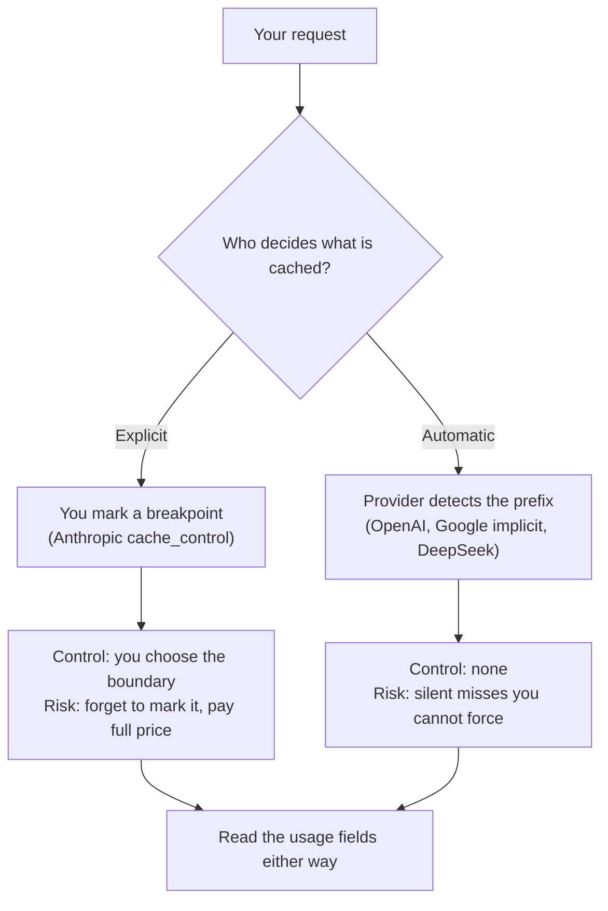

<LevelBadge level="advanced" />

<VerifyNote lastVerified="2026-09-26" source="https://platform.claude.com/docs/en/build-with-claude/prompt-caching">
Every number on this page is a published rate or threshold that providers change on their own schedule — and Google's Gemini caching prices have a scheduled increase on 2027-01-01. Re-check each provider's own docs before you budget: [Anthropic](https://platform.claude.com/docs/en/build-with-claude/prompt-caching) · [OpenAI](https://developers.openai.com/api/docs/guides/prompt-caching) · [Google](https://ai.google.dev/gemini-api/docs/caching) · [DeepSeek](https://api-docs.deepseek.com/guides/kv_cache).
</VerifyNote>

Prompt caching is the single largest cost lever in a production LLM app — routinely a 90%+ cut on the input side. Every major provider now has it. That makes it easy to assume it's the same feature everywhere, and it isn't.

The mechanism is identical: the provider reuses the processed **prefix** of your prompt instead of re-reading it. What differs is who decides, how long the cache lives, how long a prefix has to be to qualify, and — the one that bites — **whether you pay a premium to write it**. A workload tuned on one provider can quietly stop caching, or cost *more* than not caching at all, on the next.

<Callout type="objectives" items={[
  "Tell apart the two control models — explicit breakpoints vs automatic prefix detection — and what each costs you",
  "Read the cross-provider table: minimum prefix, TTL, read discount, write premium, and the usage field that proves a hit",
  "Apply the portable break-even rule: how many reuses inside the TTL before caching pays",
  "Avoid the five traps that silently kill a cache when you port a workload between providers",
  "Verify a real hit rate on any provider from the response usage, not from the docs",
]} />

If you only work on Claude, read [Prompt Caching & Cost Optimization](/docs/api/prompt-caching) first — it teaches the `cache_control` mechanism in depth. This page is the portability layer on top of it.

## The two control models

Everything in this space is one of two designs, and the design decides your failure mode.



**Explicit** (Anthropic): you attach a marker to the last stable block. Nothing is cached until you ask. You get exact control over the boundary and can place several. You also carry the bug: a prompt with no breakpoint pays full price forever, and nothing warns you.

**Automatic** (OpenAI, Google's implicit caching, DeepSeek): the provider hashes your prefix and reuses what it can. Nothing to configure, and nothing to fix when it misses. Your only lever is prompt *layout* — put stable content first — plus, on OpenAI, a routing hint.

:::tip The lever you keep in both models
Prefix order is the one control that works everywhere. **Stable content first, volatile content last.** On explicit systems it decides where your breakpoint can go; on automatic systems it's the *only* thing you control.
:::

## The cross-provider table

<VerifyNote lastVerified="2026-09-26" source="https://developers.openai.com/api/docs/guides/prompt-caching">
Read ratios below are multiples of each provider's own base input price, not absolute dollars — that's what makes them comparable. Absolute prices live on [Models & Pricing](/docs/whats-new/models-and-pricing) and each provider's pricing page.
</VerifyNote>

| | Anthropic (Claude) | OpenAI | Google (Gemini) | DeepSeek |
|---|---|---|---|---|
| **Control** | Explicit `cache_control`, up to 4 breakpoints | Automatic, prefix-matched | Implicit by default; explicit cache objects also available | Automatic, on disk |
| **Minimum prefix** | 512 tokens on Fable 5.1 / Mythos 5.1 / Opus 5.5 / Opus 5 / Fable 5 / Mythos 5; 1,024 on Sonnet 5 and Opus 4.8; 2,048–4,096 on older models | 1,024 tokens on GPT-5.6 and later; varies by request settings before that | 4,096 tokens on Gemini 3.5–3.8 Flash and 3.1 Pro Preview; 2,048 on Gemini 2.5 Flash / Pro | Not published as a token count — cache units land at request boundaries, detected common prefixes, and fixed token intervals |
| **TTL** | 5 minutes default; 1 hour optional | 30 minutes default on GPT-5.6+ via `prompt_cache_options.ttl`; earlier models use `prompt_cache_retention` — in-memory (typically 5–10 min) or 24h | Not a fixed published default for implicit caching | Automatic eviction "within a few hours to a few days" once unused |
| **Cache read** | 0.1× base input; 0.05× on Opus 5.5; 0.025× on Fable 5.1 / Mythos 5.1 | 0.1× base input | Published as a separate cached-input rate (0.1× the standard rate on Gemini 3.8 Flash through 2026-12-31) | Separate cache-hit input rate, roughly 1/30th of the miss rate on `deepseek-v4-pro` |
| **Cache write premium** | 1.25× base input for the 5-minute tier; 2× for the 1-hour tier | 1.25× base input on GPT-5.6+ | None for implicit caching; explicit caching bills **storage** at $0.50 per million tokens per hour on Gemini 3.8 Flash through 2026-12-31 | None published |
| **Proof of a hit** | `cache_read_input_tokens` and `cache_creation_input_tokens` in `usage` | Cached-token count in `usage` | `usage.total_cached_tokens` | `prompt_cache_hit_tokens` and `prompt_cache_miss_tokens` |
| **Accounting / routing hint** | Breakpoint placement | `prompt_cache_key` — separate cache accounting on GPT-5.6+, cache routing before that | — | — |

For self-hosted open models the same idea exists one layer down as **prefix caching** in the serving engine: vLLM and SGLang reuse KV-cache blocks for a shared prefix. There's no per-token price, so there's no break-even to compute — the cost is VRAM, and the win is prefill latency, not the bill. vLLM exposes it as `enable_prefix_caching`; on the V1 engine it is on by default, so on a current build you're more likely to be turning it *off* than on. See [Run models locally with Ollama](/docs/models/run-models-locally-ollama) and [A private local AI stack](/docs/models/private-local-ai-stack).

## The break-even rule

Here is the part the provider docs leave as an exercise. Caching is not free on explicit systems, and since GPT-5.6 it isn't free on OpenAI either. A write premium means **a prefix you reuse only once can cost you more than not caching it.**

Let `P` be what the prefix would cost at the base input rate, `w` the write multiplier, `r` the read multiplier, and `N` the number of calls that share the prefix **inside one TTL window**.

```text
Without caching:  N · P
With caching:     w · P  +  (N − 1) · r · P

Caching wins when:   w + (N − 1) · r  <  N
Which solves to:     N  >  (w − r) / (1 − r)
```

Plug in the published multipliers:

| Tier | w | r | Break-even N | Reuses needed |
|---|---|---|---|---|
| Anthropic 5-minute, Opus 5.5 | 1.25 | 0.05 | 1.26 | **2 calls** |
| Anthropic 5-minute, standard read tier | 1.25 | 0.1 | 1.28 | **2 calls** |
| Anthropic 1-hour | 2 | 0.1 | 2.11 | **3 calls** |
| OpenAI GPT-5.6+ | 1.25 | 0.1 | 1.28 | **2 calls** |
| Automatic, no write premium | 1 | 0.1 | 0 | **1 call** — never a loss |

So the rule of thumb is short: **two hits inside the TTL and you're ahead; make it three before you buy the 1-hour tier.** Below that, caching a prefix is a small, silent loss.

<Callout type="tip" items={[
  "N counts calls inside one TTL window, not calls per day. A prefix reused 1,000 times a day in bursts 20 minutes apart re-pays the write on every burst.",
  "The 1-hour tier is not a straight upgrade. It doubles the write premium to buy a window 12x longer — worth it only when your traffic is genuinely sparse."
]} />

### Worked example: a 50k-token prefix, 1,000 calls a day

On Claude Opus 5.5 — base input $4/MTok, 5-minute write $5/MTok, read $0.20/MTok, all from Anthropic's pricing table:

<Steps items={[
  {title: "No caching at all", body: "50,000 tokens x 1,000 calls = 50M input tokens. At $4/MTok that is $200/day, every day, for content that never changed."},
  {title: "Evenly spread traffic — one write", body: "1,000 calls a day is one call every ~86 seconds, comfortably inside the 5-minute TTL, so the cache never lapses. One write (50k at $5/MTok = $0.25) plus 999 reads (49.95M at $0.20/MTok = $9.99) is about $10.24/day — a 95% cut."},
  {title: "Bursty traffic — 100 writes", body: "Same 1,000 calls, arriving in 100 bursts with gaps longer than 5 minutes. Now you pay 100 writes (5M at $5/MTok = $25) plus 900 reads (45M at $0.20/MTok = $9) — about $34/day. Still an 83% cut, but 3.3x the even-traffic bill."},
  {title: "Decide on the 1-hour tier", body: "With 100 bursts a day averaging ~14 minutes apart, a 1-hour window collapses most of those 100 writes into a handful. The write premium doubles, so check step 3's write line against the reduced write count before you switch."}
]} />

The teaching point is step 3 versus step 2: **the same call volume, the same prefix, and a 3.3x difference in bill, decided entirely by arrival pattern against the TTL.** Arrival pattern is the variable nobody puts in the spreadsheet.

## Five traps when you port a workload

<Callout type="warning" items={[
  "TTL gap: a job that runs every 10 minutes hits on OpenAI's 30-minute default and misses on Anthropic's 5-minute default. Same code, same prompt, zero hit rate.",
  "Threshold gap: a 2,500-token system prompt caches on Claude Opus 5.5 (512-token minimum) and on GPT-5.6 (1,024) but not on Gemini 3.8 Flash (4,096). It fails silently — no error, just a full-price bill.",
  "Invalidator gap: every provider invalidates on a changed prefix, but the non-obvious triggers differ. On Anthropic, changing tool definitions, tool_choice, or (model-dependent) thinking and effort settings invalidates. On OpenAI, changing the model, tool definitions, schemas, reasoning effort, verbosity, or context compaction does.",
  "Write-premium gap: porting a low-reuse prefix from an automatic provider to an explicit one can make it more expensive than no caching. Run the break-even rule above before you mark a breakpoint.",
  "Observability gap: the usage field names share no convention. Any dashboard that parses one provider's cache fields needs a per-provider adapter, or your hit rate reads as zero after a migration."
]} />

The one Anthropic-specific mechanic with no analogue elsewhere: the cache is looked up over a **20-block lookback window** per breakpoint. A steadily growing conversation can outrun that window and stop hitting even though the prefix is unchanged — see [Prompt Caching Economics](/docs/frontiers/prompt-caching-economics) for the invalidation rules in full.

## Verify it, don't assume it

Docs describe intent; `usage` describes what you were billed. Check the real hit rate on every provider you run on.

<PromptCard title="Audit a workload's cache hit rate">{`Audit prompt caching for this codebase.

1. List every place we call an LLM API, with the provider and model.
2. For each call site, identify the prefix that is stable across calls
   and anything volatile that appears BEFORE it (timestamps, user IDs,
   reordered tool lists, freshly serialized JSON with unstable key order).
3. Report the token length of each stable prefix and compare it to that
   provider's minimum cacheable length. Flag any prefix below it.
4. Estimate the typical gap between consecutive calls sharing each prefix
   and compare it to that provider's cache TTL. Flag any gap that exceeds it.
5. Show me where we read the cache fields back from the response usage.
   If we never read them, say so plainly — that is the finding.

Do not change any code. Give me a table of call site, provider, prefix
tokens, minimum, typical gap, TTL, and the fields we read.`}</PromptCard>

Two failure signatures worth naming, because they look identical on a dashboard and have opposite fixes:

- **Cached tokens always zero** on repeated requests that should share a prefix → a volatile value sits before your stable content, or the prefix is under the minimum. Diff the *rendered* prompt bytes between two calls.
- **Cached tokens nonzero but the bill barely moved** → the prefix is caching but it's short relative to your volatile suffix. Caching is working; it isn't where your money is going. Look at output tokens and [why agents burn tokens](/docs/models/why-agents-burn-tokens) instead.

<Flashcards title="Lock in the terms" cards={[
  {front: "Explicit vs automatic caching", back: "Explicit (Anthropic): you mark a breakpoint, nothing caches until you do. Automatic (OpenAI, Gemini implicit, DeepSeek): the provider prefix-matches for you, and you cannot force a hit."},
  {front: "Write premium", back: "The surcharge on the call that populates the cache — 1.25x base input on Anthropic's 5-minute tier and on OpenAI GPT-5.6+, 2x on Anthropic's 1-hour tier. It is why a prefix reused only once can cost more cached than uncached."},
  {front: "Break-even N", back: "(w - r) / (1 - r), where w is the write multiplier and r the read multiplier. Two reuses inside the TTL for the 5-minute tiers, three for Anthropic's 1-hour tier."},
  {front: "TTL window", back: "How long an unused entry survives. Anthropic 5 minutes (1 hour optional); OpenAI 30 minutes by default on GPT-5.6+, with a 24h retention option on earlier models. N is counted inside one window, not per day."},
  {front: "Storage billing", back: "Unique to Gemini explicit caching: you pay to hold the cache per token-hour ($0.50 per million tokens per hour on Gemini 3.8 Flash through 2026-12-31), on top of the cached-input rate. Implicit caching has no storage fee."},
  {front: "Prefix caching (self-hosted)", back: "The same reuse one layer down, in vLLM or SGLang, over KV-cache blocks. No per-token price, so no break-even — you pay in VRAM and win on prefill latency."}
]} />

<Quiz title="Check yourself" questions={[
  {q: "A prefix will be reused exactly twice inside the window. Which tier is the wrong choice?", options: ["Anthropic's 5-minute tier", "Anthropic's 1-hour tier", "An automatic provider with no write premium"], answer: 1, explain: "The 1-hour tier's 2x write premium needs N > 2.11, so three reuses. At exactly two, it is a small loss. The 5-minute tier breaks even at 1.28 and the automatic provider never loses."},
  {q: "A 2,500-token system prompt cached fine on Claude and stopped caching after a port to Gemini 3.8 Flash. Most likely cause?", options: ["Gemini does not support caching", "The prefix is below Gemini's 4,096-token minimum", "The cache TTL expired mid-request"], answer: 1, explain: "Gemini 3.8 Flash requires 4,096 input tokens to be cache-eligible; Claude Opus 5.5 requires 512. A 2,500-token prefix clears one bar and not the other, with no error — just a full-price bill."},
  {q: "Same prompt, same 1,000 calls a day. Why would the bill triple?", options: ["The model changed", "Output tokens grew", "The calls arrived in bursts spaced wider than the TTL, re-paying the write each time"], answer: 2, explain: "Break-even N counts reuses inside one TTL window. Bursts spaced wider than the TTL let the entry lapse, so each burst pays the write premium again — the worked example above goes from about $10 to about $34 a day on exactly that change."},
  {q: "Cached tokens read nonzero, but the bill barely moved. What does that tell you?", options: ["The cache is broken", "The prefix is caching, but it is small next to the volatile part of your spend", "You need the 1-hour tier"], answer: 1, explain: "Nonzero cached tokens prove the cache works. If savings are small, the stable prefix just is not where the money is — look at output tokens and the volatile suffix instead."}
]} />

<Callout type="takeaways" items={[
  "Two designs, two failure modes: explicit caching fails by never being marked; automatic caching fails silently and you cannot force a hit.",
  "Caching is not automatically free. With a write premium you need N > (w - r) / (1 - r) reuses inside one TTL — two calls for the 5-minute tiers, three for Anthropic's 1-hour tier.",
  "Arrival pattern against TTL, not call volume, decides the bill: the same 1,000 daily calls cost about $10 evenly spread and about $34 in bursts on Opus 5.5.",
  "Minimum prefix length spans 512 to 4,096 tokens across providers — a prompt that caches on Claude can silently stop caching on Gemini Flash.",
  "Prove the hit rate from the response usage on every provider; the field names share no convention, so a dashboard needs a per-provider adapter.",
  "Stable content first, volatile content last. It is the one lever that works on every provider, including self-hosted prefix caching.",
]} />

## Sources & further reading

- [Anthropic: prompt caching](https://platform.claude.com/docs/en/build-with-claude/prompt-caching) — per-model minimum lengths, the 4-breakpoint limit, the 5-minute and 1-hour tiers, the write/read multipliers, the invalidation hierarchy and the 20-block lookback window.
- [OpenAI: prompt caching](https://developers.openai.com/api/docs/guides/prompt-caching) — enabled by default, the 1,024-token minimum on GPT-5.6+, `prompt_cache_options.ttl`, `prompt_cache_retention`, `prompt_cache_key`, and the 1.25x write / 0.1x read rates.
- [Google: Gemini context caching](https://ai.google.dev/gemini-api/docs/caching) and [Gemini API pricing](https://ai.google.dev/gemini-api/docs/pricing) — implicit caching on by default for 2.5 and newer, the per-model token minimums, `usage.total_cached_tokens`, and the cached-input plus storage rates with their 2027-01-01 increase.
- [DeepSeek: context caching on disk](https://api-docs.deepseek.com/guides/kv_cache) and [DeepSeek pricing](https://api-docs.deepseek.com/quick_start/pricing) — automatic for all users, where cache units land, the eviction window, and the hit/miss token split in the response.
- [vLLM: automatic prefix caching](https://docs.vllm.ai/en/latest/features/automatic_prefix_caching/) — what prefix caching does and does not speed up when you host the model yourself.
- AILmanac companions: [Prompt Caching & Cost Optimization](/docs/api/prompt-caching) · [Prompt Caching Economics](/docs/frontiers/prompt-caching-economics) · [What AI actually costs across providers](/docs/models/what-ai-costs-across-providers)

## Next

- [What AI actually costs across providers](/docs/models/what-ai-costs-across-providers) — turn these multipliers into a workload estimate you can defend
- [Why AI agents burn tokens (and how to cap the bill)](/docs/models/why-agents-burn-tokens) — the other half of the bill, which caching does not touch
- [Porting prompts across models](/docs/models/porting-prompts-across-models) — what else breaks when the same prompt moves providers
