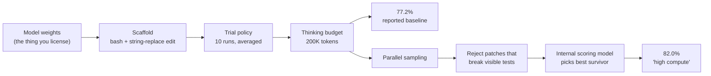

<LevelBadge level="intermediate" />

AILmanac quotes benchmark numbers on dozens of model pages. So does every launch post, every comparison table, and every "we beat the frontier" thread. Almost none of them tell you the three things that decide what a number means: **which scaffold produced it, how many trials it averages, and whether the model had already read the answers.**

Those three are not nitpicks. On one published example below, the same model weights score **77.2% and 82.0%** on the identical 500 problems — the 4.8-point gap is entirely harness. On another, frontier models that resolve **over 70%** of one coding benchmark resolve **about 23%** of a harder one built from the same kind of task. Neither gap is a lie. Both are invisible if you read only the headline.

This page is the manual for reading the number instead of the headline.

<Callout type="objectives" items={[
  "Know what a SWE-bench score literally measures — and what 'Verified' verified",
  "Separate the model from the scaffold, using a vendor's own methodology footnote as the proof",
  "Spot the contamination discount: why a harder benchmark built on unseen code cuts scores by tens of points",
  "Read 'high compute' and 'best-of-n' numbers for what they are: a different product, at a different price",
  "Apply a six-question checklist to any benchmark claim in under two minutes",
  "Know when a benchmark is saturated and has stopped telling you anything"
]} />

<VerifyNote lastVerified="2026-10-05" source="https://www.swebench.com/original.html">
Benchmark construction facts are from the maintainers' own pages: [SWE-bench](https://www.swebench.com/original.html) (2,294 instances, 12 Python repositories) and [SWE-bench Verified](https://www.swebench.com/verified.html) (500 instances, built with OpenAI). The scaffold and test-time-compute methodology is quoted from [Anthropic's Claude Sonnet 4.5 announcement](https://www.anthropic.com/news/claude-sonnet-4-5) — that model is now superseded, but the footnote is cited here as a **methodology artifact**, not as a current score; see [Models & pricing](/docs/whats-new/models-and-pricing) for what is current. SWE-bench Pro figures are from [Scale's announcement](https://scale.com/blog/swe-bench-pro) and the [SWE-Bench Pro paper](https://arxiv.org/abs/2509.16941), and are **launch-time numbers for the models tested then** — see the [live leaderboard](https://labs.scale.com/leaderboard/swe_bench_pro) for current standings. OpenAI's post [*Why we no longer evaluate SWE-bench Verified*](https://openai.com/index/why-we-no-longer-evaluate-swe-bench-verified/) blocks automated fetching; it is cited here for its title and stated position only.
</VerifyNote>

## What a SWE-bench score literally measures

Start with the mechanics, because the mechanics are the caveat.

SWE-bench was built by crawling pull requests and issues from **12 popular Python repositories**, producing **2,294 task instances**. Each instance hands a model an issue description and a repository snapshot. The model writes a patch. The patch is scored by running tests that **failed before the real fix and passed after it** — the "Fail-to-Pass" set.

So a SWE-bench score is this sentence and nothing more:

> *Given an issue text and a repo, the system produced a diff that makes a specific set of hidden tests go from red to green.*

Note everything that sentence does **not** claim. Not that the patch is the one a maintainer would merge. Not that it is readable, minimal, or safe. Not that it avoids breaking something no test covers. Not that a human would have accepted the pull request. The benchmark is a *test-suite oracle*, and test suites are an incomplete specification of correctness — which is the same reason [reward hacking in coding agents](/docs/frontiers/reward-hacking-in-coding-agents) is a live problem rather than a theoretical one.

### What "Verified" actually verified

**SWE-bench Verified** is a 500-instance subset of the original, created in collaboration with OpenAI. Human annotators reviewed each instance to confirm three things: the problem description is clear, the test patch is correct, and the task is solvable from the information given.

Read that list carefully. Verified fixed **the benchmark's own defects** — underspecified issues, broken graders, impossible tasks. It is a cleanliness guarantee, not a difficulty guarantee and not a realism guarantee. "Verified" in the name makes people hear "validated as a measure of engineering ability." It means "we checked that these 500 questions are answerable and graded correctly."

<Callout type="key">
**Verified = the questions are fair. Not: the questions are hard, representative, or unseen.** Those are three separate properties, and the next two sections are about the ones Verified never claimed.
</Callout>

## The scaffold tax: the number is a system score, not a model score

This is the most useful thing on this page, and the evidence is a vendor's own footnote.

When Anthropic published Claude Sonnet 4.5, the methodology note stated that all Claude results used **"a simple scaffold with two tools — bash and file editing via string replacements."** The headline SWE-bench Verified figure of **77.2%** was produced with **no test-time compute, averaged over 10 trials, with a 200K thinking budget, on the full 500-problem set.**

The same post reported a second number: **82.0%**, under "high compute." That configuration samples multiple attempts in parallel, discards patches that break the visible regression tests (rejection sampling), then uses an internal scoring model to pick the best survivor.

Same weights. Same 500 problems. **+4.8 points from the harness alone.**

Four consequences follow, and they generalize far past this one example.

**1. A leaderboard row is an agent, not a model.** Two submissions of the same weights with different scaffolds are different systems. When a comparison table puts Model A at 74% next to Model B at 71%, and the rows came from different harnesses, the table has measured the harnesses at least as much as the models. [Coding agent CLIs compared](/docs/models/coding-agent-clis-compared) exists because the harness is a first-class variable.

**2. "High compute" numbers are a different product at a different price.** Best-of-n with a verifier is n inference runs plus a scoring pass. If a vendor's headline figure is the high-compute one, the price you'd pay to reproduce it is roughly n× the obvious one. Always ask which number the pricing page corresponds to. [Why agents burn tokens](/docs/models/why-agents-burn-tokens) is the cost side of the same arithmetic.

**3. Rejection sampling needs a signal you may not have.** "Discard patches that break the visible regression tests" works on SWE-bench because every instance ships a test suite. On your codebase, that step is only as good as your tests. A high-compute score is partly a measurement of *the benchmark's test coverage*, transplanted into the agent as a filter.

**4. Averaging policy is load-bearing.** "Averaged over 10 trials" is an honest choice that costs points — agentic runs are high-variance, and a single best-of-10 run would read higher. A paper reporting one run and a paper reporting a 10-trial mean are not comparable, and the difference is rarely in the headline.

<Callout type="warning">
When a score has no stated scaffold, no trial count and no pass@k convention, it is not a reproducible measurement — it is marketing with a decimal point. That is true when the number flatters Claude as much as when it flatters anything else.
</Callout>

## The contamination discount

The second invisible variable: whether the model has seen the answers.

SWE-bench was assembled from public GitHub history. Public GitHub history is training data. For any benchmark built this way, there is no clean way to prove a model is solving the task rather than recalling the merged fix. OpenAI's position is now explicit in a post titled [*Why we no longer evaluate SWE-bench Verified*](https://openai.com/index/why-we-no-longer-evaluate-swe-bench-verified/).

**SWE-Bench Pro** is the structural answer. Scale built **1,865 tasks across 41 actively maintained repositories**, deliberately sourced so that training-set overlap is unlikely by construction:

| Subset | Repos | How contamination is resisted |
| --- | --- | --- |
| Public | 11 | Strong copyleft (GPL-family) licensing — legally awkward to train on |
| Held-out | 12 | Published as a benchmark, withheld from the open release |
| Commercial | 18 | Private codebases under partnership agreements; never public |

Tasks are also harder on purpose: problems that take professional engineers **hours to days**, typically spanning multiple files.

The result at launch was the number worth remembering. Top models scoring **over 70%** on SWE-bench Verified landed around **23%** on SWE-bench Pro's public set — and *lower still* on the commercial subset, where the code had demonstrably never been public:

| Model (as tested at launch) | SWE-bench Pro, public | SWE-bench Pro, commercial |
| --- | --- | --- |
| OpenAI GPT-5 | 23.3% | 14.9% |
| Claude Opus 4.1 | 23.1% | 17.8% |

Those models are long superseded — the point is not the row, it is the **shape**. Same family of task, same scoring mechanism, two design choices changed (unseen code, longer horizon), and the number falls by tens of points. The drop from public to commercial inside the *same* benchmark is the cleanest contamination signal published, because it holds task difficulty roughly fixed and varies only whether the code could have been trained on.

<Callout type="tip">
**The portable habit:** when two benchmarks measure "the same thing" and disagree by 40 points, the disagreement is the information. Ask which design choice differs — unseen data, longer horizon, stricter grader — and assume *your* codebase looks like the harder one. Your repo is private, long-lived and under-tested; it resembles the commercial subset far more than it resembles a famous Django issue from 2021.
</Callout>

## Saturation: when a benchmark stops carrying information

A benchmark where the leaders cluster at 90-something has stopped separating them. The remaining gap is dominated by grader noise, scaffold differences and the handful of instances with ambiguous specs.

The useful tell is a **paired harder variant**. In the launch table on [Ember-1](/docs/models/ember-1-reasoning-token-efficiency), the same models scoring 80–93% on SWE-bench Verified score **6.7–21.3%** on SWE-Interact, which requires asking the user questions mid-task. One of those two columns is still measuring something. When you see a 90-something headline, your first move is to find the paired number that is not 90-something — that is where the live capability gap sits, and it is the same phenomenon [the capability–reliability gap](/docs/frontiers/the-capability-reliability-gap) describes from the deployment side.

### And on the human-preference leaderboards

Arena-style rankings have the mirror-image problem. Pairwise human voting reliably rewards answers that are **longer and more heavily formatted**, independent of whether they are more correct. This is why LMArena ships a separate **style-controlled** view that statistically adjusts for response length and markdown structure. If you cite an arena rank, cite which view it came from — the two orderings are not the same, and the un-controlled one partly measures verbosity.

## Six questions, two minutes

<Steps items={[
  {
    title: "Which benchmark, and which variant?",
    body: "SWE-bench, Verified, Lite, Multimodal, Multilingual and Pro are different datasets with different sizes and difficulties. A number without a variant is unreadable. 'SWE-bench 74%' could mean four incompatible things."
  },
  {
    title: "What scaffold produced it?",
    body: "Which tools, how many turns, what thinking budget, any retrieval? If the post does not say, the number is not reproducible. Anthropic's two-tool bash-plus-string-replace disclosure is the standard to hold everyone to — including Anthropic."
  },
  {
    title: "One run, or an average — and pass@1 or best-of-n?",
    body: "Agentic evals are high-variance. A 10-trial mean and a single lucky run differ by several points on the same system. 'High compute', 'best-of-n', 'with verifier' and 'parallel test-time compute' all mean: this costs n times more than you think."
  },
  {
    title: "Could the answers be in the training data?",
    body: "Built from public GitHub history before the model's cutoff? Assume partial recall. Prefer benchmarks with held-out or private subsets, and weight the private-subset score highest — it is the closest proxy for your own unseen repository."
  },
  {
    title: "Who ran it?",
    body: "Vendor-run on vendor-chosen benchmarks is a legitimate signal and a weak one. Look for the same model on an independent leaderboard with a fixed harness. Where vendor and independent numbers disagree, the delta is usually scaffold."
  },
  {
    title: "Is it saturated, and what is the paired hard number?",
    body: "If the top five are within three points near the ceiling, the ranking is noise. Find the harder paired variant — interactive, long-horizon, private-repo — and read that column instead."
  }
]} />

## Interrogate a launch post

Paste a vendor's benchmark section in and make the model do step 2 for you. The point is not the summary; it is the **explicitly missing** list.

<PromptCard title="Benchmark claim audit">
{`You are auditing a benchmark claim for reproducibility. Here is the benchmark section of a model launch post:

<launch_post>
[PASTE THE BENCHMARK SECTION AND ALL FOOTNOTES]
</launch_post>

For each benchmark number reported, produce a row with:
- benchmark name and exact variant (e.g. SWE-bench Verified, 500 instances)
- the score, and whether it is pass@1, best-of-n, or an average of k trials
- the scaffold: tools available, turn limit, thinking/reasoning budget, retrieval
- whether any test-time-compute technique was used (parallel sampling, rejection
  sampling against visible tests, a verifier or scoring model)
- who ran the eval: the vendor, or an independent party with a fixed harness

Then output two lists:
1. NOT STATED — every field above that the post does not disclose.
2. COMPARABILITY RISKS — specific reasons a reader could not place these numbers
   next to another vendor's numbers for the same benchmark.

Do not estimate or infer missing values. If the post does not say it, it goes in
list 1. Quote the footnote text you relied on for each field you did fill in.`}
</PromptCard>

Run the same prompt against two vendors' posts for the same benchmark and the comparability risks usually write the comparison table's caveat row for you.

## Common mistakes

| Mistake | Why it misleads | What to do instead |
| --- | --- | --- |
| Treating a leaderboard row as a model score | It is a model **plus** scaffold, trial policy and compute budget | Compare rows only within one fixed harness, or compare whole systems honestly |
| Putting vendor A's high-compute number next to vendor B's pass@1 | One is n inference runs with a verifier; the other is one run | Match the compute convention, or label the asymmetry |
| Reading "Verified" as "validated as realistic" | It verified that the questions are answerable and correctly graded | Use it as a clean dataset, not as evidence of real-world ability |
| Quoting a near-ceiling score as evidence of a lead | Saturated benchmarks rank noise | Cite the paired harder variant |
| Assuming a public-GitHub benchmark is uncontaminated | The data predates the cutoff and is in the crawl | Prefer held-out or private subsets; weight those highest |
| Extrapolating a benchmark score to your repo | Your code is private, long-lived and thinly tested | Build a small eval on your own tasks — see [Evaluating your AI agent](/docs/playbooks/evaluating-agents) |
| Citing an arena rank without the view | Un-controlled pairwise voting partly rewards length and formatting | Say whether it is the style-controlled ranking |

The last row is the one that matters most in practice. A published benchmark answers "is this model good at this benchmark." The question you actually have is "is this model good at my work," and the only instrument for that is an eval on your own tasks. [Evals](/docs/power-user/evals) covers building one; twenty of your real tickets, graded by a rubric you wrote, outranks every leaderboard on this page for your decision.

<Quiz questions={[
  {
    q: "A vendor reports 82.0% on SWE-bench Verified under 'high compute', described as parallel sampling, discarding patches that break visible regression tests, then an internal scoring model picking the best survivor. Their simple-scaffold number on the same 500 problems is 77.2%. What does the 4.8-point gap measure?",
    options: [
      "A better version of the model weights",
      "The harness: extra inference runs plus a verifier, not a change in the model",
      "Measurement noise between two runs",
      "The difference between SWE-bench and SWE-bench Verified"
    ],
    answer: 1,
    explain: "Same weights, same 500 problems. The gap is entirely test-time compute — n parallel attempts, rejection sampling against the visible tests, and a scoring model to select. It is a different product at roughly n times the cost, and it depends on a test signal your own repo may not have."
  },
  {
    q: "On SWE-bench Pro at launch, Claude Opus 4.1 resolved 23.1% of the public subset but 17.8% of the commercial subset — private codebases that were never public. Why is the public-to-commercial drop the more informative of the two numbers?",
    options: [
      "The commercial tasks are much longer, so the drop measures context length",
      "It holds task design roughly fixed and varies mainly whether the code could have been in training data",
      "The commercial subset uses a stricter grader than the public one",
      "Private repos have worse test coverage, so scoring is harsher"
    ],
    answer: 1,
    explain: "Both subsets are the same benchmark, same construction, same scoring. The main thing that changes is whether the repository could plausibly have been crawled into training data — which makes the gap the cleanest published contamination signal, and the commercial score the better proxy for your own private repo."
  },
  {
    q: "What did the human annotation behind SWE-bench Verified actually guarantee?",
    options: [
      "That the 500 tasks are representative of real production engineering work",
      "That the 500 tasks are harder than the rest of SWE-bench",
      "That problem descriptions are clear, test patches are correct, and the tasks are solvable from the information given",
      "That none of the 500 tasks appear in any model's training data"
    ],
    answer: 2,
    explain: "Verified fixed the benchmark's own defects — underspecified issues, incorrect graders, unsolvable tasks. It is a cleanliness guarantee. It says nothing about difficulty, realism, or contamination, and all three are separate properties."
  }
]} />

<Flashcards cards={[
  { front: "SWE-bench, in one line", back: "2,294 task instances crawled from pull requests and issues across 12 popular Python repositories. A model is given an issue and a repo snapshot; its patch is scored by whether the 'Fail-to-Pass' tests go from red to green." },
  { front: "What SWE-bench Verified verified", back: "500 instances from the original, reviewed with OpenAI by human annotators to confirm the problem description is clear, the test patch is correct, and the task is solvable. A cleanliness guarantee — not difficulty, realism, or freedom from contamination." },
  { front: "The scaffold tax", back: "A leaderboard row is a model PLUS its harness. Anthropic's published methodology shows the same weights at 77.2% (simple two-tool scaffold, 10-trial average, no test-time compute) and 82.0% ('high compute': parallel sampling, rejection against visible tests, internal scoring model) on the identical 500 problems." },
  { front: "What 'high compute' / best-of-n really costs", back: "n inference runs plus a verification pass. If the headline is the high-compute number, reproducing it costs roughly n times the obvious price — and the rejection step needs a test signal your own codebase may not have." },
  { front: "SWE-bench Pro", back: "1,865 tasks across 41 actively maintained repos, split 11 public (strong copyleft) / 12 held-out / 18 commercial under partnership agreements. Tasks take professional engineers hours to days and usually span multiple files. Built so training-set overlap is unlikely by construction." },
  { front: "The contamination discount", back: "At launch, models above 70% on SWE-bench Verified scored around 23% on SWE-bench Pro's public set and lower on its commercial set (GPT-5 23.3% → 14.9%; Opus 4.1 23.1% → 17.8%). The within-benchmark public-to-commercial drop is the cleanest contamination signal published." },
  { front: "Benchmark saturation — the tell", back: "Leaders clustered near the ceiling within a few points means the ranking is noise. Find the paired harder variant: the models at 80–93% on SWE-bench Verified score 6.7–21.3% on SWE-Interact. The non-saturated column is the one still carrying information." },
  { front: "Arena style control", back: "Pairwise human voting rewards longer, more heavily formatted answers independent of correctness, so LMArena publishes a style-controlled ranking that adjusts for length and markdown. Always state which view a cited rank came from." },
  { front: "The six questions", back: "Which variant? What scaffold? One run or averaged, pass@1 or best-of-n? Could the answers be in training data? Who ran it? Is it saturated — and what is the paired hard number?" }
]} />

<Callout type="takeaways" items={[
  "A benchmark score is a system score. Model + scaffold + trial policy + compute budget. The published 77.2% vs 82.0% gap on identical problems is the proof.",
  "'Verified' means the questions are fair, not that they are hard, realistic, or unseen. Three separate properties, one reassuring word.",
  "Public-GitHub benchmarks cannot prove the model is not recalling. Weight held-out and private subsets highest — they are the closest proxy for your repository.",
  "A 40-point disagreement between two benchmarks measuring 'the same thing' is the information, not an error. Find the design choice that differs.",
  "Near-ceiling scores rank noise. Always read the paired harder variant instead.",
  "No published benchmark answers your actual question. Twenty of your own tickets with a rubric beats every leaderboard here."
]} />

## Next

- [Evaluating your AI agent](/docs/playbooks/evaluating-agents) — the playbook for building the eval that actually answers your question, since no public benchmark will
- [Is the model nerfed? How to actually tell](/docs/models/is-the-model-nerfed) — the same measurement discipline aimed at the other common question, with a paired-design protocol you can run
- [Coding agent CLIs compared](/docs/models/coding-agent-clis-compared) — the harness as a first-class variable, which is exactly what the scaffold tax says it is

## Sources & further reading

- [SWE-bench](https://www.swebench.com/original.html) — construction (2,294 instances, 12 Python repositories) and the Fail-to-Pass scoring mechanism
- [SWE-bench Verified](https://www.swebench.com/verified.html) — the 500-instance subset built with OpenAI, and exactly what the human annotation checked
- [Introducing Claude Sonnet 4.5 — Anthropic](https://www.anthropic.com/news/claude-sonnet-4-5) — the methodology footnote quoted here: two-tool scaffold, 10-trial average, 200K thinking budget, and what "high compute" adds
- [SWE-Bench Pro: Can AI Agents Solve Long-Horizon Software Engineering Tasks? — arXiv 2509.16941](https://arxiv.org/abs/2509.16941) — 1,865 tasks, 41 repositories, the public / held-out / commercial split
- [SWE-Bench Pro: Raising the Bar for Agentic Coding — Scale](https://scale.com/blog/swe-bench-pro) — the contamination strategy (copyleft plus private commercial code) and the launch-time public-vs-commercial results
- [SWE-Bench Pro leaderboard — Scale](https://labs.scale.com/leaderboard/swe_bench_pro) — current standings, for when the launch-time numbers above are history
- [Why we no longer evaluate SWE-bench Verified — OpenAI](https://openai.com/index/why-we-no-longer-evaluate-swe-bench-verified/) — cited for its stated position; the page blocks automated retrieval
- [LMArena leaderboard](https://lmarena.ai/leaderboard) — compare the default and style-controlled views of the same models
- Related: [Evals](/docs/power-user/evals) · [Reward hacking in coding agents](/docs/frontiers/reward-hacking-in-coding-agents) · [The capability–reliability gap](/docs/frontiers/the-capability-reliability-gap) · [Why agents burn tokens](/docs/models/why-agents-burn-tokens)
