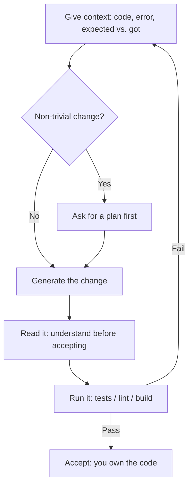

<LevelBadge level="all" />

<Callout type="objectives" items={["Know what AI coding is genuinely great at — explain, generate, refactor, debug, translate, review", "Run the golden loop: context in, plan, generate, read, run — and loop failures back as fresh context", "Reach for prompts that pull their weight instead of vague one-liners", "Internalize the two hard rules: verify by running, and never paste secrets"]} />

Whether you're learning to code or shipping production software, AI changes the loop. The winners treat it as a fast, knowledgeable pair — and **verify everything it produces**.

## What it's great at

- **Explain** unfamiliar code or errors in plain language.
- **Generate** boilerplate, tests, and first drafts of functions.
- **Refactor** for clarity, and **debug** by reasoning about a stack trace.
- **Translate** between languages/frameworks.
- **Review** a diff for bugs and smells.

For real codebases, do this *in* your repo with [Claude Code](/docs/claude-code/what-is-claude-code), which can read files, run tests, and edit with your approval.

## The golden loop

1. **Give context** — the relevant code, the error, what you expected vs. got. Vague in, vague out.
2. **Ask for a plan** on non-trivial changes before edits ([Plan Mode](/docs/claude-code/plan-mode)).
3. **Generate** the change.
4. **Read it** — understand before you accept. You own the code.
5. **Run it** — tests/lint/build. *Never trust "this works" without running it.*

The step that separates good results from bad ones is the arrow back to the top: when a test fails, you don't patch blindly — you feed the failure back in as fresh context.

## Prompts that pull their weight

<PromptCard title="Explain code + spot the edge cases">{`Explain what this function does and any edge cases it mishandles: {code}`}</PromptCard>

<PromptCard title="Generate tests">{`Write tests for {function}. Cover the happy path and the edge cases. {code}`}</PromptCard>

<PromptCard title="Debug from a stack trace">{`This throws {error}. Here's the code and stack trace. Find the root cause and propose a minimal fix. {context}`}</PromptCard>

## Hard rules

:::warning Verify, and protect your secrets
- **Run and review** generated code — it can be subtly wrong or invent APIs that don't exist.
- **Never paste secrets/keys** into a prompt ([Privacy](/docs/foundations/privacy)).
- For agentic/automated coding, lock down [permissions](/docs/claude-code/permissions) and read [Securing Agents](/docs/security/securing-agents).
:::

<Quiz title="Check yourself" questions={[{q: "In the golden loop, what most separates good AI-coding results from bad ones?", options: ["Always using the largest model available", "The arrow back to the top: feeding a failed test's output back in as fresh context instead of patching blindly", "Accepting the first generation to save time"], answer: 1, explain: "The loop is the method. When a test fails you don't guess at a patch — you hand the failure back as new context so the next attempt is grounded in what actually went wrong."}, {q: "Why read generated code before you accept it?", options: ["Reading is what triggers the test runner", "It can be subtly wrong or invent APIs that don't exist — and you own the code either way", "The SDK refuses to run code you haven't opened"], answer: 1, explain: "AI output looks confident even when it's wrong, and it will occasionally call functions that don't exist. Reading it is how you catch that before it ships — and accountability for the code is yours regardless of who typed it."}, {q: "Which of these should never go into a prompt?", options: ["The error message and stack trace", "Secrets or API keys", "What you expected versus what actually happened"], answer: 1, explain: "Errors, stack traces, and expected-vs-actual are exactly the context that improves results. Secrets and keys are the one thing to keep out — paste them and you've leaked them."}]} />

<Callout type="takeaways" items={["Treat AI as a fast, knowledgeable pair — then verify everything it produces by actually running it", "Context in, quality out: give the code, the error, and expected-vs-actual, never a vague ask", "Ask for a plan before non-trivial edits so you review the approach before any code changes", "Read generated code before accepting — it can be subtly wrong or invent APIs that don't exist", "Never paste secrets or keys into a prompt, and lock down permissions before letting an agent code on its own"]} />

## Next

- [What Claude Code Is](/docs/claude-code/what-is-claude-code)
- [Customize Claude Code for a Real Repo](/docs/walkthroughs/customize-claude-code)
- [Your First API Call](/docs/api/first-call)
