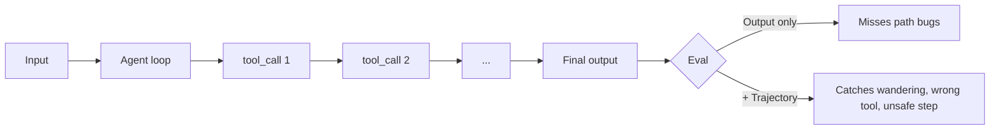

<LevelBadge level="advanced" />

<VerifyNote lastVerified="2026-07-24" source="https://platform.claude.com/docs/en/test-and-evaluate/develop-tests">
Anthropic's evaluation guide is the source of truth for methodology (SMART criteria, exact-match, LLM-graded Likert/binary). Agent-trajectory eval is an emerging discipline — treat framework names as illustrative and confirm APIs at each vendor's docs.
</VerifyNote>

<Callout type="objectives" items={["Understand why agent evals differ from prompt evals — trajectory matters, not just the final answer", "Build a golden set of 20–100 real cases with clear pass criteria", "Score four layers: tool-call correctness, trajectory quality, task success, production drift", "Use LLM-as-judge safely: rubric first, calibrate against humans, spot-check verdicts", "Ship an eval that runs in CI and fails a bad change before it reaches users"]} />

An **agent eval** answers a harder question than "did the prompt return the right words?" It asks: *did a model running in a loop pick the right tools, in the right order, with the right arguments, arrive at the right outcome — and stay within budget and safety bounds?*

Skip this step and you'll ship a "helpful" agent that quietly regresses every time you tweak the system prompt.

## Why agents need their own evals

A single-prompt eval scores one input → one output. An agent produces a **trajectory**: a chain of reasoning, tool calls, intermediate observations, and revisions across many turns. Two failure modes make this hard:

- **Right answer, wrong path.** The agent stumbles onto the correct output after wasteful loops, unsafe actions, or lucky guesses. Final-answer-only evals mark this a pass; production won't.
- **Wrong answer, plausible path.** Every step looks reasonable in isolation, but the agent misused a tool, ignored a constraint, or hallucinated an intermediate fact. You need to look at the trace, not just the reply.



## The four eval layers

Layer them cheapest-first so a bad change fails fast without waiting for expensive graders.

<Steps items={[
  {title: "Layer 1 — Tool-call correctness (deterministic)", body: "For each expected step, check tool name matches, required parameters are present, and types validate. Pure code, milliseconds, no model needed. Catches 'called search when it should have called write_file' before anything else runs."},
  {title: "Layer 2 — Trajectory quality (rubric + LLM-judge)", body: "Score the full trace: did the agent take a sensible path, or wander, loop, or backtrack? Number of steps vs. minimum needed, redundant calls, retries after tool errors, whether it stopped when done. Use an LLM judge with an explicit rubric here."},
  {title: "Layer 3 — Task success (end-to-end)", body: "Did the goal get met? Deterministic where possible (schema valid, file written, test passes), LLM-judged where fuzzy (summary faithful, answer helpful). This is your headline number."},
  {title: "Layer 4 — Production drift & safety", body: "In prod, sample real traces and re-grade a slice. Watch intervention rate (how often a human had to step in), refusal rate, and cost per successful task. When these shift, your model, tools, or inputs changed underneath you."}
]} />

## Metrics that predict value

Not every metric belongs on the dashboard. These five drive shipping decisions in 2026:

| Metric | What it measures | Why it matters |
|---|---|---|
| **Task success rate** | % of golden-set cases the agent finishes correctly | The headline. Everything else is diagnostic. |
| **Cost per successful task** | $ / passing case (tokens in + out, tool costs) | Success at 10× the cost is a regression. |
| **Latency (p50 / p95)** | Wall-clock per task, tail included | p95 is what real users feel — averages lie. |
| **Tool-call accuracy** | % of expected tool calls with correct name + args | Predicts trajectory quality; cheap to compute. |
| **Intervention rate** | % of tasks needing human takeover in prod | The autonomy number. Rising = trust falling. |

Track them together — one moving without the others is usually a leading signal, not noise.

## Build the golden set

<Steps items={[
  {title: "Mine real inputs", body: "Pull 20–100 tasks from actual usage (logs, support tickets, user requests). Cover the frequent easy path, the tricky middle, and the edge cases that already bit you."},
  {title: "Write pass criteria per case", body: "For each: what does 'done' look like? Exact expected output, required facts, valid JSON schema, files that must exist, or a rubric for fuzzy cases. If you can't write the criterion, the case is unusable — cut or clarify it."},
  {title: "Annotate the ideal trajectory", body: "For a subset, sketch the tool sequence a good agent would take. This is what Layer 1 checks against."},
  {title: "Freeze it, version it", body: "Commit the set to your repo. Never edit a case in place — add v2 alongside v1 so score history stays comparable."},
  {title: "Grow it from failures", body: "Every prod bug becomes a new eval case before you fix it. That's how the set stays predictive instead of decaying."}
]} />

## LLM-as-judge — cheap, fast, but calibrate it

Grading fuzzy outputs by hand doesn't scale. A capable model reading against an explicit rubric does — Anthropic's own [eval methodology guide](https://platform.claude.com/docs/en/test-and-evaluate/develop-tests) recommends this pattern for tone, faithfulness, helpfulness, and safety.

Judges have well-documented biases: they prefer longer answers, the first option shown, and outputs that echo their own phrasing. Three habits keep them honest:

- **Rubric, not vibes.** "Rate helpfulness 1–5" is useless. Anchor every point on the scale to observable behavior.
- **Calibrate on a human-labeled sample.** Have humans grade 30–50 cases; measure judge-vs-human agreement (aim for Cohen's κ ≥ 0.6). If it disagrees, tighten the rubric.
- **Use a different model as judge.** Grading with the same model that produced the output leaks bias in both directions.
- **Spot-check verdicts weekly.** Read 10 random judge scores and their reasoning. It's the cheapest way to catch drift.

<PromptCard title="LLM-as-judge rubric template">{`You are grading an AI assistant's response against a rubric. Be strict. Cite exact evidence from the response.

<task>{task}</task>
<response>{response}</response>

Rubric (rate 1–5 per dimension):
- Task completion: 1 = ignored task; 3 = partial; 5 = fully done, no gaps.
- Faithfulness: 1 = contains false claims; 3 = mostly grounded, one soft claim; 5 = every claim traceable to input/tools.
- Efficiency: 1 = wandered/looped; 3 = extra steps; 5 = minimum viable path.

Output JSON only:
{"task_completion": N, "faithfulness": N, "efficiency": N, "evidence": "<quote>", "verdict": "pass"|"fail"}`}</PromptCard>

<PromptCard title="Trajectory review prompt (Layer 2)">{`You are auditing an AI agent's tool-call trajectory. The goal was: {goal}
Expected minimum steps: {n_min}

<trajectory>
{list of tool_name(args) -> result, in order}
</trajectory>

Answer in JSON:
{"steps_taken": N, "wasted_steps": N, "wrong_tool_calls": [<indices>], "unsafe_actions": [<indices>], "verdict": "pass"|"fail", "reason": "<one sentence>"}`}</PromptCard>

<PromptCard title="Adversarial case generator (grow the set)">{`Generate 5 new eval cases that are likely to break an agent whose current failures cluster around: {failure_pattern}.

For each case give: input, expected output OR pass criterion, ideal tool sequence, and why this case is hard.

Return YAML.`}</PromptCard>

## CI gate: fail the bad change before it ships

The eval only pays off when it blocks regressions automatically. Wire it into CI as a check on every prompt / model / tool change:

```python
# tests/eval_gate.py — runs on every PR
import json, sys
from anthropic import Anthropic
from my_agent import run_agent

client = Anthropic()
golden = json.load(open("evals/golden.v3.json"))

results = []
for case in golden:
    trace = run_agent(case["input"])
    layer1 = tool_calls_match(trace, case["expected_tools"])   # deterministic
    layer3 = judge(client, case, trace.final_output)           # LLM rubric
    results.append({"id": case["id"], "layer1": layer1, "layer3": layer3["verdict"]})

pass_rate = sum(r["layer3"] == "pass" for r in results) / len(results)
tool_acc  = sum(r["layer1"] for r in results) / len(results)

# Gates — tighten over time
assert pass_rate >= 0.85, f"Task success dropped to {pass_rate:.0%}"
assert tool_acc  >= 0.90, f"Tool-call accuracy dropped to {tool_acc:.0%}"
print(f"PASS: task={pass_rate:.0%} tools={tool_acc:.0%}")
```

Store per-run scores so you can chart the trend. A drop of 3+ points between merges is a real regression, not noise.

<Callout type="warning" title="Anti-patterns that make evals under-deliver" items={["Judging the final answer only — misses every trajectory bug. Score Layers 1 and 2 too.", "Static golden set — if it doesn't grow with every prod failure it stops predicting prod. Budget time monthly.", "Same model as agent and judge — bias in both directions. Rotate to a different model for grading.", "No cost or latency in the gate — a prompt tweak that adds 8 tool calls can 'pass' the eval while 10×-ing the bill.", "Vibes-only scoring — 'feels better' is not a metric. If you can't diff two numbers, you can't ship confidently."]} />

<Callout type="takeaways" items={["Agents produce trajectories, not answers — evaluate the path, not only the outcome", "Layer cheapest-first: tool-call correctness → trajectory quality → task success → production drift", "The five metrics that ship decisions: task success rate, cost per success, p50/p95 latency, tool-call accuracy, intervention rate", "LLM-as-judge scales, but only with an explicit rubric, a different model, and calibration against human labels", "A golden set that doesn't grow from prod failures stops predicting prod — grow it monthly", "Wire the eval into CI as a hard gate — the check that catches a regression before users do"]} />

## Check yourself

<Quiz title="Check yourself" questions={[
  {
    q: "Why do agents need trajectory evals, not just final-answer evals?",
    options: [
      "Final-answer evals are too slow to run in CI",
      "An agent can arrive at the right answer via wandering or unsafe steps (right answer, wrong path) — and produce a plausible-looking path to a wrong answer",
      "Trajectory evals are the only kind that support LLM-as-judge",
      "Final-answer evals only work for classification tasks"
    ],
    answer: 1,
    explain: "Two failure modes hide from output-only scoring: right answer via a bad path (marked pass, will regress in prod) and wrong answer via a plausible path (fails silently). You need to score the trajectory as well as the outcome."
  },
  {
    q: "You're layering your evals. Which order is cheapest-to-most-expensive and correct?",
    options: [
      "LLM-judged task success → deterministic tool-call checks → production drift → trajectory rubric",
      "Deterministic tool-call correctness → trajectory quality (LLM-judge) → task success → production drift",
      "Production drift → task success → trajectory rubric → tool-call checks",
      "Trajectory rubric → task success → tool-call checks → production drift"
    ],
    answer: 1,
    explain: "Layer 1 (deterministic tool-call checks) runs in milliseconds with no model, so it fails bad changes fast. Then LLM-graded trajectory and task-success layers, then production-drift monitoring."
  },
  {
    q: "Which pair of habits actually keeps LLM-as-judge trustworthy over time?",
    options: [
      "Grade with the same model as the agent, and rewrite the rubric each run",
      "Use a rubric with observable anchors, and calibrate the judge against a human-labeled sample",
      "Prefer vibes-based prompts to avoid over-specifying, and never spot-check verdicts",
      "Always use the largest available model as judge, no calibration needed"
    ],
    answer: 1,
    explain: "Anchored rubrics remove the judge's freedom to invent criteria, and human calibration (Cohen's κ ≥ 0.6 is a common target) proves the judge agrees with your ground truth. Using a different model and spot-checking weekly complete the picture."
  },
  {
    q: "Your CI gate passes task success rate but latency and cost per task doubled. What's the right call?",
    options: [
      "Ship it — task success is the headline metric",
      "Fail the gate: the five shipping metrics move together, and a 2× cost/latency change is a regression even if pass rate held",
      "Rerun the eval — the numbers must be noise",
      "Loosen the pass-rate threshold to justify shipping"
    ],
    answer: 1,
    explain: "The five metrics ship decisions together. A prompt tweak that keeps pass rate flat while 2×'ing cost or latency is exactly the failure the gate exists to catch — bill and UX regressions hit users just as hard as accuracy drops."
  }
]} />

<Flashcards cards={[
  {front: "Trajectory (in agent evals)", back: "The full ordered chain of tool calls, arguments, observations, and reasoning steps an agent takes across a task — the thing you evaluate in addition to the final output."},
  {front: "Golden set", back: "A frozen, versioned collection of 20–100 real tasks with explicit pass criteria (and, for a subset, ideal trajectories) that every prompt/model/tool change is scored against."},
  {front: "Tool-call accuracy", back: "% of expected tool invocations where the name matches and required parameters validate. Deterministic, cheap, and a strong leading indicator of trajectory quality."},
  {front: "LLM-as-judge", back: "Grading pattern where a (different) capable model scores outputs against an explicit rubric. Fast and scalable, but must be calibrated against human labels to be trustworthy."},
  {front: "Intervention rate", back: "% of production tasks that required a human to take over. Rising intervention rate = falling autonomy, even when offline scores look fine."},
  {front: "Cost per successful task", back: "Total token + tool cost divided by the number of tasks the agent completed correctly. Catches regressions where 'still works' hides '10× more expensive'."},
  {front: "CI eval gate", back: "An automated check on every PR that runs the golden set and hard-fails the build below thresholds (e.g. pass rate < 85%, tool accuracy < 90%). Blocks silent regressions before merge."}
]} />

## Next

- [Building Agents on the API](/docs/api/building-agents) · [Evals (foundations)](/docs/foundations/evals)
- [Securing Agents & Tools](/docs/security/securing-agents) · [Hallucinations & How to Reduce Them](/docs/foundations/hallucinations)
- [Headless & Agent SDK](/docs/claude-code/headless-and-agent-sdk) · [Managed Agents](/docs/api/managed-agents)
