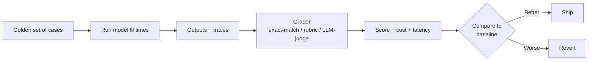

<LevelBadge level="intermediate" />

<VerifyNote lastVerified="2026-07-25" source="https://platform.claude.com/docs/en/test-and-evaluate/develop-tests">
Methodology (test-driven prompt/agent design, SMART criteria, exact-match vs. LLM-graded rubric) follows Anthropic's official "Develop tests" guide. The concepts here are model-agnostic and apply equally to OpenAI, Gemini, and open-weight models.
</VerifyNote>

<Callout type="objectives" items={[
  "Understand what an eval actually is — a repeatable test that scores model output against a fixed rubric",
  "Know when a vibe check is fine and when only an eval will do",
  "Recognize the four eval types you will actually use, and when each applies",
  "Build a minimum viable eval — 20 cases, one rubric, one script — in an afternoon",
  "Avoid the six traps that make evals lie to you"
]} />

If you take one habit from this site, take this one. Prompt-craft, model choice, tool wiring — none of it compounds until you can *measure* whether a change made the system better or worse. Once you can, every future decision — pick Sonnet 5 or Fable 5, add a tool, tighten a system prompt, raise the thinking budget — becomes a five-minute check instead of a week of argument.

Evals are how you replace "it feels smarter" with a number that survives disagreement.

## What an eval actually is

An **eval** is three things bolted together:

1. A **fixed set of inputs** — usually 20 to a few hundred cases drawn from real usage.
2. A **rubric or ground truth** — for each case, what does "correct" look like?
3. A **scoring loop** — a script that runs the model on every case, compares output to the rubric, and reports pass/fail (or a graded score) plus cost and latency.

Everything else — dashboards, LLM judges, CI gates — is optional scaffolding around that core.

Rerun that loop on every change. That is the whole game.

## When a vibe check is enough — and when it isn't

Not every prompt needs an eval. Use judgment.

| Situation | Vibe check OK | Build an eval |
|---|---|---|
| One-off script for yourself | Yes | — |
| A prompt you'll ship to five colleagues | Yes (light) | If reliability matters |
| Anything user-facing, at any scale | — | Yes |
| Anything running unattended (agents, batch jobs) | — | Yes |
| Any decision to swap models or providers | — | Yes (or you're guessing) |
| Anything where a wrong answer has cost (money, safety, legal) | — | Yes (non-negotiable) |

Rule of thumb: **the first time you catch yourself saying "does the new version *feel* better?", stop and build the eval.** The next ten changes will pay for it.

## The four kinds of eval you will use

<Steps items={[
  {title: "Exact-match / structural checks", body: "The output must equal a specific string, match a regex, parse as valid JSON, or match a schema. Cheap, fast, unambiguous. Use for classification, extraction, code that must compile, tool calls, structured output."},
  {title: "Rubric grading (human or LLM judge)", body: "The output is scored against an explicit rubric — 'is the summary faithful to the source? Y/N', 'is the tone appropriate? 1–5 with anchors'. Use for writing, summaries, explanations, anywhere quality is fuzzy."},
  {title: "Reference-based comparison", body: "Compare against a known good answer using semantic similarity, BLEU/ROUGE, or an LLM asked 'does A convey the same information as B?'. Use for translation, paraphrase, retrieval-augmented answers."},
  {title: "Trajectory / process eval", body: "For agents: did it call the right tools in a sensible order, without wandering or unsafe steps? Score the trace, not just the final answer. See the agent-specific playbook for the mechanics."}
]} />

Real systems mix these — a JSON schema check gates a rubric grade, which gates an end-to-end trajectory check. Cheap layers fail fast; expensive layers only run when cheap ones pass.

## Build your minimum viable eval

You can have a working eval in an afternoon. Skip everything else on this list first.

<Steps items={[
  {title: "Grab 20 real inputs", body: "From logs, support tickets, or your own use. Cover the common easy path, the tricky middle, and two or three cases that already burned you. Twenty is enough to detect a real regression; hundreds are for later."},
  {title: "Write pass criteria per case", body: "One sentence: 'output must include the customer's order number and a refund status of pending/approved/denied' — or 'output must be valid JSON matching schema X'. If you can't write it, the case isn't testable — cut or clarify it."},
  {title: "Write a 50-line script", body: "For each case: send the input to the model, capture output and token counts, run the grader, record pass/fail plus cost. A CSV of results is fine — you don't need a UI."},
  {title: "Establish a baseline", body: "Run today's prompt against the set. Record the score. That is your bar. Every future change is measured against it."},
  {title: "Gate one workflow on it", body: "Wire the script into CI or a pre-deploy check. Any change that drops the score fails the build. Now the eval defends itself — nobody needs to remember to run it."}
]} />

That's it. Everything after this — LLM judges, calibration, dashboards, cost tracking, per-metric slicing — is amortized over an eval that already exists and already blocks bad changes.

## The six traps that make evals lie

<PromptCard title="Trap 1 — The golden set is fake">
Cases invented by the team, not sampled from real usage. The eval passes; users hit inputs the eval never saw.

**Fix:** Mine cases from actual logs. Every prod bug becomes a new case *before* you fix it.
</PromptCard>

<PromptCard title="Trap 2 — The rubric is vibes">
"Rate quality 1–5" without anchors. Two graders — human or LLM — disagree wildly, and the score bounces on rerun.

**Fix:** Anchor each point on the scale to observable behavior. "5 = every claim traceable to the source; 3 = one unsupported claim; 1 = three or more unsupported claims."
</PromptCard>

<PromptCard title="Trap 3 — The LLM judge isn't calibrated">
You trust a model to grade because it's cheap. Judges have known biases: they prefer longer answers, first options, and outputs echoing their own phrasing.

**Fix:** Have humans grade 30–50 cases. Measure judge-vs-human agreement (Cohen's kappa at least 0.6). Randomize option order. Spot-check verdicts weekly.
</PromptCard>

<PromptCard title="Trap 4 — The eval overfits">
You keep tweaking the prompt until the score maxes out — on the same 20 cases. Prod tanks.

**Fix:** Split into dev and holdout sets. Never look at holdout scores while iterating. Grow the set from real failures, not synthetic variations.
</PromptCard>

<PromptCard title="Trap 5 — One number, no cost">
The score goes up; the token bill doubles. Or latency jumps to eight seconds. You "shipped an improvement" that regressed the product.

**Fix:** Every run reports score, cost per case, and p50/p95 latency together. A change is only "better" if it doesn't quietly regress two of the three.
</PromptCard>

<PromptCard title="Trap 6 — Model version drift">
You lock the prompt but not the model. The provider ships a silent update; your score walks.

**Fix:** Pin the model version explicitly (a specific dated snapshot, not a floating alias). Rerun the eval on every model bump. See [Models & Pricing](/docs/whats-new/models-and-pricing) for the currently pinned families.
</PromptCard>

## Tools that lower the effort

You don't need any of these to start — a Python script and a CSV are fine — but once you have a working eval, these save time:

- **Anthropic's evaluation guide** — the canonical methodology, aligned with [Develop your test cases](https://platform.claude.com/docs/en/test-and-evaluate/develop-tests). Start here even if you use another provider.
- **promptfoo** — YAML-defined eval suites, works across Anthropic, OpenAI, Google, and open models. Good for side-by-side model comparison.
- **Braintrust / LangSmith / Humanloop** — hosted eval platforms with UI, cost tracking, and dataset versioning. Useful once you're grading hundreds of cases per week.
- **Custom scripts** — still the most flexible option, especially when your grader is deterministic or domain-specific.

Whatever you pick, keep the *cases* in your own repo, versioned. Tooling is fungible; a curated golden set is the asset.

## Cross-model note

An eval built once buys you **model portability for free.** The same 20 cases plus grader plus script that scored Claude Sonnet also scores Fable 5, GPT-5, Gemini 3.6, or a local Qwen — with one line changed. That is why anyone doing serious model selection lives inside their eval, not inside benchmark leaderboards.

Public benchmarks answer "which model tops SWE-bench?". Your eval answers "which model handles *my* users' tickets, at *my* budget, without drift". Only the second question ships product.

## Quiz — check yourself

<Quiz questions={[
  {
    q: "You want to know whether a new prompt is better than the old one. What's the minimum viable eval?",
    options: [
      "Ask three teammates 'does this feel better?'",
      "20 real cases, explicit pass criteria per case, a script that runs both prompts and reports pass rate + cost + latency, comparison to baseline",
      "Run both prompts on one example you remember from last week",
      "Publish both and A/B test on live users"
    ],
    answer: 1,
    explain: "Vibes don't survive disagreement, and A/B on production is expensive and slow. Twenty curated cases with an explicit rubric beats all three."
  },
  {
    q: "Your team's rubric says 'rate helpfulness 1–5'. Scores bounce plus or minus 1 point every time you rerun. What's the fix?",
    options: [
      "Rerun three times and average",
      "Anchor each score to observable behavior — '5 = every claim traceable; 3 = one unsupported claim; 1 = three or more unsupported claims'",
      "Switch to a bigger judge model",
      "Add more cases"
    ],
    answer: 1,
    explain: "Vibes rubrics produce vibes scores. Anchoring each point makes the grader — human or LLM — reproducible."
  },
  {
    q: "The eval score went up 8 points. Nothing else in the report changed. Ship it?",
    options: [
      "Yes — that's what the eval is for",
      "No — check cost per case and p50/p95 latency too before calling it an improvement",
      "No — wait for a human review",
      "Yes but only in the EU region first"
    ],
    answer: 1,
    explain: "A quality gain that doubles the token bill or pushes p95 latency to 8 seconds is a regression in production. Score, cost, and latency move together — or you're deceiving yourself."
  }
]} />

## Key takeaways

<Callout type="takeaways" items={[
  "An eval is a fixed set of cases + a rubric + a scoring loop — everything else is scaffolding",
  "Twenty real cases with clear pass criteria beat two hundred synthetic ones",
  "Score, cost, and latency together — improving one at the expense of the others is a regression",
  "Anchor rubrics to observable behavior; calibrate LLM judges against humans",
  "Pin model versions; rerun on every provider update — silent drift is real",
  "A good eval is portable: it lets you compare Claude, GPT, Gemini, and local models on YOUR task, not benchmarks"
]} />

## Next

- Operator-level agent evals with trajectory scoring → [Evaluating Your AI Agent](/docs/playbooks/evaluating-agents)
- The four levels of hallucination and how to detect each → [Hallucinations](/docs/foundations/hallucinations)
- Pick a model on data, not vibes → [Choosing a Model](/docs/models/choosing-a-model)
- Cost per successful task, controlled → [Cut Your Token Usage](/docs/power-user/token-economy)
