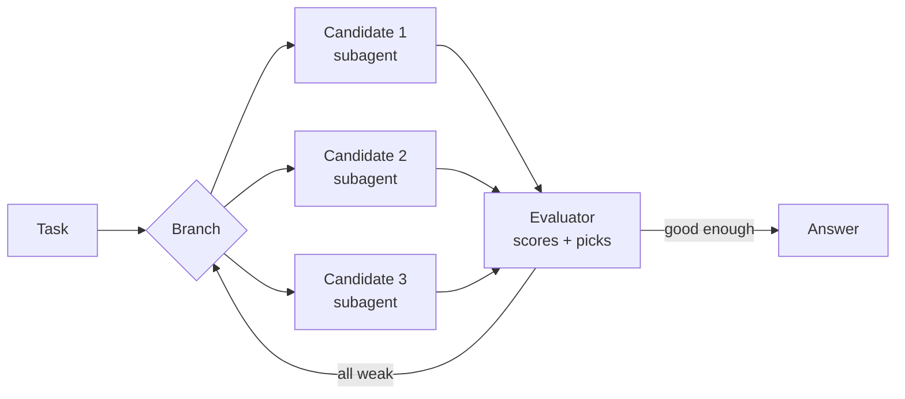
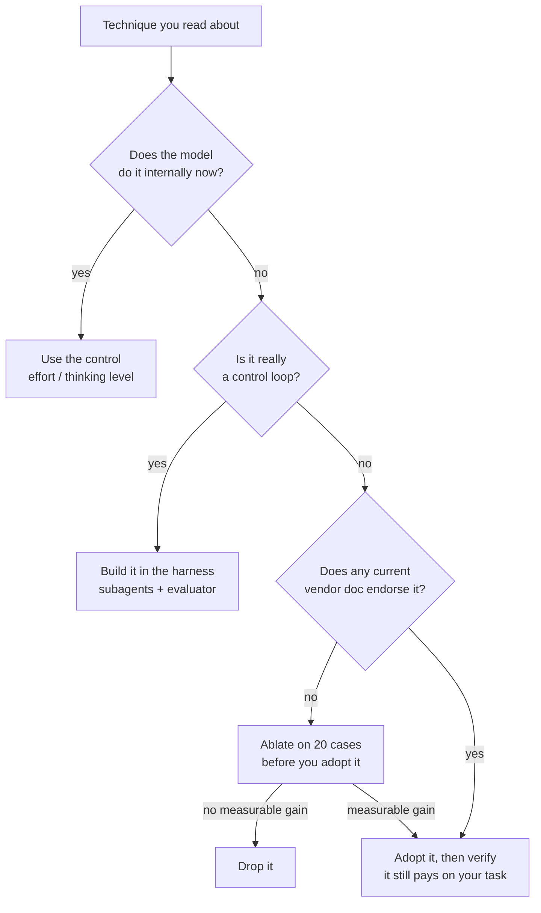

<LevelBadge level="intermediate" />

<Callout type="objectives" items={[
  "What each famous prompting technique actually was, in one line",
  "Which ones the model now does for you, and which ones the harness does",
  "The three techniques that are now actively discouraged by official vendor guidance",
  "Where the vendors openly disagree — and how to settle it for your own workload",
]} />

Open almost any prompt-engineering guide and you get a list of named techniques: Chain-of-Thought, Tree of Thoughts, Self-Consistency, ReAct, Reflexion, Least-to-Most. Nearly all of them were published between 2022 and 2023, for models that **could not reason unless you made them**.

That constraint is gone. Today's frontier models reason internally before answering, and agent harnesses loop over tools on their own. So most of those techniques didn't get disproved — they got **absorbed**, either into the model or into the harness. A few are now outright footguns.

This page names each one, says what it was for, and gives it a verdict.

## The one thing that changed

Every verdict below traces back to the same shift: reasoning moved from your prompt into the model's own forward pass. All three major vendors now say so in their own docs.

| Vendor | What their current guidance says |
|---|---|
| **Anthropic** | Extended thinking "automates structured reasoning," and when available it is "generally preferable to manual chain of thought prompting." |
| **OpenAI** | "Avoid chain-of-thought prompts: Since these models perform reasoning internally, prompting them to 'think step by step' or 'explain your reasoning' is unnecessary." |
| **Google** | If you used "complex prompt engineering (like chain of thought) to force Gemini 2.5 to reason," use the model's thinking level instead. |

<VerifyNote lastVerified="2026-10-03" source="https://claude.com/blog/best-practices-for-prompt-engineering">
Quotes verified against Anthropic's [prompt engineering best practices for 2026](https://claude.com/blog/best-practices-for-prompt-engineering), [OpenAI's reasoning best practices](https://developers.openai.com/api/docs/guides/reasoning-best-practices), and [Google's Gemini 3 developer guide](https://ai.google.dev/gemini-api/docs/gemini-3). Vendor guidance is revised independently and often — re-read the source before you rewrite a production prompt on the strength of it.
</VerifyNote>

## The verdict table

| Technique | What it was | Verdict |
|---|---|---|
| **Clear, specific instruction** | State goal, audience, format, constraints | ✅ **Still the whole game** |
| **Output contract** | "Reply with only the JSON" / exact shape | ✅ **Still essential** |
| **Prompt chaining / decomposition** | Split one hard task into several calls | ✅ **Still essential** |
| **Permission to abstain** | "Say you don't know rather than guess" | ✅ **Still essential** |
| **Context + motivation** | Explain *why* a constraint matters | ✅ **Grew in value** |
| **Meta-prompting / APE** | Have a model write or improve the prompt | ✅ **Underrated, alive** |
| **Chain-of-Thought** | "Think step by step" before answering | 🔁 **Moved into the model** |
| **Least-to-Most** | Solve easy sub-problems first, in order | 🔁 **Moved into the model** |
| **ReAct** | Interleave `Thought:` / `Action:` / `Observation:` | 🔁 **Moved into the harness** |
| **Reflexion** | Self-critique, then retry with the lesson kept | 🔁 **Moved into the memory layer** |
| **Tree of Thoughts** | Branch, evaluate, backtrack over partial answers | 🔁 **Moved into the harness** |
| **Few-shot examples** | Show 3–5 worked examples | ⚠️ **Contested — vendors disagree** |
| **Role / persona** | "You are a senior tax attorney with 20 years…" | ⚠️ **Downgraded, keep the thin version** |
| **Self-Consistency** | Sample N answers, majority-vote | ⚠️ **Situational, pay N× for it** |
| **Heavy XML scaffolding** | Tag every part of every prompt | ⚠️ **Now optional, not default** |
| **Graph of Thoughts** | Arbitrary graph of reasoning steps | 🧪 **Research, no vendor recommends it** |
| **Temperature tuning** | Turn creativity up or down | ⛔ **Rejected outright on current models** |
| **Emotional pressure / tipping** | "This is very important to my career" | ⛔ **No current vendor guide endorses it** |
| **Instruction repetition / ALL CAPS** | Say it three times, loudly | ⛔ **Retired** |

The rest of this page explains the interesting rows.

## Moved into the model

### Chain-of-Thought

[Wei et al. (2022)](https://arxiv.org/abs/2201.11903) showed that a model prompted to produce intermediate reasoning steps solved far more math and logic problems. [Kojima et al. (2022)](https://arxiv.org/abs/2205.11916) then found you could trigger most of that with five words — "Let's think step by step." For four years that was the single highest-leverage trick in prompting.

Frontier models now do it unprompted, and spend a *budget* on it that you control through effort or thinking level rather than through sentences in your prompt. See [Thinking & Effort](/docs/api/thinking-and-effort) and [Effort Tuning](/docs/api/effort-tuning).

So the instruction is no longer free. It costs tokens, it adds an instruction the model must obey alongside the real one, and on a thinking model it can push reasoning *into the visible answer* — exactly where you didn't want it.

<PromptCard title="2023 habit — don't port this forward">{`You are an expert mathematician with 20 years of experience. This is very
important to my career, so please take a deep breath and work through this
step by step, explaining your reasoning carefully before giving the final
answer. Let's think step by step.

Are there infinitely many primes p with p mod 4 == 3?`}</PromptCard>

<PromptCard title="2026 version — same question, nothing wasted">{`Are there infinitely many primes p with p mod 4 == 3?

Give the proof sketch, then the one-line answer. If the result is open, say so.`}</PromptCard>

The second prompt is shorter, contains no instruction the model has to reconcile, and spends its budget on the proof instead of on narrating. The reasoning depth comes from the request's effort setting, not from the wording.

**Keep manual Chain-of-Thought when:** you're on a small or local model with no thinking mode (see [Run Models Locally](/docs/models/run-models-locally-ollama)), or you specifically need the reasoning *in the visible output* for a human to audit.

### Least-to-Most

[Zhou et al. (2022)](https://arxiv.org/abs/2205.10625) — make the model enumerate sub-problems, then solve them in order. Same story as Chain-of-Thought: it's a plan, and planning is now the first thing a thinking model does on its own. Still useful as a *human* habit when you decompose work across several calls, which is just [prompt chaining](/docs/prompting/pattern-library).

## Moved into the harness

### ReAct

[Yao et al. (2022)](https://arxiv.org/abs/2210.03629) interleaved reasoning with tool calls by having the model emit text in a fixed `Thought:` / `Action:` / `Observation:` format that your code parsed with regexes.

Read that description again: it's a text-protocol workaround for an API that had no tool calls. The API has tool calls now. Native [tool use](/docs/api/tool-use), plus thinking between tool calls, *is* ReAct — implemented by the provider, type-checked, and streamed. Hand-rolling the text protocol in 2026 means re-adding a parser that can break on a stray colon.

**The one thing worth keeping from ReAct:** the insight that the model should get to *think about a tool result before choosing the next tool*. That's now a platform feature, not a prompt.

### Tree of Thoughts

[Yao et al. (2023)](https://arxiv.org/abs/2305.10601) generalized Chain-of-Thought into a search: generate several candidate next steps, score them, keep the promising branches, backtrack from dead ends.

As a *prompt* ("explore three approaches in parallel, then pick") it's weak — one model in one context window roleplaying a search tree mostly produces three similar paragraphs plus a confident pick. As an *architecture* it's thriving, under different names:

That is Tree of Thoughts with the branches as real parallel agents and the evaluator as a real grading step. Build it with [subagents](/docs/claude-code/subagents) or [agent teams](/docs/api/cowork-and-agent-teams), and grade it with [evals](/docs/foundations/evals) — not with one clever paragraph.

### Reflexion

[Shinn et al. (2023)](https://arxiv.org/abs/2303.11366) had the agent write a short verbal post-mortem after a failed attempt and carry that note into the next attempt — learning without touching weights.

The idea was right and it won. It just stopped living in the prompt: it lives in the **memory layer** now. See [Memory & Context Editing](/docs/api/memory-and-context-editing) and [Managed Agent Memory Stores](/docs/api/managed-agents-memory-stores). The modern version of "reflect on your failure" is an agent that writes a lesson to a durable store that survives [compaction](/docs/api/compaction).

**Still do the cheap version by hand:** after a bad run, ask the model what in the prompt or tool set misled it, then fix *that*. The output of a reflection belongs in your system prompt, not in the next turn.

### Graph of Thoughts

[Besta et al. (2023)](https://arxiv.org/abs/2308.09687) replaced the tree with an arbitrary graph — merge branches, refine nodes in place, loop. Genuinely interesting research; no vendor recommends it, no mainstream harness implements it, and the token cost is brutal. Know the name; don't build on it until something changes.

## Contested: few-shot examples

This is the honest one. The three vendors give three different answers, in writing, right now:

| Vendor | Guidance on examples |
|---|---|
| **OpenAI** | "Try zero shot first… Reasoning models often don't need few-shot examples to produce good results." |
| **Anthropic** | "Start with one example (one-shot). Only add more examples (few-shot) if the output still doesn't match your needs." |
| **Google** | "Prompts without few-shot examples are likely to be less effective" — and recommends always including them. |

Don't resolve that by picking the vendor you like. The disagreement is real and it reflects real differences in how these models were trained. Resolve it with an ablation on your own task — that's a 20-minute job and it beats anyone's advice, including this page's.

<Steps items={[
  {title: "Freeze a test set", body: "Collect 20 real inputs with known-good outputs. Not 3 — 3 cannot distinguish a 15% change from noise. See /docs/foundations/evals."},
  {title: "Write the zero-shot version", body: "Instruction, constraints, output contract. No examples at all."},
  {title: "Add exactly one example", body: "Pick the input your zero-shot version got most wrong, and show the ideal output for it."},
  {title: "Add three more", body: "Cover the shapes your task actually varies across — not four versions of the easy case."},
  {title: "Score all three variants on the same 20 inputs", body: "Same model, same settings, one variable changed. Record tokens as well as quality."},
  {title: "Ship the cheapest variant that clears your bar", body: "If one-shot ties zero-shot, ship zero-shot: fewer tokens, less pattern-lock, nothing to maintain."},
]} />

The failure mode worth naming: too many examples cause **pattern lock**, where the model reproduces the surface shape of your examples on inputs that needed a different shape. If outputs look oddly uniform, cut examples before you add instructions. More in [Few-Shot Done Right](/docs/prompting/few-shot).

## Downgraded: roles and personas

"You are a world-class senior tax attorney with 20 years of experience at a top-tier firm" was standard practice. Anthropic's current guidance is blunter: "Overly specific roles can limit the AI's helpfulness."

The useful part of a role was never the biography — it was **vocabulary and audience**. Keep that, drop the résumé:

- ⛔ "You are a legendary 10x engineer who never writes bugs."
- ✅ "Review this for a Python 3.12 service that runs in Lambda. Flag anything that would fail under concurrent cold starts."

The second one tells the model something it didn't know. The first one tells it to be confident, which is the opposite of what you want from a reviewer. See [System Prompts](/docs/prompting/system-prompts) and [Roles](/docs/foundations/roles).

## Situational: self-consistency

[Wang et al. (2022)](https://arxiv.org/abs/2203.11171) — sample the same question N times and take the majority answer. It works, and it still works. The problem is the bill: N× tokens and N× latency for one answer.

On a frontier model, raising the effort or thinking budget on **one** call usually buys more accuracy per token than three cheap calls plus a vote. Self-consistency is still the right tool when:

- The answer is short and checkable (a number, a label, a yes/no), so voting is well-defined.
- You're on a cheap or local model where three calls are still cheaper than one frontier call.
- You need a *confidence signal* — a 3–0 split and a 2–1 split tell you different things, and that's hard to get any other way.

It is the wrong tool for essays, code, and anything where "majority" isn't meaningful.

## Retired

- **Temperature tuning.** Not just discouraged — **rejected**. On current frontier Claude models, a non-default `temperature`, `top_p`, or `top_k` returns a 400 error on every request. Google "strongly recommend[s] keeping the temperature parameter at its default value of `1.0`" for all Gemini 3 models, warning that lowering it "may lead to unexpected behavior, such as looping or degraded performance." Shape behavior with the prompt and the effort setting. Which models expose which knobs is a moving target — check [Models & Pricing](/docs/whats-new/models-and-pricing) and [Sampling Controls](/docs/foundations/sampling-controls).
- **Emotional pressure.** [Li et al. (2023)](https://arxiv.org/abs/2307.11760) did measure gains from "this is very important to my career" on 2023-era models, and the offering-a-tip variant circulated widely. No current vendor guide recommends either. Treat the measured effect as a property of the models it was measured on, not a law of prompting — and note that nobody has published a frontier-model replication.
- **Instruction repetition and ALL CAPS.** Belt-and-braces for models that dropped instructions from the middle of long prompts. Restating the ask after a very long document is still sound ([Long Context](/docs/prompting/long-context)); saying it three times in a 200-token prompt just spends context and creates conflicts to resolve.
- **Prefilling the assistant turn.** Was the reliable way to force an output format on Claude. Retired — current models return a 400 on a prefilled final assistant turn. Use an output contract or [structured output](/docs/api/structured-output).

## How to decide for any technique

The whole page compresses to that diagram. A named technique is a hypothesis about where a capability has to live — in the prompt, in the model, or in the harness. When capability moves, the technique's home moves with it.

<Flashcards title="Know the canon" cards={[
  {front: "Chain-of-Thought (2022)", back: "Prompt the model to produce intermediate reasoning steps before answering. Now internal to thinking models — control it with effort, not wording."},
  {front: "Zero-shot CoT", back: "\"Let's think step by step\" — triggers reasoning with no examples. The single most-copied prompt of the 2022–2024 era; now redundant on thinking models."},
  {front: "Self-Consistency (2022)", back: "Sample N reasoning paths, take the majority answer. Still valid; costs N×. Best for short checkable answers and confidence signals."},
  {front: "Least-to-Most (2022)", back: "Enumerate sub-problems, then solve them in order. Absorbed into internal planning; survives as human-side prompt chaining."},
  {front: "ReAct (2022)", back: "Interleave Thought / Action / Observation as parsed text. Replaced by native tool use plus thinking between tool calls."},
  {front: "Reflexion (2023)", back: "Verbal self-critique after a failure, carried into the next attempt. Moved into the memory layer — write the lesson somewhere durable."},
  {front: "Tree of Thoughts (2023)", back: "Branch, score, backtrack over partial solutions. Weak as a prompt; strong as an architecture — parallel subagents plus an evaluator."},
  {front: "Graph of Thoughts (2023)", back: "Arbitrary graph of reasoning steps with merges and loops. Research only; no vendor or mainstream harness implements it."},
  {front: "Pattern lock", back: "The failure mode of too many few-shot examples: outputs copy the examples' surface shape even when the input needed a different one."},
  {front: "The absorption rule", back: "Techniques don't get disproved, they get absorbed — into the model or into the harness. Ask where the capability lives now."},
]} />

<Quiz title="Check yourself" questions={[
  {q: "Why is adding \"think step by step\" to a prompt for a thinking model now a cost rather than a win?", options: ["It makes the model slower to start streaming", "The model already reasons internally, so the instruction adds tokens and an extra instruction to reconcile — and can push reasoning into the visible answer", "It disables tool use", "It raises the temperature"], answer: 1, explain: "Frontier models reason internally and budget it via effort or thinking level. The instruction spends tokens, competes with your real ask, and can move reasoning into the output you wanted clean."},
  {q: "What is the right modern home for Tree of Thoughts?", options: ["A prompt that asks the model to explore three approaches", "A harness that runs candidate branches as parallel subagents and scores them with an evaluator", "A higher temperature setting", "A longer system prompt"], answer: 1, explain: "As a prompt it mostly yields three similar paragraphs and a confident pick. As an architecture — parallel branches plus a real grading step — it thrives."},
  {q: "The three major vendors currently give different written advice about few-shot examples. What does this page recommend?", options: ["Follow Google, since it is most pro-example", "Follow OpenAI, since zero-shot is cheapest", "Run an ablation on 20 of your own cases and ship the cheapest variant that clears your bar", "Avoid examples entirely to stay portable"], answer: 2, explain: "The disagreement is real and reflects training differences. A 20-case ablation on your own task beats any vendor's general advice."},
  {q: "What happens if you send a non-default temperature to a current frontier Claude model?", options: ["It is silently ignored", "The request returns a 400 error", "Output becomes non-deterministic", "Thinking is disabled"], answer: 1, explain: "On current frontier Claude models a non-default temperature, top_p, or top_k returns a 400 error on every request. Shape behavior with the prompt and the effort setting instead."},
]} />

<Callout type="takeaways" items={[
  "Named techniques are hypotheses about where a capability must live — in the prompt, the model, or the harness. When capability moves, so does the technique.",
  "Manual Chain-of-Thought and Least-to-Most moved into the model: use effort and thinking level instead of wording.",
  "ReAct and Tree of Thoughts moved into the harness: native tool use, parallel subagents, and a real evaluator.",
  "Reflexion moved into the memory layer: write the lesson somewhere durable, not into the next turn.",
  "Few-shot is genuinely contested between vendors — ablate on 20 of your own cases rather than trusting any guide.",
  "Temperature tuning and emotional pressure are retired. Keep role framing thin: vocabulary and audience, never the résumé.",
]} />

## Next

- The fundamentals every technique above is built on → [Prompting Basics](/docs/prompting/basics)
- Settle the few-shot question for your own task → [Few-Shot Done Right](/docs/prompting/few-shot)
- The reasoning control that replaced "think step by step" → [Thinking & Effort](/docs/api/thinking-and-effort)
- Carry a prompt to another vendor without re-learning this → [Cross-AI Prompt Translation](/docs/prompting/cross-ai-translation)
