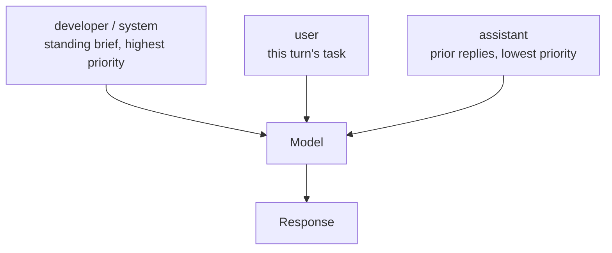

<LevelBadge level="intermediate" />

<Callout type="objectives" items={["Set a system prompt correctly on all four surfaces — Anthropic's system parameter, OpenAI's developer role, Gemini's system_instruction, and Claude Code's five flags", "Know what belongs in the standing brief and what has to stay out of it", "Stop over-pushing: why \"CRITICAL: you MUST\" now backfires on current models", "Put the system prompt where the prompt cache can reuse it, and split the volatile part out", "Choose between appending to and replacing Claude Code's default prompt — and understand what replacing drops"]} />

Every model has one layer that frames the whole conversation. It is the cheapest lever you own — set once, applies to every turn — and it is the one most people fill with the wrong material. [Roles](/docs/foundations/roles) covers *why* it matters. This lesson is the operator's version: exact parameter names, how hard to push, and where it interacts with caching.

## One idea, four surfaces

The concept ports everywhere. The plumbing does not.

| Surface | How you set it | Shape |
|---|---|---|
| **Anthropic Messages API** | `system` — a **top-level request parameter**, not an entry in `messages` | String, or an array of content blocks |
| **OpenAI Responses API** | the `instructions` parameter, or a message with the **`developer`** role | Applies to the current request; `instructions` does not carry over when you chain with `previous_response_id` |
| **Google Gemini API** | `system_instruction` on the request (`systemInstruction` in Java, `SystemInstruction` in Go) | Set per interaction |
| **Claude Code** | five CLI flags (below), plus [`CLAUDE.md`](/docs/claude-code/claude-md) and [output styles](/docs/claude-code/output-styles) | Replace or append |
| **Chat apps** | [custom instructions](/docs/claude-app/custom-instructions) on your account | Persistent across chats |

<VerifyNote lastVerified="2026-09-30" source="https://platform.claude.com/docs/en/build-with-claude/prompt-engineering/claude-prompting-best-practices">
Parameter names verified against Anthropic's prompting best-practices reference, [OpenAI's text-generation guide](https://developers.openai.com/api/docs/guides/text) (the `developer` role and the `instructions` parameter), and [Google's Gemini text-generation guide](https://ai.google.dev/gemini-api/docs/text-generation) (`system_instruction`). Vendor API surfaces move — confirm against the linked docs before you ship.
</VerifyNote>

The most common porting bug is treating Anthropic's `system` as a message. It is not: it sits beside `messages`, not inside it. Going the other way, OpenAI's hierarchy is explicit — **developer instructions outrank user instructions, which outrank the assistant's own prior turns.** Their own analogy: the developer message is the function definition, the user message is the arguments you pass to it.

<PromptCard title="Anthropic: system is a top-level parameter">{`curl https://api.anthropic.com/v1/messages \\
  -H "content-type: application/json" \\
  -H "x-api-key: $ANTHROPIC_API_KEY" \\
  -H "anthropic-version: 2023-06-01" \\
  -d '{
    "model": "claude-sonnet-5-5",
    "max_tokens": 1024,
    "system": "You are a precise financial analyst. Show your assumptions. Never invent numbers.",
    "messages": [{"role": "user", "content": "Summarize this filing."}]
  }'`}</PromptCard>

## What belongs in it

Sort every line of your prompt by **how often it changes**. Things that are true for the whole conversation go up into the standing brief. Things that change per turn stay in the user turn.

<Steps items={[
  {title: "Identity and scope — yes", body: "One sentence of role is enough to shift tone and focus. Anthropic's docs are explicit that even a single sentence makes a difference; they also warn against over-constraining the role, because current models do not need heavy persona scaffolding."},
  {title: "Hard rules and refusal boundaries — yes", body: "What the model must never do, what it must always include, what to do when it is unsure. Give it explicit permission to say \"I don't know\" — that single line measurably reduces invented answers."},
  {title: "Output contract — yes", body: "The shape of a valid answer: sections, length, language, whether preamble is allowed. \"Respond directly, without preamble\" belongs here, not in every user turn."},
  {title: "Tool policy — yes", body: "When to reach for a tool and when to answer directly. This is where you tune eagerness (see below)."},
  {title: "Volatile facts — no", body: "Today's data, the current file, retrieved documents, live state. Those belong in the user turn or in retrieval context. Bury them in the system prompt and you invalidate your cache and teach the model stale facts."},
  {title: "Long reference material — no", body: "Large documents go at the top of the user turn, above the question. See /docs/prompting/long-context."}
]} />

## How hard to push

This is where prompts written for older models actively hurt. Anthropic's guidance for the Opus 4.5/4.6 generation and later is blunt: these models are **more responsive to the system prompt than their predecessors**, so prompts hardened against a model that used to *under*-trigger tools will now make it *over*-trigger. The fix is to turn the volume down — `Use this tool when…` instead of `CRITICAL: you MUST use this tool when…`.

<Callout type="warning" items={["ALL-CAPS, \"CRITICAL\", \"you MUST\", and threat framing are a legacy of models that ignored soft instructions. On current models they cause overtriggering and over-eager tool calls.", "Over-constrained personas (\"you are a world-class 10x expert who never makes mistakes\") add tokens and buy nothing. Ask for the perspective you actually want instead.", "Contradictory layers are worse than a thin brief. If the system prompt says \"be concise\" and a skill says \"always explain your reasoning\", the model has to guess.", "Stacking every technique at once — role, XML, few-shot, chain-of-thought, output schema — is the most common form of over-engineering. Add one, measure, keep it only if it helped."]} />

Eagerness is a dial, not a fixed trait, and the system prompt is where you set it. Wrap the policy in a named tag so you can find and edit it later:

<PromptCard title="Push toward acting">{`<default_to_action>
Implement changes rather than only proposing them. If intent is ambiguous, infer the
most useful action and proceed, using tools to find the details you are missing instead
of guessing.
</default_to_action>`}</PromptCard>

<PromptCard title="Push toward asking first">{`<do_not_act_before_instructions>
Do not modify files or start an implementation unless you are clearly asked to. When
intent is ambiguous, research and recommend instead of acting. Make changes only on an
explicit request.
</do_not_act_before_instructions>`}</PromptCard>

<VerifyNote lastVerified="2026-09-30" source="https://platform.claude.com/docs/en/build-with-claude/prompt-engineering/claude-prompting-best-practices">
The overtriggering guidance and the two eagerness patterns follow Anthropic's tool-use section for the Opus 4.5/4.6 generation and later. Model-specific behavior changes with each release — recheck the model-specific guidance at the top of that page.
</VerifyNote>

## The system prompt is your cache prefix

This is the part that shows up on the invoice. Anthropic builds the cacheable prefix in a fixed order — **`tools`, then `system`, then `messages`** — and caching covers everything up to and including the block you mark. So the system prompt sits in the highest-value cache position in the whole request: stable, reused on every call, and in front of the conversation.

Two consequences:

- **Keep the system prompt byte-stable.** A timestamp, a username, or a session ID interpolated into it changes the prefix and misses the cache on every single request.
- **If part of it must vary, put the stable part first** and break the cache after it, so the varying tail is the only thing re-read.

Minimum cacheable lengths differ per model — some current models cache from 512 tokens, older ones need up to 4,096 — and a prompt below the threshold is silently processed uncached with no error. Check the current table before you count on it.

<VerifyNote lastVerified="2026-09-30" source="https://platform.claude.com/docs/en/build-with-claude/prompt-caching">
Prefix order (`tools`, `system`, `messages`) and the per-model minimum cacheable lengths come from Anthropic's prompt-caching docs; the minimums are model-specific and change with each release. See also [Prompt Caching](/docs/api/prompt-caching) and [Models & Pricing](/docs/whats-new/models-and-pricing).
</VerifyNote>

Claude Code ships a purpose-built version of that split. When your replacement prompt mixes fixed instructions with per-run context, put a line containing only `__SYSTEM_PROMPT_DYNAMIC_BOUNDARY__` between them: Claude Code splits at the first such line and drops it, keeping everything above it cached while the part below changes (v2.1.275+). For scripted multi-user runs, `--exclude-dynamic-system-prompt-sections` moves per-user context out of the prompt and into the first user message so several machines share one cached prefix.

## Claude Code: append or replace

Five flags set the prompt. Four of them set text; the fifth controls whether a conversation keeps the text it started with.

| Flag | What it does |
|---|---|
| `--system-prompt` | Replaces the entire default prompt with your text |
| `--system-prompt-file` | Replaces it with a file's contents |
| `--append-system-prompt` | Appends your text to the default prompt |
| `--append-system-prompt-file` | Appends a file's contents to the default prompt |
| `--system-prompt-snapshot` | `off` rebuilds the prompt on every request instead of reusing the one recorded on the first request |

`--system-prompt` and `--system-prompt-file` are mutually exclusive; either append flag can be combined with either replacement flag.

The decision rule is about **what you are willing to own**:

<Steps items={[
  {title: "Append when Claude should stay a coding assistant", body: "Appending preserves the default tool guidance, safety instructions, and coding conventions, so you only supply what differs — per-invocation rules, output format, domain context for a -p script."},
  {title: "Replace when the identity or permission model is genuinely different", body: "A non-coding agent in an unattended pipeline, say. Replacing drops all of the default prompt — including tool guidance and safety instructions — so everything your task still needs is now your responsibility."},
  {title: "Reach for the right lever first", body: "Project conventions Claude should always follow belong in CLAUDE.md. A persona you switch between and share belongs in an output style. A flag is for one invocation."}
]} />

<PromptCard title="Append a rule for one headless run">{`claude -p --append-system-prompt "Cite file:line for every claim." "audit the auth flow"`}</PromptCard>

One gotcha that costs real debugging time: by default Claude Code builds the system prompt **once**, on a conversation's first request, and records it. Every later request in that conversation reuses the recorded prompt — including after `--resume` or `--continue`. Change the flag text on a later launch and nothing happens until the conversation is compacted or you start a new one. While you are iterating on wording, pass `--system-prompt-snapshot off` (v2.1.257+) to rebuild it every request.

<VerifyNote lastVerified="2026-09-30" source="https://code.claude.com/docs/en/cli-reference">
The five system-prompt flags, the append-vs-replace guidance, the `__SYSTEM_PROMPT_DYNAMIC_BOUNDARY__` marker (v2.1.275+), and the snapshot-recording behavior (v2.1.257+) are from the Claude Code CLI reference. Version-gated behavior changes often — check the [changelog](https://code.claude.com/docs/en/changelog).
</VerifyNote>

## A worked before/after

**Before** — everything at maximum volume, volatile facts baked in, no output contract:

<PromptCard title="Over-pushed and cache-hostile">{`You are THE BEST code reviewer in the world. You are a 10x engineer.
CRITICAL: You MUST ALWAYS use the search tool before answering. NEVER skip this.
IT IS EXTREMELY IMPORTANT that you are thorough.
The current date is 2026-09-30 and the user is reviewing PR #4412 on branch fix/auth-race.`}</PromptCard>

Four separate problems: the superlatives buy nothing, the shouting will make the model over-call its tools, there is no definition of a valid answer, and the last line changes every run so the prefix never caches.

**After** — one sentence of role, a real output contract, an uncertainty escape hatch, volatile facts moved to the user turn:

<PromptCard title="Calm, contract-first, cacheable">{`You are a code reviewer for a TypeScript monorepo.

Rules:
- Search the codebase before claiming a symbol is unused.
- If you cannot verify a claim from the diff or the code, say so instead of guessing.

Output: a Summary section, then Risks, then Suggested changes. No preamble.`}</PromptCard>

The date, the PR number, and the branch go into the user turn, where they belong. Same behavior, a stable cache prefix, and about a third of the tokens.

## What not to reach for any more

Prefilling — starting the assistant's turn yourself so the model continues in your format — used to be the go-to way to force JSON or skip a preamble. **On Claude 4.6 and later, a prefilled final assistant turn returns a 400 error.** The replacements all live in or next to the system prompt: a direct "respond without preamble" instruction, [structured outputs](/docs/api/structured-output), or a tool with an enum field for classification. Assistant messages *elsewhere* in the conversation are unaffected, so [few-shot examples](/docs/prompting/few-shot) still work exactly as before.

<VerifyNote lastVerified="2026-09-30" source="https://platform.claude.com/docs/en/build-with-claude/prompt-engineering/claude-prompting-best-practices">
Anthropic's prompting reference states that prefilled responses on the last assistant turn are no longer supported starting with Claude 4.6 models, that such requests return a 400 error, and that earlier models still accept prefills. See also [Porting Prompts Across Models](/docs/models/porting-prompts-across-models).
</VerifyNote>

<Flashcards title="System prompt quick reference" cards={[
  {front: "Anthropic: where does the system prompt go?", back: "The `system` top-level request parameter — beside `messages`, never inside it. Accepts a string or an array of content blocks."},
  {front: "OpenAI: role name and parameter?", back: "The `developer` role (not `system`) for messages, or the `instructions` parameter on the Responses API. `instructions` applies to the current request only."},
  {front: "Gemini: parameter name?", back: "`system_instruction` on the request — `systemInstruction` in Java, `SystemInstruction` in Go."},
  {front: "Instruction hierarchy", back: "Developer/system outranks user, which outranks the assistant's prior turns. OpenAI's analogy: developer message = function definition, user message = arguments."},
  {front: "Cache prefix order", back: "`tools`, then `system`, then `messages`. The system prompt is the highest-value cache position in the request — keep it byte-stable."},
  {front: "Append vs replace in Claude Code", back: "Appending keeps the default tool guidance and safety instructions. Replacing drops all of it, so everything your task needs becomes your responsibility."},
  {front: "Why \"CRITICAL: you MUST\" backfires", back: "Current models are more responsive to the system prompt than the ones that prompt style was written for, so hardened language now causes overtriggering. Use normal phrasing."},
  {front: "Prefilling the final assistant turn", back: "Returns a 400 on Claude 4.6 and later. Use a \"no preamble\" instruction, structured outputs, or a tool with an enum instead."}
]} />

<Callout type="takeaways" items={["Same concept, different plumbing: Anthropic's `system` parameter, OpenAI's `developer` role / `instructions`, Gemini's `system_instruction`, Claude Code's five flags.", "Sort by rate of change — durable rules go in the standing brief, volatile facts go in the user turn.", "Turn the volume down. Current models over-trigger on prompts hardened for models that used to under-trigger.", "The system prompt sits in the cache prefix (tools → system → messages): keep it byte-stable, and split the varying tail off.", "In Claude Code, appending preserves the default safety and tool guidance; replacing hands you the whole responsibility.", "Prefilled final assistant turns are a 400 on Claude 4.6+ — use an output contract, structured outputs, or tools."]} />

<Quiz title="Check yourself" questions={[
  {q: "In the Anthropic Messages API, where does the system prompt live?", options: ["As the first entry in the `messages` array with role `system`", "As a top-level `system` request parameter, beside `messages`", "As a `developer` role message", "In the `instructions` parameter"], answer: 1, explain: "Anthropic's `system` is a top-level request parameter, not a message. Treating it as an entry in `messages` is the most common porting bug."},
  {q: "Your prompt says \"CRITICAL: You MUST ALWAYS call the search tool.\" On a current Claude model, what is the likely effect?", options: ["Nothing — emphasis is ignored", "The model calls the tool more often than you want, because it is more responsive to the system prompt than older models", "The request is rejected", "The model refuses the task"], answer: 1, explain: "Anthropic's guidance for the Opus 4.5/4.6 generation and later is to dial back aggressive language: these models are more responsive to the system prompt, so prompts written against undertriggering now overtrigger."},
  {q: "Why does interpolating the current timestamp into your system prompt cost money?", options: ["Timestamps consume extra output tokens", "It changes the cacheable prefix, so every request misses the prompt cache", "The API rejects non-static system prompts", "It forces the model into extended thinking"], answer: 1, explain: "The cache prefix is built as tools → system → messages. Any change to the system text invalidates it, so a per-request timestamp means you pay full input price every call."},
  {q: "You pass `--system-prompt` in Claude Code instead of `--append-system-prompt`. What did you just give up?", options: ["Nothing, the flags are equivalent", "The default prompt's tool guidance and safety instructions, which you now have to supply yourself", "The ability to use CLAUDE.md", "Prompt caching"], answer: 1, explain: "Replacing drops the whole default prompt, including tool guidance and safety instructions. Appending keeps them and only adds what differs."}
]} />

## Next

- [Prompting Claude Specifically](/docs/prompting/prompting-claude)
- [Prompting for Long Context](/docs/prompting/long-context)
- [Prompt Caching](/docs/api/prompt-caching)
