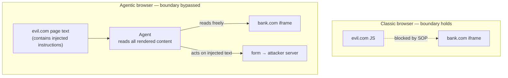

<LevelBadge level="advanced" />

<Callout type="objectives" items={["Understand the same-origin policy — the boundary that has quietly protected you for 30 years — and why an AI agent sits above it", "See which of 7 agentic browsers were found vulnerable, and the architectural reason why", "Walk the cross-origin iframe exfiltration attack step by step", "Read vendor red-team numbers honestly: mitigations halve attack success, they don't eliminate it", "Apply a practical risk posture instead of a blanket ban"]} />

On 30 June 2026, University of Washington researchers published a result that reframes AI browsers: **four of seven agentic browsers they tested let a malicious website reach data belonging to a different website.** Not through a memory-safety bug. Through the agent working exactly as designed.

<VerifyNote lastVerified="2026-07-20" source="https://agent-security.cs.washington.edu/agentic_browsers_sop.html" />

## The boundary nobody thinks about

Open your bank in one tab and a random forum in another. The forum's JavaScript cannot read your bank's page, cookies, or session. That guarantee is the **same-origin policy (SOP)** — an origin being the triple `(scheme, host, port)`. It is the reason, as UW's Franziska Roesner puts it, that browsing almost any site is safe today.

SOP is enforced *by the browser*, below the page. Nothing a page can say talks its way past it.

Now add an agent. In the most capable designs, the agent behaves like a human user of the browser: it sees the rendered page, reads the DOM, clicks, and types. A human looking at a screen is not bound by SOP — your eyes can read two tabs. Neither is an agent built to imitate one.

Here is the sentence worth keeping: **the SOP does not weaken — it stops describing reality.** The browser still enforces it correctly at the JavaScript layer. The agent simply operates above that layer. So a decades-old *architectural* guarantee silently degrades into a *behavioral* one: "we hope the model doesn't fall for prompt injection." Those are not the same class of promise, and only one of them holds against an attacker who gets unlimited retries.

## What was tested, and what broke

Kohlbrenner and Roesner tested seven browsers in late January–February 2026 and presented at the Agents in the Wild workshop in Rio de Janeiro on 26 April 2026.

| Browser | Preconditions for SOP bypass? | Notes |
|---|---|---|
| ChatGPT Atlas (Agent Mode) | **Yes — full PoC demonstrated** | End-to-end cross-origin theft achieved |
| Chrome with Gemini | **Yes** | Preconditions present |
| Claude for Chrome | **Yes** | Extension architecture allows JS injection |
| Perplexity Comet | **Yes** | Preconditions present |
| Brave Leo AI | No | Narrower agent capabilities |
| Microsoft Edge with Copilot | No | Narrower agent capabilities |
| Firefox AI Mode (Claude) | No | Most restrictive of the seven |

The pattern is the finding, and it is uncomfortable: **the browsers that were safest were the ones that could do the least.** Brave, Edge and Firefox weren't safer because of better classifiers — they hand the agent a limited, predefined slice of the page instead of the whole browsing session. Security here is bought with capability, not with cleverness. Any vendor claiming both should be read carefully.

## The attack, step by step

<Steps items={[{"title":"Attacker builds a page with a cross-origin iframe","body":"evil.com embeds an iframe pointing at a sensitive origin the victim is logged into — a bank, a webmail, an internal dashboard. Ordinary JavaScript on evil.com cannot read a single character inside that iframe. This is normal, allowed web behavior."},{"title":"The page hides instructions aimed at the agent","body":"Text on the page — visually hidden, in an alt attribute, in a DOM field the user never sees — tells the agent to include the iframe's contents in whatever it produces. To the model this is just more page content, indistinguishable from the article it was asked to read."},{"title":"The user asks for something completely innocent","body":"\"Summarize this page.\" No dangerous permission is requested and no warning fires, because from the browser's perspective nothing unusual is happening."},{"title":"The agent reads across the origin boundary","body":"Because the agent perceives the fully rendered page, it reads the iframe content too. The same-origin policy is not violated — it was never consulted, because no cross-origin JavaScript call was ever made."},{"title":"The agent writes the data into an attacker-controlled form","body":"The injected instruction directs the summary into a form field on evil.com. The agent is being helpful, following what it read."},{"title":"The form auto-submits","body":"Cross-origin data lands on the attacker's server. The user saw a summary appear and nothing else."}]} />

Note what is *absent*: no exploit, no malware, no unpatched CVE. Every step uses a documented, intended feature. That is what makes this an architecture problem rather than a bug queue.

The researchers also name three siblings of this attack, worth knowing by name:

<Flashcards title="The four cross-origin attack classes" cards={[{"front":"Cross-origin data theft","back":"The agent reads content from origin B while acting on a page from origin A, then leaks it. The PoC demonstrated on ChatGPT Atlas."},{"front":"Cross-origin action forgery","back":"The agent is induced to perform a state-changing action on origin B (send, transfer, delete) from a page on origin A — CSRF, but the confused deputy is the agent, so CSRF tokens and SameSite cookies don't help."},{"front":"Chat memory poisoning","back":"Injected text is written into the agent's persistent memory, so the compromise outlives the malicious page and fires on later, unrelated sessions."},{"front":"Masked input reading","back":"The agent perceives the underlying value of a password field or other masked input, which the visual UI deliberately hides from the human."}]} />

Memory poisoning is the one that should worry you most. The other three end when you close the tab. Memory poisoning turns a single bad page into a persistent implant in your assistant, and there is currently no equivalent of "clear cookies" that most users know to reach for.

## Read the vendor numbers honestly

Anthropic published red-team results for Claude for Chrome — and to its credit, published the unflattering ones. Across 123 test cases spanning 29 attack scenarios:

- Autonomous-mode attack success: **23.6% before mitigations → 11.2% after**
- On a challenge set of four browser-specific attack types: **35.7% → 0%**

Mitigations include site-level permissions, confirmation prompts for high-risk actions, blocking whole site categories (financial services, adult, pirated content), injection classifiers on both incoming content and outgoing actions, and specific defenses for hidden DOM fields and URL/tab-title injection. Anthropic separately reports a configuration reaching **under 0.08%** against its internal combined-technique suite.

Sit with the middle number. **11.2% is not a small number for a security control.** A door lock that opens for one in nine strangers is not a lock. The honest reading is that these are *risk reducers on a boundary that no longer exists*, not a replacement for it — which is precisely the researchers' point about needing architectural redesign rather than better filtering.

The extension delivery path has its own history: researchers reported that Claude for Chrome's per-site permissions could be bypassed by writing directly to the extension's on-disk LevelDB store, and follow-up work ("ClaudeBleed") found extension-to-extension paths that could still push the agent toward reading Gmail. Permissions enforced in client-side storage are advisory against anything already running as your user. As of v1.0.80 (7 July 2026) those extension-to-extension bypasses remain reproducible — see [ClaudeBleed Reopened](/docs/security/claudebleed-and-agentic-extension-bypass) for the two-flaw walk-through and what to do now.

Vendor response to the UW disclosure (60+ days notice) also varies: Brave, Google and Microsoft engaged; OpenAI and Firefox declined the reports citing insufficient end-to-end proof; Anthropic had not replied by publication.

<Callout type="warning" items={["Kohlbrenner's assessment is blunt: if these agents have access to a browser holding your credentials, don't treat them as ready. Treat agentic browsing as a capability you grant deliberately, not one you leave on."]} />

## A posture you can actually hold

"Never use an AI browser" is advice nobody follows. Use the shape of the attack instead — it needs **untrusted page content** plus **an authenticated session** plus **an exfiltration path** in the same agent context. Break any one leg.

<Steps items={[{"title":"Separate the profile, not just the tab","body":"Run the agent in a browser profile that is not logged into anything valuable. Sessions are the asset; an agent with no cookies to steal is a far less interesting confused deputy. This is the single highest-leverage move on the list."},{"title":"Treat 'summarize this page' as a privileged action on untrusted pages","body":"Reading arbitrary attacker-authored content is the injection vector. Summarizing your own draft is low risk; summarizing a page a stranger linked you is the exact scenario in the PoC."},{"title":"Grant site permissions narrowly and re-check them","body":"Per-site access is the one control that maps to the actual boundary. Keep the allowlist short. Assume it is advisory rather than airtight, given the LevelDB finding."},{"title":"Clear agent memory after browsing anything untrusted","body":"This is the only defense against memory poisoning that a user controls directly, and it costs nothing."},{"title":"Never leave autonomous mode on for open-ended browsing","body":"The 23.6% figure is autonomous-mode. Confirmation prompts are weak, but they convert a silent compromise into one you might notice."},{"title":"Prefer the least-capable agent that does your job","body":"The UW ranking is capability-ordered. If a narrow summarizer suffices, the extra agency you skip is attack surface you never had to defend."}]} />

For the closely-related risk on the coding side, see [When Coding Agents Get Weaponized](/docs/security/coding-agents-under-attack), the mechanics in [Prompt Injection](/docs/security/prompt-injection), and the capability trade-offs in [Computer-Use Agents](/docs/models/computer-use-agents).

## Quiz

<Quiz title="Check yourself" questions={[{"q":"Why does an agentic browser bypass the same-origin policy?","options":["The agent exploits a memory-safety bug in the browser engine","The agent perceives the fully rendered page as a user would, so no cross-origin JavaScript call is ever made for the browser to block","The same-origin policy was removed from modern browsers","The agent runs with root privileges"],"answer":1,"explain":"No SOP violation occurs — SOP governs cross-origin JavaScript access. The agent reads rendered content directly, above the layer where SOP is enforced, so the check is never reached."},{"q":"What did the UW study find about the relationship between agent capability and safety?","options":["The most capable browsers were also the safest","Capability and safety were unrelated","The browsers that were safest were the ones whose agents could do the least","Only open-source browsers were safe"],"answer":2,"explain":"Brave Leo, Edge with Copilot and Firefox AI Mode avoided the preconditions by giving agents a limited, predefined slice of the page rather than full browsing capability. Security was bought with capability."},{"q":"Anthropic's red-teaming reduced autonomous-mode attack success from 23.6% to 11.2%. What is the right reading?","options":["The problem is solved for Claude for Chrome","A meaningful reduction, but far too high to serve as a security boundary on its own","The numbers prove agentic browsing is safe","Mitigations made the browser less secure"],"answer":1,"explain":"Halving attack success is real progress, but roughly one in nine attacks still succeeding is a risk reducer, not a boundary. It supports the researchers' call for architectural redesign over filtering."},{"q":"Which attack persists after the malicious page is closed?","options":["Cross-origin data theft","Chat memory poisoning","Masked input reading","Cross-origin action forgery"],"answer":1,"explain":"Memory poisoning writes injected instructions into the agent's persistent memory, so a single visit can affect later, unrelated sessions."},{"q":"What is the highest-leverage user-side mitigation?","options":["Using a longer system prompt","Running the agent in a browser profile not logged into valuable accounts","Disabling JavaScript","Using incognito mode for all browsing"],"answer":1,"explain":"The attack needs an authenticated session to steal. Removing valuable sessions from the agent's profile breaks the chain regardless of how good the injection is."}]} />

## Sources & further reading

- [Agentic Browsers and the Same-Origin Policy](https://agent-security.cs.washington.edu/agentic_browsers_sop.html) — Franziska Roesner & David Kohlbrenner, UW Allen School (primary source; per-browser findings, attack taxonomy, disclosure timeline)
- [Some agentic AI browsers come with major cybersecurity risks, UW study finds](https://www.washington.edu/news/2026/06/30/some-agentic-ai-browsers-come-with-major-cybersecurity-risks-uw-study-finds/) — UW News, 30 June 2026
- [Piloting Claude in Chrome](https://claude.com/blog/claude-for-chrome) — Anthropic (red-team figures: 23.6% → 11.2%, 35.7% → 0%, 123 test cases / 29 scenarios)
- [Use Claude in Chrome safely](https://support.claude.com/en/articles/12902428-use-claude-in-chrome-safely) and [Claude in Chrome permissions guide](https://support.claude.com/en/articles/12902446-claude-in-chrome-permissions-guide) — Anthropic Help Center
- [Chrome extension site permissions can be bypassed via direct LevelDB write](https://github.com/anthropics/claude-code/issues/26779) — anthropics/claude-code issue #26779
- [ClaudeBleed Reopened: Browser Extensions Can Still Push Claude for Chrome to Read Your Gmail](https://www.manifold.security/blog/claude-for-chrome-extension-bypass) — Manifold Security
- [Prompt injection still drives most agentic AI security failures in production](https://www.helpnetsecurity.com/2026/06/11/owasp-prompt-injection-ai-security-failures/) — Help Net Security on the OWASP Top 10 for Agentic Applications
