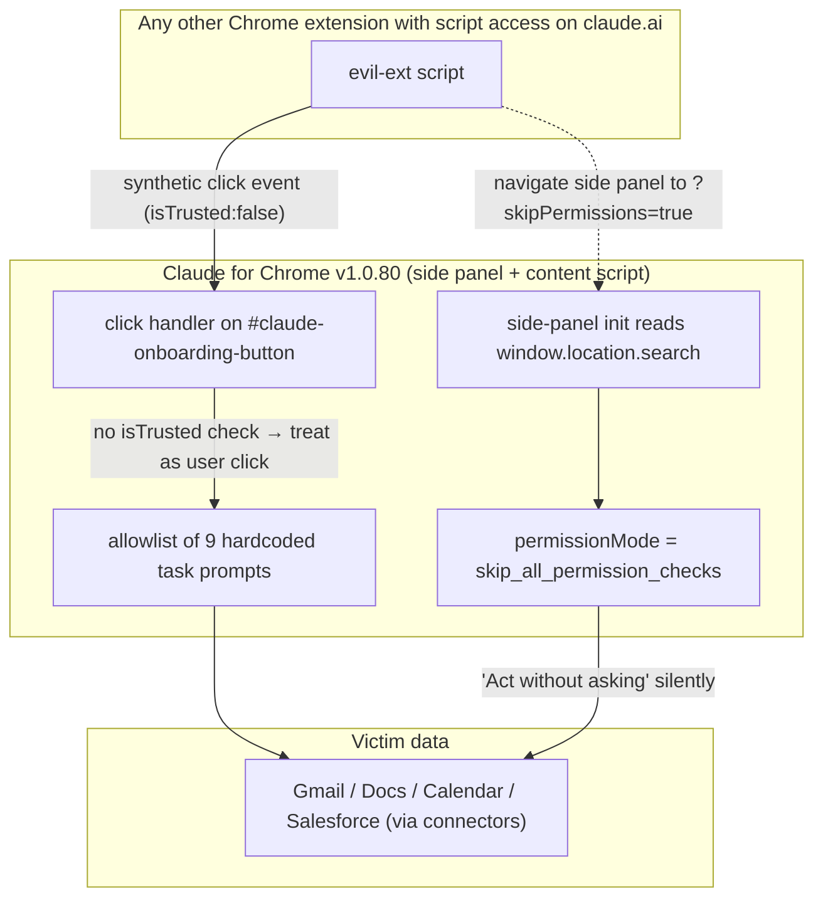

<LevelBadge level="advanced" />

<Callout type="objectives" items={["Understand the two bypasses in Claude for Chrome — a missing event.isTrusted check and a URL-parameter that self-elevates the side panel", "See why Anthropic marking the tracker \"Resolved\" before June 9, then shipping eight more releases (v1.0.73 → v1.0.80) unchanged, is the real story here", "Learn the general defensive pattern: client-only allowlists are not a security boundary when another extension shares your origin", "Take three concrete mitigations you can apply in under two minutes right now"]} />

On **7 July 2026**, Anthropic released **Claude for Chrome v1.0.80**. Manifold Security tested it the same day and found their two May bug reports still reproducible byte-for-byte from v1.0.72. Any other extension on your browser with script access to `claude.ai` — a permission thousands of Chrome extensions request — can silently instruct Claude to open Gmail, read a message, and act on it. No approval dialog. No user gesture.

<VerifyNote lastVerified="2026-07-22" source="https://www.manifold.security/blog/claude-for-chrome-extension-bypass" />

The story is not "an extension had a bug." Chrome extensions ship bugs constantly. The story is that a shipped agentic-browser product, given nine months of scrutiny and a public "ClaudeBleed" incident behind it, still enforces its permission model in a place an attacker fully controls — the client — and marks the tracking issue **Resolved** without the code changing.

## The two flaws in one picture

Two independent bugs. **Either one alone** is enough to trigger every hardcoded task. Together, one gives you the trigger (fake click) and the other gives you silent execution (auto-elevate).

## Flaw #1 — the missing `isTrusted` check

Every event a browser dispatches has an `isTrusted` boolean. Real user actions — a physical click, a keypress, a touch — arrive with `isTrusted: true`. Anything JavaScript synthesises via `dispatchEvent(new MouseEvent(...))` arrives with `isTrusted: false`. It is the browser's only reliable *user-vs-code* signal, and it exists precisely so security-sensitive handlers can tell them apart.

The Claude for Chrome content script listens for clicks on the element with id `#claude-onboarding-button` and, if the click matches one of nine allowlisted task IDs (`usecase-gmail`, `usecase-gdocs`, `usecase-calendar`, `usecase-salesforce`, plus DoorDash, Zillow and three onboarding challenges), forwards the matching prompt to Claude's side panel to execute.

The handler never checks `event.isTrusted`. In the researchers' words: from the extension's point of view, a fake click and a real one are indistinguishable.

That matters because of an easy-to-miss architectural point: **any other Chrome extension you have installed with `content_scripts` matching `https://claude.ai/*` shares Claude's origin from Chrome's perspective, and can inject a script into the page.** That permission is not exotic — password managers, note-clippers, translation tools, ad blockers, and countless "productivity" extensions request it as a matter of course. Once a script runs in that page, dispatching a synthetic click on `#claude-onboarding-button` is roughly six lines of code. Manifold's report calls out that exact size to make a point: the fix is one `if` statement, and the exploit is one dispatch call.

The nine-prompt allowlist was Anthropic's *earlier* mitigation for ClaudeBleed — the idea being "even if a click is faked, only a fixed list of safe tasks can run." That model breaks the moment "run Gmail integration" is on the list. Reading and acting on Gmail is not a safe task.

<Callout type="tip" items={["The lesson isn't \"add isTrusted\" — it's the lesson underneath: an allowlist of \"safe\" agent tasks is only as safe as the least-safe task on it. Fine-grained per-integration user consent belongs on every one of those triggers, not just the untrusted freeform ones."]} />

## Flaw #2 — `?skipPermissions=true` in the panel URL

Chrome extension side panels have their own URL, and that URL's query string is readable inside the panel via `window.location.search`. Claude's side panel reads a `skipPermissions` parameter. If it equals `"true"`, the panel initialises with `permissionMode = "skip_all_permission_checks"` — the same internal mode as when a user manually enables *Act without asking*.

That is client-side, self-served privilege escalation. The panel is asking itself for permission and answering yes based on a value the panel itself received in its URL — which anything that can `chrome.sidePanel.open({...})` or navigate the panel can supply.

Manifold rates that scenario **CVSS 9.6 Critical**, because in that mode there is no approval box at all: the nine allowlisted prompts execute silently. The synthetic-click flaw alone (with the normal approval box still showing) rates 7.7 High, because a user could in principle notice the dialog before pressing enter.

The right shape of the fix is not "sanitise the URL parameter." It is that transitions between permission modes should require an explicit, `isTrusted` user gesture on a real UI control after the panel has loaded — never a value the panel reads out of its own URL, its own storage, or a message channel any other extension can post on. That is the same architectural constraint browsers already apply to fullscreen, camera and clipboard permissions, and for the same reason.

## Why "Resolved" ≠ patched — the process failure

The timeline is what makes this a governance story, not just a code story:

<Steps items={[
{ "title": "21 May 2026 — Manifold reports both issues", "body": "Two separate bug reports filed with Anthropic against v1.0.72." },
{ "title": "22 May — acknowledged and closed", "body": "Anthropic acknowledged both. Report #1 was closed as a duplicate of an existing tracker; report #2 dismissed as \"informational\" on the argument that the URL parameter is \"only used by the extension itself\" — which is exactly the assumption the bug violates." },
{ "title": "Before 9 June — internal tracker marked \"Resolved\"", "body": "The umbrella \"ClaudeBleed\" issue was flipped to Resolved in Anthropic's internal tracking — apparently on the strength of the nine-prompt allowlist mitigation, not a fix for the two underlying bugs." },
{ "title": "7 July — v1.0.80 ships, code byte-identical", "body": "Eight releases (v1.0.73 → v1.0.80) went out between report and now. Researchers re-verified: the click handler and the panel init are unchanged from the version they originally tested." },
{ "title": "14 July — public disclosure", "body": "No CVE. No Anthropic advisory. Public blog post + Hacker News + industry press coverage. As of this page: still unpatched." }
]} />

Two failure modes worth internalising, because they are common outside this story:

1. **Mitigation collapse.** A mitigation that changes an exploit's shape (\"you now have to click one of nine buttons\") gets treated as a fix. When the trigger for those buttons is itself forgeable, the mitigation adds no security — it only changes the attack recipe.
2. **\"Resolved by design\" drift.** Bug #2 was closed on the theory that only the extension itself sets `skipPermissions`. That is a description of *intent*, not of *the browser's actual enforcement*. Anything with `sidePanel` access or a redirect through the panel URL can also set it.

Both patterns show up in security-review anti-patterns lists for a reason. Watch for them in your own code.

## What runs, and what data it can reach

The nine hardcoded task IDs, from Manifold's report:

| Category | Task IDs | Roughly what the prompt tells Claude to do |
| --- | --- | --- |
| Google | `usecase-gmail`, `usecase-gdocs`, `usecase-calendar` | Read Gmail (incl. an "unsubscribe from promo emails" flow that iterates inbox), read Google Docs comments, read Calendar availability and create meetings |
| CRM / commerce | `usecase-salesforce`, `usecase-doordash`, `usecase-zillow` | Read Salesforce leads and convert them to opportunities; run through DoorDash / Zillow flows |
| Onboarding | three onboarding challenges | Guided tour prompts |

Reach depends on which connectors the victim has enabled. If Gmail is connected, `usecase-gmail` reads Gmail. If Salesforce is connected, `usecase-salesforce` touches the CRM. The panel is doing what a user asked it to do — just not *this* user, and not now.

<Callout type="warning" items={["\"Act without asking\" is not a special developer mode. It's a checkbox in Claude for Chrome settings. If it is on, flaw #1 alone triggers real Gmail / Docs / Calendar / Salesforce reads. If it is off, flaw #2 (?skipPermissions=true) can re-enable it silently for the panel's lifetime."]} />

## Three things to do now (two minutes)

<Steps items={[
{ "title": "Turn off Act without asking", "body": "Claude for Chrome settings → disable \"Act without asking\". Approval prompts are annoying, but they are the only user-visible signal that flaw #1 alone leaves you." },
{ "title": "Audit which extensions can touch claude.ai", "body": "chrome://extensions → Details on each → Site access. Anything set to All sites or that lists claude.ai can inject a content script into the Claude page. Downgrade or remove ones you do not actively trust. Password managers and note-clippers are the two categories worth double-checking." },
{ "title": "Prune connectors you don't use", "body": "In Claude → Settings → Connectors, disconnect Gmail / Docs / Calendar / Salesforce integrations you don't rely on. The nine hardcoded tasks are only dangerous against connectors that are actually connected." }
]} />

If you run agentic extensions for a whole team, add a fourth: **runtime observation of what agents actually execute** — not just what permissions they hold. Both flaws pass a permission audit and fail behaviour observation, because they cause the agent to *do* things the user never asked for. That gap is where Manifold's own recommendation lands, and it generalises well beyond this one product.

<PromptCard title="Chrome extension audit prompt for Claude">
{`Here is my current chrome://extensions export (or a list I'll paste): {LIST}.

For each extension:
1. Is its "site access" set to "All sites" or does it match claude.ai? Flag those.
2. From its Chrome Web Store description, what content_scripts permissions does it plausibly require? Is claude.ai a required domain for its stated function?
3. Rate each on a "trust to run a script inside my Claude tab" scale from 1 (dedicated password manager from a known vendor) to 5 (random productivity extension with <10k installs).
4. Give me a two-column recommendation: KEEP AS-IS / RESTRICT TO SPECIFIC SITES / REMOVE — with a one-line reason per row.

Do not soften. If something looks sketchy, say sketchy.`}
</PromptCard>

## The wider pattern — client-only allowlists, agentic scope

Zoom out from Claude for Chrome. The same shape shows up in a growing number of agentic products:

- A trusted UI (extension, desktop app, IDE plugin) exposes an agent that can take real actions on user data.
- To constrain risk, the vendor adds an **allowlist** of tasks/prompts/tools the agent may execute without approval.
- The **trigger** for entries on the allowlist stays *inside the client* — a click, a URL, a stored setting, a message on a channel other components share.
- Any other code in the same trust zone (same extension host, same origin, same IPC bus) can forge the trigger.

The lesson each round teaches is the same. Cf. also `docs/security/agentic-browsers-same-origin.mdx` (agent reads-above-SOP), `docs/security/coding-agents-under-attack.mdx` (auto-approve is the new attack surface) and `docs/security/prompt-injection.mdx` (untrusted content becomes untrusted instructions). Every one of those is a case of *the boundary is drawn where the attacker already stands*.

Two invariants worth writing on a sticky note:

1. **A permission check the attacker can call is not a permission check.** If any of "any script on this page", "any URL parameter", "any storage value", or "any postMessage from unknown origin" can flip your agent from *ask* to *act*, that flip belongs behind an `isTrusted` gesture on a real DOM element you rendered.
2. **Allowlists are not a substitute for consent.** If any single task on the list would surprise the user when executed unprompted (`read my Gmail` qualifies), the allowlist reduces attacker choice but not attacker impact.

## Quick check

<Quiz questions={[
  {
    "q": "In Claude for Chrome v1.0.80, why does an ordinary Chrome extension that has script access to claude.ai suffice to trigger the nine allowlisted tasks?",
    "options": [
      "Because the extension can call the Claude API directly using the user's session cookie.",
      "Because the click handler on #claude-onboarding-button does not verify event.isTrusted, so a synthetic click from any script in the page is treated as user input.",
      "Because Chrome exposes the extension's private key to same-origin scripts.",
      "Because Claude side-loads the attacker's extension code into its own process."
    ],
    "answer": 1,
    "explain": "The bug is the missing isTrusted check. A synthetic MouseEvent dispatched from any script running in the Claude page passes through the handler as if the user clicked. No API key exposure or process crossing required — just script access to the page."
  },
  {
    "q": "What is the actual mechanism of the ?skipPermissions=true bypass?",
    "options": [
      "The URL parameter is sent to Anthropic's server, which returns an admin token.",
      "The side panel reads window.location.search itself and, if skipPermissions equals \"true\", sets its permissionMode to skip_all_permission_checks locally — no server involved.",
      "It disables Chrome's same-origin policy for the panel.",
      "It grants the panel Chrome's debugger permission."
    ],
    "answer": 1,
    "explain": "It's client-only, self-served privilege escalation. The panel asks itself for elevated permission and reads the answer out of its own URL — which anything able to open or navigate the panel controls."
  },
  {
    "q": "Anthropic marked the underlying tracker \"Resolved\" before 9 June 2026, yet v1.0.80 (7 July) is byte-identical to v1.0.72. Which failure mode does this best illustrate?",
    "options": [
      "A supply-chain compromise of the extension's build pipeline.",
      "Mitigation collapse: the nine-prompt allowlist was treated as a fix, but the trigger for those prompts is itself forgeable, so the allowlist changes the exploit's shape without reducing its impact.",
      "A bug in Chrome's manifest v3 permission model.",
      "Anthropic revoking Manifold's disclosure agreement."
    ],
    "answer": 1,
    "explain": "The allowlist was Anthropic's earlier ClaudeBleed mitigation. It only helps if the trigger to select an entry is trustworthy. The missing isTrusted check makes the trigger forgeable, so the mitigation reduces attacker choice, not attacker impact — but the tracker was closed as if it were a fix."
  },
  {
    "q": "Which of these is the strongest single mitigation a Claude for Chrome user can apply right now?",
    "options": [
      "Disable JavaScript on claude.ai.",
      "Uninstall Google Chrome.",
      "Disable \"Act without asking\" and audit which other extensions have script access to claude.ai.",
      "Rotate the Anthropic API key."
    ],
    "answer": 2,
    "explain": "Disabling \"Act without asking\" restores the approval prompt (so flaw #1 alone becomes user-visible), and pruning extensions with claude.ai script access removes the party that can dispatch the synthetic click in the first place. Rotating an API key does nothing here — the attack rides the user's UI session, not an API credential."
  }
]}/>

<Callout type="takeaways" items={["v1.0.80 of Claude for Chrome (7 Jul 2026) is still vulnerable to the two Manifold bugs first reported on v1.0.72 in May — synthetic-click bypass of the nine-prompt allowlist, and self-elevation via ?skipPermissions=true in the panel URL.", "Both bugs are client-only permission checks. \"Resolved\" in the tracker referred to a mitigation (the allowlist), not to the underlying enforcement gaps.", "Right now: turn off Act without asking, audit which other Chrome extensions can inject scripts into claude.ai, and disconnect connectors you don't use.", "General rule: a permission check any script on the page can call is not a permission check. Mode transitions must ride an isTrusted gesture on a real UI element, not a URL / storage / message value."]} />

## Sources & further reading

- Manifold Security — [ClaudeBleed Reopened: browser extensions can still push Claude for Chrome to read your Gmail](https://www.manifold.security/blog/claude-for-chrome-extension-bypass) (primary technical write-up; timeline, CVSS ratings, the byte-identical-code observation)
- The Hacker News — [Researchers Say Claude for Chrome Flaw Lets Rogue Extensions Trigger Gmail Reads](https://thehackernews.com/2026/07/claude-for-chrome-flaw-lets-other.html) (industry coverage; Anthropic's public response)
- BleepingComputer — [Claude Chrome extension flaw lets malicious extensions trigger AI actions](https://www.bleepingcomputer.com/news/security/claude-chrome-extension-flaw-lets-malicious-extensions-trigger-ai-actions/) (attack surface, permission requirements)
- TechRadar — [The bypass is still six lines of JavaScript](https://www.techradar.com/pro/the-bypass-is-still-six-lines-of-javascript-security-experts-warn-that-claude-for-chrome-browser-extension-could-be-hijacked-despite-it-alerting-anthropic-several-times-that-something-was-wrong) (context on why the fix is a single conditional)
- Related on AILmanac: [Agentic Browsers Break the Same-Origin Policy](/docs/security/agentic-browsers-same-origin), [When Coding Agents Get Weaponized](/docs/security/coding-agents-under-attack), [Prompt Injection: the safety model you can't ignore](/docs/security/prompt-injection)
- OWASP — [Top 10 for LLM Applications](https://genai.owasp.org/llm-top-10/) (LLM01 Prompt Injection & LLM06 Excessive Agency are the two categories these bugs map to)
