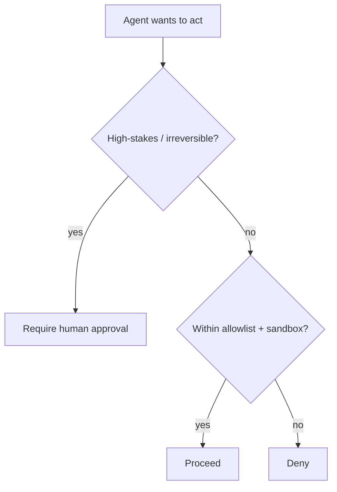

<LevelBadge level="advanced" />

<Callout type="objectives" items={["Apply least privilege — give an agent only the access its job needs", "Recognize the confused-deputy problem: an agent borrows your authority", "Layer the five defenses that shrink the blast radius when an agent is tricked", "Decide which actions demand a human in the loop", "Validate tool inputs so a bad or manipulated argument can't execute"]} />

The moment an AI can **take actions** (call tools, run code, hit APIs), it inherits a security model. The goal isn't to make the model un-trickable — it's to make sure that **even if it's tricked, it can't do much harm**.

## The core principle: least privilege

Give an agent the **minimum** access its job requires, nothing more.

- A doc-summarizer needs **read**, not write or network.
- A reviewer needs to read code and post a comment — not push or deploy.
- Scope tools, API keys, and file access per-task. A narrowly-scoped agent that gets [injected](/docs/security/prompt-injection) can only do narrow damage.

## The confused-deputy problem

An agent often acts **with your authority** (your tokens, your sessions). If attacker-controlled input steers it, the attacker borrows your privileges — a "confused deputy." Defense: don't hand the agent ambient authority it doesn't need, and require explicit, scoped credentials for sensitive tools. When the agent reaches tools through a remote MCP server, this same trap has a specific rule — see [securing MCP servers](/docs/security/securing-mcp-servers#the-confused-deputy-never-pass-the-token-through).

## Defense layers

Stack these — no single one is sufficient. Each layer assumes the ones above it might fail.

<Steps items={[
  {title: "Sandbox execution and file access", body: "Run code and file operations in containers or ephemeral dirs with no access to the broader system or secrets. If the agent is tricked, it plays in a box."},
  {title: "Allowlist the dangerous surface", body: "Decide which commands, which domains, and which paths are permitted — deny the rest. In Claude Code, that's permissions (/docs/claude-code/permissions)."},
  {title: "Human-in-the-loop for high stakes", body: "Require explicit approval for irreversible or sensitive actions: send money, send email, delete, deploy, or change production config."},
  {title: "Separate trust zones", body: "Don't let one agent simultaneously hold secrets, read untrusted content, and make arbitrary outbound calls — that combination is the exfiltration path."},
  {title: "Log and review tool calls", body: "Record what tools the agent actually invoked and with what arguments, so you can audit behavior and catch drift."}
]} />

## Put an allowlist in writing

"Allowlist the dangerous surface" is easy to nod at and easy to skip. In Claude Code it's concrete: a `settings.json` that permits the narrow set of commands and domains the task needs and denies the rest. Start restrictive and widen only when a real task blocks.

<PromptCard title="A least-privilege Claude Code permissions block">{`{
  "permissions": {
    "allow": [
      "Read",
      "Edit",
      "Bash(npm test:*)",
      "Bash(npm run build:*)",
      "Bash(git status)",
      "Bash(git diff:*)"
    ],
    "deny": [
      "Bash(git push:*)",
      "Bash(rm:*)",
      "Bash(curl:*)",
      "Read(./.env)",
      "Read(./secrets/**)"
    ]
  }
}`}</PromptCard>

The `deny` list wins over `allow`, so blocking `.env` and `secrets/**` holds even if a broad `Read` is granted. See [permissions](/docs/claude-code/permissions) for the full rule syntax and precedence.

## Tools have schemas — validate them

Tool inputs the model produces can be wrong or manipulated. **Validate** arguments before executing, and **return errors as results** so the agent recovers instead of retrying blindly.

<Flashcards title="Drill the core terms" cards={[{front: "Least privilege", back: "Give an agent only the access its specific job needs — nothing more. A narrowly-scoped agent that gets tricked can only do narrow damage."}, {front: "Confused deputy", back: "An agent acts with your authority (your tokens, your sessions). If attacker-controlled input steers it, the attacker borrows your privileges."}, {front: "Sandbox", back: "Run code and file access in an isolated container or ephemeral dir with no path to the broader system or secrets, so a tricked agent stays boxed in."}, {front: "Trust zones", back: "Keep secrets, untrusted content, and outbound network in separate agents. One agent holding all three is an exfiltration path."}, {front: "Human-in-the-loop", back: "A required human approval gate before irreversible or sensitive actions — send money, delete, deploy, change production config."}]} />

<Quiz title="Check yourself" questions={[
  {
    q: "What does the principle of least privilege ask you to do when configuring an agent?",
    options: ["Give it broad access so it never gets blocked mid-task", "Give it only the access its specific job requires", "Give it the same permissions as the human who runs it"],
    answer: 1,
    explain: "Least privilege means the minimum access the job needs. A narrowly-scoped agent that gets injected can only do narrow damage."
  },
  {
    q: "Why is an agent that acts with your tokens a 'confused deputy' risk?",
    options: ["It confuses which model to call", "Attacker-controlled input can steer it to use your privileges", "It deputizes other agents without asking"],
    answer: 1,
    explain: "The agent holds your authority. If attacker-controlled input steers it, the attacker effectively borrows your privileges — the confused-deputy problem."
  },
  {
    q: "In a Claude Code permissions block, which entry reliably keeps the agent from reading a secrets file?",
    options: ["An allow entry for Read", "A deny entry for the secrets path, since deny wins over allow", "Removing the Bash tool"],
    answer: 1,
    explain: "Deny takes precedence over allow, so a deny on secrets/** holds even when a broad Read is granted."
  }
]} />

<Callout type="takeaways" items={["Least privilege first: scope tools, keys, and file access per task so a tricked agent can only do narrow damage", "An agent acts with your authority — don't hand it ambient privileges it doesn't need (the confused-deputy problem)", "Stack the five layers: sandbox, allowlist, human-in-the-loop, separate trust zones, log and review", "In Claude Code, deny rules beat allow rules — block .env and secrets paths explicitly", "Validate tool arguments before executing, and return errors as results so the agent recovers instead of retrying blindly"]} />

## Next

- [Prompt Injection Explained](/docs/security/prompt-injection)
- [Hardening Autonomous Runs](/docs/security/hardening-autonomous-runs)
- [Reviewing Third-Party Code](/docs/security/reviewing-third-party-code)
