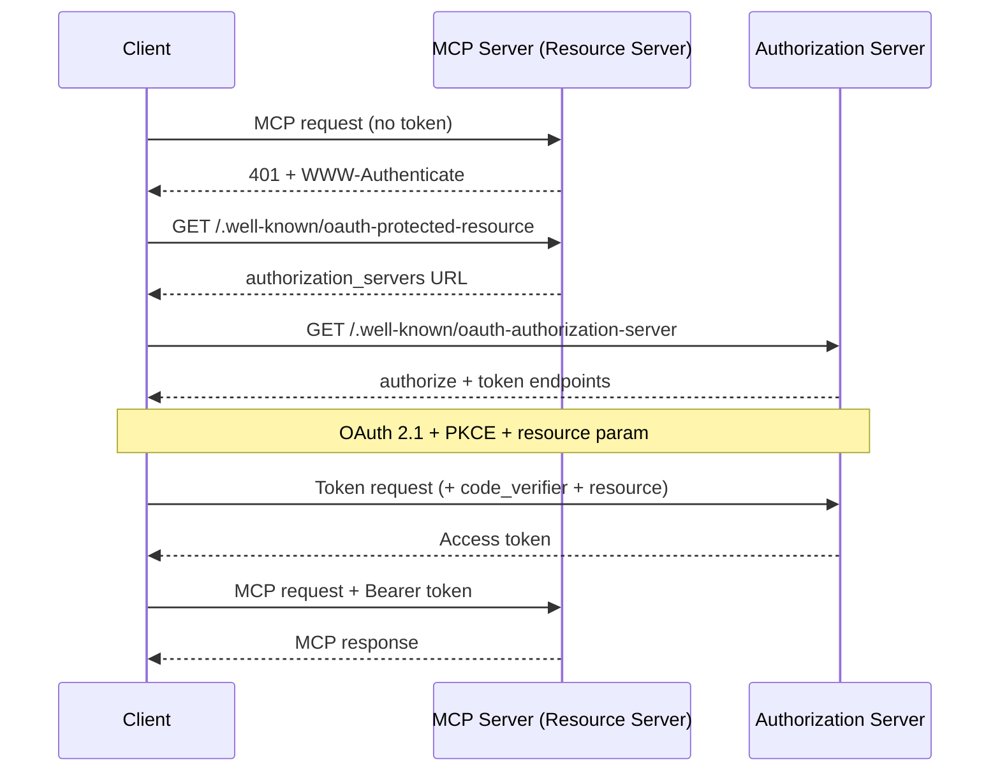
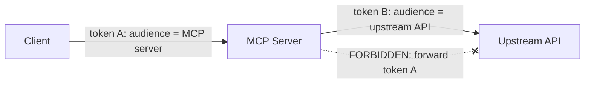

<LevelBadge level="advanced" />

<Callout type="objectives" items={["Understand why a remote (HTTP) MCP server is an OAuth 2.1 resource server, not just an API key endpoint", "Trace the discovery handshake: 401 → Protected Resource Metadata → Authorization Server Metadata → token", "Explain token audience binding (RFC 8707) and why it stops one service's token from working at another", "Name the confused-deputy trap and the one rule that closes it: never pass a client's token through to an upstream API", "Apply a short hardening checklist before you expose an MCP server to the internet"]} />

[MCP](/docs/claude-code/mcp) went from novelty to the default way agents reach tools — which means MCP servers now sit in front of real data and real actions. A local server you launch over **STDIO** trusts its environment: it reads credentials from env vars and there's no network boundary to defend. The moment you make that same server **remote** (HTTP), anyone who can reach the URL can try to call it. That flips it into an authorization problem, and the MCP spec answers with **OAuth 2.1** — not a bespoke API-key scheme.

This page is about the remote case. If your server is STDIO-only, the spec explicitly says *don't* follow the OAuth flow — pull credentials from the environment and move on.

<VerifyNote lastVerified="2026-07-07" source="https://modelcontextprotocol.io/specification/2025-06-18/basic/authorization" />

## The three roles

OAuth splits the problem into three parties. MCP maps onto them cleanly:

<Flashcards title="Who is who in an MCP OAuth flow" cards={[{front: "MCP server = Resource Server", back: "The protected thing. It accepts requests carrying an access token, validates the token, and returns data — or a 401 if the token is missing or wrong. It does NOT log the user in."}, {front: "MCP client = OAuth client", back: "Your agent host (Claude Code, the desktop app, your own code). It obtains a token on the user's behalf and attaches it to every request as a Bearer header."}, {front: "Authorization Server (AS)", back: "The party that actually talks to the user, gets consent, and issues tokens. May be hosted with the server or be a separate identity provider. Its internals are out of MCP's scope."}]} />

The key mental shift: **the MCP server never handles the login itself.** It only validates tokens someone else issued. That separation is what lets you put an off-the-shelf identity provider in front of a server you wrote.

## The discovery handshake

A client shouldn't need to be pre-configured with where to authenticate. MCP makes discovery automatic, driven by a `401`:

<Steps items={[
  {title: "Client calls the server with no token", body: "The very first request goes out bare. The server rejects it with HTTP 401 Unauthorized and a WWW-Authenticate header pointing at its resource-metadata URL."},
  {title: "Client fetches Protected Resource Metadata (RFC 9728)", body: "It GETs /.well-known/oauth-protected-resource on the server. The document's authorization_servers field names at least one Authorization Server the client can use."},
  {title: "Client fetches Authorization Server Metadata (RFC 8414)", body: "It GETs the AS's /.well-known/oauth-authorization-server to learn the authorize and token endpoints and supported capabilities."},
  {title: "Optional: Dynamic Client Registration (RFC 7591)", body: "If the client has no client ID for this AS, it can POST /register to obtain one with no human in the loop — crucial because a client can't know every MCP server in advance."},
  {title: "OAuth 2.1 authorization with PKCE + resource", body: "The client generates a PKCE verifier/challenge, opens the browser to the authorize URL including the resource parameter, the user consents, and the client exchanges the returned code (with the verifier) for an access token."},
  {title: "Client retries with the token", body: "Now every request carries Authorization: Bearer <token>. The server validates it and responds."}
]} />

Notice there's **no hardcoded auth config** on the client side — the `401` bootstraps everything. That's the whole point: an agent can connect to a server it has never seen and figure out how to authenticate.

## Audience binding: the load-bearing rule

Here's the failure mode that audience binding exists to prevent. Say a user has a token issued for `calendar.example.com`. A malicious (or just sloppy) MCP server at `evil.example.com` tricks the client into sending *that* token to it. If `evil` accepts it, it can now turn around and call the calendar API as the user. One service's token worked at another. OAuth's security boundary just collapsed.

The fix is **Resource Indicators (RFC 8707)**:

<Steps items={[
  {title: "Client declares the target", body: "On both the authorization request and the token request, the client MUST include a resource parameter set to the canonical URI of the MCP server it intends to call — e.g. resource=https://mcp.example.com. It sends this even if it's unsure the AS supports it."},
  {title: "AS binds the token to that audience", body: "When supported, the AS stamps the token so it is only valid for that specific resource server."},
  {title: "Server validates the audience", body: "Before doing any work, the MCP server MUST verify the token was issued for IT — checking the audience claim (RFC 9068). A token minted for anyone else gets a 401, full stop."}
]} />

<PromptCard title="Resource parameter on the authorization request (URL-encoded)">{`&resource=https%3A%2F%2Fmcp.example.com`}</PromptCard>

Canonical URIs are strict: `https://mcp.example.com` and `https://mcp.example.com:8443/mcp` are valid; `mcp.example.com` (no scheme) and `https://mcp.example.com#frag` (fragment) are not. Prefer the form without a trailing slash for interoperability.

## The confused deputy: never pass the token through

This is the mistake that turns a well-meaning MCP server into an attacker's proxy. It's the same [confused-deputy problem](/docs/security/securing-agents#the-confused-deputy-problem) from agent security, sharpened to one concrete rule.

An MCP server often needs to call an **upstream API** (GitHub, a database service, another SaaS). The temptation is to take the token the client handed you and forward it upstream. **Don't.** The spec is blunt: the MCP server **MUST NOT** pass through the token it received from the client.

Why it's dangerous: the client's token was issued for *your* server as its audience. If you forward it, the upstream API may trust it as though it came from you, or assume you already validated it — and now a token scoped for one hop is doing work two hops away, outside anyone's consent model.

<Callout type="warning" items={["If your MCP server calls an upstream API, it acts as a SEPARATE OAuth client to that API and obtains its OWN token from the upstream authorization server. Two independent tokens, two independent audiences. The client's token stops at your door."]} />

## A pre-flight hardening checklist

Before a remote MCP server touches the public internet:

<Steps items={[
  {title: "Serve everything over HTTPS", body: "All AS endpoints MUST be HTTPS. Redirect URIs MUST be HTTPS or localhost — nothing else."},
  {title: "Validate audience on every request", body: "Reject any token not issued specifically for this server. This is the single check that stops cross-service token reuse."},
  {title: "Require PKCE", body: "Clients MUST use PKCE so an intercepted authorization code is useless without the matching verifier."},
  {title: "Pin exact redirect URIs", body: "The AS MUST match redirect URIs exactly against pre-registered values, and clients SHOULD use and verify the state parameter — both defend against open-redirect phishing."},
  {title: "Short-lived tokens + refresh rotation", body: "Issue short-lived access tokens to limit the damage of a leak; for public clients, rotate refresh tokens. Store tokens securely and never log them."},
  {title: "Never put tokens in the URL", body: "Tokens go in the Authorization header, never the query string, where they'd land in logs and referrers."},
  {title: "Layer on the agent-security basics", body: "Audience binding is the transport gate; still apply least privilege, sandboxing, and human-in-the-loop from /docs/security/securing-agents. Auth says WHO — it doesn't say the request is safe."}
]} />

## Check yourself

<Quiz title="Check yourself" questions={[
  {
    q: "A remote MCP server receives a request with no access token. What does the spec require it to do first?",
    options: [
      "Prompt the user for a username and password",
      "Return HTTP 401 with a WWW-Authenticate header pointing at its resource-metadata URL",
      "Silently proxy the request to its upstream API",
      "Issue the client a token itself"
    ],
    answer: 1,
    explain: "The server is a resource server, not a login page. It answers a tokenless request with 401 + WWW-Authenticate, which bootstraps the client's discovery of the authorization server."
  },
  {
    q: "What is token audience binding (RFC 8707) protecting against?",
    options: [
      "Slow token validation",
      "A token issued for one service being accepted and reused at a different service",
      "Users forgetting their passwords",
      "Large context windows"
    ],
    answer: 1,
    explain: "The resource parameter binds a token to the specific server it was minted for. The server then validates the audience claim and rejects any token issued for someone else — closing the cross-service reuse hole."
  },
  {
    q: "Your MCP server needs to call an upstream GitHub API. What should it do with the access token the client sent it?",
    options: [
      "Forward that same token to GitHub to save a round trip",
      "Nothing with GitHub — obtain its own separate token as an OAuth client to GitHub, and never pass the client's token through",
      "Log the token so it can be replayed later",
      "Put the token in the GitHub request URL"
    ],
    answer: 1,
    explain: "Passing the client's token upstream is the confused-deputy trap and is explicitly forbidden. The server acts as its own OAuth client to the upstream API with a separate token bound to that API's audience."
  },
  {
    q: "For a STDIO (local) MCP server, how does the spec say credentials should be handled?",
    options: [
      "Run the full OAuth 2.1 browser flow every launch",
      "Retrieve them from the environment — the OAuth authorization flow is for HTTP transports, not STDIO",
      "Hardcode them in the client",
      "Skip authentication entirely for all transports"
    ],
    answer: 1,
    explain: "The spec says STDIO transports SHOULD NOT follow the HTTP authorization flow and instead read credentials from the environment. OAuth here is specifically for remote, HTTP-based servers."
  }
]} />

## Sources & further reading

- [MCP Authorization specification (2025-06-18)](https://modelcontextprotocol.io/specification/2025-06-18/basic/authorization) — the normative flow, roles, and MUST/SHOULD requirements this page summarizes.
- [MCP Security Best Practices](https://modelcontextprotocol.io/specification/2025-06-18/basic/security_best_practices) — token passthrough, confused deputy, and why they're forbidden.
- [RFC 8707 — Resource Indicators for OAuth 2.0](https://www.rfc-editor.org/rfc/rfc8707.html) — the `resource` parameter and audience binding.
- [RFC 9728 — OAuth 2.0 Protected Resource Metadata](https://datatracker.ietf.org/doc/html/rfc9728) — how a resource server advertises its authorization servers.
- [RFC 8414 — OAuth 2.0 Authorization Server Metadata](https://datatracker.ietf.org/doc/html/rfc8414) and [RFC 7591 — Dynamic Client Registration](https://datatracker.ietf.org/doc/html/rfc7591).
- [OAuth 2.1 draft](https://datatracker.ietf.org/doc/html/draft-ietf-oauth-v2-1-13) — PKCE, communication security, and token-handling requirements.
- Related on AILmanac: [Securing Agents & Tools](/docs/security/securing-agents) · [Prompt Injection](/docs/security/prompt-injection) · [MCP in Claude Code](/docs/claude-code/mcp).
