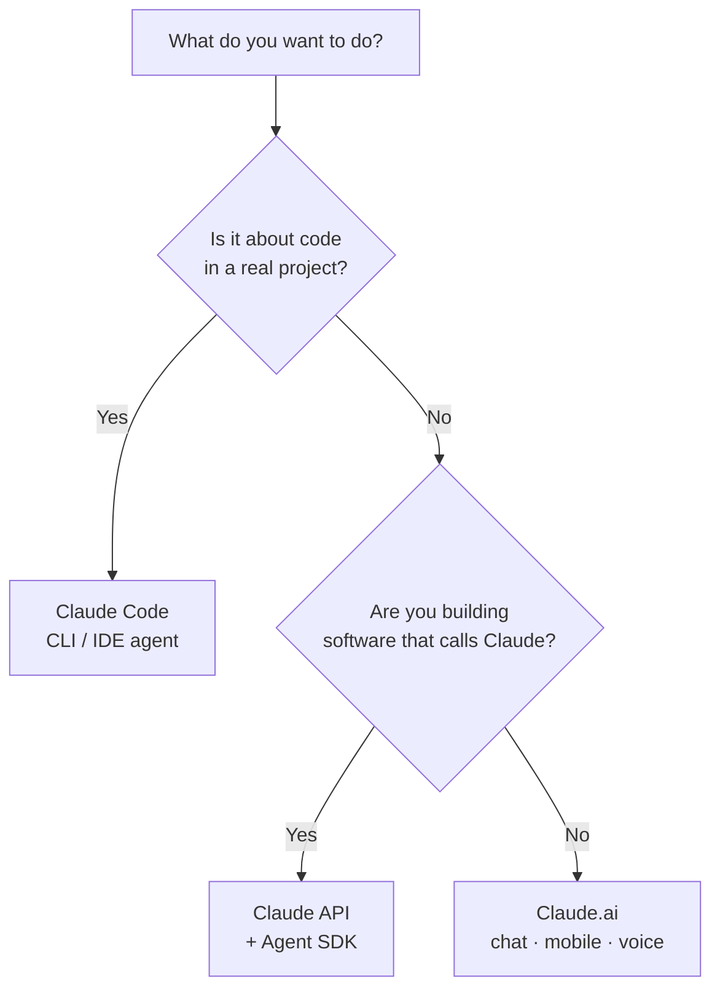

<LevelBadge level="beginner" />

"Claude" comes in a few flavors. Pick by **what you're trying to do**, not by which you've heard of.

<Callout type="objectives" items={[
  "Match your goal to the right Claude surface: chat, Claude Code, or the API",
  "Know when mobile and voice fit into the picture",
  "Understand how the three surfaces work together as you level up",
  "Get a quick read on which model to reach for once you start building"
]} />

## The 30-second decision

## The three surfaces at a glance

| Surface | Best for | Who | Start here |
|---|---|---|---|
| **Claude.ai** | Writing, research, analysis, learning, planning, everyday questions | Everyone, no setup | [Getting Started with Claude.ai](/docs/claude-app/getting-started) |
| **Claude Code** | Working *in a codebase* — reading, editing, running commands, fixing tests | Developers (and the technically curious) | [What Claude Code Is](/docs/claude-code/what-is-claude-code) |
| **API & Agent SDK** | Apps, automations, and agents that call Claude programmatically | Developers shipping a product or pipeline | [Your First API Call](/docs/api/first-call) |

### Claude.ai — the chat apps

Claude.ai is the no-setup starting point for everyone. You also get it on **mobile** ([iOS/Android](/docs/claude-app/mobile)) and by **[voice](/docs/claude-app/voice-mode)** — great for capturing ideas on the go. Power it up with [Projects](/docs/claude-app/projects), [custom instructions](/docs/claude-app/custom-instructions), and [Artifacts](/docs/claude-app/artifacts).

### Claude Code — the agentic coding tool

Claude Code works *inside* your project. It reads, edits, runs commands, and fixes tests — acting on your files with your permission.

### The API & Agent SDK — build Claude into your own software

The API and Agent SDK let your own software call Claude programmatically, so you can ship AI features, automations, and agents.

## They work together

These aren't rival products — most people graduate across them:

| You want to… | Use |
|---|---|
| Draft an email, summarize a PDF, brainstorm | Claude.ai (or voice/mobile) |
| Refactor a module, add tests, fix a bug | Claude Code |
| Add an AI feature to *your* app | The API / Agent SDK |

:::tip Not sure? Start with chat
[Claude.ai](/docs/claude-app/getting-started) needs zero setup and teaches you how Claude "thinks." The skills transfer everywhere else.
:::

## Which model, once you're building?

Picking a *surface* is step one. When you move to Claude Code or the API, you also pick a *model* — Haiku, Sonnet, or Opus. Answer three quick questions and this picker suggests a starting point:

<ModelPicker />

:::note Don't hard-code the names
Model lineups and prices change. Always confirm the current model IDs on the [Choosing a Claude Model](/docs/api/choosing-a-model) page before you ship.
:::

## Check yourself

<Quiz title="Check yourself" questions={[
  {
    q: "You want to draft an email and summarize a PDF — no setup. Which surface?",
    options: ["Claude Code", "Claude.ai (chat / mobile / voice)", "The API & Agent SDK"],
    answer: 1,
    explain: "Claude.ai is the no-setup chat surface for writing, research, and everyday questions — available on web, mobile, and by voice."
  },
  {
    q: "You need to refactor a module and fix failing tests inside a real project. Which surface?",
    options: ["Claude.ai", "Claude Code", "The API & Agent SDK"],
    answer: 1,
    explain: "Claude Code works inside your codebase — reading, editing, running commands, and fixing tests with your permission."
  },
  {
    q: "Where should you confirm the current model names and prices?",
    options: ["This page", "The Choosing a Claude Model page", "The Mermaid diagram above"],
    answer: 1,
    explain: "Model lineups change, so this page doesn't hard-code them — check the Choosing a Claude Model page for current IDs and pricing."
  }
]} />

<Callout type="takeaways" items={[
  "Claude.ai: zero-setup chat for writing, research, and everyday work — also on mobile and by voice",
  "Claude Code: an agent that acts inside your codebase",
  "API & Agent SDK: build Claude into your own software",
  "They compose — most people start with chat and graduate to Code and the API",
  "Pick a model (Haiku / Sonnet / Opus) only once you're building, and verify current IDs before shipping"
]} />

## Next

- [Your First 5 Minutes](/docs/start-here/your-first-5-minutes)
- [Learning Paths](/docs/start-here/learning-paths)
- [Choosing a Claude Model](/docs/api/choosing-a-model) (once you're building)
