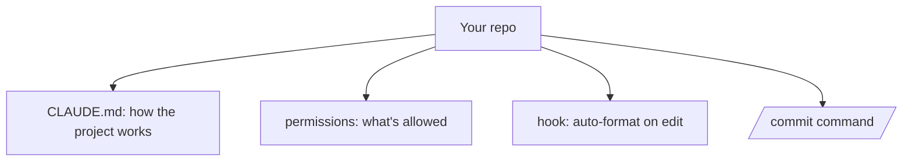

<LevelBadge level="intermediate" />

<Callout type="objectives" items={["Turn a fresh checkout into a tuned Claude Code setup in about 20 minutes", "Understand WHY each of the four customizations earns its place — CLAUDE.md, permissions, a hook, a command", "Write permission rules that cut interruptions on safe actions and hard-stop the risky ones", "Verify each piece actually works instead of assuming it did"]} />

Let's turn a fresh checkout into a Claude Code setup that *knows your project and respects your rules* — in about 20 minutes. We'll string together the core features with the rationale for each.

## The end state



## Step 1 — Generate and trim CLAUDE.md

Run `/init` to draft a [CLAUDE.md](/docs/claude-code/claude-md), then **edit it down** to what's true: stack, how to run/test/lint, real conventions, and guardrails ("run tests before done", "don't touch `/generated`"). *Why:* it's the highest-leverage customization — Claude reads it every session.

Grab a starter from [CLAUDE.md Templates](/docs/templates/claude-md).

## Step 2 — Set permissions

Add a `.claude/settings.json` ([reference](/docs/claude-code/settings)) that pre-allows safe, repetitive commands and denies the dangerous:

```json
{
  "permissions": {
    "allow": ["Read", "Bash(npm run test:*)", "Bash(npm run lint)", "Bash(git diff:*)"],
    "ask": ["Write", "Bash(npm install:*)"],
    "deny": ["Read(./.env)", "Bash(git push --force:*)"]
  }
}
```

*Why:* fewer interruptions on safe actions, hard stops on risky ones. See [Permissions](/docs/claude-code/permissions).

## Step 3 — Add a formatting hook

Auto-format after every edit ([hooks](/docs/claude-code/hooks)):

```json
{ "hooks": { "PostToolUse": [ { "matcher": "Edit|Write",
  "hooks": [ { "type": "command", "command": "npx prettier --write \"$CLAUDE_FILE_PATH\" 2>/dev/null || true" } ] } ] } }
```

*Why:* consistent formatting, guaranteed — not "please remember."

## Step 4 — Add a `/commit` command

Drop the `/commit` recipe from the [Slash Command Library](/docs/templates/slash-commands) into `.claude/commands/`. *Why:* one word for a repeatable workflow.

## Step 5 — Use Plan Mode for the first real task

Give a real goal in [Plan Mode](/docs/claude-code/plan-mode), review the plan, then let it execute. *Why:* build trust by separating thinking from doing.

## Verify it worked

Don't assume — check each piece independently. Each test isolates one customization, so a failure tells you exactly which file to fix.

<Steps items={[{title: "CLAUDE.md works", body: "Start a NEW session and give a normal task. Claude should reference your conventions unprompted, without you pasting them."}, {title: "The hook works", body: "Edit a file and let Claude write it. It should come back formatted — with no reminder from you."}, {title: "Permissions work", body: "Try a risky command. Claude should ask, or refuse outright, rather than just running it."}, {title: "The command works", body: "Run /commit. You should get a clean Conventional Commit message from one word."}]} />

<PromptCard title="Kick off the first real task in Plan Mode">{`Add pagination to the users list endpoint. Plan it first — I want to review before you touch anything.`}</PromptCard>

<Callout type="takeaways" items={["CLAUDE.md is the highest-leverage customization because Claude reads it every session — generate it with /init, then edit it down to what's actually true", "Permissions are a two-sided tool: pre-allow safe repetitive commands to cut interruptions, and deny the dangerous ones to get hard stops", "A hook makes formatting guaranteed rather than \"please remember\" — behavior enforced by the harness beats behavior requested in a prompt", "A slash command turns a repeatable workflow into one word", "Plan Mode separates thinking from doing, which is how you build trust before handing over more autonomy", "Verify each customization with its own test so a failure points at one file"]} />

<Quiz title="Check yourself" questions={[{q: "Why is CLAUDE.md called the highest-leverage customization?", options: ["It's the only file Claude Code can write to", "Claude reads it every session, so it shapes every task without you repeating yourself", "It overrides the permission rules"], answer: 1, explain: "Claude reads CLAUDE.md every session. That's the leverage — stack, commands, conventions, and guardrails land in context automatically instead of being re-pasted. Which is also why you edit it down to only what's true."}, {q: "You want auto-formatting to be guaranteed, not merely requested. What's the right mechanism?", options: ["A line in CLAUDE.md saying \"always format after editing\"", "A PostToolUse hook matching Edit|Write that runs your formatter", "A permission allow rule for the formatter command"], answer: 1, explain: "A hook is enforced by the harness — it runs whether or not the model remembers. An instruction in CLAUDE.md is a request the model can miss; a permission rule only governs whether a command is ALLOWED, not whether it runs."}, {q: "In the example settings.json, why are some commands in \"allow\" and others in \"ask\"?", options: ["\"ask\" commands are dangerous and should be in \"deny\" instead", "Pre-allowing safe repetitive commands cuts interruptions, while \"ask\" keeps a human in the loop for actions with side effects", "\"allow\" is for read operations only"], answer: 1, explain: "The split is about interruption cost versus risk. Safe, repetitive things like Read and test runs are pre-allowed so they never interrupt you; things with real side effects like Write or npm install go to \"ask\"; and genuinely dangerous ones like force-push go to \"deny\" as a hard stop."}]} />

## Next

- [Write Your First Skill](/docs/walkthroughs/first-skill)
- [Hooks & settings.json Recipes](/docs/templates/hooks-settings)
- [Coding & Software Development](/docs/playbooks/coding)
