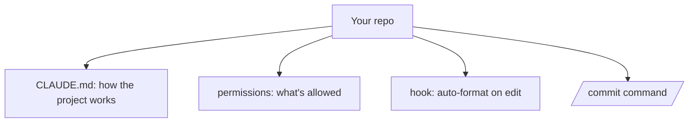

<LevelBadge level="intermediate" />

Let's turn a fresh checkout into a Claude Code setup that *knows your project and respects your rules* — in about 20 minutes. We'll string together the core features with the rationale for each.

## The end state



## Step 1 — Generate and trim CLAUDE.md

Run `/init` to draft a [CLAUDE.md](/docs/claude-code/claude-md), then **edit it down** to what's true: stack, how to run/test/lint, real conventions, and guardrails ("run tests before done", "don't touch `/generated`"). *Why:* it's the highest-leverage customization — Claude reads it every session.

Grab a starter from [CLAUDE.md Templates](/docs/templates/claude-md).

## Step 2 — Set permissions

Add a `.claude/settings.json` ([reference](/docs/claude-code/settings)) that pre-allows safe, repetitive commands and denies the dangerous:

```json
{
  "permissions": {
    "allow": ["Read", "Bash(npm run test:*)", "Bash(npm run lint)", "Bash(git diff:*)"],
    "ask": ["Write", "Bash(npm install:*)"],
    "deny": ["Read(./.env)", "Bash(git push --force:*)"]
  }
}
```

*Why:* fewer interruptions on safe actions, hard stops on risky ones. See [Permissions](/docs/claude-code/permissions).

## Step 3 — Add a formatting hook

Auto-format after every edit ([hooks](/docs/claude-code/hooks)):

```json
{ "hooks": { "PostToolUse": [ { "matcher": "Edit|Write",
  "hooks": [ { "type": "command", "command": "npx prettier --write \"$CLAUDE_FILE_PATH\" 2>/dev/null || true" } ] } ] } }
```

*Why:* consistent formatting, guaranteed — not "please remember."

## Step 4 — Add a `/commit` command

Drop the `/commit` recipe from the [Slash Command Library](/docs/templates/slash-commands) into `.claude/commands/`. *Why:* one word for a repeatable workflow.

## Step 5 — Use Plan Mode for the first real task

Give a real goal in [Plan Mode](/docs/claude-code/plan-mode), review the plan, then let it execute. *Why:* build trust by separating thinking from doing.

## Verify it worked

- New session → Claude references your conventions unprompted (CLAUDE.md works).
- Editing a file → it gets formatted (hook works).
- A risky command → it asks or refuses (permissions work).
- `/commit` → a clean Conventional Commit message (command works).

## Next

- [Write Your First Skill](/docs/walkthroughs/first-skill)
- [Hooks & settings.json Recipes](/docs/templates/hooks-settings)
- [Coding & Software Development](/docs/playbooks/coding)
