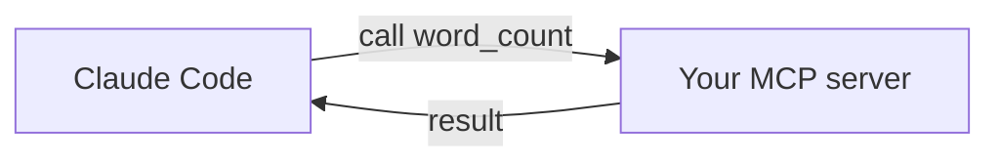

<LevelBadge level="advanced" />

<VerifyNote lastVerified="2026-06-20" source="https://modelcontextprotocol.io">
MCP SDK APIs and config evolve — confirm against the official MCP docs and the Claude Code MCP docs.
</VerifyNote>

Let's expose a custom tool to Claude by building a tiny [MCP](/docs/claude-code/mcp) server and connecting it. We'll keep it minimal so the *wiring* is clear — then you swap in your real logic.

## What we're building

A stdio server with one tool, `word_count`, that Claude can call. Same pattern scales to "query my DB", "open a ticket", etc.



## Step 1 — The server

`server.py` (Python; a TypeScript version is in [MCP scaffolds](/docs/templates/mcp-config)):

```python
from mcp.server.fastmcp import FastMCP

mcp = FastMCP("text-tools")

@mcp.tool()
def word_count(text: str) -> int:
    """Count the words in a piece of text."""
    return len(text.split())

if __name__ == "__main__":
    mcp.run()  # stdio transport
```

## Step 2 — Declare it

Add to `.mcp.json` at your repo root:

```json
{ "mcpServers": {
  "text-tools": { "command": "python", "args": ["server.py"] }
} }
```

## Step 3 — Connect & test

Start Claude Code in the repo. Ask: *"Use the text-tools server to count the words in: 'the quick brown fox'."* Claude should call `word_count` and report `4`. If it can't see the tool, check the server starts cleanly on its own and the `.mcp.json` path is right.

## Step 4 — Make it real

Replace `word_count` with your actual capability — a DB query, an internal API call, a file operation. Add input validation and return errors as results.

## Security checklist

:::warning A server is code + access
- **Least privilege** — only the data/actions it needs ([Securing Agents](/docs/security/securing-agents)).
- **Validate inputs** the model sends.
- Untrusted data it returns can carry [prompt injection](/docs/security/prompt-injection).
- **Review** any third-party server before connecting it.
:::

## Next

- [MCP Servers in Claude Code](/docs/claude-code/mcp)
- [MCP Config & Server Scaffolds](/docs/templates/mcp-config)
- [Tool Use / Function Calling](/docs/api/tool-use)
