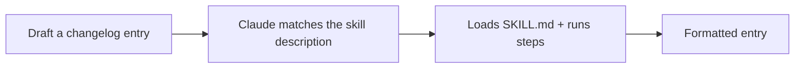

<LevelBadge level="intermediate" />

<VerifyNote lastVerified="2026-06-20" source="https://code.claude.com/docs/en/skills">
Skill layout and discovery can change — confirm against the official Skills docs.
</VerifyNote>

Let's build a working [Skill](/docs/claude-code/skills) from scratch and prove it activates. We'll make a small "changelog entry" skill — generic and reusable.

## Step 1 — Create the folder

```bash
mkdir -p .claude/skills/changelog-entry
```

(Use `~/.claude/skills/…` for a personal skill across all projects.)

## Step 2 — Write SKILL.md

`.claude/skills/changelog-entry/SKILL.md`:

```markdown
---
name: changelog-entry
description: Use when the user wants to turn recent git commits into a Keep a Changelog entry.
---

# Changelog Entry

When asked for a changelog entry:
1. Run `git log --oneline -20` to see recent commits.
2. Group them into Added / Changed / Fixed / Removed (Keep a Changelog style).
3. Write concise, user-facing bullets (not raw commit messages).
4. Output only the formatted entry.
```

The **`description` is the trigger** — write it as "Use when…" so Claude loads it at the right time.

## Step 3 — (Optional) add a helper script

Skills can ship scripts. Add `scripts/recent.sh` and reference it from SKILL.md if you want deterministic data gathering:

```bash
#!/usr/bin/env bash
git log --oneline -20
```

## Step 4 — Prove it triggers

Start a session and say: *"Draft a changelog entry for recent work."* Claude should recognize the intent, load the skill, and follow its steps. If it doesn't activate, your `description` probably isn't specific enough about *when* to use it — sharpen it.



## Step 5 — Share it

Bundle it (with others) into a [plugin](/docs/claude-code/plugins-marketplaces) so your team installs it in one step — or contribute it to AILmanac's [skill packs](/docs/templates/skills).

## Pitfalls

- **Vague description** → never triggers (or triggers always). Be specific.
- **Too much in one skill** → keep it one clear job.
- **Secrets in a shared skill** → never; see [Reviewing Third-Party Code](/docs/security/reviewing-third-party-code).

## Next

- [Skills: On-Demand Expertise](/docs/claude-code/skills)
- [SKILL.md Templates](/docs/templates/skills)
- [Build & Wire Your First MCP Server](/docs/walkthroughs/first-mcp-server)
