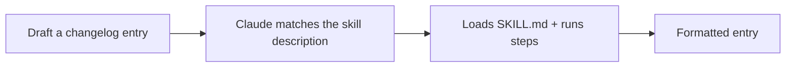

<LevelBadge level="intermediate" />

<Callout type="objectives" items={["Build a working Skill from scratch and prove it actually activates", "Write a description that triggers at the right time — the one field that decides whether a skill ever runs", "Decide when to add a helper script for deterministic data gathering", "Diagnose a skill that never fires, and know the three pitfalls that cause it"]} />

<VerifyNote lastVerified="2026-06-20" source="https://code.claude.com/docs/en/skills">
Skill layout and discovery can change — confirm against the official Skills docs.
</VerifyNote>

Let's build a working [Skill](/docs/claude-code/skills) from scratch and prove it activates. We'll make a small "changelog entry" skill — generic and reusable.

## Step 1 — Create the folder

<PromptCard title="Create the skill folder">{`mkdir -p .claude/skills/changelog-entry`}</PromptCard>

(Use `~/.claude/skills/…` for a personal skill across all projects.)

## Step 2 — Write SKILL.md

`.claude/skills/changelog-entry/SKILL.md`:

```markdown
---
name: changelog-entry
description: Use when the user wants to turn recent git commits into a Keep a Changelog entry.
---

# Changelog Entry

When asked for a changelog entry:
1. Run `git log --oneline -20` to see recent commits.
2. Group them into Added / Changed / Fixed / Removed (Keep a Changelog style).
3. Write concise, user-facing bullets (not raw commit messages).
4. Output only the formatted entry.
```

The **`description` is the trigger** — write it as "Use when…" so Claude loads it at the right time.

## Step 3 — (Optional) add a helper script

Skills can ship scripts. Add `scripts/recent.sh` and reference it from SKILL.md if you want deterministic data gathering:

```bash
#!/usr/bin/env bash
git log --oneline -20
```

## Step 4 — Prove it triggers

Start a session and try the prompt below. Claude should recognize the intent, load the skill, and follow its steps. If it doesn't activate, your `description` probably isn't specific enough about *when* to use it — sharpen it.

<PromptCard title="Prove the skill triggers">{`Draft a changelog entry for recent work.`}</PromptCard>



## Step 5 — Share it

Bundle it (with others) into a [plugin](/docs/claude-code/plugins-marketplaces) so your team installs it in one step — or contribute it to AILmanac's [skill packs](/docs/templates/skills).

## Pitfalls

- **Vague description** → never triggers (or triggers always). Be specific.
- **Too much in one skill** → keep it one clear job.
- **Secrets in a shared skill** → never; see [Reviewing Third-Party Code](/docs/security/reviewing-third-party-code).

<Callout type="takeaways" items={["A skill is a folder plus a SKILL.md — .claude/skills/<name>/ for the project, ~/.claude/skills/ for every project", "The description is the trigger. Write it as \"Use when…\" so Claude loads it at the right moment", "Skills can ship scripts — use one when you want deterministic data gathering instead of Claude improvising the command", "Prove it works by prompting the intent, not by naming the skill. If it doesn't fire, the description isn't specific enough about WHEN", "Keep one skill to one clear job, and never put secrets in a skill you share"]} />

<Quiz title="Check yourself" questions={[{q: "Your skill never activates, no matter what you ask. Which field is almost certainly the problem?", options: ["name — it must match the folder exactly", "description — it isn't specific enough about WHEN to use the skill", "The helper script is missing the executable bit"], answer: 1, explain: "The description is the trigger. Written as \"Use when…\" and specific about the situation, it tells Claude when to load the skill. Vague descriptions never trigger — or trigger constantly."}, {q: "You want a changelog skill available in every project you work on, not just this one. Where does it go?", options: [".claude/skills/changelog-entry/ in each repo", "~/.claude/skills/changelog-entry/", "It must be published as a plugin first"], answer: 1, explain: "Use ~/.claude/skills/… for a personal skill that applies across all projects. The in-repo .claude/skills/ path scopes a skill to that project."}, {q: "Why ship a helper script like scripts/recent.sh with a skill?", options: ["Skills cannot run shell commands without one", "For deterministic data gathering — the script runs the same way every time instead of Claude improvising", "It makes the skill load faster"], answer: 1, explain: "Skills can ship scripts, and referencing one from SKILL.md gives you deterministic data gathering. It's optional — you'd add it when you want the exact same command every run rather than leaving it to the model."}]} />

## Next

- [Skills: On-Demand Expertise](/docs/claude-code/skills)
- [SKILL.md Templates](/docs/templates/skills)
- [Build & Wire Your First MCP Server](/docs/walkthroughs/first-mcp-server)
