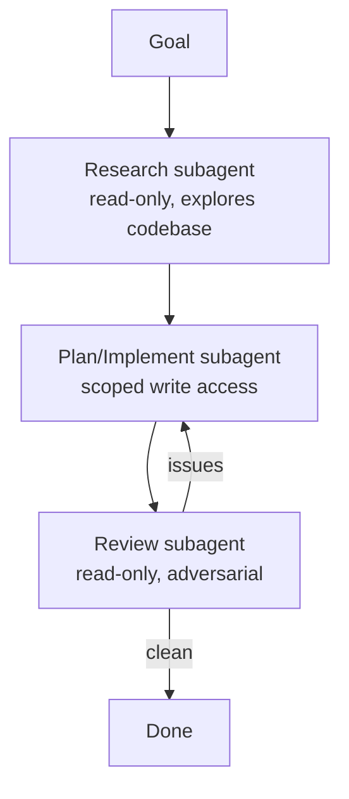

<LevelBadge level="advanced" />

Big tasks go better when you split them across focused [subagents](/docs/claude-code/subagents) instead of cramming everything into one context. Let's design a research → implement → review pipeline.

## The shape

Each subagent has its **own context** and a **tailored toolset** — and only the *result* flows back to the main session, keeping it clean.

## Step 1 — Define the agents

Via the `/agents` interface, define three, each with a tight `description` (so the main agent delegates correctly) and scoped tools:

- **researcher** — read/search only. Maps the relevant code and returns findings.
- **implementer** — can edit files and run tests; gets the researcher's findings as input.
- **reviewer** — read-only, adversarial: looks for bugs, missing cases, and convention violations.

## Step 2 — Orchestrate with handoffs

The main session passes each stage's output to the next: research → implement (using the research) → review (of the implementation). Add a **review gate**: if the reviewer finds issues, loop back to the implementer before finishing.

## Step 3 — Know when NOT to do this

:::warning Parallel/multi-agent isn't free
- **Sequential dependencies** (implement needs research) stay sequential — don't fan out where order matters.
- **Shared file writes** can conflict — isolate with [git worktrees](/docs/claude-code/worktrees) or serialize.
- For small tasks, the coordination overhead exceeds the benefit. Use this for **sizeable, decomposable** work.
:::

## Step 4 — Verify

A good multi-agent run shows: a focused main context (heavy reading happened in the researcher), an implementation that reflects the research, and a review that actually caught something (or credibly signed off). If the reviewer is a rubber stamp, make its prompt **adversarial** ("try to find what's wrong").

## Going further

The same pattern, programmatically, is [Building Agents on the API](/docs/api/building-agents) and product surfaces like [Cowork & Agent Teams](/docs/api/cowork-and-agent-teams).

## Next

- [Subagents & Parallel Agents](/docs/claude-code/subagents)
- [Git Worktrees](/docs/claude-code/worktrees)
- [Building Agents on the API](/docs/api/building-agents)
