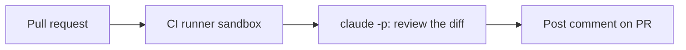

<LevelBadge level="advanced" />

<VerifyNote lastVerified="2026-06-20" source="https://docs.anthropic.com/en/docs/claude-code/sdk">
Headless flags and CI integration details evolve — confirm against the official Claude Code / Agent SDK docs.
</VerifyNote>

A classic high-value automation: have Claude **review every pull request** and post its findings as a comment — running [headless](/docs/claude-code/headless-and-agent-sdk) in CI. Here's the shape, with the guardrails that keep it safe.

## What it does

On each PR: check out the diff, ask Claude to review it for bugs/edge-cases/convention issues, and post a comment. Humans still decide; Claude just gives a fast first pass.



## The workflow (sketch)

```yaml
name: Claude PR review
on: pull_request
permissions:
  contents: read
  pull-requests: write   # to comment — NOT write to code
jobs:
  review:
    runs-on: ubuntu-latest
    steps:
      - uses: actions/checkout@v4
        with: { fetch-depth: 0 }
      - name: Review the diff
        env:
          ANTHROPIC_API_KEY: ${{ secrets.ANTHROPIC_API_KEY }}
        run: |
          git diff origin/${{ github.base_ref }}...HEAD > /tmp/diff.patch
          claude -p "Review this diff for correctness bugs, missing edge cases, and
          security issues. Report ONLY high-confidence findings as a Markdown
          checklist with file:line. Diff:" < /tmp/diff.patch > /tmp/review.md
      # then post /tmp/review.md as a PR comment (e.g. with the gh CLI or an action)
```

(Exact headless invocation may differ — see the docs. The principle is: feed the diff, capture Markdown, post it.)

## The guardrails (read [Hardening Autonomous Runs](/docs/security/hardening-autonomous-runs))

:::warning Least privilege in CI
- **Comment only.** Grant `pull-requests: write`, **not** `contents: write` — the bot shouldn't push code.
- **Scope the token**; never expose deploy/secret access to a job that reads untrusted PR content.
- **Treat PR content as untrusted** — it can carry [prompt injection](/docs/security/prompt-injection); don't let the job take consequential actions.
- **Cap cost** — large diffs cost [tokens](/docs/api/tokens-and-pricing); consider reviewing changed files only.
:::

## Make it useful, not noisy

- Ask for **high-confidence findings only** — a wall of nitpicks gets ignored.
- Keep it as a **first pass**, with humans making the merge call.

## Next

- [Headless Mode & the Agent SDK](/docs/claude-code/headless-and-agent-sdk)
- [Hardening Autonomous Runs](/docs/security/hardening-autonomous-runs)
- [Coding & Software Development](/docs/playbooks/coding)
