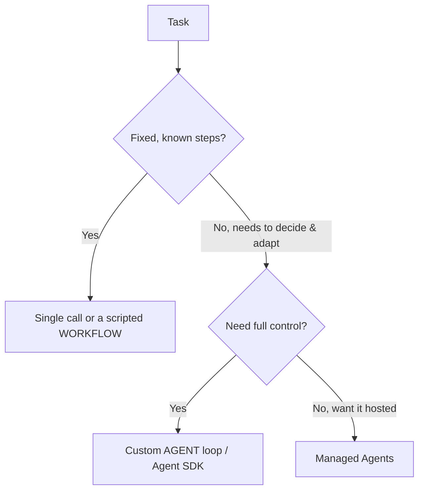

<LevelBadge level="advanced" />

<VerifyNote lastVerified="2026-06-20" source="https://platform.claude.com/docs/en/docs/agents-and-tools">
تتطوّر أدوات الوكلاء (Agent SDK، والخيارات المُدارة) بسرعة — تأكّد من الخيارات الحالية في الوثائق الرسمية.
</VerifyNote>

<Callout type="objectives" items={["تعريف ما هو الوكيل فعلًا: نموذج يعمل ضمن حلقة", "تطبيق اختبار اتخاذ القرار لاختيار استدعاء واحد مقابل سير عمل مقابل وكيل", "تصميم حلقة وكيل بحدّها الأدنى مع الضوابط الوقائية الصحيحة", "معرفة متى تلجأ إلى Claude Agent SDK بدلًا من البناء اليدوي", "اجعل الوكيل متينًا: حُدّه، وعالِج الأعطال، وقيّد الصلاحيات، وقيّمه"]} />

**الوكيل** هو نموذج يعمل ضمن حلقة: يسعى لتحقيق هدف عبر استدعاء [الأدوات](/docs/api/tool-use)، ومراقبة النتائج، واتخاذ قرار الخطوة التالية حتى الانتهاء. قبل أن تبني وكيلًا، اختر *أبسط شيء يؤدّي الغرض*.

## اختبار اتخاذ القرار (لا تُفرط في البناء)

ليست كل مهمة تحتاج إلى وكيل. اسلك هذه الشجرة أولًا — تتوقّف معظم المهام عند القمّة.

ثلاثة خيارات، الأبسط أولًا:

- **استدعاء واحد** — مطالبة واحدة تجيب عنه. معظم المهام. الأرخص والأكثر موثوقية.
- **سير عمل** — أنت تنسّق تسلسلًا ثابتًا من الاستدعاءات في الشيفرة (تدفّق تحكّم حتمي). استخدمه عندما تكون الخطوات معروفة.
- **وكيل** — النموذج يقرّر الخطوات ديناميكيًا. استخدمه فقط عندما يتعذّر فعلًا ترميز المسار بشكل ثابت.

<Callout type="warning">
لجأ إلى الوكيل عندما تكون القابلية للتكيّف هي الهدف — لا لأنه يبدو مبهرًا. سير العمل الذي تتحكّم به أسهل في الاختبار وتصحيح الأخطاء.
</Callout>

## تصميم الحلقة

الوكيل المخصّص بحدّه الأدنى ما هو إلا أربعة أجزاء متحرّكة. ابنِها بهذا الترتيب:

<Steps items={[
  {title: "مطالبة النظام (System prompt)", body: "بيّن الهدف، والقيود، والأدوات المتاحة. هذا ما يستند إليه النموذج في تفكيره في كل دورة."},
  {title: "الحلقة", body: "أرسل الرسائل ← إذا كانت الاستجابة tool_use، شغّل الأداة، وأضف tool_result، وكرّر ← حتى الوصول إلى إجابة نهائية أو شرط توقّف."},
  {title: "الضوابط الوقائية", body: "أضِف حدًّا أقصى للتكرارات، وميزانية للرموز/التكلفة، والتحقّق من مدخلات الأدوات قبل تشغيل أي شيء."},
  {title: "إدارة السياق", body: "لخّص أو قلّص مع نموّ السجلّ — الفكرة ذاتها التي تناولناها في إدارة السياق (/docs/claude-code/context-management)."}
]} />

تمنحك **[حزمة Claude Agent SDK](/docs/claude-code/headless-and-agent-sdk)** هذه الحلقة — الأدوات، والصلاحيات، ومعالجة السياق — جاهزة بالكامل، حتى لا تبنيها يدويًا بنفسك.

<Callout type="tip">
قبل أن تكتب حلقتك الخاصة، اسأل ما إذا كانت Agent SDK تغطّيها بالفعل. فهي توفّر الحلقة، والصلاحيات، ومعالجة السياق حتى تتمكّن من التركيز على الأدوات والهدف.
</Callout>

## اجعله متينًا

الحلقة التي تستطيع استدعاء الأدوات تستطيع أيضًا أن تسيء التصرّف. أربع عادات تُبقي الوكيل جديرًا بالثقة:

- **حُدّ كل شيء**: التكرارات، والوقت، والتكلفة. فالوكلاء قد يدخلون في حلقة لا تنتهي.
- **عالِج أعطال الأدوات** بسلاسة (أعِد الخطأ كنتيجة).
- **أقل صلاحية ممكنة + تدخّل بشري** للإجراءات الخطرة — راجع [تأمين الوكلاء](/docs/security/securing-agents).
- **قيّمه** على حالات حقيقية قبل الوثوق به — راجع [التقييمات](/docs/foundations/evals).

<Callout type="takeaways" items={["الوكيل هو نموذج يعمل ضمن حلقة يستدعي الأدوات سعيًا لتحقيق هدف — استخدمه فقط عندما يتعذّر ترميز المسار بشكل ثابت", "ترتيب القرار: استدعاء واحد ← سير عمل ← وكيل ← الوكلاء المُدارون؛ فضّل الأبسط الذي يؤدّي الغرض", "الحلقة بحدّها الأدنى = مطالبة النظام + حلقة tool_use/tool_result + ضوابط وقائية + إدارة السياق", "تمنحك Claude Agent SDK الحلقة، والأدوات، والصلاحيات، ومعالجة السياق جاهزة", "المتانة = تحديد التكرارات/الوقت/التكلفة، ومعالجة أعطال الأدوات، وأقل صلاحية ممكنة + تدخّل بشري، والتقييم قبل الوثوق"]} />

## اختبر نفسك

<Quiz title="اختبر نفسك" questions={[
  {
    q: "ما الذي يصف الوكيل على أفضل وجه في هذا السياق؟",
    options: [
      "مطالبة واحدة تُعيد إجابة كاملة",
      "نموذج يعمل ضمن حلقة، يستدعي الأدوات ويقرّر الخطوة التالية حتى الانتهاء",
      "تسلسل ثابت من استدعاءات الواجهة البرمجية تنسّقه في الشيفرة",
      "خدمة مُستضافة لا تتطلّب أي إعداد"
    ],
    answer: 1,
    explain: "الوكيل هو نموذج يعمل ضمن حلقة: يسعى لتحقيق هدف عبر استدعاء الأدوات، ومراقبة النتائج، واتخاذ قرار الخطوة التالية حتى الانتهاء."
  },
  {
    q: "المهمة لها خطوات ثابتة ومعروفة. إلى ماذا ينبغي أن تلجأ؟",
    options: [
      "حلقة وكيل مخصّصة، لأقصى قدر من التحكّم",
      "الوكلاء المُدارون، ليكون مُستضافًا",
      "استدعاء واحد أو سير عمل مكتوب بالشيفرة",
      "فريق متعدّد الوكلاء"
    ],
    answer: 2,
    explain: "عندما تكون الخطوات ثابتة ومعروفة، يكون الاستدعاء الواحد أو سير العمل المكتوب بالشيفرة (تدفّق تحكّم حتمي) هو الخيار الصحيح والأبسط."
  },
  {
    q: "متى يكون الوكيل المخصّص مبرَّرًا فعلًا؟",
    options: [
      "كلّما بدا أكثر إبهارًا من سير العمل",
      "عندما تكون القابلية للتكيّف هي الهدف ويتعذّر فعلًا ترميز المسار بشكل ثابت",
      "لكل مهمة تستدعي أكثر من أداة واحدة",
      "فقط عندما لا تستطيع استخدام Agent SDK"
    ],
    answer: 1,
    explain: "لجأ إلى الوكيل عندما تكون القابلية للتكيّف هي الهدف — لا لأنه يبدو مبهرًا. سير العمل الذي تتحكّم به أسهل في الاختبار وتصحيح الأخطاء."
  },
  {
    q: "في الحلقة، ماذا يحدث عندما يستجيب النموذج بـ tool_use؟",
    options: [
      "توقِف الحلقة وتُعيد الإجابة الجزئية",
      "تشغّل الأداة، وتُضيف tool_result، وتكرّر",
      "تتجاهل الرسالة وتُعيد إرسال مطالبة النظام",
      "تلخّص السجلّ فورًا"
    ],
    answer: 1,
    explain: "الحلقة: أرسل الرسائل ← إذا ظهر tool_use، شغّل الأداة، وأضف tool_result، وكرّر ← حتى الوصول إلى إجابة نهائية أو شرط توقّف."
  },
  {
    q: "أيٌّ مما يلي ليس من الضوابط الوقائية لجعل الوكيل متينًا؟",
    options: [
      "حدّ أقصى للتكرارات وميزانية للرموز/التكلفة",
      "معالجة أعطال الأدوات بإعادة الخطأ كنتيجة",
      "منح الوكيل صلاحيات كاملة حتى لا يُحجب أبدًا",
      "أقل صلاحية ممكنة إضافةً إلى تدخّل بشري للإجراءات الخطرة"
    ],
    answer: 2,
    explain: "تستخدم الوكلاء المتينة أقل صلاحية ممكنة إضافةً إلى تدخّل بشري للإجراءات الخطرة — وهو نقيض منح الصلاحيات الكاملة. كما تحدّ التكرارات/الوقت/التكلفة، وتعالج أعطال الأدوات بسلاسة، وتقيّم قبل الوثوق."
  }
]} />

## التالي

- [استخدام الأدوات](/docs/api/tool-use) · [وضع Headless و Agent SDK](/docs/claude-code/headless-and-agent-sdk)
- [الوكلاء المُدارون](/docs/api/managed-agents) · [Cowork وفِرَق الوكلاء](/docs/api/cowork-and-agent-teams)
- [تأمين الوكلاء والأدوات](/docs/security/securing-agents)
