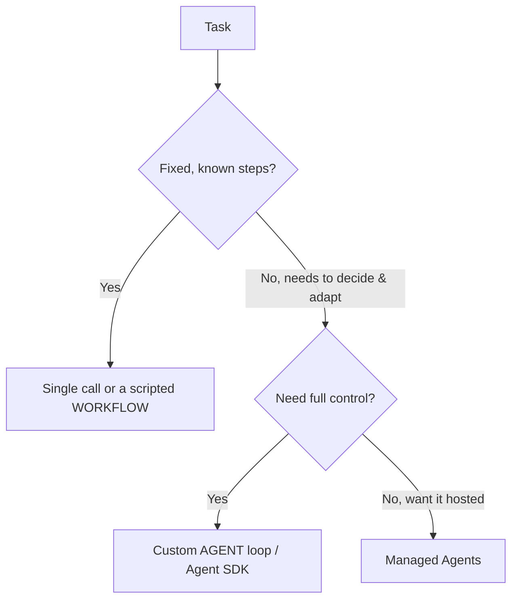

<LevelBadge level="advanced" />

<VerifyNote lastVerified="2026-06-20" source="https://docs.anthropic.com/en/docs/agents-and-tools">
تتطوّر أدوات الوكلاء (Agent SDK، والخيارات المُدارة) بسرعة — تأكّد من الخيارات الحالية في الوثائق الرسمية.
</VerifyNote>

**الوكيل** هو نموذج يعمل ضمن حلقة: يسعى لتحقيق هدف عبر استدعاء [الأدوات](/docs/api/tool-use)، ومراقبة النتائج، واتخاذ قرار الخطوة التالية حتى الانتهاء. قبل أن تبني وكيلًا، اختر *أبسط شيء يؤدّي الغرض*.

## اختبار اتخاذ القرار (لا تُفرط في البناء)

- **استدعاء واحد** — مطالبة واحدة تجيب عنه. معظم المهام. الأرخص والأكثر موثوقية.
- **سير عمل** — أنت تنسّق تسلسلًا ثابتًا من الاستدعاءات في الشيفرة (تدفّق تحكّم حتمي). استخدمه عندما تكون الخطوات معروفة.
- **وكيل** — النموذج يقرّر الخطوات ديناميكيًا. استخدمه فقط عندما يتعذّر فعلًا ترميز المسار بشكل ثابت.

> لجأ إلى الوكيل عندما تكون القابلية للتكيّف هي الهدف — لا لأنه يبدو مبهرًا. سير العمل الذي تتحكّم به أسهل في الاختبار وتصحيح الأخطاء.

## تصميم الحلقة

وكيل مخصّص بحدّه الأدنى:

1. **مطالبة النظام (System prompt)**: الهدف، والقيود، والأدوات المتاحة.
2. **الحلقة**: أرسل الرسائل ← إذا ظهر `tool_use`، شغّل الأداة، وأضف `tool_result`، وكرّر ← حتى الوصول إلى إجابة نهائية أو شرط توقّف.
3. **الضوابط الوقائية**: حدّ أقصى للتكرارات، وميزانية للرموز/التكلفة، والتحقّق من مدخلات الأدوات.
4. **إدارة السياق**: لخّص/قلّص مع نموّ السجلّ (الفكرة ذاتها الواردة في [إدارة السياق](/docs/claude-code/context-management)).

تمنحك **[حزمة Claude Agent SDK](/docs/claude-code/headless-and-agent-sdk)** هذه الحلقة — الأدوات، والصلاحيات، ومعالجة السياق — جاهزة بالكامل، حتى لا تبنيها يدويًا بنفسك.

## اجعله متينًا

- **حُدّ كل شيء**: التكرارات، والوقت، والتكلفة. فالوكلاء قد يدخلون في حلقة لا تنتهي.
- **عالِج أعطال الأدوات** بسلاسة (أعِد الخطأ كنتيجة).
- **أقل صلاحية ممكنة + تدخّل بشري** للإجراءات الخطرة — راجع [تأمين الوكلاء](/docs/security/securing-agents).
- **قيّمه** على حالات حقيقية قبل الوثوق به — راجع [التقييمات](/docs/foundations/evals).

## التالي

- [استخدام الأدوات](/docs/api/tool-use) · [وضع Headless و Agent SDK](/docs/claude-code/headless-and-agent-sdk)
- [الوكلاء المُدارون](/docs/api/managed-agents) · [Cowork وفِرَق الوكلاء](/docs/api/cowork-and-agent-teams)
- [تأمين الوكلاء والأدوات](/docs/security/securing-agents)
