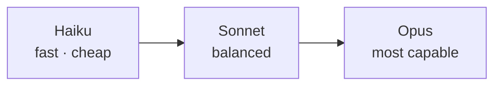

<LevelBadge level="beginner" />

تقدّم Anthropic عائلة من النماذج عند نقاط مختلفة من القدرة/التكلفة/السرعة. الاختيار الجيد يتعلّق في معظمه بمطابقة النموذج مع المهمة — وعدم دفع مبالغ زائدة مقابل قدرة لا تحتاجها.

## النماذج الحالية

<ModelTable />

## جرّبه: أيّ نموذج يناسبك؟

أجب عن ثلاثة أسئلة لتحصل على توصية مبدئية:

<ModelPicker />

## النموذج الذهني: سُلّم القدرات

- **ابدأ بـ Sonnet.** إنه النموذج الافتراضي للعمل اليومي — استدلال وبرمجة قويّان بتكلفة معقولة. ينبغي أن تبدأ معظم المهام من هنا.
- **ارتقِ إلى Opus** فقط عندما يتعثّر Sonnet وتكون الجودة أهمّ من التكلفة (استدلال صعب، وكلاء معقّدون، شيفرة شائكة).
- **انزل إلى Haiku** للعمل عالي الحجم، أو الحسّاس للزمن، أو البسيط (التصنيف، الاستخراج، التوجيه، الوكلاء الفرعيون الرخيصون).

## كيف تختار فعليًا

1. **اجعل Sonnet هو الافتراضي** وأطلق منتجك.
2. **هل بلغت سقف الجودة؟** جرّب Opus على المجموعة الصعبة فقط.
3. **هل تؤلمك التكلفة أو الزمن؟** انظر إن كان Haiku جيدًا بما يكفي لتلك الخطوة.
4. **امزج النماذج.** استخدم Haiku للمعالجة الأوّلية/اللاحقة الرخيصة، و Sonnet/Opus للنواة الصعبة. هذا "التدرّج بين النماذج" هو أحد أكبر روافع خفض التكلفة — راجع [التكلفة والزمن](/docs/foundations/cost-and-latency).

:::tip لا تختر اعتمادًا على المقاييس المرجعية وحدها
المقاييس المرجعية العامة هي مؤشّر مبدئي، لا حُكم نهائي على مهمّتك *أنت*. شغّل [تقييمًا](/docs/foundations/evals) صغيرًا على حفنة من مدخلاتك الحقيقية عبر نموذجين — يستغرق دقائق ويتفوّق على التخمين.
:::

## البحث عن معرّف النموذج الدقيق

مرّر دائمًا معرّف النموذج الحالي للواجهة البرمجية (مثلًا في استدعاء `messages.create`). احصل عليه من [جدول النماذج أعلاه](/docs/whats-new/models-and-pricing) أو صفحة النماذج الرسمية — ويُفضَّل قراءته من الإعدادات بدلًا من ترميزه يدويًا في أماكن متعددة، حتى تصبح ترقية النموذج تغييرًا في سطر واحد.

## التالي

- [الرموز والسياق والتسعير](/docs/api/tokens-and-pricing)
- [أول استدعاء للواجهة البرمجية](/docs/api/first-call)
- [النماذج والتسعير الحاليان](/docs/whats-new/models-and-pricing)
